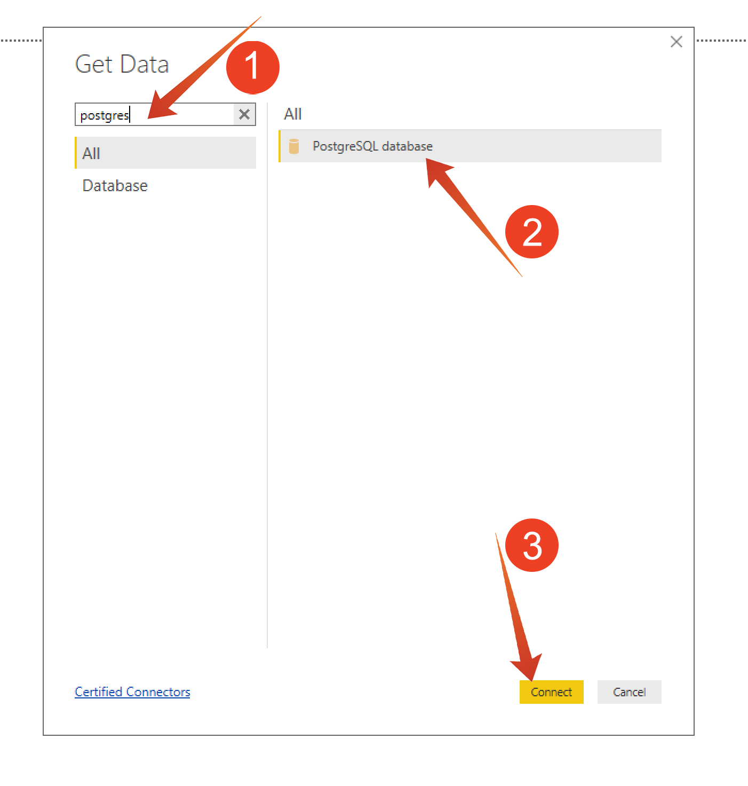

# 5.1.5 Servizio query e Power BI

Aprire Microsoft Power BI Desktop.

Fare clic su **Ottieni dati**.

Cerca **postgres** (1), seleziona **Postgres** (2) dall&#39;elenco e **Connect** (3).

Vai a Adobe Experience Platform, **Query** e **Credenziali**.

Dalla pagina **Credenziali** in Adobe Experience Platform, copiare l&#39;**Host** e incollarlo nel campo **Server**, copiare il **Database** e incollarlo nel campo **Database** in PowerBI, quindi fare clic su OK (2).

>[!IMPORTANT]
>
>Assicurarsi di includere la porta **:80** alla fine del valore Server perché il servizio query non utilizza attualmente la porta PostgreSQL predefinita di 5432.

Nella finestra di dialogo successiva compila il nome utente e la password con il nome utente e la password trovati nelle **credenziali** delle query in Adobe Experience Platform.

Nella finestra di dialogo Navigator, inserisci **LDAP** nel campo di ricerca (1) per individuare i set di dati CTAS e seleziona la casella accanto a ciascuno (2). Quindi fare clic su Carica (3).

Assicurarsi che la scheda **Report** (1) sia selezionata.

Seleziona la mappa (1) e, dopo che è stata aggiunta all’area di lavoro per i rapporti, ingrandisci la mappa (2).

Ora è necessario definire le misure e le dimensioni. A tale scopo, trascina i campi dalla sezione **fields** ai segnaposto corrispondenti (che si trovano in **visualizations**) come indicato di seguito:

Come misura utilizzeremo un conteggio di **customerId**. Trascina il campo **crmid** dalla sezione **fields** nel segnaposto **Size**:

Infine, per eseguire alcune analisi di **callTopic**, trascina il campo **callTopic** sul segnaposto **Filtri a livello di pagina** (potrebbe essere necessario scorrere la sezione **visualizzazioni**);

Seleziona/deseleziona **argomentiChiamata** per analizzare:

Hai terminato questo esercizio.

Passaggio successivo: [5.1.7 API servizio query](./ex7.md)

[Torna al modulo 5.1](./query-service.md)

[Torna a tutti i moduli](../../../overview.md)
