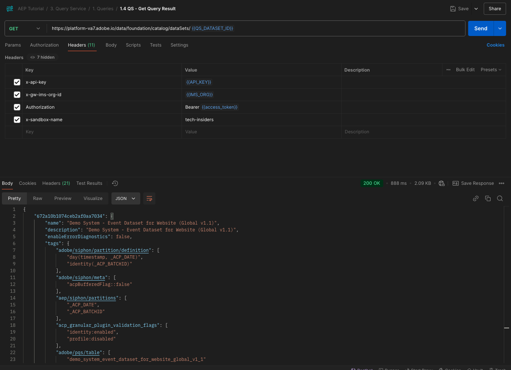

# 5.1.8 API Query Service

## Finalità

- Utilizza l’API Query Service per gestire modelli di query e pianificazioni delle query

## Contesto

In questo esercizio eseguirai chiamate API per gestire modelli di query e pianificazioni di query utilizzando una raccolta Postman. Potrai definire modelli di query, eseguire query regolari e query CTAS. Una query **CTAS** (crea tabella come query di selezione) memorizza il set di risultati in un set di dati esplicito. Mentre le query regolari vengono memorizzate in un set di dati implicito (o generato dal sistema), che in genere viene esportato in formato di file parquet.

## Documentazione

- [Guida di Adobe Experience Platform Query Service](https://experienceleague.adobe.com/docs/experience-platform/query/api/getting-started.html)
- [API servizio query](https://www.adobe.io/apis/experienceplatform/home/api-reference.html#!acpdr/swagger-specs/qs-api.yaml)

## API servizio query

L’API Query Service consente di gestire le query non interattive rispetto al data lake di Adobe Experience Platform.

Non interattivo significa che una richiesta di esecuzione di una query non darà luogo a una risposta immediata. La query verrà elaborata e il relativo set di risultati verrà memorizzato in un set di dati implicito o esplicito (CTAS: create table as select).

## Query di esempio

Come query di esempio si utilizzerà la prima query elencata in [4.3 - Query, query, query... e churn analysis](./ex3.md):

Quante visualizzazioni di prodotto abbiamo su base giornaliera?

**SQL**

```sql
select date_format( timestamp , 'yyyy-MM-dd') AS Day,
       count(*) AS productViews
from   demo_system_event_dataset_for_website_global_v1_1
where  --aepTenantId--.demoEnvironment.brandName IN ('Citi Signal')
and eventType = 'commerce.productViews'
group by Day
limit 10;
```

## Query

>[!IMPORTANT]
>
>Se sei un dipendente Adobe, segui le istruzioni qui riportate per utilizzare [PostBuster](./../../../postbuster.md).

Apri Postman sul computer. Come parte del modulo 2.1, hai creato un ambiente Postman e importato una raccolta Postman. Seguire le istruzioni nell&#39;esercizio [2.1.3](./../../../modules/rtcdp-b2c/module2.1/ex3.md) nel caso in cui non sia stato ancora eseguito.

Come parte della raccolta Postman importata, verrà visualizzata una cartella **3. Servizio query**. Se non vedi questa cartella, scarica di nuovo la [raccolta Postman](./../../../assets/postman/postman_profile.zip) e importa di nuovo la raccolta in Postman come indicato nell&#39;esercizio [2.1.3](./../../../modules/rtcdp-b2c/module2.1/ex3.md).


>[!NOTE]
>
>Al momento, solo la cartella **1. Le query** contengono richieste. Altre richieste verranno aggiunte in una fase livello.

Apri tale cartella e scopri le chiamate API di Query Service per eseguire, monitorare e scaricare il set di risultati della query.

Una chiamata POST a [/query/query] con il seguente payload attiverà l&#39;esecuzione della query;

### Crea query

Fai clic sulla richiesta denominata **1.1 QS - Crea query** e passa a **Intestazioni**. A questo punto viene visualizzato quanto segue:


Concentriamoci su questo campo intestazione:

| Chiave | Valore |
| ----------- | ----------- |
| x-sandbox-name | `--aepSandboxName--` |

>[!NOTE]
>
>È necessario specificare il nome della sandbox di Adobe Experience Platform in uso. Il campo intestazione **x-sandbox-name** deve essere `--aepSandboxName--`.

Vai alla sezione **Body** di questa richiesta. Nel **Corpo** di questa richiesta, visualizzerai quanto segue:


```sql
{
    "name" : "ldap - QS API demo - Citi Signal - Product Views Per Day",
	"description": "ldap - QS API demo - Citi Signal - Product Views Per Day",
	"dbName": "--aepSandboxName--:all",
	"sql": "select date_format( timestamp , 'yyyy-MM-dd') AS Day, count(*) AS productViews from demo_system_event_dataset_for_website_global_v1_1 where --aepTenantId--.demoEnvironment.brandName IN ('Citi Signal') and eventType = 'commerce.productViews' group by Day limit 10"
}
```

Attenzione: aggiornare la variabile **name** nella richiesta seguente sostituendo **ldap** con il **specifico—aepUserLdap—**.

Dopo aver aggiunto il tuo **ldap** specifico, il corpo dovrebbe essere simile al seguente:

```json
{
    "name" : "vangeluw - QS API demo - Citi Signal - Product Views Per Day",
	"description": "vangeluw - QS API demo - Citi Signal - Product Views Per Day",
	"dbName": "tech-insiders:all",
	"sql": "select date_format( timestamp , 'yyyy-MM-dd') AS Day, count(*) AS productViews from demo_system_event_dataset_for_website_global_v1_1 where _experienceplatform.demoEnvironment.brandName IN ('Citi Signal') and eventType = 'commerce.productViews' group by Day limit 10"
}
```

>[!NOTE]
>
>La chiave **dbName** nel corpo JSON precedente fa riferimento alla sandbox utilizzata nell&#39;istanza di Adobe Experience Platform. Se utilizzi la sandbox di PROD, il valore di dbName deve essere **prod:all**. Se utilizzi un&#39;altra sandbox, ad esempio **tech-insiders**, il valore di dbName deve essere uguale a **tech-insiders:all**.

Fai clic sul pulsante blu **Invia** per creare il segmento e visualizzarne i risultati.


In caso di esito positivo, la richiesta POST restituirà la seguente risposta:

```json
{
    "isInsertInto": false,
    "request": {
        "dbName": "module7:all",
        "sql": "select date_format( timestamp , 'yyyy-MM-dd') AS Day, count(*) AS productViews from demo_system_event_dataset_for_website_global_v1_1 where _experienceplatform.demoEnvironment.brandName IN ('Luma Telco', 'Citi Signal') and eventType = 'commerce.productViews' group by Day limit 10",
        "name": "vangeluw - QS API demo - Citi Signal - Product Views Per Day",
        "description": "vangeluw - QS API demo - Citi Signal - Product Views Per Day"
    },
    "clientId": "5a143b5ae4aa4631a1f3b09cd051333f",
    "state": "SUBMITTED",
    "rowCount": 0,
    "errors": [],
    "isCTAS": false,
    "version": 1,
    "id": "8f0d7f25-f7aa-493b-9792-290f884a7e5b",
    "elapsedTime": 0,
    "updated": "2021-01-20T13:23:13.951Z",
    "client": "API",
    "userId": "A3392DB95FFF08EE0A495E87@techacct.adobe.com",
    "created": "2021-01-20T13:23:13.951Z",
    "_links": {
        "self": {
            "href": "https://platform-va7.adobe.io/data/foundation/query/queries/8f0d7f25-f7aa-493b-9792-290f884a7e5b",
            "method": "GET"
        },
        "soft_delete": {
            "href": "https://platform-va7.adobe.io/data/foundation/query/queries/8f0d7f25-f7aa-493b-9792-290f884a7e5b",
            "method": "PATCH",
            "body": "{ \"op\": \"soft_delete\"}"
        },
        "cancel": {
            "href": "https://platform-va7.adobe.io/data/foundation/query/queries/8f0d7f25-f7aa-493b-9792-290f884a7e5b",
            "method": "PATCH",
            "body": "{ \"op\": \"cancel\"}"
        }
    }
}
```

Il **stato** corrente della query è **INVIATO**. Una volta eseguito, lo stato diventerà **COMPLETATO**.

Puoi anche cercare le query inviate tramite l&#39;interfaccia utente di Adobe Experience Platform, aprire [Adobe Experience Platform](https://experience.adobe.com/#/@experienceplatform/platform/home), passare a **Query**, **Registro** e selezionare la query:


### Ottieni query

Fai clic sulla richiesta denominata **1.2 QS - Ottieni query** e passa a **Intestazioni**. A questo punto viene visualizzato quanto segue:


Concentriamoci su questo campo intestazione:

| Chiave | Valore |
| ----------- | ----------- |
| x-sandbox-name | `--aepSandboxName--` |

>[!NOTE]
>
>È necessario specificare il nome della sandbox di Adobe Experience Platform in uso. Il campo intestazione **x-sandbox-name** deve essere `--aepSandboxName--`.

Vai a **Parametri**. A questo punto viene visualizzato quanto segue:


Il parametro **orderby** consente di specificare un ordinamento basato sulla proprietà **created**. Osserva il segno **&#39;-&#39;** prima di creato, il che significa che l&#39;ordine in cui viene restituito l&#39;elenco delle query utilizzerà la data di creazione nell&#39;ordine **decrescente**. La query deve trovarsi all&#39;inizio dell&#39;elenco.

Fai clic sul pulsante blu **Invia** per creare il segmento e visualizzarne i risultati.


In caso di esito positivo, la richiesta restituirà una risposta simile a quella riportata di seguito. Il **stato** della risposta può essere **INVIATO**, **IN_CORSO** o **COMPLETATO**. Potrebbero essere necessari alcuni minuti prima che la query abbia uno stato **SUCCESS**. Puoi ripetere l&#39;invio di questa richiesta diverse volte, finché non visualizzi lo stato **SUCCESS**.

```json
{
    "queries": [
        {
            "isInsertInto": false,
            "sessionType": "HTTP_SESSION",
            "request": {
                "dbName": "tech-insiders:all",
                "sql": "select date_format( timestamp , 'yyyy-MM-dd') AS Day, count(*) AS productViews from demo_system_event_dataset_for_website_global_v1_1 where _experienceplatform.demoEnvironment.brandName IN ('Citi Signal') and eventType = 'commerce.productViews' group by Day limit 10",
                "name": "vangeluw - QS API demo - Citi Signal - Product Views Per Day",
                "description": "vangeluw - QS API demo - Citi Signal - Product Views Per Day"
            },
            "computeMetrics": null,
            "clientId": "b7d8a1fc396242889bb31dc83644e91d",
            "state": "IN_PROGRESS",
            "rowCount": 0,
            "isService": false,
            "errors": [],
            "isCTAS": false,
            "version": 1,
            "id": "a535234e-dc0c-42ea-bcad-eb09c5997d76",
            "elapsedTime": 8088,
            "updated": "2024-12-04T14:17:10.627Z",
            "client": "API",
            "effectiveSQL": "select date_format( timestamp , 'yyyy-MM-dd') AS Day, count(*) AS productViews from demo_system_event_dataset_for_website_global_v1_1 where _experienceplatform.demoEnvironment.brandName IN ('Citi Signal') and eventType = 'commerce.productViews' group by Day limit 10",
            "userId": "8CD31E54673C49EE0A495E05@techacct.adobe.com",
            "isParentLevel": true,
            "created": "2024-12-04T14:14:22.637Z",
                "version": 1,
    "_links": {
        "next": {
            "href": "https://platform-va7.adobe.io/data/foundation/query/queries?orderby=-created&start=2024-11-22T00:32:04.505Z"
        },
        "prev": {
            "href": "https://platform-va7.adobe.io/data/foundation/query/queries?orderby=-created&start=2024-12-04T14:14:22.637Z&isPrevLink=true"
        }
    }
}
```

Quando lo stato è **SUCCESS**, continuare con la richiesta successiva.

### Ottieni stato query

Fai clic sulla richiesta denominata **1.3 QS - Ottieni stato query** e passa a **Intestazioni**. A questo punto viene visualizzato quanto segue:


Concentriamoci su questo campo intestazione:

| Chiave | Valore |
| ----------- | ----------- |
| x-sandbox-name | `--aepSandboxName--` |

>[!NOTE]
>
>È necessario specificare il nome della sandbox di Adobe Experience Platform in uso. Il campo intestazione **x-sandbox-name** deve essere `--aepSandboxName--`.

Fai clic sul pulsante blu **Invia** per creare il segmento e visualizzarne i risultati.


In caso di esito positivo, la richiesta restituirà una risposta simile a quella riportata di seguito.

```json
{
    "isInsertInto": false,
    "sessionType": "HTTP_SESSION",
    "request": {
        "dbName": "tech-insiders:all",
        "sql": "select date_format( timestamp , 'yyyy-MM-dd') AS Day, count(*) AS productViews from demo_system_event_dataset_for_website_global_v1_1 where _experienceplatform.demoEnvironment.brandName IN ('Citi Signal') and eventType = 'commerce.productViews' group by Day limit 10",
        "name": "vangeluw - QS API demo - Citi Signal - Product Views Per Day",
        "description": "vangeluw - QS API demo - Citi Signal - Product Views Per Day"
    },
    "computeMetrics": {
        "executorVMSeconds": 138,
        "clusterCpuSeconds": 3312,
        "clusterVMHours": 0.07666666805744171,
        "driverVMSeconds": 138,
        "clusterVMSeconds": 276
    },
    "clientId": "b7d8a1fc396242889bb31dc83644e91d",
    "state": "SUCCESS",
    "rowCount": 1,
    "isService": false,
    "errors": [],
    "isCTAS": false,
    "version": 1,
    "id": "a535234e-dc0c-42ea-bcad-eb09c5997d76",
    "elapsedTime": 199219,
    "updated": "2024-12-04T14:17:41.856Z",
    "client": "API",
    "effectiveSQL": "select date_format( timestamp , 'yyyy-MM-dd') AS Day, count(*) AS productViews from demo_system_event_dataset_for_website_global_v1_1 where _experienceplatform.demoEnvironment.brandName IN ('Citi Signal') and eventType = 'commerce.productViews' group by Day limit 10",
    "userId": "8CD31E54673C49EE0A495E05@techacct.adobe.com",
    "isParentLevel": true,
    "created": "2024-12-04T14:14:22.637Z",
    "_links": {
        "self": {
            "href": "https://platform-va7.adobe.io/data/foundation/query/queries/a535234e-dc0c-42ea-bcad-eb09c5997d76",
            "method": "GET"
        },
        "soft_delete": {
            "href": "https://platform-va7.adobe.io/data/foundation/query/queries/a535234e-dc0c-42ea-bcad-eb09c5997d76",
            "method": "PATCH",
            "body": "{ \"op\": \"soft_delete\"}"
        },
        "referenced_datasets": [
            {
                "id": "672a10b1074ceb2af0aa7034",
                "href": "https://platform-va7.adobe.io/data/foundation/catalog/dataSets/672a10b1074ceb2af0aa7034"
            }
        ]
    }
}
```

Quando una query raggiunge lo stato **SUCCESS**, la risposta indica anche il numero di righe recuperate dalla query tramite la proprietà **rowCount**. Nel nostro esempio, la query restituisce 10 righe. Vediamo nella sezione successiva come è possibile recuperare le 10 righe.

### Recupera risultati query

La risposta **SUCCESS** precedente include una proprietà **referenced_datasets** che punta al set di dati implicito in cui è memorizzato il risultato della query. Per accedere al risultato, utilizziamo la relativa proprietà **href** o **id**.

Fai clic sulla richiesta denominata **1.4 QS - Ottieni risultato query** e passa a **Intestazioni**. A questo punto viene visualizzato quanto segue:


Concentriamoci su questo campo intestazione:

| Chiave | Valore |
| ----------- | ----------- |
| x-sandbox-name | `--aepSandboxName--` |

>[!NOTE]
>
>È necessario specificare il nome della sandbox di Adobe Experience Platform in uso. Il campo intestazione **x-sandbox-name** deve essere `--aepSandboxName--`.

Fai clic sul pulsante blu **Invia** per creare il segmento e visualizzarne i risultati.



La risposta di questa richiesta punterà ai file del set di dati:

```json
{
    "672a10b1074ceb2af0aa7034": {
        "name": "Demo System - Event Dataset for Website (Global v1.1)",
        "description": "Demo System - Event Dataset for Website (Global v1.1)",
        "enableErrorDiagnostics": false,
        "tags": {
            "adobe/siphon/partition/definition": [
                "day(timestamp, _ACP_DATE)",
                "identity(_ACP_BATCHID)"
            ],
            "adobe/siphon/meta": [
                "acpBufferedFlag::false"
            ],
            "aep/siphon/partitions": [
                "_ACP_DATE",
                "_ACP_BATCHID"
            ],
            "acp_granular_plugin_validation_flags": [
                "identity:enabled",
                "profile:disabled"
            ],
            "adobe/pqs/table": [
                "demo_system_event_dataset_for_website_global_v1_1"
            ],
            "acp_granular_validation_flags": [
                "requiredFieldCheck:enabled"
            ],
            "aep/siphon/cleanup/trash/timestamp": [
                "1733302532212"
            ],
            "acp_validationContext": [
                "enabled"
            ],
            "adobe/siphon/table/format": [
                "delta"
            ],
            "unifiedProfile": [
                "enabled:true",
                "enabledAt:2024-11-05 12:33:59"
            ],
            "aep/siphon/cleanup/meta/timestamp": [
                "1733302532287"
            ],
            "unifiedIdentity": [
                "enabled:true"
            ]
        },
        "state": "ACTIVE",
        "imsOrg": "907075E95BF479EC0A495C73@AdobeOrg",
        "sandboxId": "79e3c8b2-0609-4564-a3c8-b20609a5648c",
        "extensions": {
            "adobe_lakeHouse": {
                "metrics": {
                    "storageSize": 810709,
                    "rowCount": 1141,
                    "asOf": 1732494676514
                }
            },
            "adobe_unifiedProfile": {}
        },
        "version": "1.0.21",
        "created": 1730810034023,
        "updated": 1733302532348,
        "createdClient": "d75039d36ca543c78612f7aac18e6c2b",
        "createdUser": "53FB1E5E66CDC87D0A495FC0@techacct.adobe.com",
        "updatedUser": "acp_foundation_dataTracker@AdobeID",
        "classification": {
            "dataBehavior": "time-series",
            "managedBy": "CUSTOMER"
        },
        "viewId": "672a10b2074ceb2af0aa7035",
        "fileDescription": {
            "format": "parquet"
        },
        "files": "@/dataSetFiles?dataSetId=672a10b1074ceb2af0aa7034",
        "schemaRef": {
            "id": "https://ns.adobe.com/experienceplatform/schemas/d9b88a044ad96154637965a97ed63c7b20bdf2ab3b4f642e",
            "contentType": "application/vnd.adobe.xed-full+json;version=1"
        }
    }
}
```

Passaggio successivo: [Riepilogo e vantaggi](./summary.md)

[Torna al modulo 5.1](./query-service.md)

[Torna a tutti i moduli](../../../overview.md)
