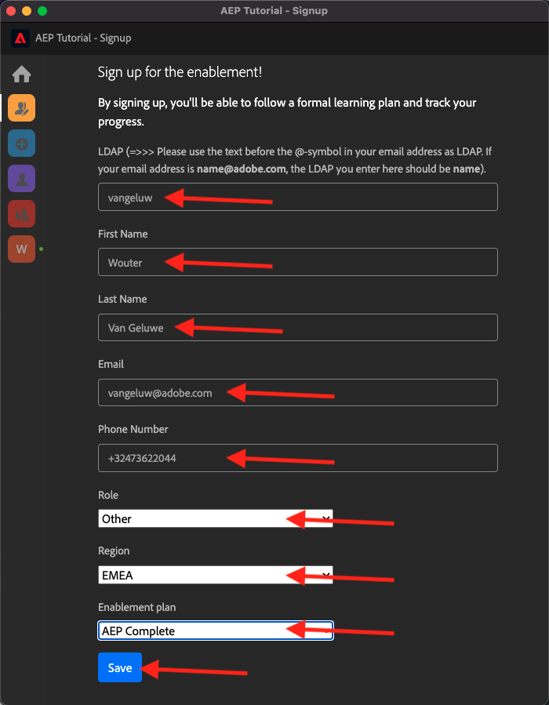

# 0.1 Installare l’estensione Chrome per la documentazione di Experience League

## 0.1.1 Perché abbiamo creato un’estensione Chrome?

La documentazione è stata resa generica in modo da poter essere riutilizzata facilmente da chiunque, utilizzando qualsiasi istanza di Adobe Experience Platform.
Rendendo riutilizzabile la documentazione, sono state introdotte **variabili di ambiente** nella documentazione, il che significa che troverai le **chiavi** seguenti nella documentazione. Ogni chiave è una variabile specifica per un ambiente specifico e l’estensione Chrome la modificherà automaticamente, semplificando così la copia di codice e testo dalle pagine dei tutorial e la relativa incollatura nelle varie interfacce utente che verranno utilizzate come parte dell’esercitazione.

Di seguito è riportato un esempio di tali valori. Attualmente, questi valori non possono ancora essere utilizzati, ma non appena installi e attivi l’estensione Chrome, vedrai che queste variabili cambiano in testo &quot;normale&quot; che puoi copiare e riutilizzare.

| Nome | Chiave |
|:-------------:| :---------------:|
| ID organizzazione IMS AEP | `--aepImsOrgId--` |
| ID tenant AEP | `--aepTenantId--` |
| ID ingresso DCS | `--dcsInletId--` |
| Profilo demo LDAP | `--demoProfileLdap--` |

Ad esempio, nella schermata seguente è possibile visualizzare un riferimento a `--aepTenantId--`.

Una volta installata l’estensione, lo stesso testo verrà modificato automaticamente in modo da riflettere i valori specifici dell’istanza.

L’estensione consente inoltre di:

- Iscriviti all’esercitazione

## 0.1.2 Installare l’estensione Chrome

Per installare l&#39;estensione Chrome, apri il browser Chrome e vai a: [https://chrome.google.com/webstore/detail/platform-learn-configurat/hhnbkfgioecmhimdhooigajdajplinfi/related?hl=en&amp;authuser=0](https://chrome.google.com/webstore/detail/platform-learn-configurat/hhnbkfgioecmhimdhooigajdajplinfi/related?hl=en&amp;authuser=0). Poi vedrai questo.

Fai clic su **Aggiungi a Chrome**.

Poi vedrai questo. Fai clic su **Aggiungi estensione**.

L&#39;estensione verrà quindi installata e verrà visualizzata una notifica simile.

Nel menu **extensions**, fai clic sull&#39;icona **puzzle** e aggiungi l&#39;estensione **Platform Learn - Configuration** al menu dell&#39;estensione.

## 0.1.2 Configurare l’estensione Chrome

Vai a [https://experienceleague.adobe.com/docs/platform-learn/comprehensive-technical-tutorial-v22/overview.html?lang=en](https://experienceleague.adobe.com/docs/platform-learn/comprehensive-technical-tutorial-v22/overview.html?lang=en) e fai clic sull&#39;icona dell&#39;estensione per aprirla.

Poi vedrai questo popup. Fai clic sull&#39;icona **+**.

Immetti il nome e l&#39;ID configurazione creati per l&#39;ambiente Adobe Experience Platform. Fai clic su **Crea nuovo**.

>[!IMPORTANT]
>
>Se sei un dipendente Adobe: puoi trovare l’ID di configurazione da utilizzare nell’archivio Github interno (https://git.corp.adobe.com/vangeluw/platformenablement).
>
>Se sei un Adobe Solution Partner, contatta il tuo contatto Solution Partner o invia un&#39;e-mail a **spphelp@adobe.com**.

Nel menu a sinistra dell’estensione, viene visualizzata un’icona con le iniziali dell’utente. Fai clic su di esso. Verrà quindi visualizzata la mappatura tra le **Variabili di ambiente** e i valori specifici dell&#39;istanza di Adobe Experience Platform. Fare clic su **Attiva configurazione**.

Dopo aver attivato la configurazione, accanto alle iniziali viene visualizzato un punto verde. Ciò significa che l&#39;ID configurazione è ora attivo. Verranno inoltre visualizzate alcune opzioni di menu aggiuntive.

Ora sono disponibili 2 opzioni:

- Se sei un utente esistente dell&#39;abilitazione con una configurazione esistente, passa a **0.1.3 Utente esistente - Accesso**
- Se sei un utente completamente nuovo che sta avviando questa esercitazione per la prima volta, vai a **0.1.4 Iscriviti** e salta **0.1.3 Utente esistente - Accesso**

## 0.1.3 Utente esistente - Accesso

>[!IMPORTANT]
>
>Esercizio **0.1.3 Utente esistente - Accesso** funzionerà solo se sei un utente esistente che si è precedentemente iscritto a questa esercitazione.

Se sei un utente esistente che configura questa estensione Chrome per la prima volta, fai clic sull’icona viola nel menu a sinistra. Poi vedrai questo.

Compila i valori come richiesto.

>[!IMPORTANT]
>
>Il campo **LDAP** è il più importante: è necessario utilizzare lo stesso LDAP utilizzato al primo abbonamento all&#39;esercitazione. In questo modo l’avanzamento verrà caricato correttamente. Se non sei sicuro di quale sia il tuo ldap, controlla il tuo indirizzo e-mail. Utilizza il testo che precede il @-symbol nell’indirizzo e-mail come LDAP. Se l&#39;indirizzo di posta elettronica è **techinsiders@adobe.com**, il LDAP immesso in questa posizione deve essere **vangeluw**).

Fai clic su **OK**.

Dopo 30 secondi-1 minuto, lo schermo cambierà e tornerai alla **Home**, dove visualizzerai questo messaggio:

L&#39;estensione Chrome è ora configurata e puoi verificare se tutto funziona correttamente.

## 0.1.4 Nuovo utente - Registrazione

>[!IMPORTANT]
>
>Esercizio **0.1.4 Nuovo utente - Iscrizione** è destinato ai nuovi utenti che stanno avviando questa esercitazione per la prima volta.

Se sei un nuovo utente che si iscrive a questo tutorial la prima volta, fai clic sull’icona gialla nel menu. Poi vedrai questo.

Compila i campi come richiesto. Fai clic su **Salva**.

>[!IMPORTANT]
>
>**LDAP** è il campo più importante. Se non sei sicuro di quale sia il tuo ldap, controlla il tuo indirizzo e-mail. Utilizza il testo che precede il @-symbol nell’indirizzo e-mail come LDAP. Se l&#39;indirizzo di posta elettronica è **techinsiders@adobe.com**, il LDAP immesso in questa posizione deve essere **vangeluw**).

Dopo 30 secondi-1 minuto, lo schermo cambierà e tornerai alla **Home**, dove visualizzerai questo messaggio:

L&#39;estensione Chrome è ora configurata e puoi verificare se tutto funziona correttamente.

## 0.1.5 Verifica del contenuto del tutorial

Come test, passa a [questa pagina](https://experienceleague.adobe.com/docs/platform-learn/comprehensive-technical-tutorial-v22/module4/ex3.html?lang=en).

Ora dovresti notare che tutte le **Variabili di ambiente** sono state sostituite dai loro valori effettivi, in base all&#39;ID configurazione nell&#39;estensione chrome.

È ora necessario disporre di una visualizzazione simile a quella riportata di seguito, in cui le variabili di ambiente `--aepTenantId--` sono state sostituite dall&#39;ID tenant effettivo, in questo caso **_experienceplatform**.

Passaggio successivo: [0.2 Utilizzare Demo System Next per configurare la proprietà client di Adobe Experience Platform Data Collection](./ex2.md)

[Torna al modulo 0](./getting-started.md)

[Torna a tutti i moduli](./../../../overview.md)
