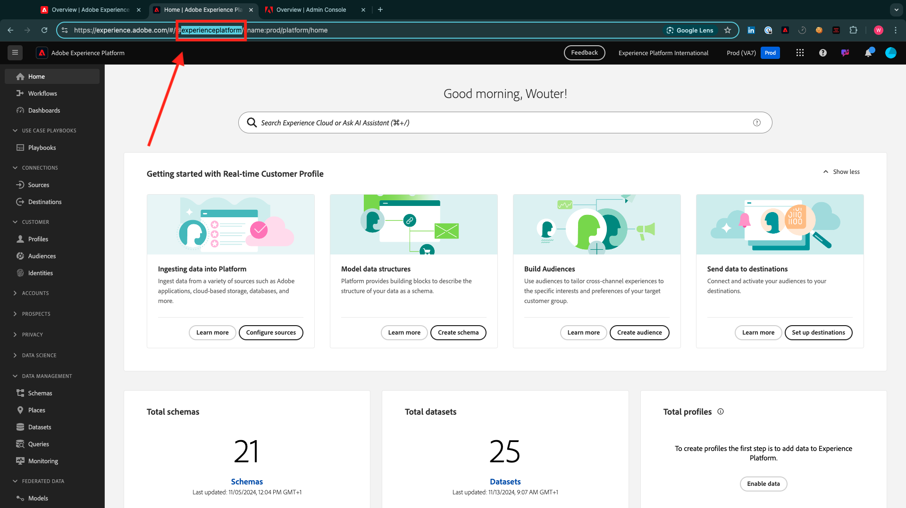

# 0.1.1 Installare l’estensione Chrome per la documentazione di Experience League

## Informazioni sull’estensione Chrome

La documentazione è stata resa generica in modo da poter essere riutilizzata facilmente da chiunque, utilizzando qualsiasi istanza di Adobe Experience Platform.
Per rendere riutilizzabile la documentazione, nella documentazione sono state introdotte **Variabili di ambiente**. Di conseguenza, nella documentazione troverai **segnaposto**. Ogni segnaposto è una variabile specifica per un ambiente specifico e l’estensione Chrome modificherà tale variabile per semplificare la copia di codice e testo dalle pagine dei tutorial e incollarla nelle varie interfacce utente che verranno utilizzate come parte dell’esercitazione.

Di seguito è riportato un esempio di tali valori. Attualmente, questi valori non possono ancora essere utilizzati, ma non appena installi e attivi l’estensione Chrome, vedrai che queste variabili cambiano in testo normale che puoi copiare e riutilizzare.

| Nome | Chiave |
|:-------------:| :---------------:|
| ID organizzazione IMS AEP | `--aepImsOrgId--` |
| ID tenant AEP | `--aepTenantId--` |
| Nome sandbox AEP | `--aepSandboxName--` |
| Profilo Allievo LDAP | `--aepUserLdap--` |

Ad esempio, nella schermata seguente è possibile visualizzare un riferimento a `aepTenantId`.

Una volta installata l’estensione, lo stesso testo verrà modificato automaticamente in modo da riflettere i valori specifici dell’istanza.

## 0.1.1.1 Installare l’estensione Chrome

Per installare l&#39;estensione Chrome, apri il browser Chrome e vai a: [https://chromewebstore.google.com/detail/tech-insiders-learning-fo/hhnbkfgioecmhimdhooigajdajplinfi](https://chromewebstore.google.com/detail/tech-insiders-learning-fo/hhnbkfgioecmhimdhooigajdajplinfi). Poi vedrai questo.

Fai clic su **Aggiungi a Chrome**.

Poi vedrai questo. Fai clic su **Aggiungi estensione**.

L&#39;estensione verrà quindi installata e verrà visualizzata una notifica simile.

Nel menu **extensions**, fai clic sull&#39;icona **puzzle** e aggiungi l&#39;estensione **Platform Learn - Configuration** al menu dell&#39;estensione.

## 0.1.1.2 Configurare l’estensione Chrome

Vai a [https://experienceleague.adobe.com/en/docs/platform-learn/tutorial-comprehensive-technical/overview](https://experienceleague.adobe.com/en/docs/platform-learn/tutorial-comprehensive-technical/overview) e fai clic sull&#39;icona dell&#39;estensione per aprirla.

Poi vedrai questo popup. Fai clic sull&#39;icona **+**.

Immetti i valori come indicato di seguito, che sono tutti relativi all’istanza Adobe Experience Platform.

Se non si è sicuri dei valori da immettere per questi campi, seguire le istruzioni riportate di seguito.

**Nome organizzazione IMS AEP**

Quando accedi all&#39;istanza di Adobe Experience Platform in [https://platform.adobe.com/](https://platform.adobe.com/), il nome dell&#39;istanza si trova nell&#39;angolo in alto a destra dello schermo.

**ID organizzazione IMS AEP**

L’ID organizzazione IMS è l’identificatore univoco dell’istanza di Adobe Experience Cloud e in questa esercitazione viene fatto riferimento a tale ID in più posizioni.

È possibile trovare l’ID organizzazione IMS in diversi modi. Se non sei sicuro, rivolgiti a uno degli amministratori di sistema della tua istanza per trovare l’ID.

Puoi trovarlo andando in [Admin Console](https://https://adminconsole.adobe.com/), dove è possibile trovarlo come parte dell&#39;URL.

Puoi anche trovarlo andando in **Gestione dati > Query** nel menu AEP, dove puoi trovarlo in **Nome utente**.

Assicurarsi di copiare e incollare la parte **@AdobeOrg** insieme all&#39;ID.

**ID tenant AEP**

L’ID tenant è l’identificatore univoco dell’istanza AEP della tua organizzazione. Quando accedi all&#39;istanza di Adobe Experience Platform in [https://platform.adobe.com/](https://platform.adobe.com/), troverai l&#39;ID tenant nell&#39;URL.

Quando lo inserisci nell&#39;estensione Chrome, accertati che un trattino basso sia aggiunto come prefisso, quindi in questo esempio **experienceplatform** diventa **_experienceplatform**.

**Nome Sandbox AEP**

Il nome della sandbox è il nome dell’ambiente che utilizzerai nell’istanza di AEP. Quando accedi all&#39;istanza di Adobe Experience Platform in [https://platform.adobe.com/](https://platform.adobe.com/), troverai l&#39;ID tenant nell&#39;URL.

Prima di estrarre il nome della sandbox dall’URL, accertati di trovarti nella sandbox da utilizzare per questa esercitazione. Per passare alla sandbox di destra, fai clic sul menu del commutatore sandbox nell’angolo in alto a destra dello schermo.

In questo esempio, il nome della sandbox AEP è **tech-insiders**.

**Il tuo LDAP**

Questo è il nome utente che verrà usato come parte dell&#39;esercitazione. In questo esempio, il protocollo LDAP si basa sull’indirizzo e-mail di questo utente. L&#39;indirizzo di posta elettronica è **vangeluw@adobe.com**, quindi LDAP diventa **vangeluw**.

Il protocollo LDAP viene utilizzato per garantire che la configurazione che eseguirai sia collegata all’utente e non sia in conflitto con altri utenti che potrebbero utilizzare la stessa istanza e sandbox in uso.

I valori dovrebbero essere simili a questi.
Infine, fare clic su **Crea nuovo**.

Nel menu a sinistra dell’estensione, viene ora visualizzata una nuova icona con le iniziali dell’ambiente. Fai clic su di esso. Verrà quindi visualizzata la mappatura tra le **Variabili di ambiente** e i valori specifici dell&#39;istanza di Adobe Experience Platform. Fare clic su **Attiva configurazione**.

Dopo aver attivato la configurazione, accanto alle iniziali dell’ambiente compare un punto verde. Ciò significa che l’ambiente è ora attivo.

## 0.1.1.3 Verifica del contenuto del tutorial

Come test, passa a [questa pagina](https://experienceleague.adobe.com/en/docs/platform-learn/tutorial-comprehensive-technical/datadistiller/module51/ex3).

È ora possibile vedere che tutte le **Variabili di ambiente** sono state sostituite dai loro valori effettivi, in base all&#39;ambiente attivato nell&#39;estensione chrome.

È ora necessario disporre di una visualizzazione simile a quella riportata di seguito, in cui la variabile di ambiente `aepTenantId` è stata sostituita dall&#39;ID tenant AEP effettivo, che in questo caso è **_experienceplatform**.

Passaggio successivo: [0.2 Utilizzare Demo System Next per configurare la proprietà client di Adobe Experience Platform Data Collection](./ex2.md)

[Torna al modulo 0](./getting-started.md)

[Torna a tutti i moduli](./../../../overview.md)
