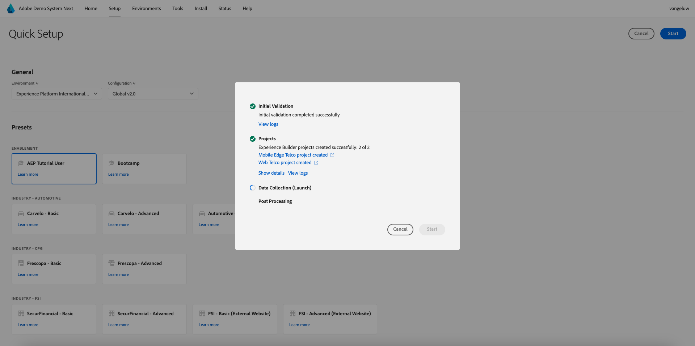

# 0.2 Utilizza Demo System Next per configurare la proprietà client di Adobe Experience Platform Data Collection

Dopo esserti registrato al tutorial tecnico completo per Adobe Experience Platform, è disponibile un processo automatizzato che ti fornirà l’accesso a Demo System, in modo da poter accedere ed eseguire la configurazione seguente.

Dopo aver effettuato l&#39;accesso a Demo System, procedere come segue.

Vai a [https://dashboard.adobedemo.com/](https://dashboard.adobedemo.com/). Seleziona la sandbox e fai clic su **Configurazione rapida**.

Vedrai questo:

In **Generale** - **Ambiente**, seleziona l&#39;istanza di Adobe Experience Platform e la sandbox, in questo caso:

- **Experience Platform internazionale**
- **aepenablementfy22**
- Configurazione: selezionare **Global v2.0**

Selezionare quindi il predefinito **Utente attivazione** e fare clic su **Avvia**.

Nella finestra a comparsa, immetti un nome per la proprietà Raccolta dati. Utilizza questa convenzione per i nomi: **Sistema demo (GG/MM/AAAA)**. Nota: il tuo LDAP verrà aggiunto automaticamente, non è necessario aggiungerlo autonomamente.

Fare clic su **Inizio**.

Viene quindi visualizzata questa finestra a comparsa che mostra l’avanzamento della creazione dei progetti per siti web e app mobili e delle proprietà di raccolta dati.

Una volta completato il processo di configurazione rapida, avrai:

- 1 Progetto Web Retail, che consente di utilizzare un sito web demo con il marchio demo Luma
- 1 progetto Mobile Retail, che consente di utilizzare un’app mobile demo con il marchio demo Luma
- 1 Progetto CX App Retail, che consente di utilizzare un call center e un’app di clientela con il marchio demo Luma
- 1 Proprietà di raccolta dati per il Web, che verrà utilizzata per raccogliere i dati dal sito Web
- 1 Proprietà di raccolta dati per dispositivi mobili, che utilizzerai per raccogliere dati dall’app mobile

Tieni aperta questa schermata come ti servirà nei passaggi successivi.

Passaggio successivo: [0.3 Crea lo stream di dati](./ex3.md)

[Torna al modulo 0](./getting-started.md)

[Torna a tutti i moduli](./../../../overview.md)
