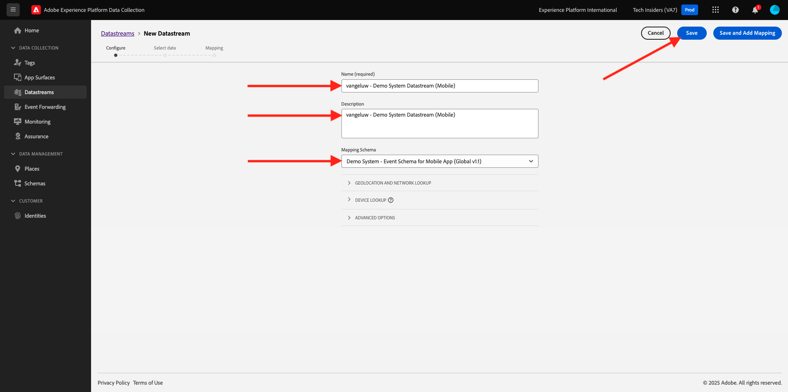

# Creare lo stream di dati

Vai a [https://experience.adobe.com/#/data-collection/](https://experience.adobe.com/it#/data-collection/).

Nel menu a sinistra, fai clic su **[!UICONTROL Tag]**. Dopo l’esercizio precedente, ora disponi di 3 proprietà di raccolta dati: una per il web, una per i dispositivi mobili e una per l’app CX.

Queste proprietà sono quasi pronte per essere utilizzate, ma prima di poter iniziare a raccogliere dati utilizzando queste proprietà è necessario impostare un flusso di dati. In un esercizio successivo nel modulo di raccolta dei dati troverai ulteriori informazioni sul concetto di flusso di dati e sul suo significato.

Per il momento, segui questi passaggi.

## Creare lo stream di dati per il web

Fare clic su **[!UICONTROL Datastreams]**.

Nell&#39;angolo in alto a destra dello schermo, seleziona il nome della sandbox, che dovrebbe essere `--aepSandboxName--`.

Fare clic su **[!UICONTROL Nuovo flusso di dati]**.

Per **[!UICONTROL Name]** e per la descrizione facoltativa, immettere `--aepUserLdap-- - Demo System Datastream`. Per **Schema mappatura**, selezionare **Sistema demo - Schema evento per sito Web (Global v1.1)**. Fai clic su **Salva**.

Poi vedrai questo. Fare clic su **Aggiungi servizio**.

Selezionare il servizio **[!UICONTROL Adobe Experience Platform]**, che esporrà campi aggiuntivi. Poi vedrai questo.

Per Set di dati evento, selezionare **Sistema demo - Set di dati evento per sito Web (Global v1.1)** e per Set di dati profilo, selezionare **Sistema demo - Set di dati profilo per sito Web (Global v1.1)**. Fai clic su **Salva**.

Ora vedrai questo.

È tutto per ora. Nel [modulo 1.1](./../../../modules/datacollection/module1.1/data-ingestion-launch-web-sdk.md) verranno fornite ulteriori informazioni su Web SDK e su come configurarne tutte le funzionalità.

Nel menu a sinistra, fai clic su **[!UICONTROL Tag]**.

Filtra i risultati della ricerca per visualizzare le proprietà di raccolta dati. Aprire la proprietà per **Web** facendo clic su di essa.

Poi vedrai questo. Fare clic su **Estensioni**.

Fare clic sull&#39;estensione Adobe Experience Platform Web SDK e quindi su **Configura**.

Poi vedrai questo. Dai un&#39;occhiata al menu **Flussi di dati** e assicurati che sia selezionata la sandbox corretta, che in questo caso dovrebbe essere `--aepSandboxName--`.

Apri il menu a discesa **Datastreams** e seleziona lo stream di dati creato in precedenza.

Assicurati di aver selezionato lo **stream di dati** in tutti e tre i diversi ambienti. Quindi fare clic su **Salva**.

Vai a **Flusso di pubblicazione**.

Fai clic su **...** per **Principale**, quindi su **Modifica**.

Fare clic su **Aggiungi tutte le risorse modificate** e quindi su **Salva e genera per sviluppo**.

Le modifiche sono in fase di pubblicazione e saranno pronte tra qualche minuto, dopodiché verrà visualizzato il punto verde accanto a **Principale**.

## Creare lo stream di dati per dispositivi mobili

Vai a [https://experience.adobe.com/#/data-collection/](https://experience.adobe.com/it#/data-collection/).

Fare clic su **[!UICONTROL Datastreams]**.

Nell&#39;angolo in alto a destra dello schermo, seleziona il nome della sandbox, che dovrebbe essere `--aepSandboxName--`.

Fare clic su **[!UICONTROL Nuovo flusso di dati]**.

Per **[!UICONTROL Nome descrittivo]** e per la descrizione facoltativa, immettere `--aepUserLdap-- - Demo System Datastream (Mobile)`. Per **Schema mappatura**, selezionare **Sistema demo - Schema evento per app mobile (Global v1.1)**. Fai clic su **Salva**.

Fai clic su **[!UICONTROL Salva]**.

Poi vedrai questo. Fare clic su **Aggiungi servizio**.

Selezionare il servizio **[!UICONTROL Adobe Experience Platform]**, che esporrà campi aggiuntivi. Poi vedrai questo.

Per Set di dati evento, selezionare **Sistema demo - Set di dati evento per app mobile (Global v1.1)** e per Set di dati profilo, selezionare **Sistema demo - Set di dati profilo per app mobile (Global v1.1)**. Fai clic su **Salva**.

Poi vedrai questo.

Lo stream di dati è ora pronto per essere utilizzato nella proprietà Client di raccolta dati di Adobe Experience Platform per dispositivi mobili.

Vai a **Tag** e filtra i risultati della ricerca per visualizzare le proprietà della raccolta dati. Apri la proprietà per **Mobile** facendo clic su di essa.

Poi vedrai questo. Fare clic su **Estensioni**.

Fai clic sull&#39;estensione **Adobe Experience Platform Edge Network** e quindi su **Configura**.

Poi vedrai questo. Ora devi selezionare la sandbox e il flusso di dati corretti che hai appena configurato. La sandbox da utilizzare è `--aepSandboxName--` e lo stream di dati è denominato `--aepUserLdap-- - Demo System Datastream (Mobile)`.

Per il **dominio Edge Network**, utilizzare il dominio predefinito.

Fai clic su **Salva** per salvare le modifiche.

Vai a **Flusso di pubblicazione**.

Fai clic su **...** accanto a **Principale**, quindi su **Modifica**.

Fai clic su **Aggiungi tutte le risorse modificate**, quindi su **Salva e genera per sviluppo**.

Le modifiche sono in fase di pubblicazione e saranno pronte tra qualche minuto, dopodiché verrà visualizzato il punto verde accanto a **Principale**.

Passaggio successivo: [Utilizzare il sito Web](./ex4.md)

[Torna a Guida introduttiva](./getting-started.md)

[Torna a tutti i moduli](./../../../overview.md)
