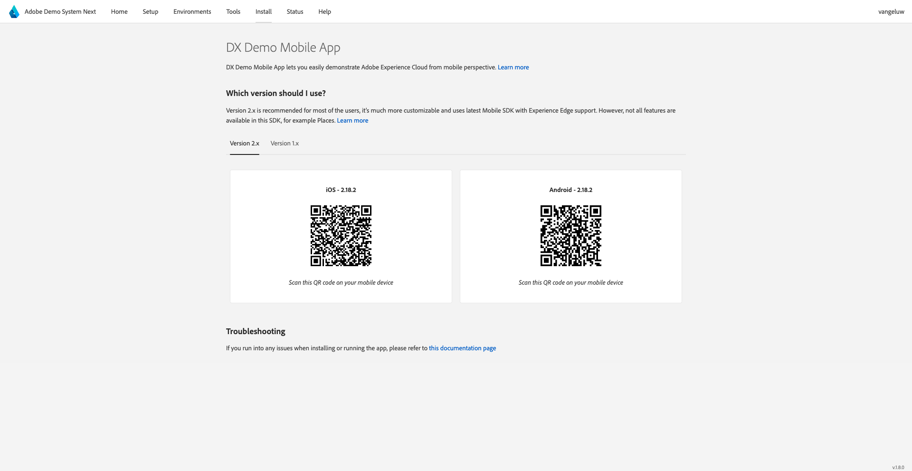
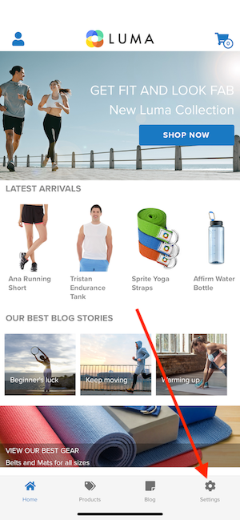
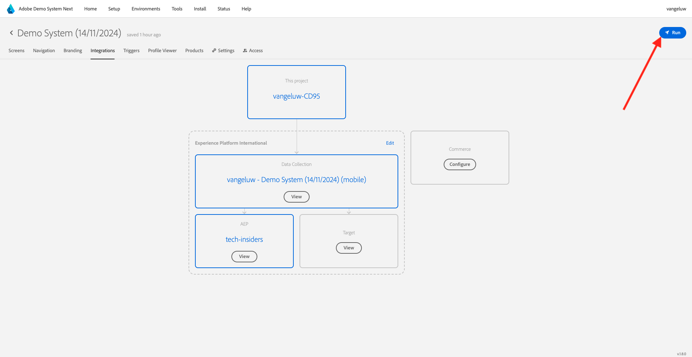

# Utilizzare l’app mobile

## Scaricare l’app

Vai a [https://bit.ly/dx-demo-app](https://bit.ly/dx-demo-app) sul tuo computer. Poi vedrai questo.

Utilizza l&#39;app **Fotocamera** sul tuo smartphone per installare l&#39;app mobile per il sistema operativo del tuo dispositivo. Per questa abilitazione, è necessario installare la **versione 2.x** che utilizza il SDK di Adobe Experience Platform Mobile.

>[!NOTE]
>
>Dopo aver installato l&#39;app per la prima volta su un dispositivo iOS, è possibile che venga visualizzato un messaggio di errore quando si tenta di aprire l&#39;app con il seguente messaggio: **Sviluppatore Enterprise non attendibile**. Per risolvere il problema, vai a **Impostazioni > Generale > Gestione VPN e dispositivi > Adobe Systems Inc.** e fai clic su **Considera attendibile Adobe Systems Inc.**.
>È probabile che il dispositivo iOS debba essere riavviato per completare il processo di affidabilità di uno sviluppatore.

Una volta installata l’app, questa si trova nella schermata iniziale del dispositivo. Fai clic sull&#39;icona per aprire l&#39;app.

Quando utilizzi l’app per la prima volta, ti verrà richiesto di accedere con il tuo Adobe ID. Completa il processo di accesso.

Dopo aver effettuato l’accesso, verrà visualizzata una notifica con la richiesta dell’autorizzazione per l’invio di notifiche. Invieremo notifiche come parte dell&#39;esercitazione, quindi fai clic su **Consenti**.

Viene quindi visualizzata la home page dell’app. Vai a **Impostazioni**.

Nelle impostazioni, vedrai che attualmente un **progetto pubblico** è caricato nell&#39;app. Fai clic su **Progetto personalizzato**.

Ora puoi caricare un progetto personalizzato. Fai clic sul codice QR per caricare facilmente il progetto.

Questo risultato è stato ottenuto dopo l&#39;esercizio precedente. Fai clic per aprire il **progetto Edge Telco per dispositivi mobili** creato per te.

Nel caso in cui tu abbia chiuso accidentalmente la finestra del browser o per sessioni di attivazione o demo future, puoi anche accedere al progetto del tuo sito web da [https://dsn.adobe.com](https://dsn.adobe.com). Dopo aver effettuato l’accesso con il tuo Adobe ID, visualizzerai questo. Fai clic sui tre punti **...** nel progetto per app mobile, quindi fai clic su **Modifica**.

Nella pagina **Integrazioni** è necessario selezionare la proprietà Raccolta dati creata nell&#39;esercizio precedente. A tale scopo, fare clic su **Seleziona ambiente**.

Fare clic su **Seleziona** nella proprietà Raccolta dati creata nel passaggio precedente, denominata `--aepUserLdap-- - Demo System (DD/MM/YYYY) (mobile)`. Quindi fare clic su **Salva**.

Poi vedrai questo. Fare clic su **Esegui**.

Viene quindi visualizzata questa finestra a comparsa contenente un codice QR. Esegui la scansione di questo codice QR dall’app mobile.

Nell&#39;app verrà quindi visualizzato l&#39;ID progetto, dopodiché potrai fare clic su **Salva**.

Ora torna alla **Home** nell&#39;app. L&#39;app è ora pronta per essere utilizzata.

Hai completato il modulo Guida introduttiva e sei pronto per iniziare con i prossimi esercizi.

[Torna a Guida introduttiva](./getting-started.md)

[Torna a tutti i moduli](./../../../overview.md)
