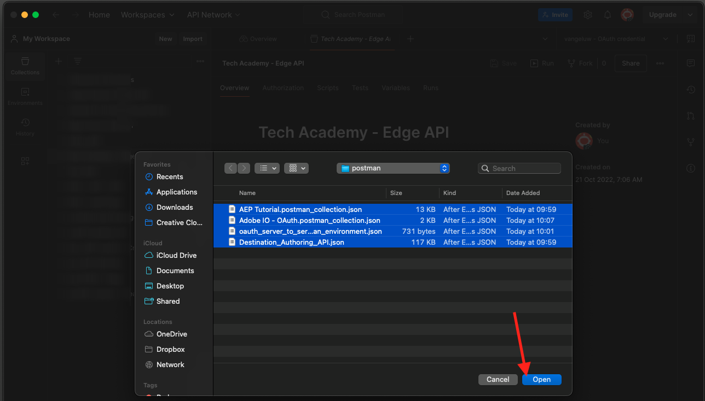

# 2.1.3 Visualizzare il proprio profilo cliente in tempo reale - API

In questo esercizio, utilizzerai Postman e Adobe I/O per eseguire query sulle API di Adobe Experience Platform per visualizzare il tuo profilo cliente in tempo reale.

## Storia

In Real-time Customer Profile, tutti i dati di profilo vengono visualizzati insieme ai dati di evento, così come le appartenenze ai segmenti esistenti. I dati visualizzati possono provenire da qualsiasi luogo, da applicazioni Adobe e soluzioni esterne. Questa è la visualizzazione più potente di Adobe Experience Platform, l’esperienza del sistema di registrazione.

Il profilo cliente in tempo reale può essere utilizzato da tutte le applicazioni Adobe, ma anche da soluzioni esterne come Call Center o app di clientela in-store. Il modo per farlo è collegare queste soluzioni esterne alle API di Adobe Experience Platform.

## 2.1.3.1 I Suoi Identificatori

Nel pannello Visualizzatore profili del sito web puoi trovare più identità. Ogni identità è collegata a uno spazio dei nomi.


Nel pannello a raggi X, possiamo vedere 4 diverse combinazioni di ID e namespace:

| Identità | Namespace |
|:-------------:| :---------------:|
| ID Experience Cloud (ECID) | 12507560687324495704459439363261812234 |
| ID e-mail | woutervangeluwe+06022022-01@gmail.com |
| ID numero cellulare | +32473622044+06022022-01 |

Ricorda questi identificatori per il passaggio successivo.

Tenendo presenti questi ID, vai a Postman.

## 2.1.3.2 Configurare il progetto Adobe I/O

In questo esercizio utilizzerai Adobe I/O in modo piuttosto intensivo per eseguire query sulle API di Platform. Per configurare l’Adobe I/O, segui i passaggi seguenti.

Vai a [https://developer.adobe.com/console/home](https://developer.adobe.com/console/projects)


Assicurati di selezionare l’istanza Adobe Experience Platform corretta nell’angolo in alto a destra dello schermo. L&#39;istanza è `--envName--`.


Fare clic su **Crea nuovo progetto**.

 o


Seleziona **+ Aggiungi al progetto** e seleziona **API**.


A questo punto viene visualizzato quanto segue:


Fai clic sull&#39;icona **Adobe Experience Platform**.
/images/api2.png)

Fare clic su **Experience Platform API**.


Fai clic su **Avanti**.


Ora puoi scegliere se far generare la coppia di chiavi di sicurezza da Adobe I/O o caricarne una esistente.

Scegliere **Opzione 1 - Genera una coppia di chiavi**.


Fai clic su **Genera coppia di chiavi**.


Vedrete un giratore per circa 30 secondi.


Visualizzerai quindi questo messaggio e la coppia di chiavi generata verrà scaricata come file zip: **config.zip**.

Decomprimi il file **config.zip** sul desktop e vedrai che contiene 2 file:


- **certificate_pub.crt** è il tuo certificato a chiave pubblica. Dal punto di vista della sicurezza, si tratta del certificato utilizzato liberamente per configurare le integrazioni con le applicazioni online.
- **private.key** è la tua chiave privata. Questo non dovrebbe mai e poi mai essere condiviso con nessuno. La chiave privata è ciò che utilizzi per l’autenticazione nell’implementazione API e che deve essere un segreto. Se condividi la chiave privata con chiunque, può accedere alla tua implementazione e sfruttare l’API per acquisire dati dannosi in Platform ed estrarre tutti i dati presenti in Platform.


Assicurati di salvare il file **config.zip** in un percorso sicuro, in quanto sarà necessario per i passaggi successivi e per l&#39;accesso futuro alle API Adobe I/O e Adobe Experience Platform.

Fai clic su **Avanti**.


Ora devi selezionare i **profili di prodotto** per l&#39;integrazione.

Seleziona i profili di prodotto richiesti.

**FYI**: nell&#39;istanza di Adobe Experience Platform, i profili prodotto avranno un nome diverso. Devi selezionare almeno un profilo di prodotto con i diritti di accesso appropriati, che sono impostati in Adobe Admin Console.


Fare clic su **Salva API configurata**.


Vedrete un giratore per un paio di secondi.


E poi vedrai la tua integrazione.


Fai clic sul pulsante **Scarica per Postman** e quindi su **Account di servizio (JWT)** per scaricare un ambiente Postman (attendi che l&#39;ambiente venga scaricato, l&#39;operazione potrebbe richiedere alcuni secondi).


Scorri verso il basso fino a visualizzare **Account di servizio (JWT)**, che è il luogo in cui puoi trovare tutti i dettagli di integrazione utilizzati per configurare l&#39;integrazione con Adobe Experience Platform.


Il progetto I/O ha un nome generico. È necessario assegnare un nome descrittivo alla tua integrazione. Fai clic su **Progetto 1** (o nome simile) come indicato


Fare clic su **Modifica progetto**.


Immetti un nome e una descrizione per l’integrazione. Come convenzione per i nomi, utilizzeremo `AEP API --demoProfileLdap--`. Sostituire ldap con ldap.
Ad esempio, se ldap è vangeluw, il nome e la descrizione dell&#39;integrazione diventano AEP API vangeluw.

Immetti `AEP API --demoProfileLdap--` come **Titolo progetto**. Fai clic su **Salva**.


L’integrazione di Adobe I/O è terminata.


## 2.1.3.3 Autenticazione Postman per Adobe I/O

Vai a [https://www.getpostman.com/](https://www.getpostman.com/).

Fai clic su **Inizia**.


Quindi, scarica e installa Postman.


Dopo aver installato Postman, avviare l&#39;applicazione.

In Postman sono disponibili 2 concetti: ambienti e raccolte.

- L’ambiente contiene tutte le variabili ambientali che sono più o meno coerenti. Nell’ambiente, troverai elementi come l’IMSOrg del nostro ambiente Platform, insieme alle credenziali di sicurezza come la tua Chiave privata e altri. Il file dell&#39;ambiente è quello scaricato durante l&#39;Adobe I/O di configurazione dell&#39;esercizio precedente, con il nome seguente: **service.postman_environment.json**.

- La raccolta contiene diverse richieste API che puoi utilizzare. Utilizzeremo 2 raccolte
   - 1 raccolta per l&#39;autenticazione in Adobe I/0
   - 1 Raccolta per gli esercizi in questo modulo
   - 1 raccolta per gli esercizi nel modulo Real-Time CDP, per l’authoring delle destinazioni

Scarica il file [postman.zip](./../../../assets/postman/postman_profile.zip) sul desktop locale.

In questo file **postman.zip**, troverai i seguenti file:

- `_Adobe I-O - Token.postman_collection.json`
- `_Adobe Experience Platform Enablement.postman_collection.json`
- `Destination_Authoring_API.json`

Decomprimi il file **postman.zip** e archivia questi 3 file in una cartella sul desktop, insieme all&#39;ambiente Postman scaricato da Adobe I/O. Devi avere questi 4 file in quella cartella:


Torna a Postman. Fai clic su **Importa**.


Fare clic su **Carica file**.


Passa alla cartella sul desktop in cui sono stati estratti i 4 file scaricati. Selezionare questi 4 file contemporaneamente e fare clic su **Apri**.



Dopo aver fatto clic su **Apri**, Postman ti mostrerà una panoramica dell&#39;ambiente e delle raccolte che stai per importare. Fai clic su **Importa**.


Ora disponi di tutto il necessario in Postman per iniziare a interagire con Adobe Experience Platform tramite le API.

La prima cosa da fare è accertarsi di essere autenticati correttamente. Per essere autenticato, devi richiedere un token di accesso.

Accertati di aver selezionato l’ambiente corretto prima di eseguire qualsiasi richiesta. Per controllare l’ambiente attualmente selezionato, verifica l’elenco a discesa Ambiente nell’angolo in alto a destra.

L’ambiente selezionato deve avere un nome simile a questo:


Fai clic sull&#39;icona **occhio** e quindi su **Modifica** per aggiornare la chiave privata nel file di ambiente.


Poi vedrai questo. Tutti i campi sono precompilati, ad eccezione del campo **PRIVATE_KEY**.


La chiave privata è stata generata al momento della creazione del progetto di Adobe I/O. È stato scaricato come file zip, denominato **config.zip**. Estrai il file zip sul desktop.


Apri la cartella **config** e apri il file **private.key** con l&#39;editor di testo desiderato.


Si vedrà quindi qualcosa di simile a questo, copiare tutto il testo negli Appunti.


Torna a Postman e incolla la chiave privata nei campi accanto alla variabile **PRIVATE_KEY**, per entrambe le colonne **INITIAL VALUE** e **CURRENT VALUE**. Fai clic su **Salva**.


L’ambiente e le raccolte Postman ora sono configurati e funzionanti. Ora puoi eseguire l’autenticazione da Postman a Adobe I/O.

A questo scopo, devi caricare una libreria esterna che si occuperà della crittografia e decrittografia delle comunicazioni. Per caricare questa libreria, è necessario eseguire la richiesta con il nome **INIT: Load Crypto Library for RS256**. Seleziona questa richiesta in **_Adobe I/O - Raccolta token** e la visualizzerai al centro dello schermo.


Fai clic sul pulsante blu **Invia**. Dopo un paio di secondi, dovresti visualizzare una risposta nella sezione **Body** di Postman:


Con la libreria di crittografia ora caricata, possiamo eseguire l&#39;autenticazione in Adobe I/O.

Nella **\_Adobe I/O - raccolta token**, seleziona la richiesta con il nome **IMS: JWT Generate + Auth**. Di nuovo, i dettagli della richiesta saranno visualizzati al centro della schermata.


Fai clic sul pulsante blu **Invia**. Dopo un paio di secondi, dovresti visualizzare una risposta nella sezione **Body** di Postman:


Se la configurazione è andata a buon fine, dovresti vedere una risposta simile che contiene le seguenti informazioni:

| Chiave | Valore |
|:-------------:| :---------------:| 
| token_type | **portatore** |
| access_token | **eyJ4NXUiOiJpbXNfbmEx...QT7mqZkumN1tdsPEioOEl4087Dg** |
| expires_in | **86399973** |

L&#39;Adobe I/O ti ha assegnato un token **bearer**, con un valore specifico (access_token molto lungo) e una finestra di scadenza.

Il token ricevuto è ora valido per 24 ore. Ciò significa che dopo 24 ore, se desideri utilizzare Postman per l’autenticazione in Adobe I/O, dovrai generare un nuovo token eseguendo nuovamente questa richiesta.

## 2.1.3.4 API del profilo cliente in tempo reale, schema: profilo

Ora puoi procedere e inviare la tua prima richiesta alle API Real-time Customer Profile di Platform.

In Postman, individuare la raccolta **_Abilitazione Adobe Experience Platform**.


In **1. Servizio profilo unificato**, selezionare la prima richiesta con il nome **UPS - Profilo GET per ID entità e NS**.


Per questa richiesta, sono necessarie tre variabili:

| Chiave | Valore | Definizione |
|:-------------:| :---------------:| :---------------:| 
| entityId | **id** | l’ID cliente specifico |
| entityIdNS | **spazio dei nomi** | lo spazio dei nomi specifico applicabile all’ID |
| schema.name | **_xdm.context.profile** | lo schema specifico per il quale si desidera ricevere informazioni |

Pertanto, se desideri che le API di Adobe Experience Platform ti forniscano tutte le informazioni sul profilo per il tuo ECID, devi configurare la richiesta come segue:

| Chiave | Valore |
|:-------------:| :---------------:| 
| entityId | **tuoECID** |
| entityIdNS | **ecid** |
| schema.name | **_xdm.context.profile** |


È inoltre necessario verificare i campi **Intestazione** della richiesta. Vai a **Intestazioni**. A questo punto viene visualizzato quanto segue:


| Chiave | Valore |
| ----------- | ----------- |
| x-sandbox-name | `--aepSandboxId--` |

>[!NOTE]
>
>È necessario specificare il nome della sandbox di Adobe Experience Platform in uso. Il nome x-sandbox deve essere `--aepSandboxId--`.

Fai clic su **Invia** per inviare la richiesta a Platform.

Dovresti ricevere una risposta immediata da Platform che ti mostri qualcosa di simile a questo:


Questa è la risposta completa di Platform:

```javascript
{
    "A28iM3aJBJRbEQpOnUh5HOM9": {
        "entityId": "A28iM3aJBJRbEQpOnUh5HOM9",
        "mergePolicy": {
            "id": "e632ccb8-882a-4b5e-8375-96a1ba3df1aa"
        },
        "sources": [
            "61fe23c5be4b5f19485dc379",
            "profile-streaming-segment",
            "61fe23cfa07c1219489b3ba4"
        ],
        "tags": [
            "1644130566774:1542:232:va7",
            "0a1e9dd4-940a-46ec-9114-7e371cf5c4d0",
            "aep_ups_partitioned_profile_cdc_low_lag_sla_0:106:1090888313",
            "a6fed09e-2c56-403e-8692-4e99e4779dfa:IRL1",
            "1644419616318:2989:31:va7",
            "aep_ups_profile_change_event_prod_va7:71:7946633524-8361f22c-c09e-4364-b24b-b57435c4d14f"
        ],
        "identityGraph": [
            "BUF9zMKLrXq72p4HpbsHv1SSBnr0LTAxQGdtYWlsLmNvbQ",
            "GkicrkFjgmCjUg",
            "GtCbrkFjgkSOFg",
            "A2-AP9zOsakzNTe9Rqwf7Wse",
            "BkFuK4QcJpSPByuSBnr0LTAx",
            "A28jSB484ziuECF3fEoXmFlF",
            "A28iM3aJBJRbEQpOnUh5HOM9"
        ],
        "entity": {
            "_experienceplatform": {
                "individualCharacteristics": {},
                "loyaltyDetails": {
                    "level": "Basic",
                    "points": 0
                },
                "identification": {
                    "core": {
                        "phoneNumber": "+32473622044+06022022-01",
                        "email": "woutervangeluwe+06022022-01@gmail.com",
                        "loyaltyId": "5415776",
                        "ecid": "12019606991718502754997192487345616673",
                        "crmId": "1478212"
                    }
                }
            },
            "personalEmail": {
                "address": "woutervangeluwe+06022022-01@gmail.com"
            },
            "_repo": {
                "createDate": "2022-02-06T06:56:06.424Z"
            },
            "testProfile": true,
            "homeAddress": {
                "postalCode": "1831",
                "city": "Diegem",
                "street1": "Culliganlaan 2F"
            },
            "mobilePhone": {
                "number": "+32473622044+06022022-01"
            },
            "segmentMembership": {
                "ups": {
                    "bc999ded-b6d7-40d4-87a7-d3a280b950e3": {
                        "lastQualificationTime": "2022-02-09T20:38:33Z",
                        "status": "exited"
                    },
                    "23b1cd4e-d62f-44bd-8392-3095a33109c4": {
                        "lastQualificationTime": "2022-02-09T20:38:33Z",
                        "status": "exited"
                    },
                    "f0807704-a1c8-4ac4-85dd-60db2fbf18f1": {
                        "lastQualificationTime": "2022-02-09T20:38:33Z",
                        "status": "existing"
                    }
                }
            },
            "person": {
                "name": {
                    "lastName": "Van Geluwe",
                    "firstName": "Wouter"
                },
                "gender": "female",
                "birthDate": "1982-07-08"
            },
            "userActivityRegions": {
                "IRL1": {
                    "captureTimestamp": "2022-02-09T15:21:11Z"
                }
            },
            "identityMap": {
                "email": [
                    {
                        "id": "woutervangeluwe+06022022-01@gmail.com"
                    }
                ],
                "crmid": [
                    {
                        "id": "1478212"
                    }
                ],
                "ecid": [
                    {
                        "id": "12507560687324495704459439363261812234"
                    },
                    {
                        "id": "12019606991718502754997192487345616673"
                    },
                    {
                        "id": "38335942889672702722192106363935964471"
                    }
                ],
                "phone": [
                    {
                        "id": "+32473622044+06022022-01"
                    }
                ],
                "loyaltyid": [
                    {
                        "id": "5415776"
                    }
                ]
            }
        },
        "lastModifiedAt": "2022-02-09T20:38:36Z"
    }
}
```

Al momento questi sono tutti i dati profilo disponibili in Platform per questo ECID.

Non è necessario utilizzare l’ECID per richiedere i dati del profilo al Real-time Customer Profile di Platform, puoi utilizzare qualsiasi ID in qualsiasi spazio dei nomi per richiedere tali dati.

Torniamo a Postman e fingiamo di essere il call center e inviamo una richiesta a Platform specificando lo spazio dei nomi di **Telefono** e il tuo numero di cellulare.

Pertanto, se desideri chiedere alle API di Platform di restituirti tutte le informazioni sul profilo per un telefono specifico, dovrai configurare la richiesta come segue:

| Chiave | Valore |
|:-------------:| :---------------:| 
| entityId | **numero di telefono** |
| entityIdNS | **telefono** (sostituisci ecid con telefono) |
| schema.name | **_xdm.context.profile** |

Se il numero di telefono contiene simboli speciali come **+**, è necessario selezionare il numero di telefono completo, fare clic con il pulsante destro del mouse e fare clic su **EncodeURIComponent**.


A questo punto si otterrà:


È inoltre necessario verificare i campi **Intestazione** della richiesta. Vai a **Intestazioni**. A questo punto viene visualizzato quanto segue:


| Chiave | Valore |
| ----------- | ----------- |
| x-sandbox-name | `--aepSandboxId--` |

>[!NOTE]
>
>È necessario specificare il nome della sandbox di Adobe Experience Platform in uso. Il nome x-sandbox deve essere `--aepSandboxId--`.

Fai clic sul pulsante blu **Invia** e verifica la risposta.


Facciamo la stessa cosa per il tuo indirizzo e-mail specificando lo spazio dei nomi di **email** e il tuo indirizzo e-mail.

Pertanto, se desideri chiedere alle API di Platform di restituirti tutte le informazioni sul profilo per un indirizzo e-mail specifico, dovrai configurare la richiesta come segue:

| Chiave | Valore |
|:-------------:| :---------------:| 
| entityId | **messaggio** |
| entityIdNS | **e-mail** (sostituisci telefono con e-mail) |
| schema.name | **_xdm.context.profile** |

Se l&#39;indirizzo di posta elettronica contiene simboli speciali come **+**, è necessario selezionare l&#39;indirizzo di posta elettronica completo, fare clic con il pulsante destro del mouse e scegliere **CodificaURIComponent**.


A questo punto si otterrà:


È inoltre necessario verificare i campi **Intestazione** della richiesta. Vai a **Intestazioni**. A questo punto viene visualizzato quanto segue:


| Chiave | Valore |
| ----------- | ----------- |
| x-sandbox-name | `--aepSandboxId--` |

>[!NOTE]
>
>È necessario specificare il nome della sandbox di Adobe Experience Platform in uso. Il nome x-sandbox deve essere `--aepSandboxId--`.

Fai clic sul pulsante blu **Invia** e verifica la risposta.


Si tratta di un tipo molto importante di flessibilità che viene offerto ai brand. Ciò significa che qualsiasi ambiente può inviare una richiesta a Platform utilizzando il proprio ID e spazio dei nomi, senza dover comprendere la complessità di più ID e spazi dei nomi.

Ad esempio:

- il call center richiederà dati a Platform utilizzando lo spazio dei nomi **phone**
- il sistema di fidelizzazione richiederà dati a Platform utilizzando lo spazio dei nomi **email**
- le applicazioni online potrebbero utilizzare lo spazio dei nomi **ecid**

Il Call Center non sa necessariamente che tipo di identificatore viene utilizzato nel sistema fedeltà e il sistema fedeltà non sa necessariamente che tipo di identificatore viene utilizzato dalle applicazioni online. Ogni singolo sistema può utilizzare le informazioni di cui dispone e comprendere per ottenere le informazioni di cui ha bisogno, quando ne ha bisogno.

## 2.1.3.5 API del profilo cliente in tempo reale, schema: Profile ed ExperienceEvent

Dopo aver eseguito correttamente la query sulle API di Platform per i dati del profilo, facciamo lo stesso con i dati ExperienceEvent.

In Postman, individuare la raccolta **_Abilitazione Adobe Experience Platform**.


In **1. GET Servizio profilo unificato**, selezionare la seconda richiesta con il nome **UPS - Profilo ed EE per ID entità e NS**.


Per questa richiesta, sono necessarie quattro variabili:

| Chiave | Valore | Definizione |
|:-------------:| :---------------:|  :---------------:| 
| schema.name | **_xdm.context.experienceevent** | lo schema specifico per il quale desideri ricevere informazioni. In questo caso, stiamo cercando i dati mappati sullo schema ExperienceEvent. |
| relatedSchema.name | **_xdm.context.profile** | Durante la ricerca di dati mappati sullo schema ExperienceEvent, è necessario specificare un’identità per la quale ricevere i dati. Lo schema che ha accesso all’identità è Profile-schema, quindi relatedSchema è Profile-schema. |
| relatedEntityId | **id** | lo specifico ID cliente |
| relatedEntityIdNS | **spazio dei nomi** | lo spazio dei nomi specifico applicabile all’ID |

Pertanto, se desideri che le API di Platform ti forniscano tutte le informazioni di profilo per il tuo ecid, devi configurare la richiesta come segue:

| Chiave | Valore |
|:-------------:| :---------------:| 
| schema.name | **_xdm.context.experienceevent** |
| relatedSchema.name | **_xdm.context.profile** |
| relatedEntityId | **tuoECID** |
| relatedEntityIdNS | **ecid** |


È inoltre necessario verificare i campi **Intestazione** della richiesta. Vai a **Intestazioni**. A questo punto viene visualizzato quanto segue:


| Chiave | Valore |
| ----------- | ----------- |
| x-sandbox-name | `--aepSandboxId--` |

>[!NOTE]
>
>È necessario specificare il nome della sandbox di Adobe Experience Platform in uso. Il nome x-sandbox deve essere `--aepSandboxId--`.

Fai clic su **Invia** per inviare la richiesta a Platform.

Dovresti ricevere una risposta immediata da Platform che ti mostri qualcosa di simile a questo:


Di seguito è riportata la risposta completa di Platform. In questo esempio, sono presenti otto ExperienceEvents collegati all’ECID del cliente. Dai un’occhiata a quanto segue per vedere le diverse variabili della richiesta, poiché quello che vedi di seguito è la conseguenza diretta della configurazione in Launch negli esercizi precedenti.

Inoltre, quando il pannello a raggi X mostra le informazioni di ExperienceEvent, utilizza il payload seguente per analizzare e recuperare informazioni come Nome prodotto (cerca productName nel payload seguente) e URL immagine prodotto (cerca productImageUrl nel payload seguente).

```javascript
{
    "_page": {
        "orderby": "timestamp",
        "start": "d686ab8a-2d0c-4722-9ff5-bfc1020b0b55-0",
        "count": 31,
        "next": ""
    },
    "children": [
        {
            "relatedEntityId": "A28iM3aJBJRbEQpOnUh5HOM9",
            "entityId": "d686ab8a-2d0c-4722-9ff5-bfc1020b0b55-0",
            "timestamp": 1644127126596,
            "entity": {
                "environment": {
                    "ipV4": "213.118.129.117",
                    "type": "browser",
                    "browserDetails": {
                        "viewportHeight": 969,
                        "viewportWidth": 1920,
                        "userAgent": "Mozilla/5.0 (Macintosh; Intel Mac OS X 10_15_7) AppleWebKit/537.36 (KHTML, like Gecko) Chrome/98.0.4758.80 Safari/537.36"
                    }
                },
                "web": {
                    "webPageDetails": {
                        "pageViews": {
                            "value": 1
                        },
                        "name": "vangeluw-OCUC",
                        "URL": "https://builder.adobedemo.com/run/vangeluw-OCUC"
                    },
                    "webReferrer": {
                        "URL": "https://adobe.okta.com/"
                    }
                },
                "_experienceplatform": {
                    "interactionDetails": {
                        "core": {
                            "channel": "web"
                        }
                    },
                    "demoEnvironment": {
                        "brandName": "vangeluw-OCUC"
                    },
                    "identification": {
                        "core": {
                            "ecid": "12507560687324495704459439363261812234"
                        }
                    }
                },
                "implementationDetails": {
                    "name": "https://ns.adobe.com/experience/alloy/reactor",
                    "version": "2.8.0+2.9.0",
                    "environment": "browser"
                },
                "identityMap": {
                    "ECID": [
                        {
                            "id": "12507560687324495704459439363261812234",
                            "authenticatedState": "ambiguous",
                            "primary": true
                        }
                    ]
                },
                "eventType": "web.webpagedetails.pageViews",
                "_id": "d686ab8a-2d0c-4722-9ff5-bfc1020b0b55-0",
                "placeContext": {
                    "localTime": "2022-02-06T06:58:46.596+01:00",
                    "localTimezoneOffset": -60
                },
                "device": {
                    "screenOrientation": "landscape",
                    "screenWidth": 1920,
                    "screenHeight": 1080
                },
                "timestamp": "2022-02-06T05:58:46.596Z"
            },
            "lastModifiedAt": "2022-02-06T05:59:48Z"
        },
        {
            "relatedEntityId": "A28iM3aJBJRbEQpOnUh5HOM9",
            "entityId": "919a46bf-a591-4c32-9201-b72250d5f5d9-0",
            "timestamp": 1644127129876,
            "entity": {
                "environment": {
                    "ipV4": "213.118.129.117",
                    "type": "browser",
                    "browserDetails": {
                        "viewportHeight": 969,
                        "viewportWidth": 1920,
                        "userAgent": "Mozilla/5.0 (Macintosh; Intel Mac OS X 10_15_7) AppleWebKit/537.36 (KHTML, like Gecko) Chrome/98.0.4758.80 Safari/537.36"
                    }
                },
                "web": {
                    "webPageDetails": {
                        "pageViews": {
                            "value": 1
                        },
                        "name": "vangeluw-OCUC#",
                        "URL": "https://builder.adobedemo.com/run/vangeluw-OCUC#"
                    },
                    "webReferrer": {
                        "URL": "https://adobe.okta.com/"
                    }
                },
                "_experienceplatform": {
                    "interactionDetails": {
                        "core": {
                            "channel": "web"
                        }
                    },
                    "demoEnvironment": {
                        "brandName": "vangeluw-OCUC"
                    },
                    "identification": {
                        "core": {
                            "ecid": "12507560687324495704459439363261812234"
                        }
                    }
                },
                "implementationDetails": {
                    "name": "https://ns.adobe.com/experience/alloy/reactor",
                    "version": "2.8.0+2.9.0",
                    "environment": "browser"
                },
                "identityMap": {
                    "ECID": [
                        {
                            "id": "12507560687324495704459439363261812234",
                            "authenticatedState": "ambiguous",
                            "primary": true
                        }
                    ]
                },
                "eventType": "web.webpagedetails.pageViews",
                "_id": "919a46bf-a591-4c32-9201-b72250d5f5d9-0",
                "placeContext": {
                    "localTime": "2022-02-06T06:58:49.876+01:00",
                    "localTimezoneOffset": -60
                },
                "device": {
                    "screenOrientation": "landscape",
                    "screenWidth": 1920,
                    "screenHeight": 1080
                },
                "timestamp": "2022-02-06T05:58:49.876Z"
            },
            "lastModifiedAt": "2022-02-06T05:59:48Z"
        },
        {
            "relatedEntityId": "A28iM3aJBJRbEQpOnUh5HOM9",
            "entityId": "41a80489-00d4-446c-b456-8cb19c3f309a-0",
            "timestamp": 1644130597134,
            "entity": {
                "environment": {
                    "ipV4": "213.118.129.117",
                    "type": "browser",
                    "browserDetails": {
                        "viewportHeight": 1001,
                        "viewportWidth": 1920,
                        "userAgent": "Mozilla/5.0 (Macintosh; Intel Mac OS X 10_15_7) AppleWebKit/537.36 (KHTML, like Gecko) Chrome/98.0.4758.80 Safari/537.36"
                    }
                },
                "web": {
                    "webPageDetails": {
                        "pageViews": {
                            "value": 1
                        },
                        "name": "login",
                        "URL": "https://builder.adobedemo.com/run/vangeluw-OCUC/login"
                    },
                    "webReferrer": {
                        "URL": "https://builder.adobedemo.com/run/vangeluw-OCUC/login"
                    }
                },
                "_experienceplatform": {
                    "interactionDetails": {
                        "core": {
                            "channel": "web"
                        }
                    },
                    "demoEnvironment": {
                        "brandName": "vangeluw-OCUC"
                    },
                    "identification": {
                        "core": {
                            "ecid": "12507560687324495704459439363261812234"
                        }
                    }
                },
                "implementationDetails": {
                    "name": "https://ns.adobe.com/experience/alloy/reactor",
                    "version": "2.8.0+2.9.0",
                    "environment": "browser"
                },
                "identityMap": {
                    "ECID": [
                        {
                            "id": "12507560687324495704459439363261812234",
                            "authenticatedState": "ambiguous",
                            "primary": true
                        }
                    ]
                },
                "eventType": "web.webpagedetails.pageViews",
                "_id": "41a80489-00d4-446c-b456-8cb19c3f309a-0",
                "placeContext": {
                    "localTime": "2022-02-06T07:56:37.134+01:00",
                    "localTimezoneOffset": -60
                },
                "device": {
                    "screenOrientation": "landscape",
                    "screenWidth": 1920,
                    "screenHeight": 1080
                },
                "timestamp": "2022-02-06T06:56:37.134Z"
            },
            "lastModifiedAt": "2022-02-06T06:56:38Z"
        },
        {
            "relatedEntityId": "A28jSB484ziuECF3fEoXmFlF",
            "entityId": "8ACC7B6C-2320-4865-B414-3B0CFA01F628",
            "timestamp": 1644419615000,
            "entity": {
                "environment": {
                    "ipV4": "213.118.129.117",
                    "browserDetails": {
                        "userAgent": "Mozilla/5.0 (iPhone; CPU OS 15_3 like Mac OS X; en_BE)"
                    }
                },
                "eventType": "application.login",
                "_id": "8ACC7B6C-2320-4865-B414-3B0CFA01F628",
                "_experienceplatform": {
                    "interactionDetails": {
                        "core": {
                            "channel": "mobile"
                        }
                    },
                    "demoEnvironment": {
                        "brandName": "vangeluw-2L6V"
                    },
                    "identification": {
                        "core": {
                            "ecid": "12019606991718502754997192487345616673",
                            "email": "woutervangeluwe+06022022-01@gmail.com"
                        }
                    }
                },
                "timestamp": "2022-02-09T15:13:35Z",
                "identityMap": {
                    "ECID": [
                        {
                            "id": "12019606991718502754997192487345616673",
                            "authenticatedState": "ambiguous",
                            "primary": true
                        }
                    ]
                }
            },
            "lastModifiedAt": "2022-02-09T15:13:38Z"
        },
        {
            "relatedEntityId": "A28jSB484ziuECF3fEoXmFlF",
            "entityId": "54F68CE5-E9E1-4AD0-91B1-7B607A9285C4",
            "timestamp": 1644419658000,
            "entity": {
                "environment": {
                    "ipV4": "213.118.129.117",
                    "browserDetails": {
                        "userAgent": "Mozilla/5.0 (iPhone; CPU OS 15_3 like Mac OS X; en_BE)"
                    }
                },
                "_experienceplatform": {
                    "interactionDetails": {
                        "core": {
                            "channel": "mobile"
                        }
                    },
                    "demoEnvironment": {
                        "brandName": "vangeluw-2L6V"
                    },
                    "identification": {
                        "core": {
                            "ecid": "12019606991718502754997192487345616673"
                        }
                    }
                },
                "identityMap": {
                    "ECID": [
                        {
                            "id": "12019606991718502754997192487345616673",
                            "authenticatedState": "ambiguous",
                            "primary": true
                        }
                    ]
                },
                "eventType": "commerce.productViews",
                "_id": "54F68CE5-E9E1-4AD0-91B1-7B607A9285C4",
                "commerce": {
                    "productViews": {
                        "value": 1
                    }
                },
                "productListItems": [
                    {
                        "quantity": 1,
                        "productAddMethod": "Mobile",
                        "_experienceplatform": {
                            "core": {
                                "mainCategory": "Women",
                                "productURL": "product1",
                                "imageURL": "https://contentviewer.s3.amazonaws.com/helium/wh08-white_main.jpg"
                            }
                        },
                        "priceTotal": 42,
                        "name": "Cassia Funnel Sweatshirt",
                        "SKU": "product1",
                        "currencyCode": "USD"
                    }
                ],
                "timestamp": "2022-02-09T15:14:18Z"
            },
            "lastModifiedAt": "2022-02-09T15:14:21Z"
        },
        {
            "relatedEntityId": "A2-AP9zOsakzNTe9Rqwf7Wse",
            "entityId": "bfe26684-bc3b-40c5-9fe5-5aba854c3227-0",
            "timestamp": 1644420036035,
            "entity": {
                "environment": {
                    "ipV4": "193.105.139.131",
                    "type": "browser",
                    "browserDetails": {
                        "viewportHeight": 969,
                        "viewportWidth": 1920,
                        "userAgent": "Mozilla/5.0 (Macintosh; Intel Mac OS X 10_15_7) AppleWebKit/537.36 (KHTML, like Gecko) Chrome/98.0.4758.80 Safari/537.36"
                    }
                },
                "web": {
                    "webPageDetails": {
                        "pageViews": {
                            "value": 1
                        },
                        "name": "vangeluw-OCUC",
                        "URL": "https://builder.adobedemo.com/run/vangeluw-OCUC"
                    },
                    "webReferrer": {
                        "URL": "https://adobe.okta.com/"
                    }
                },
                "_experienceplatform": {
                    "interactionDetails": {
                        "core": {
                            "channel": "web"
                        }
                    },
                    "demoEnvironment": {
                        "brandName": "vangeluw-OCUC"
                    },
                    "identification": {
                        "core": {
                            "ecid": "38335942889672702722192106363935964471"
                        }
                    }
                },
                "implementationDetails": {
                    "name": "https://ns.adobe.com/experience/alloy/reactor",
                    "version": "2.8.0+2.9.0",
                    "environment": "browser"
                },
                "identityMap": {
                    "ECID": [
                        {
                            "id": "38335942889672702722192106363935964471",
                            "authenticatedState": "ambiguous",
                            "primary": true
                        }
                    ]
                },
                "eventType": "web.webpagedetails.pageViews",
                "_id": "bfe26684-bc3b-40c5-9fe5-5aba854c3227-0",
                "placeContext": {
                    "localTime": "2022-02-09T16:20:36.035+01:00",
                    "localTimezoneOffset": -60
                },
                "device": {
                    "screenOrientation": "landscape",
                    "screenWidth": 1920,
                    "screenHeight": 1080
                },
                "timestamp": "2022-02-09T15:20:36.035Z"
            },
            "lastModifiedAt": "2022-02-09T15:20:39Z"
        },
        {
            "relatedEntityId": "A2-AP9zOsakzNTe9Rqwf7Wse",
            "entityId": "0480c434-8fcd-4a80-b298-c561276ac989-0",
            "timestamp": 1644420037078,
            "entity": {
                "environment": {
                    "ipV4": "193.105.139.131",
                    "type": "browser",
                    "browserDetails": {
                        "viewportHeight": 969,
                        "viewportWidth": 1920,
                        "userAgent": "Mozilla/5.0 (Macintosh; Intel Mac OS X 10_15_7) AppleWebKit/537.36 (KHTML, like Gecko) Chrome/98.0.4758.80 Safari/537.36"
                    }
                },
                "web": {
                    "webPageDetails": {
                        "pageViews": {
                            "value": 1
                        },
                        "name": "vangeluw-OCUC#",
                        "URL": "https://builder.adobedemo.com/run/vangeluw-OCUC#"
                    },
                    "webReferrer": {
                        "URL": "https://adobe.okta.com/"
                    }
                },
                "_experienceplatform": {
                    "interactionDetails": {
                        "core": {
                            "channel": "web"
                        }
                    },
                    "demoEnvironment": {
                        "brandName": "vangeluw-OCUC"
                    },
                    "identification": {
                        "core": {
                            "ecid": "38335942889672702722192106363935964471"
                        }
                    }
                },
                "implementationDetails": {
                    "name": "https://ns.adobe.com/experience/alloy/reactor",
                    "version": "2.8.0+2.9.0",
                    "environment": "browser"
                },
                "identityMap": {
                    "ECID": [
                        {
                            "id": "38335942889672702722192106363935964471",
                            "authenticatedState": "ambiguous",
                            "primary": true
                        }
                    ]
                },
                "eventType": "web.webpagedetails.pageViews",
                "_id": "0480c434-8fcd-4a80-b298-c561276ac989-0",
                "placeContext": {
                    "localTime": "2022-02-09T16:20:37.078+01:00",
                    "localTimezoneOffset": -60
                },
                "device": {
                    "screenOrientation": "landscape",
                    "screenWidth": 1920,
                    "screenHeight": 1080
                },
                "timestamp": "2022-02-09T15:20:37.078Z"
            },
            "lastModifiedAt": "2022-02-09T15:20:39Z"
        },
        {
            "relatedEntityId": "A2-AP9zOsakzNTe9Rqwf7Wse",
            "entityId": "6b1b3983-6966-4551-a711-6b6e410fd819-0",
            "timestamp": 1644420045993,
            "entity": {
                "environment": {
                    "ipV4": "193.105.139.131",
                    "type": "browser",
                    "browserDetails": {
                        "viewportHeight": 969,
                        "viewportWidth": 1920,
                        "userAgent": "Mozilla/5.0 (Macintosh; Intel Mac OS X 10_15_7) AppleWebKit/537.36 (KHTML, like Gecko) Chrome/98.0.4758.80 Safari/537.36"
                    }
                },
                "web": {
                    "webPageDetails": {
                        "pageViews": {
                            "value": 1
                        },
                        "name": "login",
                        "URL": "https://builder.adobedemo.com/run/vangeluw-OCUC/login"
                    },
                    "webReferrer": {
                        "URL": "https://adobe.okta.com/"
                    }
                },
                "_experienceplatform": {
                    "interactionDetails": {
                        "core": {
                            "channel": "web"
                        }
                    },
                    "demoEnvironment": {
                        "brandName": "vangeluw-OCUC"
                    },
                    "identification": {
                        "core": {
                            "ecid": "38335942889672702722192106363935964471"
                        }
                    }
                },
                "implementationDetails": {
                    "name": "https://ns.adobe.com/experience/alloy/reactor",
                    "version": "2.8.0+2.9.0",
                    "environment": "browser"
                },
                "identityMap": {
                    "ECID": [
                        {
                            "id": "38335942889672702722192106363935964471",
                            "authenticatedState": "ambiguous",
                            "primary": true
                        }
                    ]
                },
                "eventType": "web.webpagedetails.pageViews",
                "_id": "6b1b3983-6966-4551-a711-6b6e410fd819-0",
                "placeContext": {
                    "localTime": "2022-02-09T16:20:45.993+01:00",
                    "localTimezoneOffset": -60
                },
                "device": {
                    "screenOrientation": "landscape",
                    "screenWidth": 1920,
                    "screenHeight": 1080
                },
                "timestamp": "2022-02-09T15:20:45.993Z"
            },
            "lastModifiedAt": "2022-02-09T15:20:47Z"
        },
        {
            "relatedEntityId": "A2-AP9zOsakzNTe9Rqwf7Wse",
            "entityId": "ae0f3551-7753-4467-8547-8fdbb66c2214-0",
            "timestamp": 1644420058565,
            "entity": {
                "environment": {
                    "ipV4": "193.105.139.131",
                    "type": "browser",
                    "browserDetails": {
                        "viewportHeight": 969,
                        "viewportWidth": 1920,
                        "userAgent": "Mozilla/5.0 (Macintosh; Intel Mac OS X 10_15_7) AppleWebKit/537.36 (KHTML, like Gecko) Chrome/98.0.4758.80 Safari/537.36"
                    }
                },
                "web": {
                    "webPageDetails": {
                        "URL": "https://builder.adobedemo.com/run/vangeluw-OCUC/home"
                    },
                    "webReferrer": {
                        "URL": "https://adobe.okta.com/"
                    }
                },
                "_experienceplatform": {
                    "interactionDetails": {
                        "core": {
                            "channel": "web"
                        }
                    },
                    "demoEnvironment": {
                        "brandName": "vangeluw-OCUC"
                    },
                    "identification": {
                        "core": {
                            "ecid": "38335942889672702722192106363935964471",
                            "email": "woutervangeluwe+06022022-01@gmail.com"
                        }
                    }
                },
                "implementationDetails": {
                    "name": "https://ns.adobe.com/experience/alloy/reactor",
                    "version": "2.8.0+2.9.0",
                    "environment": "browser"
                },
                "identityMap": {
                    "ECID": [
                        {
                            "id": "38335942889672702722192106363935964471",
                            "authenticatedState": "ambiguous",
                            "primary": true
                        }
                    ]
                },
                "eventType": "web.login",
                "_id": "ae0f3551-7753-4467-8547-8fdbb66c2214-0",
                "placeContext": {
                    "localTime": "2022-02-09T16:20:58.565+01:00",
                    "localTimezoneOffset": -60
                },
                "device": {
                    "screenOrientation": "landscape",
                    "screenWidth": 1920,
                    "screenHeight": 1080
                },
                "timestamp": "2022-02-09T15:20:58.565Z"
            },
            "lastModifiedAt": "2022-02-09T15:20:59Z"
        },
        {
            "relatedEntityId": "A2-AP9zOsakzNTe9Rqwf7Wse",
            "entityId": "5e67a9c9-b201-4e21-bd3a-4d10475f6156-0",
            "timestamp": 1644420058653,
            "entity": {
                "environment": {
                    "ipV4": "193.105.139.131",
                    "type": "browser",
                    "browserDetails": {
                        "viewportHeight": 969,
                        "viewportWidth": 1920,
                        "userAgent": "Mozilla/5.0 (Macintosh; Intel Mac OS X 10_15_7) AppleWebKit/537.36 (KHTML, like Gecko) Chrome/98.0.4758.80 Safari/537.36"
                    }
                },
                "web": {
                    "webPageDetails": {
                        "pageViews": {
                            "value": 1
                        },
                        "name": "home",
                        "URL": "https://builder.adobedemo.com/run/vangeluw-OCUC/home"
                    },
                    "webReferrer": {
                        "URL": "https://adobe.okta.com/"
                    }
                },
                "_experienceplatform": {
                    "interactionDetails": {
                        "core": {
                            "channel": "web"
                        }
                    },
                    "demoEnvironment": {
                        "brandName": "vangeluw-OCUC"
                    },
                    "identification": {
                        "core": {
                            "ecid": "38335942889672702722192106363935964471"
                        }
                    }
                },
                "implementationDetails": {
                    "name": "https://ns.adobe.com/experience/alloy/reactor",
                    "version": "2.8.0+2.9.0",
                    "environment": "browser"
                },
                "identityMap": {
                    "ECID": [
                        {
                            "id": "38335942889672702722192106363935964471",
                            "authenticatedState": "ambiguous",
                            "primary": true
                        }
                    ]
                },
                "eventType": "web.webpagedetails.pageViews",
                "_id": "5e67a9c9-b201-4e21-bd3a-4d10475f6156-0",
                "placeContext": {
                    "localTime": "2022-02-09T16:20:58.653+01:00",
                    "localTimezoneOffset": -60
                },
                "device": {
                    "screenOrientation": "landscape",
                    "screenWidth": 1920,
                    "screenHeight": 1080
                },
                "timestamp": "2022-02-09T15:20:58.653Z"
            },
            "lastModifiedAt": "2022-02-09T15:21:00Z"
        },
        {
            "relatedEntityId": "A2-AP9zOsakzNTe9Rqwf7Wse",
            "entityId": "33253c5a-6a7e-4858-a7d2-4e6d4a1c7901-0",
            "timestamp": 1644420061804,
            "entity": {
                "environment": {
                    "ipV4": "193.105.139.131",
                    "type": "browser",
                    "browserDetails": {
                        "viewportHeight": 969,
                        "viewportWidth": 1920,
                        "userAgent": "Mozilla/5.0 (Macintosh; Intel Mac OS X 10_15_7) AppleWebKit/537.36 (KHTML, like Gecko) Chrome/98.0.4758.80 Safari/537.36"
                    }
                },
                "web": {
                    "webPageDetails": {
                        "pageViews": {
                            "value": 1
                        },
                        "name": "vangeluw-OCUC",
                        "URL": "https://builder.adobedemo.com/run/vangeluw-OCUC"
                    },
                    "webReferrer": {
                        "URL": "https://builder.adobedemo.com/run/vangeluw-OCUC/home"
                    }
                },
                "_experienceplatform": {
                    "interactionDetails": {
                        "core": {
                            "channel": "web"
                        }
                    },
                    "demoEnvironment": {
                        "brandName": "vangeluw-OCUC"
                    },
                    "identification": {
                        "core": {
                            "ecid": "38335942889672702722192106363935964471"
                        }
                    }
                },
                "implementationDetails": {
                    "name": "https://ns.adobe.com/experience/alloy/reactor",
                    "version": "2.8.0+2.9.0",
                    "environment": "browser"
                },
                "identityMap": {
                    "ECID": [
                        {
                            "id": "38335942889672702722192106363935964471",
                            "authenticatedState": "ambiguous",
                            "primary": true
                        }
                    ]
                },
                "eventType": "web.webpagedetails.pageViews",
                "_id": "33253c5a-6a7e-4858-a7d2-4e6d4a1c7901-0",
                "placeContext": {
                    "localTime": "2022-02-09T16:21:01.804+01:00",
                    "localTimezoneOffset": -60
                },
                "device": {
                    "screenOrientation": "landscape",
                    "screenWidth": 1920,
                    "screenHeight": 1080
                },
                "timestamp": "2022-02-09T15:21:01.804Z"
            },
            "lastModifiedAt": "2022-02-09T15:21:03Z"
        },
        {
            "relatedEntityId": "A2-AP9zOsakzNTe9Rqwf7Wse",
            "entityId": "d8e81fb7-6de9-44c1-b9c6-60d93b520209-0",
            "timestamp": 1644420071737,
            "entity": {
                "environment": {
                    "ipV4": "193.105.139.131",
                    "type": "browser",
                    "browserDetails": {
                        "viewportHeight": 969,
                        "viewportWidth": 1920,
                        "userAgent": "Mozilla/5.0 (Macintosh; Intel Mac OS X 10_15_7) AppleWebKit/537.36 (KHTML, like Gecko) Chrome/98.0.4758.80 Safari/537.36"
                    }
                },
                "web": {
                    "webPageDetails": {
                        "pageViews": {
                            "value": 1
                        },
                        "name": "vangeluw-OCUC",
                        "URL": "https://builder.adobedemo.com/run/vangeluw-OCUC"
                    },
                    "webReferrer": {
                        "URL": "https://builder.adobedemo.com/run/vangeluw-OCUC/home"
                    }
                },
                "_experienceplatform": {
                    "interactionDetails": {
                        "core": {
                            "channel": "web"
                        }
                    },
                    "demoEnvironment": {
                        "brandName": "vangeluw-OCUC"
                    },
                    "identification": {
                        "core": {
                            "ecid": "38335942889672702722192106363935964471"
                        }
                    }
                },
                "implementationDetails": {
                    "name": "https://ns.adobe.com/experience/alloy/reactor",
                    "version": "2.8.0+2.9.0",
                    "environment": "browser"
                },
                "identityMap": {
                    "ECID": [
                        {
                            "id": "38335942889672702722192106363935964471",
                            "authenticatedState": "ambiguous",
                            "primary": true
                        }
                    ]
                },
                "eventType": "web.webpagedetails.pageViews",
                "_id": "d8e81fb7-6de9-44c1-b9c6-60d93b520209-0",
                "placeContext": {
                    "localTime": "2022-02-09T16:21:11.737+01:00",
                    "localTimezoneOffset": -60
                },
                "device": {
                    "screenOrientation": "landscape",
                    "screenWidth": 1920,
                    "screenHeight": 1080
                },
                "timestamp": "2022-02-09T15:21:11.737Z"
            },
            "lastModifiedAt": "2022-02-09T15:21:14Z"
        }
    ],
    "_links": {
        "next": {
            "href": ""
        }
    }
}
```

Al momento questi sono tutti i dati ExperienceEvent disponibili in Platform per questo ECID.

Non è necessario utilizzare l’ECID per richiedere dati ExperienceEvent dal profilo in tempo reale di Adobe Experience Platform, puoi utilizzare qualsiasi ID in qualsiasi spazio dei nomi per richiedere tali dati.

Passaggio successivo: [2.1.4 Creare un segmento - Interfaccia utente](./ex4.md)

[Torna al modulo 2.1](./real-time-customer-profile.md)

[Torna a tutti i moduli](../../../overview.md)
