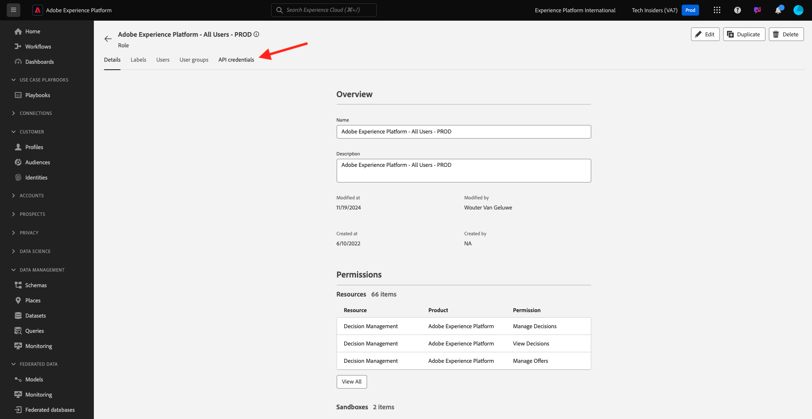

# 2.1.3 Visualizzare il proprio profilo cliente in tempo reale - API

In questo esercizio, utilizzerai Postman e Adobe I/O per eseguire query sulle API di Adobe Experience Platform per visualizzare il tuo profilo cliente in tempo reale.

## Contesto

In Real-time Customer Profile, tutti i dati di profilo vengono visualizzati insieme ai dati dell’evento, così come le iscrizioni al pubblico esistenti. I dati visualizzati possono provenire da qualsiasi luogo, da applicazioni Adobe e soluzioni esterne. Questa è la visualizzazione più potente di Adobe Experience Platform, l’esperienza del sistema di registrazione.

Il profilo cliente in tempo reale può essere utilizzato da tutte le applicazioni Adobe, ma anche da soluzioni esterne come Call Center o app di clientela in-store. Il modo per farlo è collegare queste soluzioni esterne alle API di Adobe Experience Platform.

## I tuoi identificatori

Nel pannello Visualizzatore profili del sito web puoi trovare più identità. Ogni identità è collegata a uno spazio dei nomi.


Nel pannello a raggi X, possiamo vedere 4 diverse combinazioni di ID e namespace:

| Identità | Namespace |
|:-------------:| :---------------:|
| ID Experience Cloud (ECID) | 79943948563923140522865572770524243489 |
| ID Experience Cloud (ECID) | 70559351147248820114888181867542007989 |
| ID e-mail | woutervangeluwe+18112024-01@gmail.com |
| ID numero cellulare | +32473622044+18112024-01 |

Ricorda questi identificatori per il passaggio successivo.

## Configurare il progetto Adobe I/O

In questo esercizio utilizzerai Adobe I/O in modo piuttosto intensivo per eseguire query sulle API di Platform. Per configurare l’Adobe I/O, segui i passaggi seguenti.

Vai a [https://developer.adobe.com/console/home](https://developer.adobe.com/console/projects)


Assicurati di selezionare l’istanza Adobe Experience Platform corretta nell’angolo in alto a destra dello schermo. L&#39;istanza è `--aepImsOrgName--`. Fare clic su **Crea nuovo progetto**.


Seleziona **+ Aggiungi al progetto** e seleziona **API**.


A questo punto viene visualizzato quanto segue:


Seleziona **Experience Platform API** e fai clic su **Next**.


Ora vedrai questo. Specificare un nome per le credenziali: `--aepUserLdap-- - OAuth credential`. Fai clic su **Avanti**.


Successivamente, devi selezionare un profilo di prodotto che definirà quali autorizzazioni sono disponibili per questa integrazione.

Seleziona i profili di prodotto richiesti.

>[!NOTE]
>
> I nomi dei profili di prodotto variano nell’istanza Adobe Experience Platform in quanto sono specifici per l’istanza. Devi selezionare almeno un profilo di prodotto con i diritti di accesso appropriati, impostati in Adobe Admin Console e nell’interfaccia utente delle autorizzazioni AEP.

Fare clic su **Salva API configurata**.


L’integrazione di Adobe I/O è ora pronta.


Fare clic sul pulsante **Scarica per Postman** e quindi su **OAuth Server-to-Server** per scaricare un ambiente Postman. Attendere che l&#39;ambiente venga scaricato. L&#39;operazione può richiedere alcuni secondi.


Il progetto I/O ha un nome generico. È necessario assegnare un nome descrittivo alla tua integrazione. Fare clic su **Progetto X** (o nome simile) come indicato


Fare clic su **Modifica progetto**.


Immettere un nome e una descrizione per l&#39;integrazione: `--aepUserLdap-- AEP Tutorial`.

Fai clic su **Salva**.


L’integrazione di Adobe I/O è terminata.


>[!NOTE]
>
>È inoltre necessario assicurarsi che questo progetto di Adobe I/O abbia accesso alle impostazioni delle autorizzazioni di Adobe Experience Platform. Le credenziali API del progetto devono essere aggiunte all’interfaccia utente Autorizzazioni di Adobe Experience Platform, per la quale sono necessari i diritti di accesso di amministratore di sistema. I passaggi sono documentati di seguito, ma potrebbe essere necessario contattare l’amministratore di sistema per eseguire l’elaborazione nel caso in cui non si disponga dei diritti di accesso richiesti.

## Autorizzazioni AEP per le credenziali API

Vai a [Adobe Experience Platform](https://experience.adobe.com/platform). Dopo aver effettuato l’accesso, accedi alla home page di Adobe Experience Platform.

Vai a **Autorizzazioni**, a **Ruoli** e fai clic sul relativo profilo di prodotto.

>[!NOTE]
>
> I nomi dei profili di prodotto variano nell’istanza Adobe Experience Platform in quanto sono specifici per l’istanza. Devi selezionare almeno un profilo di prodotto con i diritti di accesso appropriati, impostati in Adobe Admin Console e nell’interfaccia utente delle autorizzazioni AEP.


Fare clic su **Credenziali API**.



Fare clic su **+ Aggiungi credenziali API**.


Seleziona il progetto di Adobe I/O appena creato e fai clic su **Salva**.


## Autenticazione Postman da Adobe I/O

Vai a [https://www.postman.com/downloads/](https://www.postman.com/downloads/).

Scarica e installa la versione rilevante di Postman per il tuo sistema operativo.


Dopo aver installato Postman, avviare l&#39;applicazione.

In Postman sono disponibili 2 concetti: ambienti e raccolte.

- L’ambiente contiene tutte le variabili ambientali che sono più o meno coerenti. Nell’ambiente, troverai elementi come l’IMSOrg del nostro ambiente Platform, insieme alle credenziali di sicurezza come la tua Chiave privata e altri. Il file dell&#39;ambiente è quello scaricato durante l&#39;Adobe I/O di configurazione dell&#39;esercizio precedente. Nome: **`oauth_server_to_server.postman_environment.json`**.

- La raccolta contiene diverse richieste API che puoi utilizzare. Utilizzeremo 2 raccolte
   - 1 raccolta per l&#39;autenticazione all&#39;Adobe I/O
   - 1 Raccolta per gli esercizi in questo modulo
   - 1 raccolta per gli esercizi nel modulo Real-Time CDP, per l’authoring delle destinazioni

Scarica il file [postman.zip](./../../../assets/postman/postman_profile.zip) sul desktop locale.

In questo file **postman.zip**, troverai i seguenti file:

- `Adobe IO - OAuth.postman_collection.json`
- `AEP Tutorial.postman_collection.json`
- `Destination_Authoring_API.json`

Decomprimi il file **postman.zip** e archivia questi 3 file in una cartella sul desktop, insieme all&#39;ambiente Postman scaricato da Adobe I/O. Devi avere questi 4 file in quella cartella:


Torna a Postman. Fai clic su **Importa**.


Fai clic su **file**.


Passa alla cartella sul desktop in cui sono stati estratti i 4 file scaricati. Selezionare questi 4 file contemporaneamente e fare clic su **Apri**.


Dopo aver fatto clic su **Apri**, Postman ti mostrerà una panoramica dell&#39;ambiente e delle raccolte che stai per importare. Fai clic su **Importa**.


Ora disponi di tutto il necessario in Postman per iniziare a interagire con Adobe Experience Platform tramite le API.

La prima cosa da fare è accertarsi di essere autenticati correttamente. Per essere autenticato, devi richiedere un token di accesso.

Accertati di aver selezionato l’ambiente corretto prima di eseguire qualsiasi richiesta. Per controllare l’ambiente attualmente selezionato, verifica l’elenco a discesa Ambiente nell’angolo in alto a destra.

L&#39;ambiente selezionato deve avere un nome simile a questo, `--aepUserLdap-- OAuth Credential`.


L’ambiente e le raccolte Postman ora sono configurati e funzionanti. Ora puoi eseguire l’autenticazione da Postman a Adobe I/O.

Nella raccolta **Adobe IO - OAuth**, selezionare la richiesta con il nome **POST - Ottieni token di accesso**. Fai clic su **Invia**.


Dopo un paio di secondi, dovresti visualizzare una risposta nella sezione **Body** di Postman:


Se la configurazione è andata a buon fine, dovresti vedere una risposta simile che contiene le seguenti informazioni:

| Chiave | Valore |
|:-------------:| :---------------:| 
| token_type | **portatore** |
| access_token | **eyJhbGciOiJSU...jrNZ6mdaQ** |
| expires_in | **86399** |

L&#39;Adobe I/O ti ha assegnato un token **bearer**, con un valore specifico (access_token molto lungo) e una finestra di scadenza.

Il token ricevuto è ora valido per 24 ore. Ciò significa che dopo 24 ore, se desideri utilizzare Postman per l’autenticazione in Adobe I/O, dovrai generare un nuovo token eseguendo nuovamente questa richiesta.

## API del profilo cliente in tempo reale, schema: profilo

Ora puoi procedere e inviare la tua prima richiesta alle API Real-time Customer Profile di Platform.

In Postman, individua la raccolta **Tutorial AEP**.


In **1. Servizio profili unificati**, fare clic sulla prima richiesta denominata **UPS - Profilo GET per ID entità e NS**.


Per questa richiesta, sono necessarie tre variabili:

| Chiave | Valore | Definizione |
|:-------------:| :---------------:| :---------------:| 
| entityId | **id** | l’ID cliente specifico |
| entityIdNS | **spazio dei nomi** | lo spazio dei nomi specifico applicabile all’ID |
| schema.name | **_xdm.context.profile** | lo schema specifico per il quale si desidera ricevere informazioni |

Pertanto, se desideri che le API di Adobe Experience Platform ti forniscano tutte le informazioni sul profilo per il tuo ECID, devi configurare la richiesta come segue:

| Chiave | Valore |
|:-------------:| :---------------:| 
| entityId | **tuoECID** |
| entityIdNS | **ecid** |
| schema.name | **_xdm.context.profile** |


È inoltre necessario verificare i campi **Intestazione** della richiesta. Vai a **Intestazioni**. A questo punto viene visualizzato quanto segue:


>[!NOTE]
>
>È necessario specificare il nome della sandbox di Adobe Experience Platform in uso. Il nome x-sandbox deve essere `--aepSandboxName--`.

| Chiave | Valore |
| ----------- | ----------- |
| x-sandbox-name | `--aepSandboxName--` |


Dopo aver selezionato il nome della sandbox, fai clic su **Invia** per inviare la richiesta a Platform.

Dovresti ricevere una risposta immediata da Platform che ti mostri qualcosa di simile a questo:


Questa è la risposta completa di Platform:

```javascript
{
    "A2_ETHkJxMvxbiEmIZlAj8Qn": {
        "entityId": "A2_ETHkJxMvxbiEmIZlAj8Qn",
        "mergePolicy": {
            "id": "64e4b0ed-dfc3-4084-8e67-643e977168d7"
        },
        "sources": [
            "672a10cdb015162aefedfc0f",
            "672a10b1a05e282aee19737c"
        ],
        "tags": [
            "0938B898-469A-4513-8E86-87464307120F:va7",
            "3ba34930-405e-4b31-aafa-bac22d35203e:va7"
        ],
        "identityGraph": [
            "G7z3JAFBY4I6Rzg",
            "A2_ETHkJxMvxbiEmIZlAj8Qn",
            "BkFvK4QcJpSPByuDGF4UAS0wMQ",
            "BUF9zMKLrXq72p4HpbsHv1SDGF4UAS0wMUBnbWFpbC5jb20",
            "A29btmFXmrfrYbXQWISCT9ZD"
        ],
        "entity": {
            "_experienceplatform": {
                "identification": {
                    "core": {
                        "ecid": "79943948563923140522865572770524243489",
                        "phoneNumber": "+32473622044+18112024-01",
                        "email": "woutervangeluwe+18112024-01@gmail.com"
                    }
                }
            },
            "userAccount": {
                "ID": "3688250"
            },
            "pushNotificationDetails": [
                {
                    "denylisted": false,
                    "token": "2E0945F186CE5ED8CBFD1EB519A8CF38BA2B28A67FB381D45AA15EE37D289214",
                    "identity": {
                        "namespace": {
                            "code": "ECID"
                        },
                        "id": "70559351147248820114888181867542007989"
                    },
                    "platform": "apns",
                    "appID": "com.adobe.demosystem.dxdemo"
                }
            ],
            "personalEmail": {
                "address": "woutervangeluwe+18112024-01@gmail.com"
            },
            "_repo": {
                "createDate": "2024-11-18T10:39:12.296Z"
            },
            "extSourceSystemAudit": {
                "lastUpdatedDate": "2024-11-19T07:46:52.001Z"
            },
            "testProfile": true,
            "mobilePhone": {
                "number": "+32473622044"
            },
            "consents": {
                "metadata": {
                    "time": "2024-11-19T07:46:52.001Z"
                },
                "idSpecific": {
                    "ECID": {
                        "70559351147248820114888181867542007989": {
                            "collect": {
                                "val": "y"
                            }
                        }
                    }
                }
            },
            "person": {
                "name": {
                    "lastName": "Van Geluwe",
                    "firstName": "Wouter"
                }
            },
            "userActivityRegions": {
                "IRL1": {
                    "captureTimestamp": "2024-11-19T07:46:51.239Z"
                }
            },
            "identityMap": {
                "ecid": [
                    {
                        "id": "70559351147248820114888181867542007989"
                    },
                    {
                        "id": "79943948563923140522865572770524243489"
                    }
                ],
                "email": [
                    {
                        "id": "woutervangeluwe+18112024-01@gmail.com"
                    }
                ],
                "phone": [
                    {
                        "id": "+32473622044+18112024-01"
                    }
                ],
                "userid": [
                    {
                        "id": "3688250"
                    }
                ]
            }
        },
        "lastModifiedAt": "2024-11-19T07:47:23Z"
    }
}
```

Al momento questi sono tutti i dati profilo disponibili in Platform per questo ECID.

Non è necessario utilizzare l’ECID per richiedere i dati del profilo al Real-time Customer Profile di Platform, puoi utilizzare qualsiasi ID in qualsiasi spazio dei nomi per richiedere tali dati.

Torniamo a Postman e fingiamo di essere il call center e inviamo una richiesta a Platform specificando lo spazio dei nomi di **Telefono** e il tuo numero di cellulare.

Pertanto, se desideri chiedere alle API di Platform di restituirti tutte le informazioni sul profilo per un telefono specifico, dovrai configurare la richiesta come segue:

| Chiave | Valore |
|:-------------:| :---------------:| 
| entityId | **numero di telefono** |
| entityIdNS | **telefono** (sostituisci ecid con telefono) |
| schema.name | **_xdm.context.profile** |

Se il numero di telefono contiene simboli speciali come **+**, è necessario selezionare il numero di telefono completo, fare clic con il pulsante destro del mouse e fare clic su **EncodeURIComponent**.


A questo punto si otterrà:


È inoltre necessario verificare i campi **Intestazione** della richiesta. Vai a **Intestazioni**. A questo punto viene visualizzato quanto segue:


>[!NOTE]
>
>È necessario specificare il nome della sandbox di Adobe Experience Platform in uso. Il nome x-sandbox deve essere `--aepSandboxName--`.

| Chiave | Valore |
| ----------- | ----------- |
| x-sandbox-name | `--aepSandboxName--` |


Fai clic su **Invia** e verifica che la risposta sia la stessa di prima quando utilizzavi l&#39;ECID come identità.


Facciamo la stessa cosa per il tuo indirizzo e-mail specificando lo spazio dei nomi di **email** e il tuo indirizzo e-mail.

Pertanto, se desideri chiedere alle API di Platform di restituirti tutte le informazioni sul profilo per un indirizzo e-mail specifico, dovrai configurare la richiesta come segue:

| Chiave | Valore |
|:-------------:| :---------------:| 
| entityId | **messaggio** |
| entityIdNS | **e-mail** (sostituisci telefono con e-mail) |
| schema.name | **_xdm.context.profile** |

Se l&#39;indirizzo di posta elettronica contiene simboli speciali come **+**, è necessario selezionare l&#39;indirizzo di posta elettronica completo, fare clic con il pulsante destro del mouse e scegliere **CodificaURIComponent**.


A questo punto si otterrà:


È inoltre necessario verificare i campi **Intestazione** della richiesta. Vai a **Intestazioni**. A questo punto viene visualizzato quanto segue:

>[!NOTE]
>
>È necessario specificare il nome della sandbox di Adobe Experience Platform in uso. Il nome x-sandbox deve essere `--aepSandboxName--`.


| Chiave | Valore |
| ----------- | ----------- |
| x-sandbox-name | `--aepSandboxName--` |

Fai clic su **Invia** e verifica che la risposta sia la stessa di prima, con ECID e numero di telefono.


Si tratta di un tipo molto importante di flessibilità che viene offerto ai brand. Ciò significa che qualsiasi ambiente può inviare una richiesta a Platform utilizzando il proprio ID e spazio dei nomi, senza dover comprendere la complessità di più ID e spazi dei nomi.

Ad esempio:

- il call center può richiedere dati a Platform utilizzando lo spazio dei nomi **phone**
- il sistema di fidelizzazione può richiedere dati a Platform utilizzando lo spazio dei nomi **email**
- le applicazioni online possono utilizzare lo spazio dei nomi **ecid**

Il Call Center non sa necessariamente che tipo di identificatore viene utilizzato nel sistema fedeltà e il sistema fedeltà non sa necessariamente che tipo di identificatore viene utilizzato dalle applicazioni online. Ogni singolo sistema può utilizzare le informazioni di cui dispone e comprendere per ottenere le informazioni di cui ha bisogno, quando ne ha bisogno.

## API del profilo cliente in tempo reale, schema: Profile ed ExperienceEvent

Dopo aver eseguito correttamente la query sulle API di Platform per i dati del profilo, facciamo lo stesso con i dati ExperienceEvent.

In Postman, individua la raccolta **Tutorial AEP**.


In **1. GET Servizio profilo unificato**, selezionare la seconda richiesta con il nome **UPS - Profilo ed EE per ID entità e NS**.


Per questa richiesta, sono necessarie quattro variabili:

| Chiave | Valore | Definizione |
|:-------------:| :---------------:|  :---------------:| 
| schema.name | **_xdm.context.experienceevent** | lo schema specifico per il quale desideri ricevere informazioni. In questo caso, stiamo cercando i dati mappati sullo schema ExperienceEvent. |
| relatedSchema.name | **_xdm.context.profile** | Durante la ricerca di dati mappati sullo schema ExperienceEvent, è necessario specificare un’identità per la quale ricevere i dati. Lo schema che ha accesso all’identità è Profile-schema, quindi relatedSchema è Profile-schema. |
| relatedEntityId | **id** | lo specifico ID cliente |
| relatedEntityIdNS | **spazio dei nomi** | lo spazio dei nomi specifico applicabile all’ID |

Pertanto, se desideri che le API di Platform ti forniscano tutte le informazioni di profilo per il tuo ecid, devi configurare la richiesta come segue:

| Chiave | Valore |
|:-------------:| :---------------:| 
| schema.name | **_xdm.context.experienceevent** |
| relatedSchema.name | **_xdm.context.profile** |
| relatedEntityId | **tuoECID** |
| relatedEntityIdNS | **ecid** |


È inoltre necessario verificare i campi **Intestazione** della richiesta. Vai a **Intestazioni**. A questo punto viene visualizzato quanto segue:


>[!NOTE]
>
>È necessario specificare il nome della sandbox di Adobe Experience Platform in uso. Il nome x-sandbox deve essere `--aepSandboxName--`.

| Chiave | Valore |
| ----------- | ----------- |
| x-sandbox-name | `--aepSandboxName--` |

Fai clic su **Invia** per inviare la richiesta a Platform.

Dovresti ricevere una risposta immediata da Platform che ti mostri qualcosa di simile a questo:


Di seguito è riportata la risposta completa di Platform. In questo esempio, sono presenti otto ExperienceEvents collegati all’ECID del cliente. Dai un’occhiata a quanto segue per vedere le diverse variabili della richiesta, poiché quello che vedi di seguito è la conseguenza diretta della configurazione in Launch negli esercizi precedenti.

Inoltre, quando il pannello a raggi X mostra le informazioni di ExperienceEvent, utilizza il payload seguente per analizzare e recuperare informazioni come Nome prodotto (cerca productName nel payload seguente) e URL immagine prodotto (cerca productImageUrl nel payload seguente).

```javascript
{
    "_page": {
        "orderby": "timestamp",
        "start": "b1325606-9b96-4e51-b7dd-73aacf527c72-0",
        "count": 14,
        "next": ""
    },
    "children": [
        {
            "relatedEntityId": "A2_ETHkJxMvxbiEmIZlAj8Qn",
            "entityId": "b1325606-9b96-4e51-b7dd-73aacf527c72-0",
            "sourceId": "672a10b1074ceb2af0aa7034",
            "timestamp": 1731923802848,
            "entity": {
                "environment": {
                    "ipV4": "141.134.241.99",
                    "type": "browser",
                    "browserDetails": {
                        "userAgentClientHints": {
                            "mobile": false,
                            "platform": "macOS",
                            "brands": [
                                {
                                    "brand": "Chromium",
                                    "version": "130"
                                },
                                {
                                    "brand": "Google Chrome",
                                    "version": "130"
                                },
                                {
                                    "brand": "Not?A_Brand",
                                    "version": "99"
                                }
                            ]
                        },
                        "userAgent": "Mozilla/5.0 (Macintosh; Intel Mac OS X 10_15_7) AppleWebKit/537.36 (KHTML, like Gecko) Chrome/130.0.0.0 Safari/537.36",
                        "viewportHeight": 992,
                        "viewportWidth": 1920
                    }
                },
                "web": {
                    "webPageDetails": {
                        "name": "Home",
                        "viewName": "Home",
                        "pageViews": {
                            "value": 1
                        },
                        "URL": "https://dsn.adobe.com/web/vangeluw-QIMU"
                    },
                    "webReferrer": {
                        "URL": "https://auth.services.adobe.com/"
                    }
                },
                "_experienceplatform": {
                    "interactionDetails": {
                        "core": {
                            "channel": "web"
                        }
                    },
                    "demoEnvironment": {
                        "brandName": "vangeluw-QIMU"
                    },
                    "identification": {
                        "core": {
                            "ecid": "79943948563923140522865572770524243489"
                        }
                    }
                },
                "implementationDetails": {
                    "name": "https://ns.adobe.com/experience/alloy/reactor",
                    "version": "2.24.0+2.27.0",
                    "environment": "browser"
                },
                "identityMap": {
                    "ECID": [
                        {
                            "id": "79943948563923140522865572770524243489",
                            "authenticatedState": "ambiguous",
                            "primary": true
                        }
                    ]
                },
                "eventType": "web.webpagedetails.pageViews",
                "_id": "b1325606-9b96-4e51-b7dd-73aacf527c72-0",
                "placeContext": {
                    "localTime": "2024-11-18T10:56:42.848+01:00",
                    "localTimezoneOffset": -60
                },
                "device": {
                    "screenOrientation": "landscape",
                    "screenWidth": 1920,
                    "screenHeight": 1080
                },
                "timestamp": "2024-11-18T09:56:42.848Z"
            },
            "lastModifiedAt": "2024-11-18T09:56:45Z"
        },
    "_links": {
        "next": {
            "href": ""
        }
    }
}
```

Al momento questi sono tutti i dati ExperienceEvent disponibili in Platform per questo ECID.

Non è necessario utilizzare l’ECID per richiedere dati ExperienceEvent dal profilo in tempo reale di Adobe Experience Platform, puoi utilizzare qualsiasi ID in qualsiasi spazio dei nomi per richiedere tali dati.

Passaggio successivo: [2.1.4 Creare un pubblico - Interfaccia utente](./ex4.md)

[Torna al modulo 2.1](./real-time-customer-profile.md)

[Torna a tutti i moduli](../../../overview.md)
