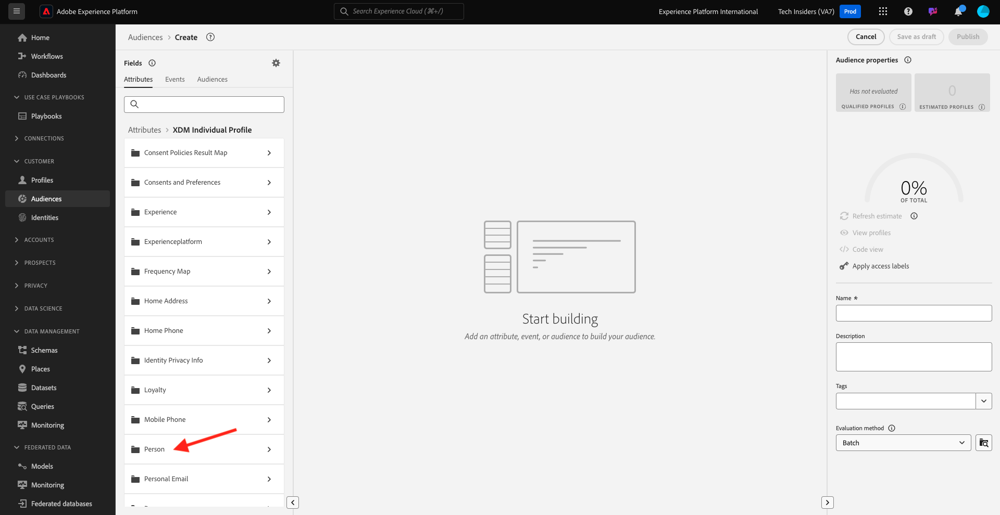
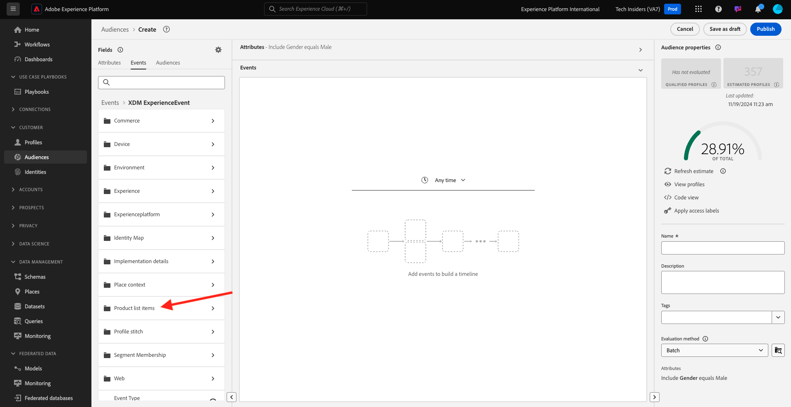

# 2.1.4 Creare un segmento - Interfaccia utente

In questo esercizio creerai un segmento utilizzando il Generatore di segmenti di Adobe Experience Platform.

## Storia

Vai a [Adobe Experience Platform](https://experience.adobe.com/platform). Dopo aver effettuato l’accesso, accedi alla home page di Adobe Experience Platform.


Prima di continuare, devi selezionare una **sandbox**. La sandbox da selezionare è denominata ``--aepSandboxId--``. A tale scopo, fai clic sul testo **[!UICONTROL Prod produzione]** nella riga blu nella parte superiore dello schermo. Dopo aver selezionato la [!UICONTROL sandbox] appropriata, la schermata verrà modificata e ora sei nella [!UICONTROL sandbox] dedicata.


Nel menu a sinistra, vai a **Segmenti**. In questa pagina è disponibile una panoramica di tutti i segmenti esistenti. Fai clic sul pulsante **+ Crea segmento** per iniziare a creare un nuovo segmento.


Nel nuovo Generatore di segmenti puoi notare immediatamente l&#39;opzione di menu **Attributi** e il riferimento a **Profilo individuale XDM**.


Poiché XDM è il linguaggio che alimenta il business dell’esperienza, XDM è anche la base per il generatore di segmenti. Tutti i dati acquisiti in Platform devono essere mappati su XDM e, come tale, tutti i dati diventano parte dello stesso modello di dati, indipendentemente da dove provengono. Questo ti offre un grande vantaggio durante la creazione di segmenti: da questa interfaccia utente di Generatore di segmenti puoi combinare dati di qualsiasi origine nello stesso flusso di lavoro. I segmenti generati in Segment Builder possono essere inviati a soluzioni come Adobe Target, Adobe Campaign e Adobe Audience Manager per l&#39;attivazione.

Creiamo un segmento che include tutti i **clienti maschi**.

Per ottenere l’attributo di genere, è necessario conoscere e comprendere XDM.

Il genere è un attributo di Persona, che si trova in Attributi. Per raggiungerlo, fai clic su **Profilo individuale XDM**. Poi vedrai questo. Dalla finestra **Profilo individuale XDM**, seleziona **Persona**.



Poi vedrai questo. In **Persona**, puoi trovare l&#39;attributo **Genere**. Trascina l’attributo Gender nel generatore di segmenti.


Ora puoi scegliere il genere specifico tra le opzioni precompilate. In questo caso, scegliamo **Maschio**.


Dopo aver selezionato **Maschio**, puoi ottenere una stima della popolazione del segmento premendo il pulsante **Aggiorna stima**. Questa funzione è molto utile per un utente aziendale, in modo che possa vedere l’impatto di alcuni attributi sulla dimensione del segmento risultante.


Viene quindi visualizzata una stima come quella riportata di seguito:


Successivamente, dovresti perfezionare un po’ il segmento. Devi creare un segmento di tutti i clienti maschi che hanno visualizzato il prodotto **Proteus Fitness Jackshirt (arancione)**.

Per creare questo segmento, devi aggiungere un evento esperienza. Per trovare tutti gli eventi esperienza, fai clic sull&#39;icona **Eventi** nella barra dei menu **Campi**.


Verrà visualizzato il nodo principale **XDM ExperienceEvents**. Fai clic su **XDM ExperienceEvent**.


Vai a **Elementi elenco prodotti**.



Seleziona **Nome** e trascina l&#39;oggetto **Nome** dal menu a sinistra nell&#39;area di lavoro del Generatore di segmenti nella sezione **Eventi**.


A questo punto viene visualizzato quanto segue:


Il parametro di confronto deve essere **uguale a** e nel campo di input immettere **MONTANA WIND JACKET**.


Ogni volta che aggiungi un elemento al generatore di segmenti, puoi fare clic sul pulsante **Aggiorna stima** per ottenere una nuova stima della popolazione nel segmento.

Finora hai utilizzato solo l’interfaccia utente per creare il segmento, ma esiste anche un’opzione di codice per creare un segmento.

Durante la creazione di un segmento, in realtà si sta componendo una query Profile Query Language (PQL). Per visualizzare il codice PQL, puoi fare clic sul selettore **Vista Codice** nell&#39;angolo superiore destro del generatore di segmenti.


Ora puoi vedere l’istruzione PQL completa:

```sql
person.gender in ["male"] and CHAIN(xEvent, timestamp, [C0: WHAT(productListItems.exists(name.equals("MONTANA WIND JACKET", false)))])
```

Puoi anche visualizzare in anteprima un esempio dei profili cliente che fanno parte di questo segmento facendo clic su **Visualizza profili**.


Infine, diamo un nome al segmento e salvalo.

Come convenzione di denominazione, utilizza:

- `--demoProfileLdap-- - Male customers with interest in Montana Wind Jacket`


Quindi, fai clic sul pulsante **Salva e chiudi** per salvare il segmento, dopodiché tornerai alla pagina di panoramica del segmento.


Ora puoi continuare con l’esercizio successivo e creare un segmento tramite l’API.

Passaggio successivo: [2.1.5 Creare un segmento - API](./ex5.md)

[Torna al modulo 2.1](./real-time-customer-profile.md)

[Torna a tutti i moduli](../../../overview.md)
