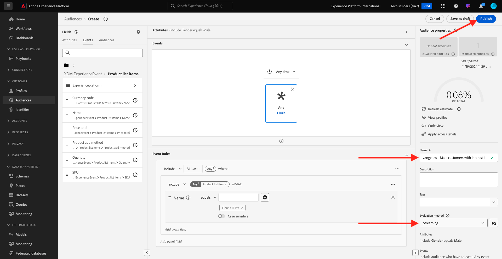

# 2.1.4 Creare un pubblico - Interfaccia utente

In questo esercizio creerai un pubblico utilizzando Audience Builder di Adobe Experience Platform.

Vai a [Adobe Experience Platform](https://experience.adobe.com/platform). Dopo aver effettuato l’accesso, accedi alla home page di Adobe Experience Platform.


Prima di continuare, devi selezionare una **sandbox**. La sandbox da selezionare è denominata ``--aepSandboxName--``. Dopo aver selezionato la [!UICONTROL sandbox] appropriata, la schermata verrà modificata e ora sei nella [!UICONTROL sandbox] dedicata.


Nel menu a sinistra, vai a **Tipi di pubblico**. In questa pagina è disponibile una panoramica di tutti i tipi di pubblico esistenti. Fai clic sul pulsante **+ Crea pubblico** per iniziare a creare un nuovo pubblico.


Seleziona **Genera regola** e fai clic su **Crea**.


Nel nuovo generatore di pubblico, puoi notare immediatamente l&#39;opzione di menu **Attributi** e il riferimento a **Profilo individuale XDM**.


Poiché XDM è il linguaggio che alimenta il business dell’esperienza, XDM è anche la base per il generatore di pubblico. Tutti i dati acquisiti in Platform devono essere mappati su XDM e, come tale, tutti i dati diventano parte dello stesso modello di dati, indipendentemente da dove provengono. Questo ti offre un grande vantaggio durante la creazione di tipi di pubblico; infatti, da questa interfaccia utente di audience builder puoi combinare dati di qualsiasi origine nello stesso flusso di lavoro. I tipi di pubblico generati in audience builder possono essere inviati a soluzioni come Adobe Target, Adobe Campaign e Adobe Audience Manager per l&#39;attivazione.

Creiamo un pubblico che includa tutti i **clienti maschi**.

Per ottenere l’attributo di genere, è necessario conoscere e comprendere XDM.

Il genere è un attributo di Persona, che si trova in Attributi. Per raggiungerlo, fai clic su **Profilo individuale XDM**. Poi vedrai questo. Dalla finestra **Profilo individuale XDM**, seleziona **Persona**.


Poi vedrai questo. In **Persona**, puoi trovare l&#39;attributo **Genere**. Trascina l’attributo Gender nel generatore di pubblico.


Ora puoi scegliere il genere specifico tra le opzioni precompilate. In questo caso, scegliamo **Maschio**.


Dopo aver selezionato **Maschio**, puoi ottenere una stima del pubblico premendo il pulsante **Aggiorna stima**. Questa funzione è molto utile per un utente aziendale, in modo che possa vedere l’impatto di determinati attributi sulla dimensione del pubblico risultante.


Viene quindi visualizzata una stima come quella riportata di seguito:


Ora dovresti perfezionare un po’ il pubblico. Devi creare un pubblico di tutti i clienti maschi che hanno visualizzato il prodotto **iPhone 15 Pro**.

Per creare questo pubblico, devi aggiungere un evento esperienza. Per trovare tutti gli eventi esperienza, fai clic sull&#39;icona **Eventi** nella barra dei menu **Campi**. Verrà visualizzato il nodo principale **XDM ExperienceEvents**. Fai clic su **XDM ExperienceEvent**.


Vai a **Elementi elenco prodotti**.


Seleziona **Name** e trascina l&#39;oggetto **Name** dal menu a sinistra nell&#39;area di lavoro di audience builder nella sezione **Events**.


A questo punto viene visualizzato quanto segue:


Il parametro di confronto deve essere **uguale a** e nel campo di input immettere **iPhone 15 Pro**.


Ogni volta che aggiungi un elemento al generatore di pubblico, puoi fare clic sul pulsante **Aggiorna stima** per ottenere una nuova stima della popolazione nel pubblico.

Finora hai utilizzato solo l’interfaccia utente per creare il pubblico, ma esiste anche un’opzione di codice per creare un pubblico.

Durante la creazione di un pubblico, in realtà stai componendo una query Profile Query Language (PQL). Per visualizzare il codice PQL, puoi fare clic sul commutatore **Vista codice** nell&#39;angolo superiore destro del generatore di pubblico.


Ora puoi vedere l’istruzione PQL completa:

```sql
person.gender in ["male"] and CHAIN(xEvent, timestamp, [C0: WHAT(productListItems.exists(name.equals("iPhone 15 Pro", false)))])
```

Puoi anche visualizzare in anteprima un esempio dei profili cliente che fanno parte del pubblico facendo clic su **Visualizza profili**.


Infine, diamo un nome al pubblico,
impostare **Metodo di valutazione** su **Streaming** e fare clic su **Publish**.

Come convenzione di denominazione, utilizza:

- `--aepUserLdap-- - Male customers with interest in iPhone 15 Pro`



Verrai riportato alla pagina di panoramica del pubblico.


Passaggio successivo: [2.1.5 Vedere il proprio profilo cliente in tempo reale in azione nel call center](./ex5.md)

[Torna al modulo 2.1](./real-time-customer-profile.md)

[Torna a tutti i moduli](../../../overview.md)
