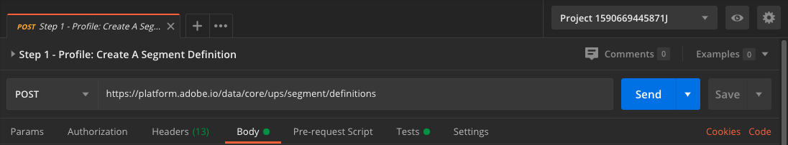

# 2.1.5 Creare un segmento - API

In questo esercizio, utilizzerai Postman e Adobe I/O per creare un segmento e archiviare i risultati di tale segmento come set di dati, utilizzando le API di Adobe Experience Platform.

## Storia

In Real-time Customer Profile, tutti i dati di profilo vengono visualizzati insieme ai dati di evento e alle iscrizioni ai segmenti esistenti. I dati visualizzati possono provenire da qualsiasi luogo, da applicazioni Adobe e soluzioni esterne. Questa è la visualizzazione più potente di Adobe Experience Platform, l’esperienza del sistema di registrazione.

## 2.1.5.1 - Creare un segmento tramite l’API della piattaforma

Passa a Postman.

Individuare la raccolta: **_abilitazione Adobe Experience Platform**. In questa raccolta verrà visualizzata la cartella **2. Segmentazione**. Queste richieste verranno utilizzate in questo esercizio.


Ora seguirò tutti i passaggi necessari per creare un segmento tramite l’API. Stiamo per creare un segmento semplice: &quot;**ldap** - All Female Customers&quot; (Tutti i clienti femmina).

### Passaggio 1: creare una definizione di segmento

Fai clic sulla richiesta denominata **Passaggio 1 - Profilo: Creare Una Definizione Di Segmento**.


Vai alla sezione **Body** di questa richiesta.



Nel **Corpo** di questa richiesta, visualizzerai quanto segue:


La lingua utilizzata per questa richiesta è denominata Profile Query Language o **PQL**.

Ulteriori informazioni e documentazione su PQL [sono disponibili qui](https://experienceleague.adobe.com/docs/experience-platform/segmentation/pql/overview.html?lang=en).


Attenzione: aggiornare la variabile **name** nella richiesta seguente sostituendo **ldap** con il **ldap** specifico.

```json
{
    "name" : "ldap - API - All Female Customer",
    "expression" : {"type":"PQL", "format":"pql/json", "value":"{\"nodeType\":\"fnApply\",\"fnName\":\"in\",\"params\":[{\"nodeType\":\"fieldLookup\",\"fieldName\":\"gender\",\"object\":{\"nodeType\":\"fieldLookup\",\"fieldName\":\"person\",\"object\":{\"nodeType\":\"literal\",\"literalType\":\"XDMObject\",\"value\":\"profile\"}}},{\"literalType\":\"List\",\"nodeType\":\"literal\",\"value\":[\"female\"]}]}"},
    "createdBy": "ldap",
    "schema" : { "name" : "_xdm.context.profile"},
    "ttlInDays" : 90
}
```

Dopo aver aggiunto il tuo **ldap** specifico, il corpo dovrebbe essere simile al seguente:

```json
{
    "name" : "vangeluw - API - All Female Customer",
    "expression" : {"type":"PQL", "format":"pql/json", "value":"{\"nodeType\":\"fnApply\",\"fnName\":\"in\",\"params\":[{\"nodeType\":\"fieldLookup\",\"fieldName\":\"gender\",\"object\":{\"nodeType\":\"fieldLookup\",\"fieldName\":\"person\",\"object\":{\"nodeType\":\"literal\",\"literalType\":\"XDMObject\",\"value\":\"profile\"}}},{\"literalType\":\"List\",\"nodeType\":\"literal\",\"value\":[\"female\"]}]}"},
    "createdBy": "vangeluw",
    "schema" : { "name" : "_xdm.context.profile"},
    "ttlInDays" : 90
}
```

È inoltre necessario verificare i campi **Intestazione** della richiesta. Vai a **Intestazioni**. A questo punto viene visualizzato quanto segue:


| Chiave | Valore |
| -------------- | ------------------ |
| x-sandbox-name | `--aepSandboxId--` |

>[!NOTE]
>
>È necessario specificare il nome della sandbox di Adobe Experience Platform in uso. Il nome x-sandbox deve essere `--aepSandboxId--`.

Ora fai clic sul pulsante blu **Invia** per creare il segmento e visualizzarne i risultati.


Dopo questo passaggio, puoi visualizzare la definizione del segmento nell’interfaccia utente di Platform. Per controllare, accedi a Adobe Experience Platform e passa a **Segmenti**.


### Passaggio 2: creare un processo Segment POST

Nell&#39;esercizio precedente hai creato un segmento _streaming_. Un segmento di streaming valuta continuamente le qualifiche in tempo reale. Stai creando un segmento _batch_. Il segmento batch offre un&#39;anteprima di come potrebbe essere il segmento in termini di qualifiche, ma _ciò non significa che il segmento sia stato effettivamente eseguito_. Attualmente, _nessuno è idoneo per questo segmento_. Per rendere le persone idonee, è necessario eseguire il segmento batch, che è esattamente ciò che faremo qui.

Ora diamo POST a un processo per segmenti.

Passa a Postman.


Nella tua raccolta Postman, fai clic sulla richiesta denominata **Passaggio 2 - Processo segmento POST** per aprirla.


È inoltre necessario verificare i campi **Intestazione** della richiesta. Vai a **Intestazioni**. A questo punto viene visualizzato quanto segue:


| Chiave | Valore |
| -------------- | ------------------ |
| x-sandbox-name | `--aepSandboxId--` |

>[!NOTE]
>
>È necessario specificare il nome della sandbox di Adobe Experience Platform in uso. Il nome x-sandbox deve essere `--aepSandboxId--`.

Fai clic sul pulsante blu **Invia**.

Dovresti vedere un risultato simile:


Questo processo di segmentazione è ora in esecuzione e potrebbe richiedere un po’ di tempo. Nel passaggio 3, potrai controllare lo stato di questo processo.


### Passaggio 3: stato del processo di GET

Passa a Postman.


Nella tua raccolta Postman, fai clic sulla richiesta denominata **Passaggio 3 - Stato del processo del segmento di GET**.


È inoltre necessario verificare i campi **Intestazione** della richiesta. Vai a **Intestazioni**. A questo punto viene visualizzato quanto segue:


| Chiave | Valore |
| -------------- | ------------------ |
| x-sandbox-name | `--aepSandboxId--` |

>[!NOTE]
>
>È necessario specificare il nome della sandbox di Adobe Experience Platform in uso. Il nome x-sandbox deve essere `--aepSandboxId--`.

Fai clic sul pulsante blu **Invia**.

Dovresti vedere un risultato simile:


In questo esempio, lo **stato** del processo è impostato su **QUEUED**.

Ripeti questa richiesta facendo clic sul pulsante blu **Invia** ogni due minuti fino a quando lo **stato** non è impostato su **COMPLETATO**.


Quando lo stato è **COMPLETATO**, il processo di segmentazione è stato eseguito e i clienti si qualificano per il segmento.

Congratulazioni, hai completato correttamente l’esercizio Segmentazione. Vediamo ora come è possibile attivare Real-time Customer Profile nell’azienda.

Passaggio successivo: [2.1.6 Visualizza il profilo cliente in tempo reale in azione nel call center](./ex6.md)

[Torna al modulo 2.1](./real-time-customer-profile.md)

[Torna a tutti i moduli](../../../overview.md)
