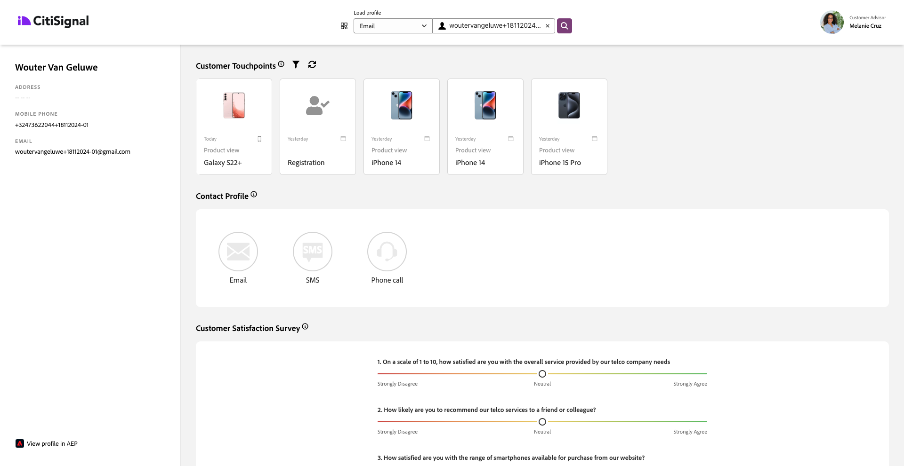

# 2.1.5 Consultare Real-time Customer Profile in azione nel call center

In questo esercizio, l’obiettivo è quello di guidarti attraverso il percorso dei clienti e comportarti come un vero cliente.

Su questo sito web è stato implementato Adobe Experience Platform. Ogni azione è considerata un evento esperienza e viene inviata a Adobe Experience Platform in tempo reale, idratando il Profilo cliente in tempo reale.

In un esercizio precedente, hai iniziato come cliente anonimo che stava navigando sul sito e, dopo un paio di passaggi, sei diventato un cliente noto.

Quando lo stesso cliente risponde al telefono e chiama il call center, è fondamentale che le informazioni provenienti da altri canali siano immediatamente disponibili, in modo che l’esperienza del call center possa essere rilevante e personalizzata.

## Utilizzare l’app CX

Vai a [https://dsn.adobe.com](https://dsn.adobe.com). Dopo aver effettuato l’accesso con il tuo Adobe ID, visualizzerai questo. Fai clic sui tre punti **...** del progetto dell&#39;app CX, quindi fai clic su **Modifica** per aprirlo.

Nel progetto dell&#39;app CX, vai a **Integrazioni**. Fare clic su **Seleziona ambiente**.

Seleziona la proprietà Raccolta dati di Adobe Experience Platform creata in Guida introduttiva. Selezionare la proprietà il cui nome contiene **(cx-app)**.

Poi vedrai questo. Fare clic su **Esegui**.

Quindi, devi selezionare una delle tue identità e il namespace corrispondente e fare clic sull&#39;**icona di ricerca**.

| Identità | Namespace |
|:-------------:| :---------------:|
| ID Experience Cloud (ECID) | 79943948563923140522865572770524243489 |
| ID Experience Cloud (ECID) | 70559351147248820114888181867542007989 |
| ID e-mail | woutervangeluwe+18112024-01@gmail.com |
| ID numero cellulare | +32473622044+18112024-01 |

Quando il cliente chiama il call center, il numero di telefono può essere utilizzato per identificare il cliente. In questo esercizio utilizzerai il numero di telefono per recuperare il profilo del cliente nell’app CX.

Ora vedrai le informazioni che idealmente verrebbero visualizzate nel Call Center, in modo che i dipendenti del Call Center abbiano immediatamente a disposizione tutte le informazioni pertinenti quando parlano con un cliente.

Passaggio successivo: [Riepilogo e vantaggi](./summary.md)

[Torna al modulo 2.1](./real-time-customer-profile.md)

[Torna a tutti i moduli](../../../overview.md)
