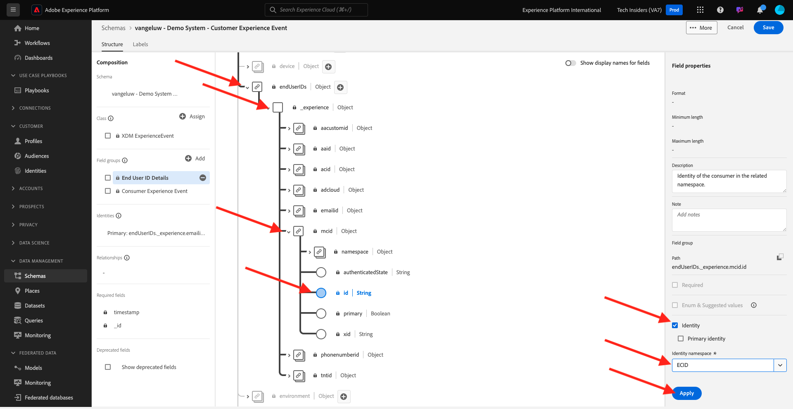

# 2.2.1 IA per l’analisi dei clienti - Preparazione dei dati (acquisizione)

Affinché Intelligent Services possa scoprire informazioni provenienti dai dati degli eventi di marketing, i dati devono essere arricchiti semanticamente e mantenuti in una struttura standard. Per ottenere questo risultato, Intelligent Services sfrutta gli schemi Experience Data Model (XDM) di Adobe.
In particolare, tutti i set di dati utilizzati in Intelligent Services devono essere conformi allo schema XDM **Consumer Experience Event**.

## 2.2.1.1 Creare uno schema

In questo esercizio creerai uno schema contenente il mixin **Consumer Experience Event**, richiesto dal servizio intelligente **Customer AI**.

Accedi a Adobe Experience Platform da questo URL: [https://experience.adobe.com/platform](https://experience.adobe.com/platform).

Dopo aver effettuato l’accesso, accedi alla home page di Adobe Experience Platform.

Prima di continuare, devi selezionare una **sandbox**. La sandbox da selezionare è denominata ``--module10sandbox--``. A tale scopo, fai clic sul testo **[!UICONTROL Prod produzione]** nella riga blu nella parte superiore dello schermo. Dopo aver selezionato la sandbox appropriata, la schermata cambia e ora sei nella sandbox dedicata.

Dal menu a sinistra, fai clic su **Schemi** e passa a **Sfoglia**. Fare clic su **Crea schema**.

Nel popup, seleziona **XDM ExperienceEvent**.

Poi vedrai questo.

Cerca e seleziona i **mixin** seguenti da aggiungere a questo schema:

- Evento esperienza del consumatore

  

- Dettagli dell’ID dell’utente finale

  

Fare clic su **Aggiungi gruppi di campi**.

Poi vedrai questo. Selezionare il mixin **Dettagli ID utente finale**.

Passa al campo **endUserIDs._experience.emailid.id**.

Nel menu a destra per il campo **endUserIDs._experience.emailid.id**, scorri verso il basso e seleziona la casella di controllo per **Identità**, seleziona la casella di controllo per **Identità primaria** e seleziona **Spazio dei nomi identità** di **E-mail**.

Passa al campo **endUserIDs._experience.mcid.id**. Selezionare la casella di controllo per **Identity** e selezionare **Identity namespace** di **ECID**. Fare clic su **Applica**.

Assegna un nome allo schema.

Come nome del nostro schema, utilizzerai quanto segue:

- `--aepUserLdap-- - Demo System - Customer Experience Event`

Ad esempio, per ldap **vangeluw**, deve essere il nome dello schema:

- **vangeluw - Sistema demo - Evento esperienza cliente**

Dovrebbe darti qualcosa del genere. Fai clic sul pulsante **+ Aggiungi** per aggiungere nuovi **mixin**.

Seleziona il nome dello schema. Abilitare ora lo schema per il **profilo** facendo clic sull&#39;interruttore **profilo**.

Poi vedrai questo. Fare clic su **Abilita**.

Ora dovresti avere questo. Fai clic su **Salva** per salvare lo schema.

## 2.2.1.2 Creare un set di dati

Dal menu a sinistra, fai clic su **Set di dati** e passa a **Sfoglia**. Fare clic su **Crea set di dati**.

Fai clic su **Crea set di dati dallo schema**.

Nella schermata successiva, seleziona il set di dati creato nell&#39;esercizio precedente, denominato **[!UICONTROL ldap - Demo System - Customer Experience Event]**. Fai clic su **Avanti**.

Come nome per il set di dati, utilizza `--aepUserLdap-- - Demo System - Customer Experience Event Dataset`. Fai clic su **Fine**.

Il set di dati è stato creato. Attiva/disattiva **Profilo**.

Fare clic su **Abilita**.

Ora dovresti disporre di:

Ora puoi iniziare a acquisire i dati di Consumer Experience Event e iniziare a utilizzare il servizio Customer AI.

## 2.2.1.3 Scaricare i dati di prova dell’evento esperienza

Una volta configurati lo **Schema** e il **Set di dati**, puoi acquisire i dati di Experience Event. Poiché IA per l&#39;analisi dei clienti richiede dati per almeno **2 trimestri**, dovrai acquisire dati preparati esternamente.

I dati preparati per gli eventi esperienza devono essere conformi ai requisiti e allo schema del [mixin XDM per evento esperienza del consumatore](https://github.com/adobe/xdm/blob/797cf4930d5a80799a095256302675b1362c9a15/docs/reference/context/experienceevent-consumer.schema.md).

Scarica il file contenente i dati di esempio da questa posizione: [https://dashboard.adobedemo.com/data](https://dashboard.adobedemo.com/data). Fai clic sul pulsante **Scarica**.

In alternativa, se non è possibile accedere al collegamento precedente, è possibile scaricare il file anche da questa posizione: [https://aepmodule10.s3-us-west-2.amazonaws.com/retail-v1-dec2020-xl.json.zip](https://aepmodule10.s3-us-west-2.amazonaws.com/retail-v1-dec2020-xl.json.zip).

È stato scaricato il file **retail-v1-dec2020-xl.json.zip**. Posiziona il file sul desktop del computer e decomprimi, dopodiché visualizzerai il file denominato **retail-v1.json**. Questo file sarà necessario nell&#39;esercizio successivo.

## 2.2.1.4 Acquisire i dati di prova di Experience Event

In Adobe Experience Platform, vai a **Set di dati** e apri il set di dati, denominato **[!UICONTROL ldap - Demo System - Set di dati evento esperienza cliente]**.

Nel set di dati, fai clic su **Scegli i file** per aggiungere i dati.

Nel popup, selezionare il file **retail-v1.json** e fare clic su **Apri**.

Vedrai quindi i dati in fase di importazione e verrà creato un nuovo batch nello stato **Caricamento**. Non allontanarti da questa pagina finché il file non viene caricato.

Una volta caricato il file, lo stato del batch passerà da **Caricamento** a **Elaborazione**.

L’acquisizione e l’elaborazione dei dati potrebbero richiedere 10-20 minuti.

Una volta completata l&#39;acquisizione dei dati, lo stato del batch passerà a **Operazione completata**.

Passaggio successivo: [2.2.2 Customer AI - Crea una nuova istanza (Configura)](./ex2.md)

[Torna al modulo 2.2](./intelligent-services.md)

[Torna a tutti i moduli](./../../../overview.md)
