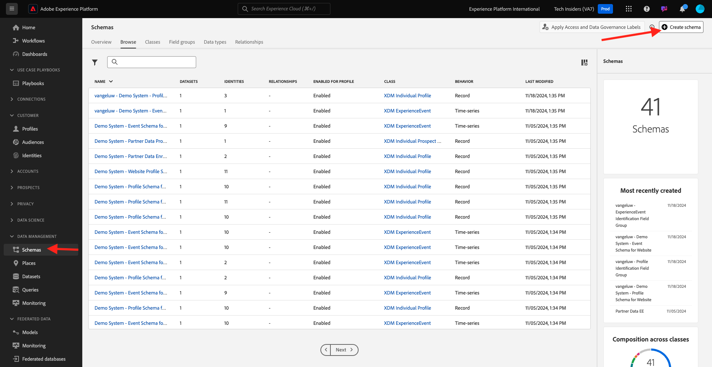
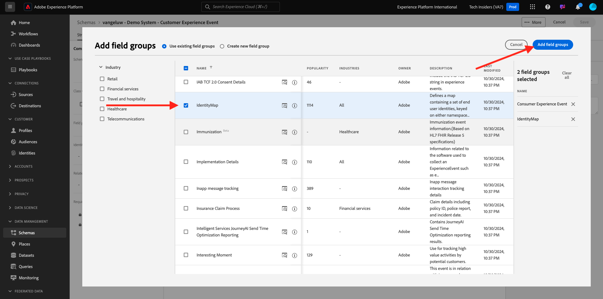

# 2.2.1 IA per l’analisi dei clienti - Preparazione dei dati (acquisizione)

Affinché Intelligent Services possa scoprire informazioni provenienti dai dati degli eventi di marketing, i dati devono essere arricchiti semanticamente e mantenuti in una struttura standard. Per ottenere questo risultato, Intelligent Services sfrutta gli schemi Experience Data Model (XDM) di Adobe.
In particolare, tutti i set di dati utilizzati in Intelligent Services devono essere conformi allo schema XDM **Consumer Experience Event**.

## Crea schema

In questo esercizio creerai uno schema contenente il mixin **Consumer Experience Event**, richiesto dal servizio intelligente **Customer AI**.

Accedi a Adobe Experience Platform da questo URL: [https://experience.adobe.com/platform](https://experience.adobe.com/platform).

Dopo aver effettuato l’accesso, accedi alla home page di Adobe Experience Platform.

Prima di continuare, devi selezionare una **sandbox**. La sandbox da selezionare è denominata ``--aepSandboxName--``. Dopo aver selezionato la sandbox appropriata, la schermata cambia e ora sei nella sandbox dedicata.

Dal menu a sinistra, fai clic su **Schemi** e passa a **Sfoglia**. Fare clic su **Crea schema**.

Nel popup, selezionare **Manuale** e fare clic su **Seleziona**.

Quindi, seleziona **Evento esperienza** e fai clic su **Avanti**.

È necessario specificare un nome per lo schema. Come nome dello schema, utilizzare `--aepUserLdap-- - Demo System - Customer Experience Event` e fare clic su **Fine**.

Poi vedrai questo. Fare clic su **+ Aggiungi** in Gruppi di campi.

Cerca e seleziona i **Gruppi di campi** seguenti da aggiungere a questo schema:

- Evento esperienza del consumatore

- IdentityMap

Fare clic su **Aggiungi gruppi di campi**.

Poi vedrai questo. Quindi, seleziona il nome dello schema. Abilitare ora lo schema per il **profilo** facendo clic sull&#39;interruttore **profilo**.

Poi vedrai questo. Selezionare la casella di controllo per **I dati per questo schema conterranno un&#39;identità primaria nel campo identityMap.**. Fare clic su **Abilita**.

Ora dovresti avere questo. Fai clic su **Salva** per salvare lo schema.

## Crea set di dati

Dal menu a sinistra, fai clic su **Set di dati** e passa a **Sfoglia**. Fare clic su **Crea set di dati**.

Fai clic su **Crea set di dati dallo schema**.

Nella schermata successiva, selezionare il set di dati creato nell&#39;esercizio precedente, denominato `--aepUserLdap-- - Demo System - Customer Experience Event`. Fai clic su **Avanti**.

Come nome per il set di dati, utilizza `--aepUserLdap-- - Demo System - Customer Experience Event Dataset`. Fai clic su **Fine**.

Il set di dati è stato creato. Attiva/disattiva **Profilo**.

Fare clic su **Abilita**.

Ora dovresti disporre di:

Ora puoi iniziare a acquisire i dati di Consumer Experience Event e iniziare a utilizzare il servizio Customer AI.

## Scarica dati di prova di Experience Event

Una volta configurati lo **Schema** e il **Set di dati**, puoi acquisire i dati di Experience Event. Poiché IA per l’analisi dei clienti richiede requisiti di dati specifici, dovrai acquisire dati preparati esternamente.

I dati preparati per gli eventi esperienza in questo esercizio devono essere conformi ai requisiti e allo schema del [gruppo di campi XDM per eventi esperienza del consumatore](https://github.com/adobe/xdm/blob/797cf4930d5a80799a095256302675b1362c9a15/docs/reference/context/experienceevent-consumer.schema.md).

Scarica il file zip con i dati demo da questa posizione: [https://tech-insiders.s3.us-west-2.amazonaws.com/CUSTOM-CAI-EVENTS-WEB.zip](https://tech-insiders.s3.us-west-2.amazonaws.com/CUSTOM-CAI-EVENTS-WEB.zip).

È stato scaricato il file **CUSTOM-CAI-EVENTS-WEB.zip**. Posiziona il file sul desktop del computer e decomprimi, dopodiché visualizzerai la cartella **CUSTOM-CAI-EVENTS-WEB**.

In tale cartella troverai più file json in sequenza, che devono essere tutti acquisiti nell’esercizio successivo.

## Acquisire i dati di prova di Experience Event

In Adobe Experience Platform, vai a **Set di dati** e apri il set di dati, denominato **[!UICONTROL ldap - Demo System - Set di dati evento esperienza cliente]**.

Nel set di dati, fai clic su **Scegli i file** per aggiungere i dati.

Nel popup, seleziona i file **WEBSITE-EE-1.json** fino a **WEBSITE-EE-5.json** e fai clic su **Apri**.

Ripeti questo processo di acquisizione per i file **WEBSITE-EE-6.json** e **WEBSITE-EE-7.json**.

Vedrai quindi i dati in fase di importazione e verrà creato un nuovo batch nello stato **Caricamento**. Non allontanarti da questa pagina finché il file non viene caricato.

Una volta caricato il file, lo stato del batch passerà da **Caricamento** a **Elaborazione**.

L’acquisizione e l’elaborazione dei dati potrebbero richiedere 10-20 minuti.

Una volta completata l&#39;acquisizione dei dati, lo stato batch dei vari caricamenti passerà a **Operazione completata**.

Passaggio successivo: [2.2.2 Customer AI - Crea una nuova istanza (Configura)](./ex2.md)

[Torna al modulo 2.2](./intelligent-services.md)

[Torna a tutti i moduli](./../../../overview.md)
