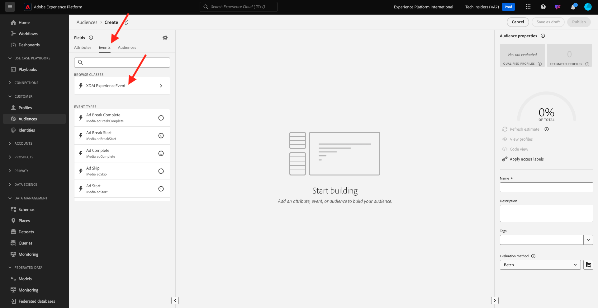

# 2.3.1 Creare un pubblico

In questo esercizio creerai un pubblico utilizzando il generatore di pubblico di Adobe Experience Platform.

## Contesto

Rispondere agli interessi di un cliente deve essere in tempo reale. Uno dei modi per rispondere al comportamento dei clienti in tempo reale è utilizzare un pubblico, a condizione che il pubblico si qualifichi in tempo reale. In questo esercizio, devi creare un pubblico, tenendo conto dell’attività reale sul sito web che abbiamo utilizzato.

## Identificare il comportamento a cui si desidera reagire

Vai a [https://dsn.adobe.com](https://dsn.adobe.com). Dopo aver effettuato l’accesso con il tuo Adobe ID, visualizzerai questo. Fai clic sui tre punti **...** del progetto del sito Web, quindi fai clic su **Esegui** per aprirlo.

Poi vedrai il tuo sito web demo aperto. Seleziona l’URL e copialo negli Appunti.

Apri una nuova finestra del browser in incognito.

Incolla l’URL del sito web demo, che hai copiato nel passaggio precedente. Ti verrà quindi chiesto di effettuare l’accesso con il tuo Adobe ID.

Seleziona il tipo di account e completa la procedura di accesso.

Vedrai quindi il tuo sito web caricato in una finestra del browser in incognito. Per ogni esercizio, dovrai utilizzare una nuova finestra del browser in incognito per caricare l’URL del sito web demo.

In questo esempio, desideri rispondere a un cliente specifico che visualizza un prodotto specifico.
Dalla home page di **Citi Signal**, vai a **Telefoni e dispositivi** e fai clic sul prodotto **Galaxy S24**.

Quindi, quando qualcuno visita la pagina del prodotto per **Galaxy S24**, vuoi poter intervenire. La prima cosa da fare per agire è definire un pubblico.

## Creare il pubblico

Vai a [Adobe Experience Platform](https://experience.adobe.com/platform). Dopo aver effettuato l’accesso, accedi alla home page di Adobe Experience Platform.

Prima di continuare, devi selezionare una **sandbox**. La sandbox da selezionare è denominata ``--aepSandboxName--``. Dopo aver selezionato la [!UICONTROL sandbox] appropriata, la schermata verrà modificata e ora sei nella [!UICONTROL sandbox] dedicata.

Nel menu a sinistra, vai a **Tipi di pubblico** e quindi vai a **Sfoglia** dove puoi vedere una panoramica di tutti i tipi di pubblico esistenti. Fai clic sul pulsante **Crea pubblico** per iniziare a creare un nuovo pubblico.

Seleziona **Genera regola** e fai clic su **Crea**.

Come accennato in precedenza, è necessario creare un pubblico tra tutti i clienti che hanno visualizzato il prodotto **Galaxy S24**.

Per creare questo pubblico, devi aggiungere un evento. Per trovare tutti gli eventi, fai clic sull&#39;icona **Eventi** nella barra dei menu **Tipi di pubblico**.

Successivamente verrà visualizzato il nodo principale **XDM ExperienceEvent**.

Per trovare i clienti che hanno visitato il prodotto **Galaxy S24**, fai clic su **XDM ExperienceEvent**.

Scorri verso il basso fino a **Elementi elenco prodotti** e fai clic su di esso.

Seleziona **Nome** e trascina l&#39;oggetto **Nome** dal menu di sinistra **Elementi elenco prodotti** nell&#39;area di lavoro di audience builder nella sezione **Eventi**.

Il parametro di confronto deve essere **uguale a** e nel campo di input immettere `Galaxy S24`.

Le **Regole evento** dovrebbero ora avere questo aspetto. Ogni volta che aggiungi un elemento al generatore di pubblico, puoi fare clic sul pulsante **Aggiorna stima** per ottenere una nuova stima della popolazione nel pubblico.

Assegna un nome al pubblico e imposta il **metodo di valutazione** su **Edge**.

Come convenzione di denominazione, utilizza:

- `--aepUserLdap-- - Interest in Galaxy S24`

Fai clic sul pulsante **Publish** per salvare il pubblico.

Ora verrai riportato alla pagina di panoramica del pubblico.

Passaggio successivo: [2.3.2 Verificare come configurare la destinazione DV360 utilizzando le destinazioni](./ex2.md)

[Torna al modulo 2.3](./real-time-cdp-build-a-segment-take-action.md)

[Torna a tutti i moduli](../../../overview.md)
