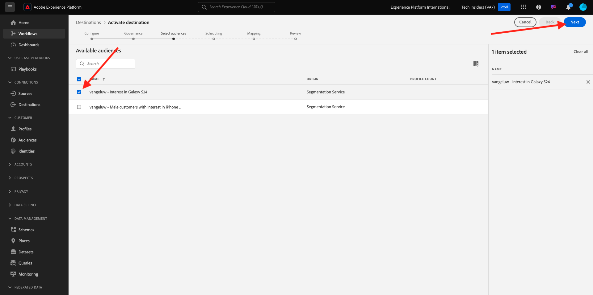

# 2.3.4 Intervenire: inviare il pubblico a una destinazione S3

Adobe Experience Platform ha anche la possibilità di condividere i tipi di pubblico su destinazioni del marketing via e-mail, come Salesforce Marketing Cloud, Oracle Eloqua, Oracle Responsys e Adobe Campaign.

Puoi utilizzare FTP o SFTP come parte delle destinazioni dedicate per ciascuna di queste destinazioni del marketing via e-mail, oppure puoi utilizzare AWS S3 per scambiare elenchi di clienti tra Adobe Experience Platform e queste destinazioni del marketing via e-mail.

In questo modulo, configurerai tale destinazione utilizzando un bucket AWS S3.

## Creare il bucket S3

Vai a [https://console.aws.amazon.com](https://console.aws.amazon.com) e accedi.

>[!NOTE]
>
>Se non disponi ancora di un account AWS, crea un nuovo account AWS utilizzando il tuo indirizzo e-mail personale.

Dopo l&#39;accesso, verrai reindirizzato a **AWS Management Console**.

Nella barra di ricerca, cerca **s3**. Fare clic sul primo risultato della ricerca: **S3 - Storage scalabile nel cloud**.

Verrà quindi visualizzata la home page di **Amazon S3**. Fai clic su **Crea bucket**.

Nella schermata **Crea bucket**, utilizza il nome `aepmodulertcdp--aepUserLdap--`

Lascia invariate tutte le altre impostazioni predefinite. Scorri verso il basso e fai clic su **Crea bucket**.

Vedrai quindi il tuo bucket in fase di creazione e verrà reindirizzato alla home page di Amazon S3.

## Impostare le autorizzazioni per accedere al bucket S3

Il passaggio successivo consiste nel configurare l’accesso al bucket S3.

Per eseguire questa operazione, vai a [https://console.aws.amazon.com/iam/home](https://console.aws.amazon.com/iam/home).

L’accesso alle risorse di AWS è controllato da Amazon Identity and Access Management (IAM).

Ora vedrai questa pagina.

Nel menu a sinistra, fai clic su **Utenti**. Viene visualizzata la schermata **Utenti**. Fare clic su **Crea utente**.

Quindi, configura l’utente:

- Nome utente: utilizzare `s3_--aepUserLdap--_rtcdp`

Fai clic su **Avanti**.

Viene quindi visualizzata questa schermata delle autorizzazioni. Fai clic su **Allega criteri direttamente**.

Immettere il termine di ricerca **s3** per visualizzare tutti i criteri S3 correlati. Selezionare il criterio **AmazonS3FullAccess**. Scorri verso il basso e fai clic su **Avanti**.

Controlla la configurazione. Fare clic su **Crea utente**.

Poi vedrai questo. Fare clic su **Visualizza utente**.

Fare clic su **Credenziali di protezione** e quindi su **Crea chiave di accesso**.

Selezionare **l&#39;applicazione in esecuzione all&#39;esterno di AWS**. Scorri verso il basso e fai clic su **Avanti**.

Fai clic su **Crea chiave di accesso**

Poi vedrai questo. Fai clic su **Mostra** per visualizzare la chiave di accesso segreta:

È ora visualizzata la **chiave di accesso segreta**.

>[!IMPORTANT]
>
>Memorizzare le credenziali in un file di testo nel computer.
>
> - ID chiave di accesso: ...
> - Chiave di accesso segreta: ...
>
> Dopo aver fatto clic su **Fine** non verranno più visualizzate le credenziali.

Fai clic su **Fine**.

Ora hai creato correttamente un bucket AWS S3 e hai creato un utente con autorizzazioni di accesso a questo bucket.

## Configurare la destinazione in Adobe Experience Platform

Vai a [Adobe Experience Platform](https://experience.adobe.com/platform). Dopo aver effettuato l’accesso, accedi alla home page di Adobe Experience Platform.

Prima di continuare, devi selezionare una **sandbox**. La sandbox da selezionare è denominata ``--aepSandboxName--``. Dopo aver selezionato la [!UICONTROL sandbox] appropriata, la schermata verrà modificata e ora sei nella [!UICONTROL sandbox] dedicata.

Nel menu a sinistra, vai a **Destinazioni**, quindi vai a **Catalogo**. Verrà quindi visualizzato il **Catalogo destinazioni**.

Fai clic su **Archiviazione cloud**, quindi sul pulsante **Configura** (o su **Attiva pubblico**, a seconda dell&#39;ambiente in uso) nella scheda **Amazon S3**.

Selezionare **Chiave di accesso** come tipo di account. Utilizza le credenziali S3 che ti sono state fornite nel passaggio precedente:

| ID chiave di accesso | Chiave di accesso segreta |
|:-----------------------:| :-----------------------:|
| AKIA..... | 7 Icm..... |

Fai clic su **Connetti alla destinazione**.

Verrà quindi visualizzata una conferma visiva che la destinazione è ora connessa.

Devi fornire i dettagli del bucket S3 in modo che Adobe Experience Platform possa connettersi al bucket S3.

Come convenzione di denominazione, utilizza quanto segue:

| ID chiave di accesso | Chiave di accesso segreta |
|:-----------------------:| :-----------------------:|
| Nome | `AWS - S3 - --aepUserLdap--` |
| Descrizione | `AWS - S3 - --aepUserLdap--` |
| Nome bucket | `aepmodulertcdp--aepUserLdap--` |
| Percorso cartella | /now |

Seleziona **Tipi di pubblico**.

Per **Tipo file**, selezionare **CSV** e lasciare invariate le impostazioni predefinite.

Scorri verso il basso. Per **Formato di compressione**, selezionare **Nessuno**. Fai clic su **Avanti**.

Facoltativamente, ora puoi allegare un criterio di governance dei dati alla nuova destinazione. Fai clic su **Avanti**.

Nell&#39;elenco dei tipi di pubblico, cercare il pubblico creato nell&#39;esercizio precedente, `--aepUserLdap-- - Interest in Galaxy S24` e selezionarlo. Fai clic su **Avanti**.

Poi vedrai questo. Se lo desideri, puoi modificare la pianificazione e il nome del file facendo clic sull&#39;icona **matita**. Fai clic su **Avanti**.

Ora puoi selezionare gli attributi del profilo per l’esportazione in AWS S3. Fai clic su **Aggiungi nuovo campo** e assicurati che il campo `--aepTenantId--.identification.core.ecid` sia aggiunto e contrassegnato come **Chiave di deduplicazione**.

Facoltativamente, puoi aggiungere tutti gli altri attributi di profilo necessari.

Dopo aver aggiunto tutti i campi, fai clic su **Avanti**.

Controlla la configurazione. Fai clic su **Fine** per completare la configurazione.

Poi tornerai alla schermata di attivazione della destinazione e vedrai il tuo pubblico aggiunto a questa destinazione.

Se desideri aggiungere altre esportazioni di pubblico, puoi fare clic su **Attiva pubblico** per riavviare il processo e aggiungere altri tipi di pubblico.

Passaggio successivo: [2.3.5 Intervieni: invia il pubblico ad Adobe Target](./ex5.md)

[Torna al modulo 2.3](./real-time-cdp-build-a-segment-take-action.md)

[Torna a tutti i moduli](../../../overview.md)
