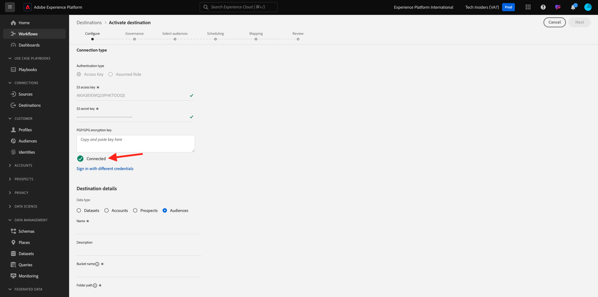
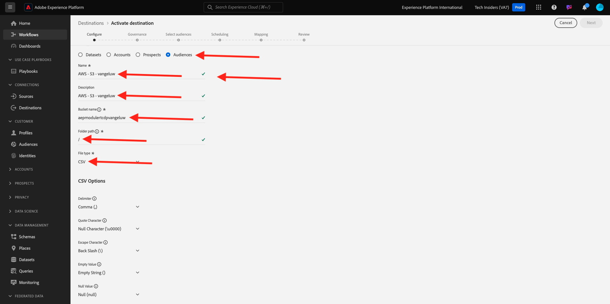

# 2.3.4 Intervenire: inviare il segmento a una destinazione S3

Adobe Experience Platform ha anche la possibilità di condividere i tipi di pubblico sulle destinazioni del marketing via e-mail, come Salesforce Marketing Cloud, Oracle Eloqua, Oracle Responsys e Adobe Campaign.

Puoi utilizzare FTP o SFTP come parte delle destinazioni dedicate per ciascuna di queste destinazioni del marketing via e-mail, oppure puoi utilizzare AWS S3 per scambiare elenchi di clienti tra Adobe Experience Platform e queste destinazioni del marketing via e-mail.

In questo modulo, configurerai tale destinazione utilizzando un bucket AWS S3.

## 2.3.4.1 Creare il bucket S3

Vai a [https://console.aws.amazon.com](https://console.aws.amazon.com) e accedi con l&#39;account Amazon creato in precedenza.

Dopo l&#39;accesso, verrai reindirizzato a **AWS Management Console**.

Nel menu **Trova servizi**, cerca **s3**. Fare clic sul primo risultato della ricerca: **S3 - Storage scalabile nel cloud**.

Verrà quindi visualizzata la home page di **Amazon S3**. Fai clic su **Crea bucket**.

Nella schermata **Crea bucket**, è necessario configurare due elementi:

- Nome: utilizzare il nome `aepmodulertcdp--demoProfileLdap--`. Ad esempio, in questo esercizio il nome del bucket è **aepmodulertcdpvangeluw**
- Regione: utilizzare la regione **UE (Francoforte) eu-central-1**

Lascia invariate tutte le altre impostazioni predefinite. Scorri verso il basso e fai clic su **Crea bucket**.

Vedrai quindi il tuo bucket in fase di creazione e verrà reindirizzato alla home page di Amazon S3.

## 2.3.4.2 Impostare le autorizzazioni per accedere al bucket S3

Il passaggio successivo consiste nel configurare l’accesso al bucket S3.

Per eseguire questa operazione, vai a [https://console.aws.amazon.com/iam/home](https://console.aws.amazon.com/iam/home).

L’accesso alle risorse di AWS è controllato da Amazon Identity and Access Management (IAM).

Ora vedrai questa pagina.

Nel menu a sinistra, fai clic su **Utenti**. Viene visualizzata la schermata **Utenti**. Fare clic su **Aggiungi utenti**.

Quindi, configura l’utente:

- Nome utente: utilizzare `s3_--demoProfileLdap--_rtcdp` come nome, quindi in questo esempio il nome è `s3_vangeluw_rtcdp`.
- Tipo di accesso AWS: selezionare **Chiave di accesso - Accesso a livello di programmazione**.

Fai clic su **Avanti: autorizzazioni**.

Viene quindi visualizzata questa schermata delle autorizzazioni. Fai clic su **Allega direttamente i criteri esistenti**.

Immettere il termine di ricerca **s3** per visualizzare tutti i criteri S3 correlati. Selezionare il criterio **AmazonS3FullAccess**. Fai clic su **Avanti: Tag**.

Nella schermata **Tag** non è necessario configurare nulla. Fai clic su **Avanti: rivedi**.

Controlla la configurazione. Fare clic su **Crea utente**.

L’utente è stato creato e le credenziali per accedere all’ambiente S3 sono visibili. Questa è l&#39;unica volta che vedrai le tue credenziali, quindi ti preghiamo di trascriverle.

Fai clic su **Mostra** per visualizzare la chiave di accesso segreta:

>[!IMPORTANT]
>
>Memorizzare le credenziali in un file di testo nel computer.
>
> - ID chiave di accesso: ...
> - Chiave di accesso segreta: ...
>
> Facendo clic su **Chiudi** non verranno più visualizzate le credenziali.

Fai clic su **Chiudi**.

Ora hai creato correttamente un bucket AWS S3 e hai creato un utente con autorizzazioni di accesso a questo bucket.

## 2.3.4.3 Configurare la destinazione in Adobe Experience Platform

Vai a [Adobe Experience Platform](https://experience.adobe.com/platform). Dopo aver effettuato l’accesso, accedi alla home page di Adobe Experience Platform.

Prima di continuare, devi selezionare una **sandbox**. La sandbox da selezionare è denominata ``--aepSandboxId--``. A tale scopo, fai clic sul testo **[!UICONTROL Prod produzione]** nella riga blu nella parte superiore dello schermo. Dopo aver selezionato la [!UICONTROL sandbox] appropriata, la schermata verrà modificata e ora sei nella [!UICONTROL sandbox] dedicata.

Nel menu a sinistra, vai a **Destinazioni**, quindi vai a **Catalogo**. Verrà quindi visualizzato il **Catalogo destinazioni**.

Fai clic su **Archiviazione cloud**, quindi sul pulsante **Configura** (o su **Attiva segmenti**, a seconda dell&#39;ambiente in uso) nella scheda **Amazon S3**.

A seconda dell&#39;ambiente, potrebbe essere necessario fare clic su **+ Configurare una nuova destinazione** per iniziare a creare la destinazione.

Seleziona **Nuovo account** come tipo di account. Utilizza le credenziali S3 che ti sono state fornite nel passaggio precedente:

| ID chiave di accesso | Chiave di accesso segreta |
|:-----------------------:| :-----------------------:|
| AKIA..... | Cm5Ln..... |

Fai clic su **Connetti alla destinazione**.

Verrà quindi visualizzata una conferma visiva che la destinazione è ora connessa.

Devi fornire un nome e una cartella in modo che Adobe Experience Platform possa connettersi al bucket S3.

Come convenzione di denominazione, utilizza quanto segue:

| ID chiave di accesso | Chiave di accesso segreta |
|:-----------------------:| :-----------------------:|
| Nome | `AWS - S3 - --demoProfileLdap--` |
| Descrizione | `AWS - S3 - --demoProfileLdap--` |
| Nome bucket | `aepmodulertcdp--demoProfileLdap--` |
| Percorso cartella | / |

Fai clic su **Avanti**.

Facoltativamente, ora puoi allegare un criterio di governance dei dati alla nuova destinazione. Fai clic su **Avanti**.

Nell’elenco dei segmenti, cerca il segmento creato nell’esercizio 1 e selezionalo. Fai clic su **Avanti**.

Poi vedrai questo. Se lo desideri, puoi modificare la pianificazione facendo clic sull&#39;icona **matita**. **Crea Schedule**.

Definisci la pianificazione desiderata. Seleziona **Esporta file incrementali** e imposta la frequenza su **Ore** ogni **3 ore**. Fai clic su **Crea**.

Allora avrai questo. Fai clic su **Avanti**.

Ora puoi selezionare gli attributi per l’esportazione in AWS S3. Fai clic su **Aggiungi nuovo campo** e assicurati che il campo `--aepTenantId--.identification.core.ecid` sia aggiunto e contrassegnato come **Chiave di deduplicazione**.

Facoltativamente, puoi aggiungere tutti gli altri campi necessari.

Dopo aver aggiunto tutti i campi, fai clic su **Avanti**.

Controlla la configurazione. Fai clic su **Fine** per completare la configurazione.

Tornerai quindi alla schermata di attivazione della destinazione e vedrai il tuo segmento aggiunto a questa destinazione.

Se desideri aggiungere altre esportazioni di segmenti, puoi fare clic su **Attiva segmenti** per riavviare il processo e aggiungere altri segmenti.

Passaggio successivo: [2.3.5 Intervieni: invia il tuo segmento ad Adobe Target](./ex5.md)

[Torna al modulo 2.3](./real-time-cdp-build-a-segment-take-action.md)

[Torna a tutti i moduli](../../../overview.md)
