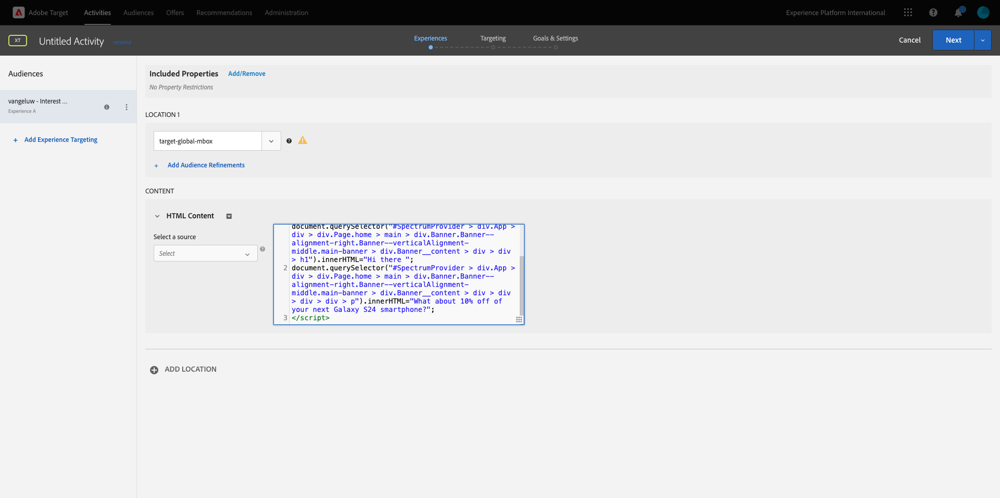
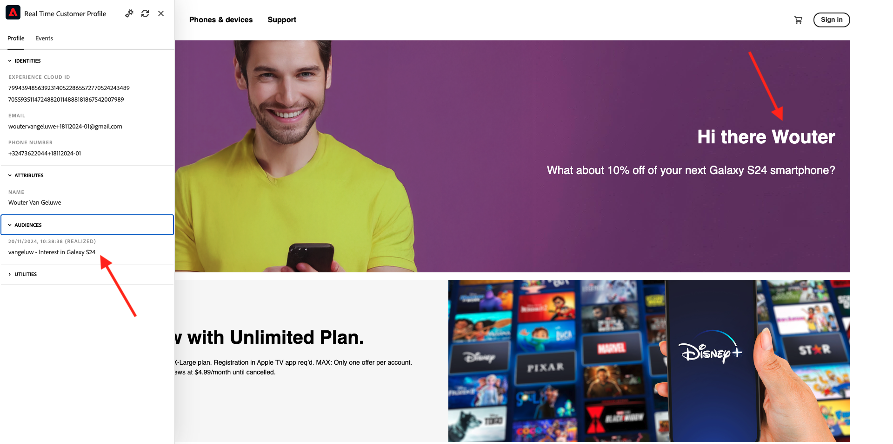

# 2.3.5 Intervenire: inviare il pubblico ad Adobe Target

Vai a [Adobe Experience Platform](https://experience.adobe.com/platform). Dopo aver effettuato l’accesso, accedi alla home page di Adobe Experience Platform.


Prima di continuare, devi selezionare una **sandbox**. La sandbox da selezionare è denominata ``--aepSandboxName--``. Dopo aver selezionato la [!UICONTROL sandbox] appropriata, la schermata verrà modificata e ora sei nella [!UICONTROL sandbox] dedicata.


## Verificare lo stream di dati

La destinazione Adobe Target in Real-Time CDP è connessa allo stream di dati utilizzato per acquisire i dati nella rete Adobe Edge. Se desideri configurare la destinazione Adobe Target, devi innanzitutto verificare se lo stream di dati è già abilitato per Adobe Target. Il flusso di dati è stato configurato in [Esercizio 0.2 Creare il flusso di dati](./../../../modules/gettingstarted/gettingstarted/ex2.md) ed è stato denominato `--aepUserLdap-- - Demo System Datastream`.

Nel menu a sinistra, scorri verso il basso e fai clic su **Datastreams**. In Datastreams, cercare lo stream di dati denominato `--aepUserLdap-- - Demo System Datastream`. Fai clic sullo stream di dati per aprirlo.


Visualizzerai quindi questo elemento, fai clic su **...** accanto a **Adobe Experience Platform** e quindi su **Modifica**.


Seleziona le caselle di controllo per **Segmentazione Edge** e **Destinazioni Personalization**. Fai clic su **Salva**.


Fare clic su **+ Aggiungi servizio**.


Selezionare il servizio **Adobe Target**. Fai clic su **Salva**.


Lo stream di dati è ora configurato per Adobe Target.


## Configurare la destinazione Adobe Target

Adobe Target è disponibile come destinazione da Real-Time CDP. Per configurare la tua integrazione con Adobe Target, vai a **Destinazioni**, **Catalogo**.

Fai clic su **Personalization** nel menu **Categorie**. Verrà quindi visualizzata la scheda di destinazione **(v2) Adobe Target**.


Fare clic su **Connetti alla destinazione**.


Poi vedrai questo. Per creare una destinazione Adobe Target personalizzata, segui queste linee guida:

- Nome: utilizzare il nome `--aepUserLdap-- - Adobe Target v2  (Web)`.
- ID dello stream di dati: è necessario selezionare lo stream di dati configurato in [Esercizio 0.2 Creare lo stream di dati](./../../../modules/gettingstarted/gettingstarted/ex2.md). Il nome dello stream di dati deve essere: `--aepUserLdap-- - Demo System Datastream`.
- Workspace: è relativo alle aree di lavoro di Adobe Target. Se non è necessario utilizzare un&#39;area di lavoro specifica, selezionare **Workspace predefinito**.

Fai clic su **Avanti**.


Ora puoi selezionare facoltativamente un criterio di governance dei dati. Fai clic su **Avanti**.


Nell&#39;elenco dei tipi di pubblico disponibili selezionare il pubblico creato nell&#39;esercizio precedente [Creare un pubblico](./ex1.md), denominato `--aepUserLdap-- - Interest in Galaxy S24`. Quindi fare clic su **Avanti**.


Nella schermata **Mapping**, puoi mappare gli attributi del profilo affinché diventino disponibili in Adobe Target. Questo ti aiuta ad aggiungere un ulteriore livello di personalizzazione sul tuo sito web. Fare clic su **Aggiungi nuovo campo**.


Per il nuovo campo, seleziona il campo **person.name.firstName**. Fai clic su **Salva**.


Allora avrai questo. Fai clic su **Avanti**.


Fai clic su **Fine**.


Il pubblico è ora attivato nei confronti di Adobe Target.


>[!IMPORTANT]
>
>Quando hai appena creato la destinazione Adobe Target in Real-Time CDP, la pubblicazione della destinazione potrebbe richiedere fino a un’ora. Si tratta di un tempo di attesa una tantum, dovuto alla configurazione del back-end. Al termine della configurazione del back-end e del tempo di attesa iniziale di 1 ora, i nuovi tipi di pubblico aggiunti inviati alla destinazione Adobe Target saranno disponibili per il targeting in tempo reale.

## Configurare l’attività basata su moduli di Adobe Target

Ora che il pubblico di Real-Time CDP è configurato per essere inviato ad Adobe Target, puoi configurare la tua attività Targeting esperienza in Adobe Target. In questo esercizio configurerai un’attività basata su moduli.

Vai alla home page di Adobe Experience Cloud da [https://experiencecloud.adobe.com/](https://experiencecloud.adobe.com/). Fai clic su **Target** per aprirlo.


Nella home page di **Adobe Target** verranno visualizzate tutte le attività esistenti. Fai clic su **Crea attività**, quindi fai clic su **Targeting esperienza**.


Seleziona **Web**, **Modulo** e **Nessuna restrizione proprietà**. Fai clic su **Crea**.


Ora sei nel compositore attività basato su moduli.


Per il campo **POSIZIONE 1**, selezionare **target-global-mbox**.


Il pubblico predefinito è attualmente **Tutti i visitatori**. Fai clic su **3 punti** accanto a **Tutti i visitatori** e fai clic su **Cambia pubblico**.


Ora visualizzi l’elenco dei tipi di pubblico disponibili e il pubblico Adobe Experience Platform creato in precedenza e inviato ad Adobe Target ora fa parte di questo elenco. Seleziona il pubblico creato in precedenza in Adobe Experience Platform. Fai clic su **Assegna pubblico**.


Il pubblico di Adobe Experience Platform ora fa parte di questa attività Targeting esperienza.


Ora cambiamo l&#39;immagine protagonista sulla homepage del sito web. Fai clic su per aprire l&#39;elenco a discesa accanto a **Contenuto predefinito** e fai clic su **Crea offerta HTML**.


Incolla il seguente codice.

```javascript
<script>document.querySelector("#SpectrumProvider > div.App > div > div.Page.home > main > div.Banner.Banner--alignment-right.Banner--verticalAlignment-middle.main-banner > div.Image > img").src="https://tech-insiders.s3.us-west-2.amazonaws.com/citisignal-new-hero.png"; document.querySelector("#SpectrumProvider > div.App > div > div.Page.home > main > div.Banner.Banner--alignment-right.Banner--verticalAlignment-middle.main-banner > div.Banner__content > div > div > h1").innerHTML="Hi there ";
document.querySelector("#SpectrumProvider > div.App > div > div.Page.home > main > div.Banner.Banner--alignment-right.Banner--verticalAlignment-middle.main-banner > div.Banner__content > div > div > div > div > p").innerHTML="What about 10% off of your next Galaxy S24 smartphone?";
</script>
```



Successivamente, devi aggiungere un token di personalizzazione dagli attributi del profilo di Adobe Experience Platform. Ricorda che quando hai attivato il pubblico in Adobe Target, hai anche selezionato il campo **person.name.firstName** da condividere con Adobe Target. Per recuperare il campo, selezionare l&#39;origine **Adobe Experience Platform**, selezionare la sandbox (che dovrebbe essere `--aepSandboxName--`), quindi selezionare l&#39;attributo **person.name.firstName**.


Prima di fare clic sul pulsante **Aggiungi**, accertarsi di passare alla riga in cui è visualizzato `... > h1").innerHTML="Hi there ";` e posizionare il cursore all&#39;interno delle parentesi dopo la parola `there`, come segue:

```
... > h1").innerHTML="Hi there ";
```

Quindi fai clic sul pulsante **Aggiungi**, che dovrebbe aggiungere il token, che aggiornerà il codice come segue:

```
... > h1").innerHTML="Hi there ${aep.person.name.firstName}";
```


Fai clic su **Avanti**.


Potrai quindi visualizzare la panoramica della tua esperienza con la nuova immagine, per il pubblico selezionato. Fai clic su **Avanti**.


Fai clic sul titolo dell&#39;attività nell&#39;angolo superiore sinistro per rinominarla, così: `--aepUserLdap-- - RTCDP - XT (Form)`


Nella pagina **Obiettivi e impostazioni** - vai a **Metriche obiettivo**. Imposta l&#39;obiettivo principale su **Coinvolgimento** - **Tempo sul sito**. Fai clic su **Salva e chiudi**.


Sei ora nella pagina **Panoramica attività**. Devi comunque attivare l&#39;attività. Fai clic sul campo **Inattivo** e seleziona **Attiva**.


Otterrai quindi una conferma visiva che l’attività è ora live.


L&#39;attività è ora live e può essere testata sul sito web demo.

>[!IMPORTANT]
>
>Quando hai appena creato la destinazione Adobe Target in Real-Time CDP, la pubblicazione della destinazione potrebbe richiedere fino a un’ora. Si tratta di un tempo di attesa una tantum, dovuto alla configurazione del back-end. Al termine della configurazione del tempo di attesa iniziale di 1 ora e del back-end, i nuovi tipi di pubblico edge aggiunti, inviati alla destinazione Adobe Target, saranno disponibili per il targeting in tempo reale.

Se ora torni al sito web di dimostrazione e visiti la pagina del prodotto di Galaxy S24, ti qualificherai per il pubblico che hai creato e vedrai l’attività Adobe Target visualizzata nella pagina principale in tempo reale.



Passaggio successivo: [2.3.6 Destinazioni SDK](./ex6.md)

[Torna al modulo 2.3](./real-time-cdp-build-a-segment-take-action.md)

[Torna a tutti i moduli](../../../overview.md)
