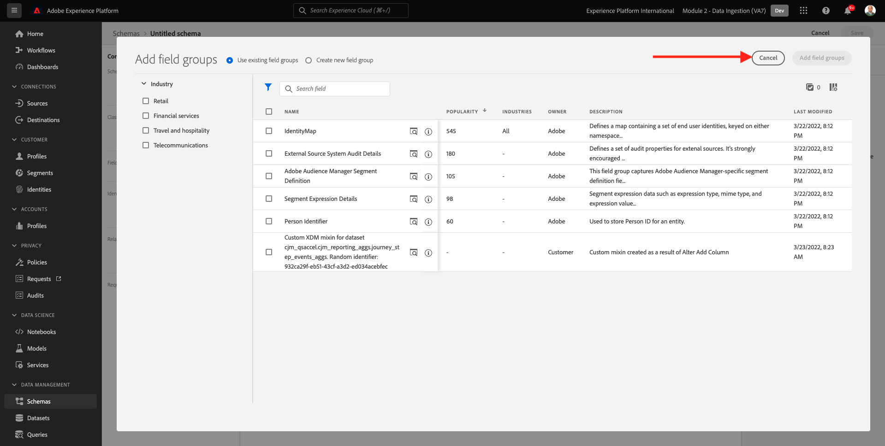
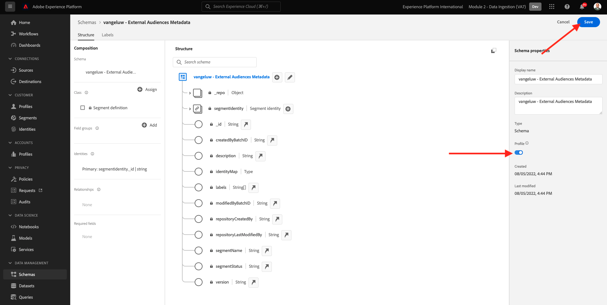
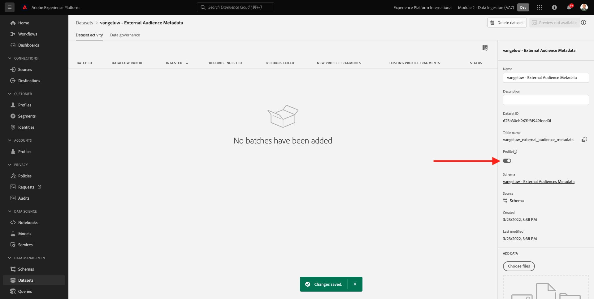
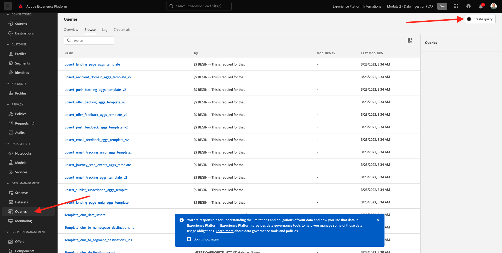

# 2.3.6 Pubblico esterno

In molti casi, la tua azienda potrebbe voler utilizzare i segmenti esistenti di altre applicazioni per arricchire il profilo cliente in Adobe Experience Platform.
Tali tipi di pubblico esterni possono essere stati definiti in base a un modello di scienza dei dati o utilizzando piattaforme di dati esterne.

La funzione dei tipi di pubblico esterni di Adobe Experience Platform consente di concentrarti sull’acquisizione dei tipi di pubblico esterni e sulla loro attivazione senza dover ridefinire la definizione del segmento corrispondente in Adobe Experience Platform.

Il processo complessivo si articola in tre fasi principali:

- Importare i metadati del pubblico esterno: questo passaggio ha lo scopo di acquisire in Adobe Experience Platform i metadati del pubblico esterno, come il nome del pubblico.
- Assegna la partecipazione del pubblico esterno al profilo cliente: questo passaggio ha lo scopo di arricchire il profilo cliente con l’attributo di iscrizione al segmento esterno.
- Creare i segmenti in Adobe Experience Platform: questo passaggio ha lo scopo di creare segmenti utilizzabili in base all’iscrizione a tipi di pubblico esterni.

## 2.3.6.1 Metadati

Vai a [Adobe Experience Platform](https://experience.adobe.com/platform). Dopo aver effettuato l’accesso, accedi alla home page di Adobe Experience Platform.


>[!IMPORTANT]
>
>La sandbox da utilizzare per questo esercizio è ``--module2sandbox--``.

Prima di continuare, devi selezionare una **sandbox**. La sandbox da selezionare è denominata ``--module2sandbox--``. A tale scopo, fai clic sul testo **[!UICONTROL Prod produzione]** nella riga blu nella parte superiore dello schermo. Dopo aver selezionato la [!UICONTROL sandbox] appropriata, la schermata verrà modificata e ora sei nella [!UICONTROL sandbox] dedicata.


Mentre i dati del segmento definiscono la condizione affinché un profilo faccia parte di un segmento, i metadati del segmento sono informazioni sul segmento come il nome, la descrizione e lo stato del segmento. Poiché i metadati dei tipi di pubblico esterni verranno memorizzati in Adobe Experience Platform, è necessario utilizzare uno spazio dei nomi delle identità per acquisire i metadati in Adobe Experience Platform.

## 2.3.6.1.1 Namespace Identity per tipi di pubblico esterni

È già stato creato uno spazio dei nomi delle identità per l&#39;utilizzo con **tipi di pubblico esterni**.
Per visualizzare l&#39;identità già creata, passa a **Identità** e cerca **Esterna**. Fai clic sull’elemento &quot;Pubblico esterno&quot;.

Nota:

- Il simbolo di identità **externalaudiences** verrà utilizzato nei passaggi successivi per fare riferimento all&#39;identità dei tipi di pubblico esterni.
- Per questo spazio dei nomi delle identità viene utilizzato il tipo **Identificatore non persone**, in quanto questo spazio dei nomi non è destinato a identificare i profili dei clienti, ma i segmenti.


## 2.3.6.1.2 Creare lo schema metadati per tipi di pubblico esterni

I metadati dei tipi di pubblico esterni si basano sullo **Schema di definizione del segmento**. Ulteriori dettagli sono disponibili nell&#39;archivio Github [XDM](https://github.com/adobe/xdm/blob/master/docs/reference/classes/segmentdefinition.schema.md).

Nel menu a sinistra, vai a Schemi. Fare clic su **+ Crea schema** e quindi su **Sfoglia**.


Per assegnare una classe, cercare **definizione segmento**. Seleziona la classe **Definizione segmento** e fai clic su **Assegna classe**.


Poi vedrai questo. Fare clic su **Annulla**.



Poi vedrai questo. Seleziona il campo **_id**. Nel menu di destra, scorri verso il basso e abilita le caselle di controllo **Identità** e **Identità primaria**. Seleziona lo spazio dei nomi dell&#39;identità **Tipi di pubblico esterni**. Fare clic su **Applica**.


Selezionare quindi il nome dello schema **Schema senza titolo**. Cambia il nome in `--aepUserLdap-- - External Audiences Metadata`.


Attiva/disattiva **Profilo** e conferma. Infine, fare clic su **Salva**.



## 2.3.6.1.3 Creare il set di dati dei metadati dei tipi di pubblico esterni

In **Schemi**, passa a **Sfoglia**. Cerca e fai clic sullo schema `--aepUserLdap-- - External Audiences Metadata` creato nel passaggio precedente. Fare clic su **Crea set di dati dallo schema**.


Per il campo **Nome**, immettere `--aepUserLdap-- - External Audience Metadata`. Fare clic su **Crea set di dati**.


Poi vedrai questo. Non dimenticare di abilitare l&#39;interruttore **Profilo**.



## 2.3.6.1.4 Creare una connessione HTTP API Source

Successivamente, devi configurare il connettore Source API HTTP che utilizzerai per acquisire i metadati nel set di dati.

Vai a **Origini**. Nel campo di ricerca immettere **HTTP**. Fare clic su **Aggiungi dati**.


Immettere le seguenti informazioni:

- **Tipo di account**: seleziona **Nuovo account**
- **Nome account**: immettere `--aepUserLdap-- - External Audience Metadata`
- Seleziona la casella di controllo **casella compatibile con XDM**

Fare clic su **Connetti all&#39;origine**.


Poi vedrai questo. Fai clic su **Avanti**.


Selezionare **Set di dati esistente** e nel menu a discesa cercare e selezionare il set di dati `--aepUserLdap-- - External Audience Metadata`.

Verificare i **dettagli del flusso di dati**, quindi fare clic su **Avanti**.


Poi vedrai questo.

Il passaggio **Mappatura** della procedura guidata è vuoto perché verrà acquisito un payload conforme a XDM nel connettore Source API HTTP, quindi non è richiesta alcuna mappatura. Fai clic su **Avanti**.


Nel passaggio **Rivedi** puoi facoltativamente rivedere la connessione e i dettagli di mappatura. Fai clic su **Fine**.


Poi vedrai questo.


## 2.3.6.1.5 Acquisizione dei metadati di tipi di pubblico esterni

Nella scheda Panoramica di Source Connector, fare clic su **...** e quindi su **Copia payload schema**.


Apri l’applicazione Editor di testo sul computer e incolla il payload appena copiato, che si presenta così. Successivamente, devi aggiornare l&#39;oggetto **xdmEntity** in questo payload.


L&#39;oggetto **xdmEntity** deve essere sostituito dal codice seguente. Copiare il codice seguente e incollarlo nel file di testo sostituendo l&#39;oggetto **xdmEntity** nell&#39;editor di testo.

```
"xdmEntity": {
    "_id": "--aepUserLdap---extaudience-01",
    "description": "--aepUserLdap---extaudience-01 description",
    "segmentIdentity": {
      "_id": "--aepUserLdap---extaudience-01",
      "namespace": {
        "code": "externalaudiences"
      }
    },
    "segmentName": "--aepUserLdap---extaudience-01 name",
    "segmentStatus": "ACTIVE",
    "version": "1.0"
  }
```

Dovresti quindi vedere quanto segue:


Aprire quindi una nuova finestra **Terminal**. Copiate tutto il testo nell&#39;Editor di testo e incollatelo nella finestra del terminale.


Quindi, premi **Invio**.

Nella finestra Terminal viene quindi visualizzata una conferma dell’inserimento dei dati:


Aggiorna la schermata del connettore Source API HTTP, in cui ora vedrai che i dati sono in fase di elaborazione:


## 2.3.6.1.6 Convalidare l’acquisizione dei metadati di tipi di pubblico esterni

Al termine dell’elaborazione, puoi verificare la disponibilità dei dati nel set di dati utilizzando Query Service.

Nel menu a destra, vai a **Set di dati** e seleziona il set di dati `--aepUserLdap-- - External Audience Metadata` creato in precedenza.


Nel menu di destra, vai a Query e fai clic su **Crea query**.



Immetti il seguente codice, quindi premi **MAIUSC + INVIO**:

```
select * from --aepUserLdap--_external_audience_metadata
```

Nei risultati della query verranno visualizzati i metadati del pubblico esterno che hai acquisito.


## 2.3.6.2 Iscrizione Al Segmento

Con i metadati del pubblico esterno disponibili, ora puoi acquisire l’iscrizione al segmento per un profilo cliente specifico.

Ora devi preparare un set di dati di profilo arricchito in base allo schema di iscrizione al segmento. Ulteriori dettagli sono disponibili nell&#39;archivio Github [XDM](https://github.com/adobe/xdm/blob/master/docs/reference/datatypes/segmentmembership.schema.md).

## 2.3.6.2.1 Creare lo schema di iscrizione al pubblico esterno

Nel menu a destra, vai a **Schemi**. Fare clic su **Crea schema** e quindi su **Profilo individuale XDM**.


Nel popup **Aggiungi gruppi di campi**, cerca **Core profilo**. Seleziona il gruppo di campi **Core profilo v2**.


Quindi, nel popup **Aggiungi gruppi di campi**, cerca **Appartenenza al segmento**. Selezionare il gruppo di campi **Dettagli appartenenza al segmento**. Fare clic su **Aggiungi gruppi di campi**.


Poi vedrai questo. Passare al campo `--aepTenantId--.identification.core`. Fai clic sul campo **crmId**. Nel menu di destra, scorri verso il basso e seleziona le caselle di controllo **Identità** e **Identità primaria**. Per lo spazio dei nomi **Identity**, seleziona **Sistema demo - CRMID**.

Fare clic su **Applica**.


Selezionare quindi il nome dello schema **Schema senza titolo**. Nel campo del nome visualizzato, immettere `--aepUserLdap-- - External Audiences Membership`.


Quindi, abilita il **Profilo** e conferma. Fai clic su **Salva**.


## 2.3.6.2.2 Creare il set di dati Appartenenza a tipi di pubblico esterni

In **Schemi**, passa a **Sfoglia**. Cerca e fai clic sullo schema `--aepUserLdap-- - External Audiences Membership` creato nel passaggio precedente. Fare clic su **Crea set di dati dallo schema**.


Per il campo **Nome**, immettere `--aepUserLdap-- - External Audiences Membership`. Fare clic su **Crea set di dati**.


Poi vedrai questo. Non dimenticare di abilitare l&#39;interruttore **Profilo**.


## 2.3.6.2.3 Creare una connessione HTTP API Source


Successivamente, devi configurare il connettore Source API HTTP che utilizzerai per acquisire i metadati nel set di dati.

Vai a **Origini**. Nel campo di ricerca immettere **HTTP**. Fare clic su **Aggiungi dati**.


Immettere le seguenti informazioni:

- **Tipo di account**: seleziona **Nuovo account**
- **Nome account**: immettere `--aepUserLdap-- - External Audience Membership`
- Seleziona la casella di controllo **casella compatibile con XDM**

Fare clic su **Connetti all&#39;origine**.


Poi vedrai questo. Fai clic su **Avanti**.


Selezionare **Set di dati esistente** e nel menu a discesa cercare e selezionare il set di dati `--aepUserLdap-- - External Audiences Membership`.

Verificare i **dettagli del flusso di dati**, quindi fare clic su **Avanti**.


Poi vedrai questo.

Il passaggio **Mappatura** della procedura guidata è vuoto perché verrà acquisito un payload conforme a XDM nel connettore Source API HTTP, quindi non è richiesta alcuna mappatura. Fai clic su **Avanti**.


Nel passaggio **Rivedi** puoi facoltativamente rivedere la connessione e i dettagli di mappatura. Fai clic su **Fine**.


Poi vedrai questo.


## 2.3.6.2.4 Acquisizione dei dati relativi all’appartenenza a tipi di pubblico esterni

Nella scheda Panoramica di Source Connector, fare clic su **...** e quindi su **Copia payload schema**.


Apri l’applicazione Editor di testo sul computer e incolla il payload appena copiato, che si presenta così. Successivamente, devi aggiornare l&#39;oggetto **xdmEntity** in questo payload.


L&#39;oggetto **xdmEntity** deve essere sostituito dal codice seguente. Copiare il codice seguente e incollarlo nel file di testo sostituendo l&#39;oggetto **xdmEntity** nell&#39;editor di testo.

```
  "xdmEntity": {
    "_id": "--aepUserLdap---profile-test-01",
    "_experienceplatform": {
      "identification": {
        "core": {
          "crmId": "--aepUserLdap---profile-test-01"
        }
      }
    },
    "personID": "--aepUserLdap---profile-test-01",
    "segmentMembership": {
      "externalaudiences": {
        "--aepUserLdap---extaudience-01": {
          "status": "realized",
          "lastQualificationTime": "2022-03-05T00:00:00Z"
        }
      }
    }
  }
```

Dovresti quindi vedere quanto segue:


Aprire quindi una nuova finestra **Terminal**. Copiate tutto il testo nell&#39;Editor di testo e incollatelo nella finestra del terminale.


Quindi, premi **Invio**.

Nella finestra Terminal viene quindi visualizzata una conferma dell’inserimento dei dati:


Aggiorna la schermata del connettore Source API HTTP, in cui dopo un paio di minuti vedrai che i dati vengono elaborati:


## 2.3.6.2.5 Convalidare l’acquisizione dell’appartenenza a tipi di pubblico esterni

Al termine dell’elaborazione, puoi verificare la disponibilità dei dati nel set di dati utilizzando Query Service.

Nel menu a destra, vai a **Set di dati** e seleziona il set di dati `--aepUserLdap-- - External Audiences Membership ` creato in precedenza.


Nel menu di destra, vai a Query e fai clic su **Crea query**.


Immetti il seguente codice, quindi premi **MAIUSC + INVIO**:

```
select * from --aepUserLdap--_external_audiences_membership
```

Nei risultati della query verranno visualizzati i metadati del pubblico esterno che hai acquisito.


## 2.3.6.3 Creare un segmento

Ora sei pronto a intervenire sui tipi di pubblico esterni.
In Adobe Experience Platform l’azione si ottiene creando segmenti, popolando i rispettivi tipi di pubblico e condividendoli con le destinazioni.
Ora creerai un segmento utilizzando il pubblico esterno appena creato.

Nel menu a sinistra, vai a **Segmenti** e fai clic su **Crea segmento**.


Vai a **Tipi di pubblico**. Poi vedrai questo. Fai clic su **Tipi di pubblico esterni**.


Selezionare il pubblico esterno creato in precedenza, denominato `--aepUserLdap---extaudience-01`. Trascina e rilascia il pubblico nell’area di lavoro.


Assegna un nome al segmento e utilizza `--aepUserLdap-- - extaudience-01`. Fare clic su **Salva e chiudi**.


Poi vedrai questo. Noterai inoltre che il profilo per il quale hai acquisito l&#39;appartenenza al segmento ora viene visualizzato nell&#39;elenco dei **Profili di esempio**.


Il segmento è pronto ora e può essere inviato a una destinazione per l’attivazione.

## 2.3.6.4 Visualizzare il profilo del cliente

Ora puoi anche visualizzare la qualifica del segmento sul tuo profilo cliente. Vai a **Profili**, utilizza lo spazio dei nomi delle identità **Sistema demo - CRMID** e fornisci l&#39;identità `--aepUserLdap---profile-test-01`, che hai utilizzato come parte dell&#39;esercizio 6.6.2.4, quindi fai clic su **Visualizza**. Fare quindi clic su **ID profilo** per aprire il profilo.


Vai a **Iscrizione al segmento**, dove verrà visualizzato il pubblico esterno.


Passaggio successivo: [2.3.7 Destinazioni SDK](./ex7.md)

[Torna al modulo 2.3](./real-time-cdp-build-a-segment-take-action.md)

[Torna a tutti i moduli](../../../overview.md)
