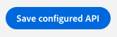
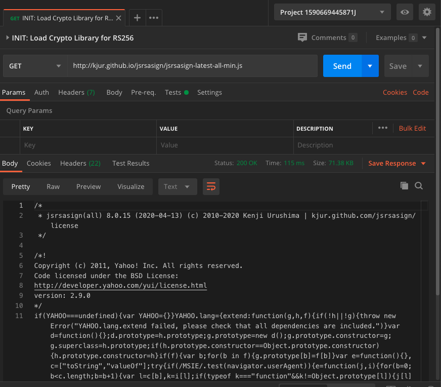
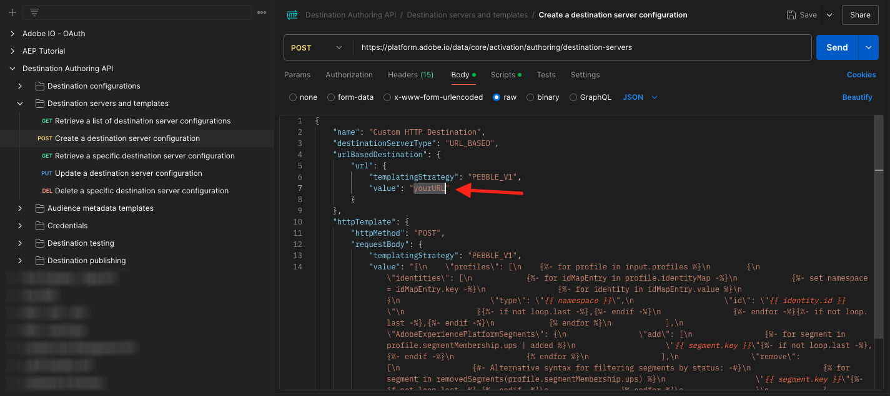

# 2.3.7 SDK delle destinazioni

## 2.3.7.1 Configurare il progetto Adobe I/O

>[!IMPORTANT]
>
>Se hai creato il progetto Adobe I/O dopo dicembre 2021, puoi riutilizzarlo, saltare questo esercizio e passare immediatamente all’esercizio 6.7.2.
>
>Se hai creato il progetto di Adobe I/O prima di dicembre 2021, crea un nuovo progetto per assicurarti che sia compatibile con l’API di authoring delle destinazioni.

In questo esercizio utilizzerai Adobe I/O in modo piuttosto intensivo per eseguire query sulle API di Platform. Per configurare l’Adobe I/O, segui i passaggi seguenti.

Vai a [https://developer.adobe.com/console/home](https://developer.adobe.com/console/projects)


Assicurati di selezionare l’istanza Adobe Experience Platform corretta nell’angolo in alto a destra dello schermo. L&#39;istanza è `--envName--`.


Fare clic su **Crea nuovo progetto**.

 o


Seleziona **+ Aggiungi al progetto** e seleziona **API**.


A questo punto viene visualizzato quanto segue:


Fai clic sull&#39;icona **Adobe Experience Platform**.


Fare clic su **Experience Platform API**.


Fai clic su **Avanti**.


Ora puoi scegliere se far generare la coppia di chiavi di sicurezza da Adobe I/O o caricarne una esistente.

Scegliere **Opzione 1 - Genera una coppia di chiavi**.


Fai clic su **Genera coppia di chiavi**.


Vedrete un giratore per circa 30 secondi.


Visualizzerai quindi questo messaggio e la coppia di chiavi generata verrà scaricata come file zip: **config.zip**.

Decomprimi il file **config.zip** sul desktop e vedrai che contiene 2 file:


- **certificate_pub.crt** è il tuo certificato a chiave pubblica. Dal punto di vista della sicurezza, si tratta del certificato utilizzato liberamente per configurare le integrazioni con le applicazioni online.
- **private.key** è la tua chiave privata. Questo non dovrebbe mai e poi mai essere condiviso con nessuno. La chiave privata è ciò che utilizzi per l’autenticazione nell’implementazione API e che deve essere un segreto. Se condividi la chiave privata con chiunque, può accedere alla tua implementazione e sfruttare l’API per acquisire dati dannosi in Platform ed estrarre tutti i dati presenti in Platform.


Assicurati di salvare il file **config.zip** in un percorso sicuro, in quanto sarà necessario per i passaggi successivi e per l&#39;accesso futuro alle API Adobe I/O e Adobe Experience Platform.

Fai clic su **Avanti**.


Ora devi selezionare i **profili di prodotto** per l&#39;integrazione.

Seleziona i profili di prodotto richiesti.

**FYI**: nell&#39;istanza di Adobe Experience Platform, i profili prodotto avranno un nome diverso. Devi selezionare almeno un profilo di prodotto con i diritti di accesso appropriati, che sono impostati in Adobe Admin Console.


Fare clic su **Salva API configurata**.



Vedrete un giratore per un paio di secondi.


E poi vedrai la tua integrazione.


Fai clic sul pulsante **Scarica per Postman** e quindi su **Account di servizio (JWT)** per scaricare un ambiente Postman (attendi che l&#39;ambiente venga scaricato, l&#39;operazione potrebbe richiedere alcuni secondi).


Scorri verso il basso fino a visualizzare **Account di servizio (JWT)**, che è il luogo in cui puoi trovare tutti i dettagli di integrazione utilizzati per configurare l&#39;integrazione con Adobe Experience Platform.


Il progetto I/O ha un nome generico. È necessario assegnare un nome descrittivo alla tua integrazione. Fai clic su **Progetto 1** (o nome simile) come indicato


Fare clic su **Modifica progetto**.


Immetti un nome e una descrizione per l’integrazione. Come convenzione per i nomi, utilizzeremo `AEP API --aepUserLdap--`. Sostituire ldap con ldap.
Ad esempio, se ldap è vangeluw, il nome e la descrizione dell&#39;integrazione diventano AEP API vangeluw.

Immetti `AEP API --aepUserLdap--` come **Titolo progetto**. Fai clic su **Salva**.


L’integrazione di Adobe I/O è terminata.


## 2.3.7.2 Autenticazione Postman per Adobe I/O

Vai a [https://www.getpostman.com/](https://www.getpostman.com/).

Fai clic su **Inizia**.


Quindi, scarica e installa Postman.


Dopo aver installato Postman, avviare l&#39;applicazione.

In Postman sono disponibili 2 concetti: ambienti e raccolte.

- L’ambiente contiene tutte le variabili ambientali che sono più o meno coerenti. Nell’ambiente, troverai elementi come l’IMSOrg del nostro ambiente Platform, insieme alle credenziali di sicurezza come la tua Chiave privata e altri. Il file dell&#39;ambiente è quello scaricato durante l&#39;Adobe I/O di configurazione dell&#39;esercizio precedente, con il nome seguente: **service.postman_environment.json**.

- La raccolta contiene diverse richieste API che puoi utilizzare. Utilizzeremo 2 raccolte
   - 1 raccolta per l&#39;autenticazione in Adobe I/0
   - 1 Raccolta per gli esercizi in questo modulo
   - 1 raccolta per gli esercizi nel modulo Real-Time CDP, per l’authoring delle destinazioni

Scarica il file [postman.zip](./../../../assets/postman/postman_profile.zip) sul desktop locale.

In questo file **postman.zip**, troverai i seguenti file:

- `_Adobe I-O - Token.postman_collection.json`
- `_Adobe Experience Platform Enablement.postman_collection.json`
- `Destination_Authoring_API.json`

Decomprimi il file **postman.zip** e archivia questi 3 file in una cartella sul desktop, insieme all&#39;ambiente Postman scaricato da Adobe I/O. Devi avere questi 4 file in quella cartella:


Torna a Postman. Fai clic su **Importa**.


Fare clic su **Carica file**.


Passa alla cartella sul desktop in cui sono stati estratti i 4 file scaricati. Selezionare questi 4 file contemporaneamente e fare clic su **Apri**.


Dopo aver fatto clic su **Apri**, Postman ti mostrerà una panoramica dell&#39;ambiente e delle raccolte che stai per importare. Fai clic su **Importa**.


Ora disponi di tutto il necessario in Postman per iniziare a interagire con Adobe Experience Platform tramite le API.

La prima cosa da fare è accertarsi di essere autenticati correttamente. Per essere autenticato, devi richiedere un token di accesso.

Accertati di aver selezionato l’ambiente corretto prima di eseguire qualsiasi richiesta. Per controllare l’ambiente attualmente selezionato, verifica l’elenco a discesa Ambiente nell’angolo in alto a destra.

L’ambiente selezionato deve avere un nome simile a questo:


Fai clic sull&#39;icona **occhio** e quindi su **Modifica** per aggiornare la chiave privata nel file di ambiente.


Poi vedrai questo. Tutti i campi sono precompilati, ad eccezione del campo **PRIVATE_KEY**.


La chiave privata è stata generata al momento della creazione del progetto di Adobe I/O. È stato scaricato come file zip, denominato **config.zip**. Estrai il file zip sul desktop.


Apri la cartella **config** e apri il file **private.key** con l&#39;editor di testo desiderato.


Si vedrà quindi qualcosa di simile a questo, copiare tutto il testo negli Appunti.


Torna a Postman e incolla la chiave privata nei campi accanto alla variabile **PRIVATE_KEY**, per entrambe le colonne **INITIAL VALUE** e **CURRENT VALUE**. Fai clic su **Salva**.


L’ambiente e le raccolte Postman ora sono configurati e funzionanti. Ora puoi eseguire l’autenticazione da Postman a Adobe I/O.

A questo scopo, devi caricare una libreria esterna che si occuperà della crittografia e decrittografia delle comunicazioni. Per caricare questa libreria, è necessario eseguire la richiesta con il nome **INIT: Load Crypto Library for RS256**. Seleziona questa richiesta in **_Adobe I/O - Raccolta token** e la visualizzerai al centro dello schermo.


Fai clic sul pulsante blu **Invia**. Dopo un paio di secondi, dovresti visualizzare una risposta nella sezione **Body** di Postman:



Con la libreria di crittografia ora caricata, possiamo eseguire l&#39;autenticazione in Adobe I/O.

Nella **\_Adobe I/O - raccolta token**, seleziona la richiesta con il nome **IMS: JWT Generate + Auth**. Di nuovo, i dettagli della richiesta saranno visualizzati al centro della schermata.


Fai clic sul pulsante blu **Invia**. Dopo un paio di secondi, dovresti visualizzare una risposta nella sezione **Body** di Postman:


Se la configurazione è andata a buon fine, dovresti vedere una risposta simile che contiene le seguenti informazioni:

| Chiave | Valore |
|:-------------:| :---------------:| 
| token_type | **portatore** |
| access_token | **eyJ4NXUiOiJpbXNfbmEx...QT7mqZkumN1tdsPEioOEl4087Dg** |
| expires_in | **86399973** |

L&#39;Adobe I/O ti ha assegnato un token **bearer**, con un valore specifico (access_token molto lungo) e una finestra di scadenza.

Il token ricevuto è ora valido per 24 ore. Ciò significa che dopo 24 ore, se desideri utilizzare Postman per l’autenticazione in Adobe I/O, dovrai generare un nuovo token eseguendo nuovamente questa richiesta.

## 2.3.7.3 Definire il punto finale e il formato

Per questo esercizio, dovrai configurare un endpoint in modo che, quando un segmento si qualifica, l’evento di qualifica possa essere inviato in streaming a tale endpoint. In questo esercizio utilizzerai un endpoint di esempio utilizzando [https://webhook.site/](https://webhook.site/). Vai a [https://webhook.site/](https://webhook.site/), dove vedrai qualcosa di simile. Fai clic su **Copia negli Appunti** per copiare l&#39;URL. Nel prossimo esercizio dovrai specificare questo URL. L&#39;URL in questo esempio è `https://webhook.site/e0eb530c-15b4-4a29-8b50-e40877d5490a`.


Per quanto riguarda il formato, utilizzeremo un modello standard che trasmetterà in streaming le qualifiche o le non qualifiche dei segmenti insieme a metadati come gli identificatori dei clienti. I modelli possono essere personalizzati per soddisfare le aspettative di endpoint specifici, ma in questo esercizio riutilizzeremo un modello standard, che si tradurrà in un payload come questo che verrà inviato in streaming all’endpoint.

```json
{
  "profiles": [
    {
      "identities": [
        {
          "type": "ecid",
          "id": "64626768309422151580190219823409897678"
        }
      ],
      "AdobeExperiencePlatformSegments": {
        "add": [
          "f58c723c-f1e5-40dd-8c79-7bb4ab47f041"
        ],
        "remove": []
      }
    }
  ]
}
```

## 2.3.7.4 Creare una configurazione di server e modelli

Il primo passaggio per creare una tua destinazione in Adobe Experience Platform consiste nel creare una configurazione di server e modelli.

A tale scopo, passare a **Destination Authoring API**, a **Server e modelli di destinazione** e fare clic per aprire la richiesta **POST - Crea una configurazione del server di destinazione**. Poi vedrai questo. In **Intestazioni**, devi aggiornare manualmente il valore per la chiave **x-sandbox-name** e impostarlo su `--aepSandboxName--`. Selezionare il valore **{{SANDBOX_NAME}}**.


Sostituiscilo con `--aepSandboxName--`.


Quindi, vai a **Corpo**. selezionare il segnaposto **{{body}}**.


Sostituire il segnaposto **{{body}}** con il codice seguente:

```json
{
    "name": "Custom HTTP Destination",
    "destinationServerType": "URL_BASED",
    "urlBasedDestination": {
        "url": {
            "templatingStrategy": "PEBBLE_V1",
            "value": "yourURL"
        }
    },
    "httpTemplate": {
        "httpMethod": "POST",
        "requestBody": {
            "templatingStrategy": "PEBBLE_V1",
            "value": "{\n    \"profiles\": [\n    \n        {\n            \"identities\": [\n            \n            \n                \n                {\n                    \"type\": \"{{ namespace }}\",\n                    \"id\": \"{{ identity.id }}\"\n                },\n                ,\n            \n            ],\n            \"AdobeExperiencePlatformSegments\": {\n                \"add\": [\n                \n                    \"{{ segment.key }}\",\n                \n                ],\n                \"remove\": [\n                {#- Alternative syntax for filtering segments by status: -#}\n                \n                    \"{{ segment.key }}\",\n                \n                ]\n            }\n        },\n    \n    ]\n}"
        },
        "contentType": "application/json"
    }
}
```

Dopo aver incollato il codice precedente, è necessario aggiornare manualmente il campo **urlBasedDestination.url.value** e impostarlo sull&#39;URL del webhook creato nel passaggio precedente, che era `https://webhook.site/e0eb530c-15b4-4a29-8b50-e40877d5490a` in questo esempio.



Dopo aver aggiornato il campo **urlBasedDestination.url.value**, dovrebbe essere simile al seguente. Fai clic su **Invia**.


Dopo aver fatto clic su **Invia**, verrà creato il modello del server e come parte della risposta verrà visualizzato un campo denominato **instanceId**. Scrivilo, come ti servirà nel passaggio successivo. In questo esempio, **instanceId** è
`eb0f436f-dcf5-4993-a82d-0fcc09a6b36c`.


## 2.3.7.5 Creare la configurazione di destinazione

In Postman, in **Destination Authoring API**, vai a **Destination configurations** e fai clic per aprire la richiesta **POST - Create a destination configuration**. Poi vedrai questo. In **Intestazioni**, devi aggiornare manualmente il valore per la chiave **x-sandbox-name** e impostarlo su `--aepSandboxName--`. Selezionare il valore **{{SANDBOX_NAME}}**.


Sostituiscilo con `--aepSandboxName--`.


Quindi, vai a **Corpo**. selezionare il segnaposto **{{body}}**.


Sostituire il segnaposto **{{body}}** con il codice seguente:

```json
{
    "name": "--aepUserLdap-- - Webhook",
    "description": "Exports segment qualifications and identities to a custom webhook via Destination SDK.",
    "status": "TEST",
    "customerAuthenticationConfigurations": [
        {
            "authType": "BEARER"
        }
    ],
    "customerDataFields": [
        {
            "name": "endpointsInstance",
            "type": "string",
            "title": "Select Endpoint",
            "description": "We could manage several instances across the globe for REST endpoints that our customers are provisioned for. Select your endpoint in the dropdown list.",
            "isRequired": true,
            "enum": [
                "US",
                "EU",
                "APAC",
                "NZ"
            ]
        }
    ],
    "uiAttributes": {
        "documentationLink": "https://experienceleague.adobe.com/docs/experience-platform/destinations/home.html?lang=en",
        "category": "streaming",
        "connectionType": "Server-to-server",
        "frequency": "Streaming"
    },
    "identityNamespaces": {
        "ecid": {
            "acceptsAttributes": true,
            "acceptsCustomNamespaces": false
        }
    },
    "segmentMappingConfig": {
        "mapExperiencePlatformSegmentName": true,
        "mapExperiencePlatformSegmentId": true,
        "mapUserInput": false
    },
    "aggregation": {
        "aggregationType": "BEST_EFFORT",
        "bestEffortAggregation": {
            "maxUsersPerRequest": "1000",
            "splitUserById": false
        }
    },
    "schemaConfig": {
        "profileRequired": false,
        "segmentRequired": true,
        "identityRequired": true
    },
    "destinationDelivery": [
        {
            "authenticationRule": "NONE",
            "destinationServerId": "yourTemplateInstanceID"
        }
    ]
}
```


Dopo aver incollato il codice precedente, devi aggiornare manualmente il campo **destinationDelivery. destinationServerId**, e devi impostarlo su **instanceId** del modello del server di destinazione creato nel passaggio precedente, che era `eb0f436f-dcf5-4993-a82d-0fcc09a6b36c` in questo esempio. Fare clic su **Invia**.


Vedrai questa risposta.


La destinazione viene ora creata in Adobe Experience Platform. Andiamo lì e controlliamo.

Vai a [Adobe Experience Platform](https://experience.adobe.com/platform). Dopo aver effettuato l’accesso, accedi alla home page di Adobe Experience Platform.


Prima di continuare, devi selezionare una **sandbox**. La sandbox da selezionare è denominata ``--aepSandboxName--``. A tale scopo, fai clic sul testo **[!UICONTROL Prod produzione]** nella riga blu nella parte superiore dello schermo. Dopo aver selezionato la [!UICONTROL sandbox] appropriata, la schermata verrà modificata e ora sei nella [!UICONTROL sandbox] dedicata.


Nel menu a sinistra, vai a **Destinazioni**, fai clic su **Catalogo** e scorri verso il basso fino alla categoria **Streaming**. La destinazione sarà ora disponibile.


## 2.3.7.6 Collega il segmento alla destinazione

In **Destinazioni** > **Catalogo**, fai clic su **Configura** nella tua destinazione per iniziare ad aggiungere segmenti alla nuova destinazione.


Immettere un token portatore fittizio, ad esempio **1234**. Fai clic su **Connetti alla destinazione**.


Poi vedrai questo. Come nome per la destinazione, utilizzare `--aepUserLdap-- - Webhook`. Seleziona un endpoint di scelta, in questo esempio **EU**. Fai clic su **Avanti**.


È possibile selezionare un criterio di governance dei dati. Fai clic su **Avanti**.


Selezionare il segmento creato in precedenza, denominato `--aepUserLdap-- - Interest in PROTEUS FITNESS JACKSHIRT`. Fai clic su **Avanti**.


Poi vedrai questo. Assicurarsi di mappare il **CAMPO SOURCE** `--aepTenantId--.identification.core.ecid` al campo `Identity: ecid`. Fai clic su **Avanti**.


Fai clic su **Fine**.


La destinazione è ora live, le nuove qualifiche dei segmenti verranno inviate in streaming al tuo webhook personalizzato ora.


## 2.3.7.7 Testare l’attivazione del segmento

Vai a [https://builder.adobedemo.com/projects](https://builder.adobedemo.com/projects). Dopo aver effettuato l’accesso con il tuo Adobe ID, visualizzerai questo. Fai clic sul progetto del tuo sito web per aprirlo.


Ora puoi seguire il flusso seguente per accedere al sito web. Fai clic su **Integrazioni**.


Nella pagina **Integrazioni** è necessario selezionare la proprietà Raccolta dati creata nell&#39;esercizio 0.1.


Poi vedrai il tuo sito web demo aperto. Seleziona l’URL e copialo negli Appunti.


Apri una nuova finestra del browser in incognito.


Incolla l’URL del sito web demo, che hai copiato nel passaggio precedente. Ti verrà quindi chiesto di effettuare l’accesso con il tuo Adobe ID.


Seleziona il tipo di account e completa la procedura di accesso.


Vedrai quindi il tuo sito web caricato in una finestra del browser in incognito. Per ogni dimostrazione, dovrai utilizzare una nuova finestra del browser in incognito per caricare l’URL del sito web demo.


Dalla home page di **Luma**, vai a **Men** e fai clic sul prodotto **CAMICIA FITNESS PROTEUS**.


Hai visitato la pagina dei prodotti per **PROTEUS FITNESS JACKSHIRT**, il che significa che ora potrai qualificarti per il segmento creato in precedenza in questo esercizio.


Quando apri il Visualizzatore profili e vai a **Segmenti**, vedrai il segmento idoneo.


Torna al webhook aperto su [https://webhook.site/](https://webhook.site/), dove dovresti trovare una nuova richiesta in arrivo, proveniente da Adobe Experience Platform, che contiene l&#39;evento di qualificazione del segmento.


Passaggio successivo: [Riepilogo e vantaggi](./summary.md)

[Torna al modulo 2.3](./real-time-cdp-build-a-segment-take-action.md)

[Torna a tutti i moduli](../../../overview.md)
