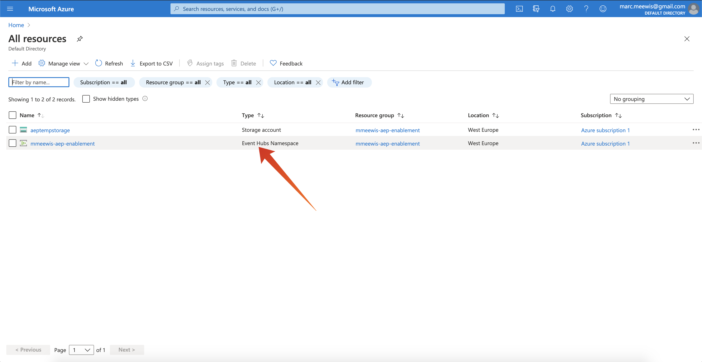

# 2.4.2 Configurare la destinazione dell’hub eventi di Azure in Adobe Experience Platform

## 2.4.2.1 Identifica i parametri di connessione Azure richiesti

Per definire una destinazione dell’hub eventi in Adobe Experience Platform è necessario:

- Spazio dei nomi degli hub eventi
- Hub eventi
- Nome chiave SAS di Azure
- Chiave SAS di Azure

Nell&#39;esercizio precedente sono stati definiti l&#39;hub eventi e lo spazio dei nomi EventHub: [Esercizio 1 - Configurare l&#39;hub eventi in Azure](./ex1.md)

### Spazio dei nomi degli hub eventi

Per cercare le informazioni di cui sopra nel portale di Azure, passare a [https://portal.azure.com/#home](https://portal.azure.com/#home). Assicurati di utilizzare l’account Azure corretto.

Selezionare **Tutte le risorse** nel portale di Azure:

### Hub eventi

Cerca una risorsa con tipo di risorsa **Spazio dei nomi degli hub eventi**. Se hai seguito le convenzioni di denominazione utilizzate nell&#39;esercizio precedente, lo spazio dei nomi degli hub eventi sarà `--aepUserLdap---aep-enablement`. Prendetene nota, ne avrete bisogno nel prossimo esercizio.

Fai clic sul nome dello spazio dei nomi degli hub eventi per ottenere i dettagli:

Seleziona **Hub eventi** per ottenere un elenco di Hub eventi definiti nello spazio dei nomi degli hub eventi. Se hai seguito le convenzioni di denominazione utilizzate nell&#39;esercizio precedente, troverai un hub eventi denominato `--aepUserLdap---aep-enablement-event-hub`. Prendetene nota, ne avrete bisogno nel prossimo esercizio.

### Nome chiave SAS

Seleziona **Criteri di accesso condiviso** per lo spazio dei nomi **Event Hubs**

Verrà visualizzato un elenco dei criteri di accesso condiviso. La chiave SAS cercata è **RootManageSharedAccessKey**. Nome della chiave SAS. Annotatelo.

### Valore chiave SAS

Fare clic su **RootManageSharedAccessKey** per ottenere il valore della chiave SAS. E premi l&#39;icona **Copia negli Appunti** per copiare la **chiave primaria**:

### Riepilogo valori di destinazione

A questo punto, dovresti aver identificato tutti i valori necessari per definire la destinazione dell’hub eventi di Azure in Adobe Experience Platform Real-time CDP.

| Nome attributo di destinazione | Valore attributo di destinazione | Esempio di valore |
|---|---|---|
| sasKeyName | Nome chiave SAS | RootManageSharedAccessKey |
| sasKey | Valore chiave SAS | srREx9ShJG1Rv7f/ |
| namespace | Spazio dei nomi degli hub eventi | `--aepUserLdap---aep-enablement` |
| eventHubName | Hub eventi | `--aepUserLdap---aep-enablement-event-hub` |

## 2.4.2.2 Creare la destinazione dell’hub eventi di Azure in Adobe Experience Platform

Accedi a Adobe Experience Platform da questo URL: [https://experience.adobe.com/platform](https://experience.adobe.com/platform).

Dopo aver effettuato l’accesso, accedi alla home page di Adobe Experience Platform.

Prima di continuare, devi selezionare una **sandbox**. La sandbox da selezionare è denominata ``--aepSandboxName--``. Dopo aver selezionato la sandbox appropriata, la schermata cambia e ora sei nella sandbox dedicata.

Vai a **Destinazioni**, quindi vai a **Catalogo**.

Seleziona **Archiviazione cloud**, vai a **Hub eventi di Azure** e fai clic su **Configura** o **Configura**:

Inserisci i valori di destinazione raccolti nell&#39;esercizio precedente. Fare clic su **Connetti alla destinazione**.

Se le credenziali sono corrette, verrà visualizzata una conferma: **Connesso**.

Immettere il nome e la descrizione nel formato `--aepUserLdap---aep-enablement`. Immetti **eventHubName** (vedi l&#39;esercizio precedente, è simile al seguente: `--aepUserLdap---aep-enablement-event-hub`) e fai clic su **Next**.

Fai clic su **Salva ed esci**.

La destinazione è ora creata e disponibile in Adobe Experience Platform.

Passaggio successivo: [2.4.3 Crea un segmento](./ex3.md)

[Torna al modulo 2.4](./segment-activation-microsoft-azure-eventhub.md)

[Torna a tutti i moduli](./../../../overview.md)
