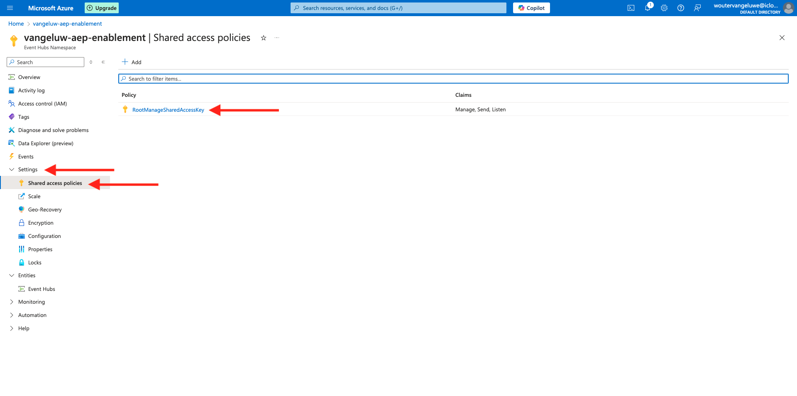
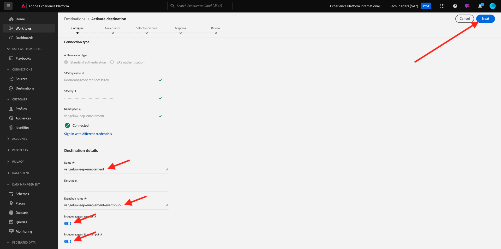

# 2.4.3 Configurare la destinazione dell’hub eventi di Azure in Adobe Experience Platform

## Identificare i parametri di connessione di Azure richiesti

Per configurare una destinazione Hub eventi in Adobe Experience Platform è necessario:

- Spazio dei nomi degli hub eventi
- Hub eventi
- Nome chiave SAS di Azure
- Chiave SAS di Azure

Nell&#39;esercizio precedente sono stati definiti l&#39;hub eventi e lo spazio dei nomi EventHub: [Imposta hub eventi in Azure](./ex2.md)

### Spazio dei nomi degli hub eventi

Per cercare le informazioni di cui sopra nel portale di Azure, passare a [https://portal.azure.com/#home](https://portal.azure.com/#home). Assicurati di utilizzare l’account Azure corretto.

Fai clic su **Tutte le risorse** nel portale di Azure:

Trova il tuo **Spazio dei nomi degli hub eventi** nell&#39;elenco e fai clic su di esso.

Il nome dello spazio dei nomi **Event Hubs** è ora chiaramente visibile. Deve essere simile a `--aepUserLdap---aep-enablement`.

### Hub eventi

Nella pagina **Spazio dei nomi degli hub eventi**, fai clic su **Entità > Hub eventi** per ottenere un elenco di hub eventi definiti nello spazio dei nomi degli hub eventi. Se hai seguito le convenzioni di denominazione utilizzate nell&#39;esercizio precedente, troverai un hub eventi denominato `--aepUserLdap---aep-enablement-event-hub`. Prendetene nota, ne avrete bisogno nel prossimo esercizio.

### Nome chiave SAS

Nella pagina **Spazio dei nomi degli hub eventi**, fai clic su **Impostazioni > Criteri di accesso condiviso**. Verrà visualizzato un elenco dei criteri di accesso condiviso. La chiave SAS che si sta cercando è **RootManageSharedAccessKey**, che è il nome della chiave **SAS. Annotatelo.

### Valore chiave SAS

Fare clic su **RootManageSharedAccessKey** per ottenere il valore della chiave SAS. E premi l&#39;icona **Copia negli Appunti** per copiare la **chiave primaria**, in questo caso `pqb1jEC0KLazwZzIf2gTHGr75Z+PdkYgv+AEhObbQEY=`.

### Riepilogo valori di destinazione

A questo punto, dovresti aver identificato tutti i valori necessari per definire la destinazione dell’hub eventi di Azure in Adobe Experience Platform Real-time CDP.

| Nome attributo di destinazione | Valore attributo di destinazione | Esempio di valore |
|---|---|---|
| sasKeyName | Nome chiave SAS | RootManageSharedAccessKey |
| sasKey | Valore chiave SAS | pqb1jEC0KLazwZzIf2gTHGr75Z+PdkYgv+AEhObbQEY= |
| namespace | Spazio dei nomi degli hub eventi | `--aepUserLdap---aep-enablement` |
| eventHubName | Hub eventi | `--aepUserLdap---aep-enablement-event-hub` |

## Creare la destinazione dell’hub eventi di Azure in Adobe Experience Platform

Accedi a Adobe Experience Platform da questo URL: [https://experience.adobe.com/platform](https://experience.adobe.com/platform).

Dopo aver effettuato l’accesso, accedi alla home page di Adobe Experience Platform.

Prima di continuare, devi selezionare una **sandbox**. La sandbox da selezionare è denominata ``--aepSandboxName--``. Dopo aver selezionato la sandbox appropriata, la schermata cambia e ora sei nella sandbox dedicata.

Vai a **Destinazioni**, quindi vai a **Catalogo**. Seleziona **Archiviazione cloud**, passa a **Azure Event Hubs** e fai clic su **Configura**.

Seleziona **Autenticazione standard**. Compila i dettagli di connessione raccolti nell’esercizio precedente. Fare clic su **Connetti alla destinazione**.

Se le credenziali sono corrette, verrà visualizzata una conferma: **Connesso**.

Immettere il nome e la descrizione nel formato `--aepUserLdap---aep-enablement`. Immetti **eventHubName** (vedi l&#39;esercizio precedente, è simile al seguente: `--aepUserLdap---aep-enablement-event-hub`) e fai clic su **Next**.

È possibile selezionare un criterio di governance dei dati. Fai clic su **Salva ed esci**.

La destinazione è ora creata e disponibile in Adobe Experience Platform.

Passaggio successivo: [2.4.4 Crea un pubblico](./ex4.md)

[Torna al modulo 2.4](./segment-activation-microsoft-azure-eventhub.md)

[Torna a tutti i moduli](./../../../overview.md)
