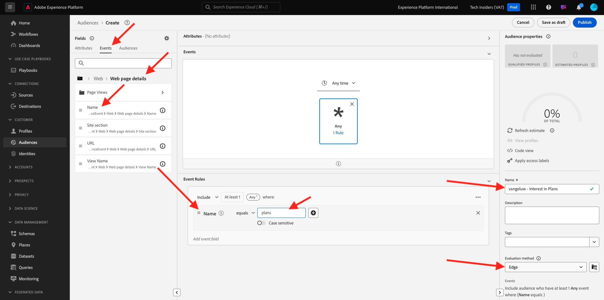
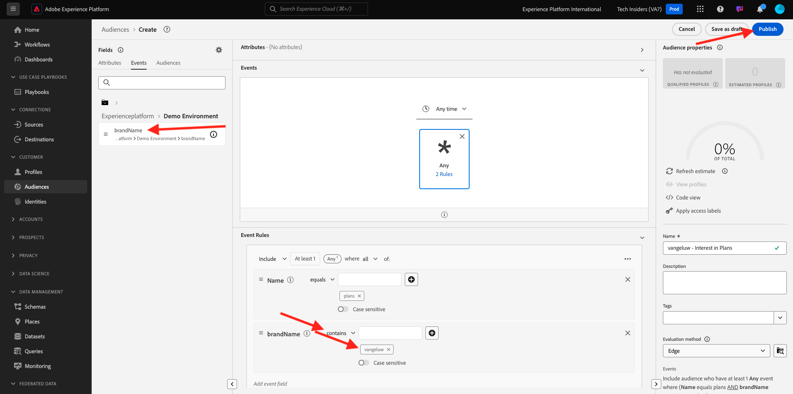

# 2.4.4 Creare un pubblico

## Introduzione

Puoi creare un pubblico semplice:

- **Interesse nei piani** per i quali i clienti si qualificheranno quando visitano la pagina **Piani** del sito Web di dimostrazione di CitiSignal.

### Buono a sapersi

Real-Time CDP attiva un&#39;attivazione su una destinazione quando ti qualifichi per un pubblico che fa parte dell&#39;elenco di attivazione di tale destinazione. In questo caso, il payload di qualificazione del pubblico che verrà inviato a tale destinazione conterrà **tutti i tipi di pubblico per i quali è qualificato il profilo cliente**.

L’obiettivo di questo modulo è mostrare che la qualificazione del pubblico del tuo profilo cliente viene inviata alla destinazione dell’hub eventi in tempo reale.

### Stato del pubblico

Una qualifica di pubblico in Adobe Experience Platform ha sempre una proprietà **status** e può essere una delle seguenti:

- **realized**: indica una nuova qualifica per il pubblico
- **uscita**: indica che il profilo non è più idoneo per il pubblico

## Creare il pubblico

Accedi a Adobe Experience Platform da questo URL: [https://experience.adobe.com/platform](https://experience.adobe.com/platform).

Dopo aver effettuato l’accesso, accedi alla home page di Adobe Experience Platform.

Prima di continuare, devi selezionare una **sandbox**. La sandbox da selezionare è denominata ``--aepSandboxName--``. Dopo aver selezionato la sandbox appropriata, la schermata cambia e ora sei nella sandbox dedicata.

Vai a **Tipi di pubblico**. Fare clic sul pulsante **+ Crea pubblico**.

Seleziona **Genera regola** e fai clic su **Crea**.

Assegna un nome al pubblico `--aepUserLdap-- - Interest in Plans`, imposta il metodo di valutazione su **Edge** e aggiungi il nome della pagina dall&#39;evento esperienza.

Fai clic su **Eventi** e trascina **XDM ExperienceEvent > Web > Dettagli pagina Web > Nome**. Immetti **piani** come valore:

Trascina e rilascia **XDM ExperienceEvent > `--aepTenantId--` > demoEnvironment > brandName**. Immetti `--aepUserLdap--` come valore, imposta il parametro di confronto su **contains** e fai clic su **Publish**:

Il pubblico è ora pubblicato.

Passaggio successivo: [2.4.5 Attiva il pubblico](./ex5.md)

[Torna al modulo 2.4](./segment-activation-microsoft-azure-eventhub.md)

[Torna a tutti i moduli](./../../../overview.md)
