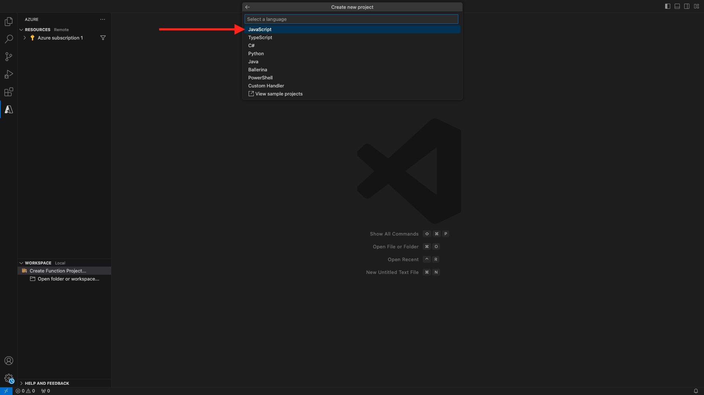

# 2.4.5 Creare il progetto Microsoft Azure

## 2.4.5.1 Introduzione alle funzioni di Azure Event Hub

Funzioni di Azure consente di eseguire piccole parti di codice (denominate **funzioni**) senza preoccuparsi dell&#39;infrastruttura dell&#39;applicazione. Con le funzioni di Azure, l’infrastruttura cloud fornisce tutti i server aggiornati necessari per mantenere l’applicazione in esecuzione su larga scala.

Funzione **attivata** da un tipo specifico di evento. I trigger supportati includono la risposta alle modifiche nei dati, la risposta ai messaggi (ad esempio, Hub eventi), l’esecuzione su una pianificazione o come risultato di una richiesta HTTP.

Azure Functions è un servizio di elaborazione senza server che consente di eseguire codice attivato da evento senza dover eseguire esplicitamente il provisioning o la gestione dell’infrastruttura.

Azure Event Hubs si integra con le funzioni di Azure per un’architettura senza server.

## 2.4.5.2 Aprire il codice Visual Studio e accedere ad Azure

Visual Studio Code semplifica le operazioni di...

- definire e associare le funzioni di Azure agli hub eventi
- test locale
- distribuire in Azure
- esecuzione della funzione di registro remoto

### Apri codice Visual Studio

Per aprire il codice Visual Studio, immettere **visual** nella ricerca del sistema operativo (ricerca in evidenza su OSX, Ricerca nella barra delle applicazioni di Windows). Se non lo trovi, devi ripetere i passaggi descritti nell&#39;[Esercizio 0 - Prerequisiti](./ex0.md).


### Accesso ad Azure

Quando si esegue l&#39;accesso con l&#39;account di Azure utilizzato per la registrazione all&#39;[Esercizio 0 - Prerequisiti](./ex0.md), Visual Studio Code consente di trovare e associare tutte le risorse dell&#39;hub eventi.

Fare clic sull&#39;icona **Azure** in Visual Studio Code. Se non disponi di tale opzione, potrebbe essersi verificato un errore durante l’installazione delle estensioni richieste.

Selezionare **Accedi ad Azure**:


Verrai reindirizzato al browser per accedere. Ricorda di selezionare l’account di Azure utilizzato per la registrazione.


Quando viene visualizzata la seguente schermata nel browser, si è connessi con Visual Code Studio:


Torna a Visual Code Studio (verrà visualizzato il nome della sottoscrizione di Azure, ad esempio **sottoscrizione di Azure 1**):


## 2.4.5.3 Creare un progetto Azure

Quando passi il cursore del mouse su **Sottoscrizione Azure 1**, sopra la sezione viene visualizzato un menu, selezionare **Crea nuovo progetto...**:


Seleziona una cartella locale a tua scelta per salvare il progetto e fai clic su **Seleziona**:


Verrà avviata la procedura guidata per la creazione del progetto. Seleziona **Javascript** come lingua per il progetto:



Seleziona **Trigger dell&#39;hub eventi di Azure** come primo modello di funzione del progetto:


Immettere un nome per la funzione, utilizzare il seguente formato `--aepUserLdap---aep-event-hub-trigger` e premere Invio:


Seleziona **Crea nuova impostazione app locale**:


Selezionare uno spazio dei nomi dell&#39;hub eventi. Dovrebbe essere visualizzato l&#39;hub eventi definito nell&#39;**Esercizio 2**. In questo esempio lo spazio dei nomi dell&#39;hub eventi è **vangeluw-aep-enablement**:


Selezionare l&#39;hub eventi, dovrebbe essere visualizzato l&#39;hub eventi definito nell&#39;esercizio 2 **di** Esercizio. Nel mio caso che è **vangeluw-aep-enablement-event-hub**:


Seleziona **RootManageSharedAccessKey** come criterio dell&#39;hub eventi:


Immetti per utilizzare **$Default**:


Seleziona **Aggiungi all&#39;area di lavoro** per aprire il progetto:


Dopo aver creato il progetto, fai clic su **index.js** per aprire il file nell&#39;editor:


Il payload inviato da Adobe Experience Platform all’hub eventi includerà gli ID segmento:

```json
[{
"segmentMembership": {
"ups": {
"ca114007-4122-4ef6-a730-4d98e56dce45": {
"lastQualificationTime": "2020-08-31T10:59:43Z",
"status": "realized"
},
"be2df7e3-a6e3-4eb4-ab12-943a4be90837": {
"lastQualificationTime": "2020-08-31T10:59:56Z",
"status": "realized"
},
"39f0feef-a8f2-48c6-8ebe-3293bc49aaef": {
"lastQualificationTime": "2020-08-31T10:59:56Z",
"status": "realized"
}
}
},
"identityMap": {
"ecid": [{
"id": "08130494355355215032117568021714632048"
}]
}
}]
```

Sostituire il codice in index.js del codice Visual Studio con il codice seguente. Questo codice verrà eseguito ogni volta che Real-time CDP invia le qualifiche dei segmenti alla destinazione dell’hub eventi. Nel nostro esempio, il codice riguarda solo la visualizzazione e l’ottimizzazione del payload ricevuto. Ma potete immaginare qualsiasi tipo di funzione per elaborare le qualifiche dei segmenti in tempo reale.

```javascript
// Marc Meewis - Solution Consultant Adobe - 2020
// Adobe Experience Platform Enablement - Module 13

// Main function
// -------------
// This azure function is fired for each segment activated to the Adobe Exeperience Platform Real-time CDP Azure 
// Eventhub destination
// This function enriched the received segment payload with the name fo the segment. 
// You can replace this function with any logic that is require to process and deliver
// Adobe Experience Platform segments in real-time to any application or platform that 
// would need to act upon an AEP segment qualiification.
// 

module.exports = async function (context, eventHubMessages) {

    return new Promise (function (resolve, reject) {

        context.log('Message : ' + JSON.stringify(eventHubMessages, null, 2));

        resolve();

    });    

};
```

Il risultato dovrebbe essere simile al seguente:


## 2.4.5.4 Esecuzione del progetto Azure

Ora è il momento di eseguire il progetto. In questa fase, il progetto non verrà distribuito ad Azure. Verrà eseguito localmente in modalità di debug. Seleziona l’icona Esegui e fai clic sulla freccia verde.


La prima volta che esegui un progetto in modalità di debug, dovrai allegare un account di archiviazione Azure e fare clic su **Seleziona account di archiviazione**.


Dall&#39;elenco degli account di archiviazione, selezionare quello creato come parte di [13.1.4 Configurare l&#39;account di archiviazione Azure](./ex1.md). L&#39;account di archiviazione è denominato `--aepUserLdap--aepstorage`, ad esempio **mmeewisaepstorage**.


Il progetto è ora operativo e l’elenco degli eventi nell’hub eventi è attivo. Nel prossimo esercizio dimostrerai sul sito web di dimostrazione Luma il comportamento che ti qualificherà per tali segmenti. Di conseguenza, riceverai un payload di qualificazione del segmento nel terminale della funzione di attivazione dell’hub eventi:


## 2.4.5.5 Arrestare il progetto Azure

Per arrestare il progetto, selezionare la scheda **Terminal**, fare clic nella finestra del terminale e premere **CMD-C** su OSX o **CTRL-C** su Windows:


Passaggio successivo: [2.4.6 Scenario end-to-end](./ex6.md)

[Torna al modulo 2.4](./segment-activation-microsoft-azure-eventhub.md)

[Torna a tutti i moduli](./../../../overview.md)
