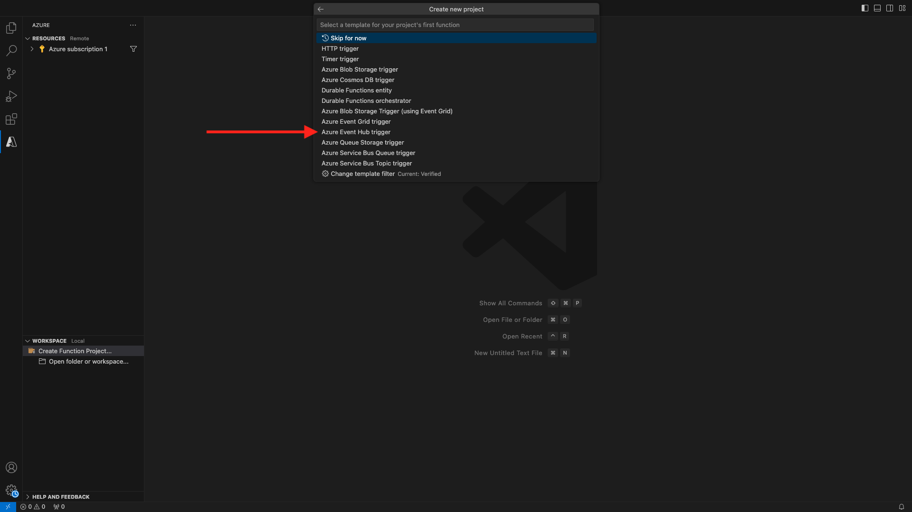
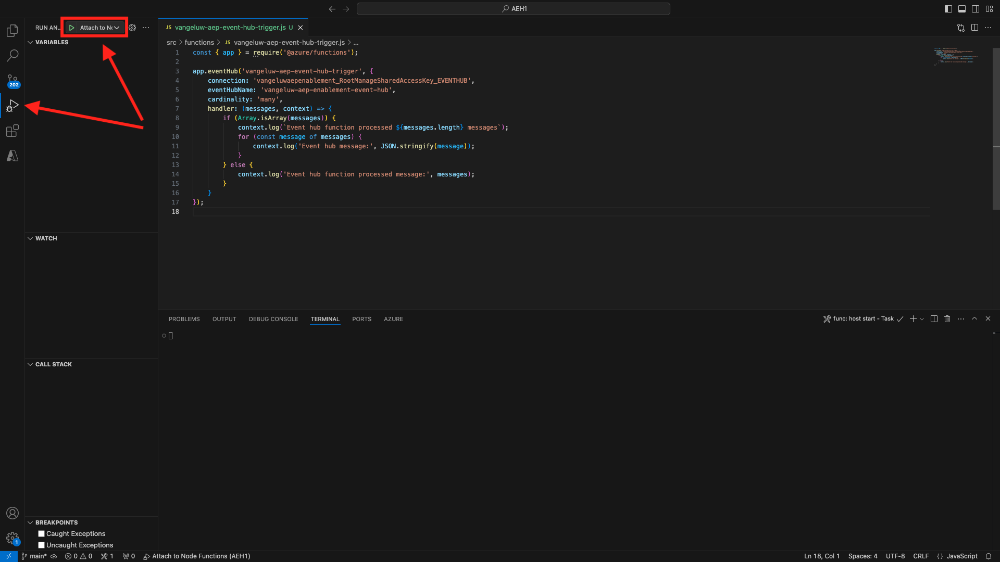

# 2.4.6 Creare il progetto Microsoft Azure

## Acquisizione di familiarità con le funzioni dell’hub eventi di Azure

Le funzioni di Azure consentono di eseguire piccole parti di codice (denominate **funzioni**) senza preoccuparsi dell&#39;infrastruttura dell&#39;applicazione. Con le funzioni di Azure, l’infrastruttura cloud fornisce tutti i server aggiornati necessari per mantenere l’applicazione in esecuzione su larga scala.

Funzione **attivata** da un tipo specifico di evento. I trigger supportati includono la risposta alle modifiche nei dati, la risposta ai messaggi (ad esempio, Hub eventi), l’esecuzione su una pianificazione o come risultato di una richiesta HTTP.

Azure Functions è un servizio di elaborazione senza server che consente di eseguire codice attivato da evento senza dover eseguire esplicitamente il provisioning o la gestione dell’infrastruttura.

Azure Event Hubs si integra con le funzioni di Azure per un’architettura senza server.

## Apri codice Visual Studio e accedi ad Azure

Visual Studio Code semplifica le operazioni di...

- definire e associare le funzioni di Azure agli hub eventi
- test locale
- distribuire in Azure
- esecuzione della funzione di registro remoto

### Apri codice Visual Studio

### Accesso ad Azure

Quando si esegue l&#39;accesso con l&#39;account di Azure utilizzato per la registrazione nell&#39;esercizio precedente, il codice di Visual Studio consente di trovare e associare tutte le risorse dell&#39;hub eventi.

Aprire Visual Studio Code e fare clic sull&#39;icona **Azure**.

Selezionare **Accedi ad Azure**:


Verrai reindirizzato al browser per accedere. Ricorda di selezionare l’account di Azure utilizzato per la registrazione.

Quando viene visualizzata la seguente schermata nel browser, si è connessi con Visual Code Studio:


Torna a Visual Code Studio (verrà visualizzato il nome della sottoscrizione di Azure, ad esempio **sottoscrizione di Azure 1**):


## Creare un progetto Azure

Fare clic su **Crea progetto funzione...**:


Seleziona una cartella locale a tua scelta per salvare il progetto e fai clic su **Seleziona**:


Verrà avviata la procedura guidata per la creazione del progetto. Fai clic su **Javascript** come lingua per il progetto:


Quindi selezionare **Modello v4**.


Seleziona **Trigger dell&#39;hub eventi di Azure** come primo modello di funzione del progetto:



Immettere un nome per la funzione, utilizzare il seguente formato `--aepUserLdap---aep-event-hub-trigger` e premere Invio:


Seleziona **Crea nuova impostazione app locale**:


Fare clic per selezionare lo spazio dei nomi hub eventi creato in precedenza, denominato `--aepUserLdap---aep-enablement`.


Fare quindi clic per selezionare l&#39;hub eventi creato in precedenza, denominato `--aepUserLdap---aep-enablement-event-hub`.


Fai clic per selezionare **RootManageSharedAccessKey** come criterio dell&#39;hub eventi:


Seleziona **Aggiungi all&#39;area di lavoro** per aprire il progetto:


Potresti ricevere un messaggio come questo. In tal caso, fare clic su **Sì, gli autori sono attendibili**.


Dopo aver creato il progetto, fai clic su **index.js** per aprire il file nell&#39;editor:


Il payload inviato da Adobe Experience Platform all’hub eventi includerà gli ID del pubblico:

```json
[{
"segmentMembership": {
"ups": {
"ca114007-4122-4ef6-a730-4d98e56dce45": {
"lastQualificationTime": "2020-08-31T10:59:43Z",
"status": "realized"
},
"be2df7e3-a6e3-4eb4-ab12-943a4be90837": {
"lastQualificationTime": "2020-08-31T10:59:56Z",
"status": "realized"
},
"39f0feef-a8f2-48c6-8ebe-3293bc49aaef": {
"lastQualificationTime": "2020-08-31T10:59:56Z",
"status": "realized"
}
}
},
"identityMap": {
"ecid": [{
"id": "08130494355355215032117568021714632048"
}]
}
}]
```

Sostituire il codice in index.js del codice Visual Studio con il codice seguente. Questo codice verrà eseguito ogni volta che Real-time CDP invia i requisiti del pubblico alla destinazione dell’hub eventi. Nel nostro esempio, il codice riguarda solo la visualizzazione e l’ottimizzazione del payload ricevuto. Ma potete immaginare qualsiasi tipo di funzione per elaborare le qualifiche del pubblico in tempo reale.

```javascript
// Marc Meewis - Solution Consultant Adobe - 2020
// Adobe Experience Platform Enablement - Module 2.4

// Main function
// -------------
// This azure function is fired for each audience activated to the Adobe Exeperience Platform Real-time CDP Azure 
// Eventhub destination
// This function enriched the received audience payload with the name of the audience. 
// You can replace this function with any logic that is require to process and deliver
// Adobe Experience Platform audiences in real-time to any application or platform that 
// would need to act upon an AEP audience qualification.
// 

module.exports = async function (context, eventHubMessages) {

    return new Promise (function (resolve, reject) {

        context.log('Message : ' + JSON.stringify(eventHubMessages, null, 2));

        resolve();

    });    

};
```

Il risultato dovrebbe essere simile al seguente:


## Esegui progetto Azure

Ora è il momento di eseguire il progetto. In questa fase, il progetto non verrà distribuito ad Azure. Verrà eseguito localmente in modalità di debug. Seleziona l’icona Esegui e fai clic sulla freccia verde.



La prima volta che esegui il progetto in modalità di debug, dovrai allegare un account di archiviazione Azure, fare clic su **Seleziona account di archiviazione** e quindi selezionare l&#39;account di archiviazione creato in precedenza, denominato `--aepUserLdap--aepstorage`.

Il progetto è ora operativo e l’elenco degli eventi nell’hub eventi è attivo. Nell&#39;esercizio successivo verrà illustrato il comportamento sul sito Web di dimostrazione di CitiSignal che risulterà idoneo per i tipi di pubblico. Di conseguenza, riceverai un payload di qualificazione del pubblico nel terminale della funzione di attivazione dell’hub eventi.


## Arresta progetto Azure

Per arrestare il progetto, vai al lenu **STACK CHIAMATE** in VSC, fai clic sulla freccia del progetto in esecuzione, quindi fai clic su **Interrompi**.


Passaggio successivo: [2.4.7 Scenario end-to-end](./ex7.md)

[Torna al modulo 2.4](./segment-activation-microsoft-azure-eventhub.md)

[Torna a tutti i moduli](./../../../overview.md)
