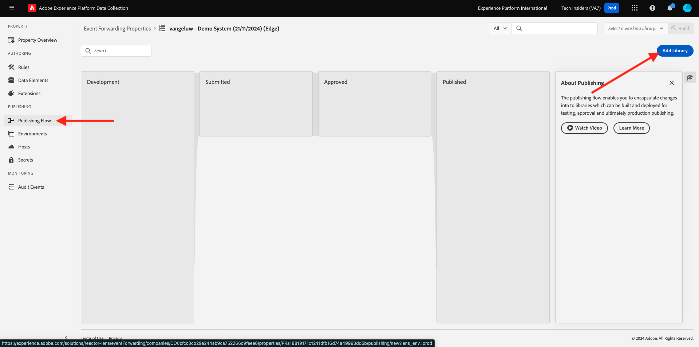
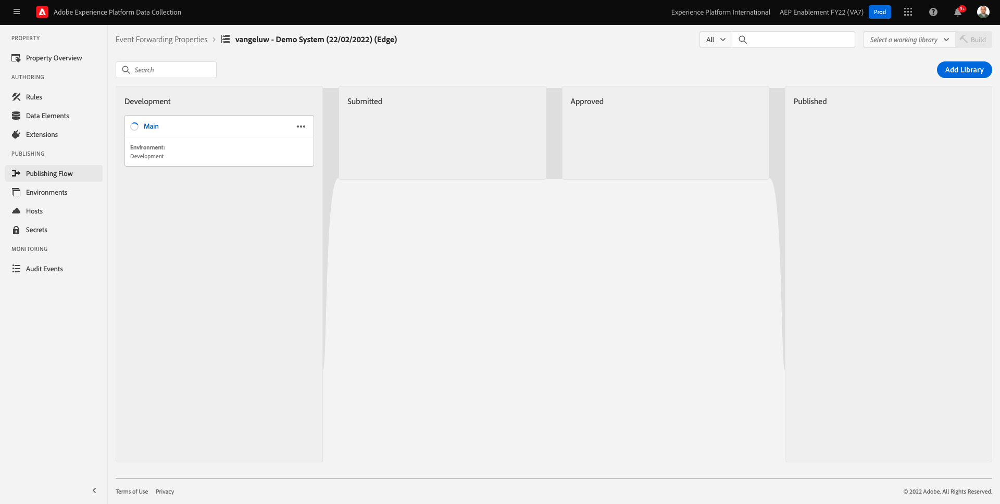

# 2.5.1 Creare una proprietà Inoltro eventi raccolta dati di Adobe Experience Platform

>[!NOTE]
>
>L&#39;estensione Adobe Experience Platform Edge per dispositivi mobili è attualmente in BETA. L’utilizzo di questa estensione è consentito solo su invito. Contatta il tuo Customer Success Manager Adobe per ulteriori informazioni e per accedere ai materiali per questa esercitazione.

## 2.5.1.1 Cos’è una proprietà di inoltro degli eventi di raccolta dati di Adobe Experience Platform?

In genere, quando i dati vengono raccolti utilizzando Raccolta dati di Adobe Experience Platform, vengono raccolti sul **lato client**. **Client Side** è un ambiente come un sito Web o un&#39;app mobile. Nei moduli 0 e 1, la configurazione di una proprietà del client di raccolta dati di Adobe Experience Platform è stata discussa in modo approfondito e hai implementato tale proprietà del client di raccolta dati di Adobe Experience Platform sul tuo sito web e sulla tua app mobile, in modo che i dati possano essere raccolti lì quando un cliente interagisce con il sito web e l’app mobile.

Quando i dati di interazione vengono raccolti dalla proprietà Client di raccolta dati di Adobe Experience Platform, il sito web o l’app mobile invia una richiesta all’Edge di Adobe. Edge è l’ambiente di raccolta dati di Adobe ed è il punto di ingresso per i dati di click-stream nell’ecosistema Adobe. Da Edge, i dati raccolti vengono quindi inviati ad applicazioni come Adobe Experience Platform, Adobe Analytics, Adobe Audience Manager o Adobe Target.

Con l’aggiunta di una proprietà Adobe Experience Platform Data Collection Event Forwarding, ora è possibile configurare una proprietà Adobe Experience Platform Data Collection che ascolta i dati in arrivo su Edge. Quando la proprietà Inoltro eventi raccolta dati di Adobe Experience Platform in esecuzione su Edge vede i dati in arrivo, può utilizzarli e inoltrarli a un’altra posizione. Che da qualche altra parte ora può essere anche un webhook esterno non Adobe, che consente di inviare tali dati ad esempio al tuo data lake di scelta, a un’applicazione decisionale o a qualsiasi altra applicazione che ha la capacità di aprire un webhook.

La configurazione di una proprietà di Inoltro eventi raccolta dati di Adobe Experience Platform ha un aspetto familiare con una proprietà Client, con la possibilità di configurare elementi dati e regole come in passato con le proprietà Client raccolta dati di Adobe Experience Platform. Tuttavia, il modo in cui i dati saranno accessibili e utilizzati sarà leggermente diverso, a seconda del caso d’uso.

Iniziamo creando la proprietà Inoltro eventi raccolta dati di Adobe Experience Platform.

## 2.5.1.2 Creare una proprietà Inoltro eventi raccolta dati di Adobe Experience Platform

Vai a [https://experience.adobe.com/#/data-collection/](https://experience.adobe.com/it#/data-collection/). Nel menu a sinistra, fai clic su **Inoltro eventi**. Viene quindi visualizzata una panoramica di tutte le proprietà di inoltro degli eventi di raccolta dati di Adobe Experience Platform disponibili. Fare clic sul pulsante **Nuova proprietà**.

È ora necessario immettere un nome per la proprietà Inoltro eventi raccolta dati di Adobe Experience Platform. Come convenzione di denominazione, utilizzare `--aepUserLdap-- - Demo System (DD/MM/YYYY) (Edge)`. In questo esempio, il nome è **vangeluw - Demo System (22/02/2022) (Edge)**. Fai clic su **Salva**.

Tornerai quindi all’elenco delle proprietà di Inoltro eventi raccolta dati di Adobe Experience Platform. Fai clic su per aprire la proprietà appena creata.

## 2.5.1.2 Configurare l’estensione Adobe Cloud Connector

Nel menu a sinistra, vai a **Estensioni**. L&#39;estensione **Core** è già configurata.

Vai a **Catalogo**. Verrà visualizzata l&#39;estensione **Adobe Cloud Connector**. Fai clic su **Installa** per installarlo.

L’estensione verrà quindi aggiunta. Nessuna configurazione da eseguire in questo passaggio. Ti verrà inviata nuovamente la panoramica delle estensioni installate.

## 2.5.1.3 Distribuire la proprietà Inoltro eventi raccolta dati di Adobe Experience Platform

Nel menu a sinistra, vai a **Flusso di pubblicazione**. Fare clic su **Aggiungi libreria**.

Immetti il nome **Principale**, seleziona l&#39;ambiente **Sviluppo (sviluppo)** e fai clic su **+ Aggiungi tutte le risorse modificate**.

Poi vedrai questo. Fai clic su **Salva e genera per sviluppo**.

La libreria verrà quindi generata e potrebbe richiedere 1-2 minuti.

Finalmente la libreria sarà creata e pronta.

Passaggio successivo: [2.5.2 Aggiorna lo stream di dati per rendere disponibili i dati per la proprietà di inoltro degli eventi di raccolta dati](./ex2.md)

[Torna al modulo 2.5](./aep-data-collection-ssf.md)

[Torna a tutti i moduli](./../../../overview.md)
