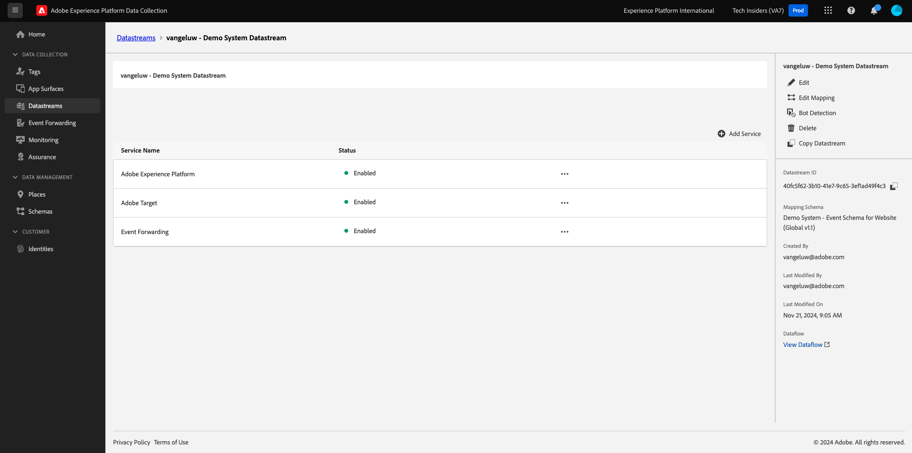

# 2.5.2 Aggiorna lo stream di dati per rendere i dati disponibili per la proprietà Adobe Experience Platform Data Collection Server

## Aggiornare lo stream di dati

In [Guida introduttiva](./../../gettingstarted/gettingstarted/ex2.md), hai creato il tuo **[!UICONTROL Datastream]**. È stato quindi utilizzato il nome `--aepUserLdap-- - Demo System Datastream`.

In questo esercizio, devi configurare **[!UICONTROL Datastream]** in modo che funzioni con la proprietà **Data Collection Server**.

Per eseguire questa operazione, vai a [https://experience.adobe.com/#/data-collection/](https://experience.adobe.com/it#/data-collection/). Poi vedrai questo. Nel menu a sinistra, fai clic su **[!UICONTROL Datastreams]**.

Nell&#39;angolo in alto a destra dello schermo, seleziona il nome della sandbox, che dovrebbe essere `--aepSandboxName--`.

Cerca il **[!UICONTROL flusso di dati]**, denominato `--aepUserLdap-- - Demo System Datastream`. Fai clic sul **[!UICONTROL Datastream]** per aprirlo.

Poi vedrai questo. Fare clic su **[!UICONTROL + Aggiungi servizio]**.

Selezionare il servizio **Inoltro eventi**. Verranno visualizzate 2 impostazioni aggiuntive. Selezionare la proprietà Inoltro eventi creata nell&#39;esercizio precedente e denominata `--aepUserLdap-- - Demo System (DD/MM/YYYY) (Edge)`. Quindi seleziona **Sviluppo** in **Ambiente**. Fai clic su **Salva**.

Lo stream di dati è stato aggiornato ed è pronto per l’utilizzo.

Lo stream di dati è ora pronto per funzionare con **[!DNL Event Forwarding property]**.

Passaggio successivo: [2.5.3 Crea e configura un webhook personalizzato](./ex3.md)

[Torna al modulo 2.5](./aep-data-collection-ssf.md)

[Torna a tutti i moduli](./../../../overview.md)
