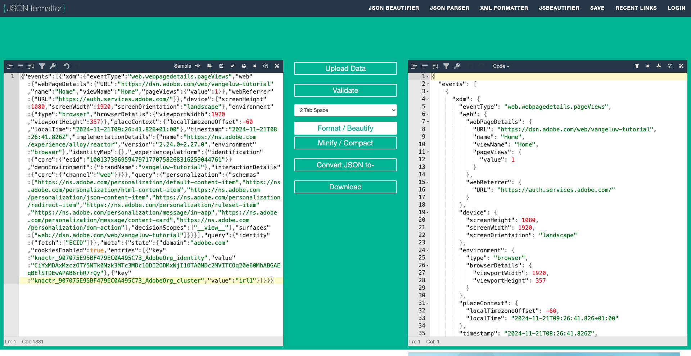

# 2.5.3 Creare e configurare un webhook personalizzato

## Creare un webhook personalizzato

Vai a [https://pipedream.com/requestbin](https://pipedream.com/requestbin). Hai già utilizzato questa applicazione nell&#39;SDK [Esercizio 2.3.7 Destinazioni](./../../../modules/rtcdp-b2c/module2.3/ex7.md)

Se non hai ancora utilizzato tale servizio, crea un account e quindi un’area di lavoro. Una volta creata l’area di lavoro, verrà visualizzato qualcosa di simile a questo.

Fai clic su **copia** per copiare l&#39;URL. Nel prossimo esercizio dovrai specificare questo URL. L&#39;URL in questo esempio è `https://eodts05snjmjz67.m.pipedream.net`.

Questo webhook è stato creato dal sito Web e sarà possibile configurarlo nel **[!DNL Event Forwarding property]** per iniziare a testare l&#39;inoltro degli eventi.

## Aggiornare la proprietà di inoltro degli eventi: creare un elemento dati

Vai a [https://experience.adobe.com/#/data-collection/](https://experience.adobe.com/it#/data-collection/) e vai a **Inoltro eventi**. Cerca nella proprietà Inoltro eventi e fai clic su di essa per aprirla.

Nel menu a sinistra, vai a **Elementi dati**. Fai clic su **Crea nuovo elemento dati**.

Viene quindi visualizzato un nuovo elemento dati da configurare.

Effettua la seguente selezione:

- Come **Nome**, immetti **Evento XDM**.
- Come **Estensione**, seleziona **Core**.
- Come **Tipo elemento dati**, selezionare **Percorso**.
- Come **Percorso**, seleziona **Leggi dati da XDM (arc.event.xdm)**. Selezionando questo percorso, escluderai la sezione **XDM** dal payload dell&#39;evento inviato dal sito Web o dall&#39;app mobile all&#39;interno di Adobe Edge.

Ora avrai questo. Fai clic su **Salva**.

>[!NOTE]
>
>Nel percorso precedente viene fatto riferimento a **arc**. **arc** sta per Contesto risorsa Adobe e **arc** sta sempre per l&#39;oggetto disponibile più alto disponibile nel contesto lato server. È possibile aggiungere arricchimenti e trasformazioni all&#39;oggetto **arc** utilizzando le funzioni del server di raccolta dati di Adobe Experience Platform.
>
>Nel percorso precedente viene fatto riferimento a **event**. **event** rappresenta un evento univoco e Adobe Experience Platform Data Collection Server valuterà sempre ogni evento singolarmente. A volte è possibile che venga visualizzato un riferimento a **eventi** nel payload inviato dal lato client di Web SDK, ma nel server di raccolta dati di Adobe Experience Platform ogni evento viene valutato singolarmente.

## Aggiorna la proprietà del server di raccolta dati di Adobe Experience Platform: creazione di una regola

Nel menu a sinistra, vai a **Regole**. Fai clic su **Crea nuova regola**.

Viene quindi visualizzata una nuova regola da configurare. Immetti **Nome**: **Tutte le pagine**. Per questo esercizio non sarà necessario configurare una condizione. Viene invece impostata un&#39;azione. Fai clic sul pulsante **+ Aggiungi** in **Azioni**.

Poi vedrai questo. Effettua la seguente selezione:

- Seleziona l&#39;**estensione**: **Connettore cloud Adobe**.
- Seleziona il **Tipo azione**: **Effettua chiamata di recupero**.

Questo dovrebbe darti **Nome**: **Connettore Adobe Cloud - Effettua una chiamata di recupero**. Ora dovresti vedere:

Quindi, configura quanto segue:

- Cambia il metodo di richiesta da GET a **POST**
- Immettere l&#39;URL del webhook personalizzato creato in uno dei passaggi precedenti, ovvero `https://eodts05snjmjz67.m.pipedream.net`

Ora dovresti avere questo. Quindi, vai a **Corpo**.

Poi vedrai questo. Fai clic sull’icona dell’elemento dati come indicato di seguito.

Nel popup, seleziona l&#39;elemento dati **XDM Event** creato nel passaggio precedente. Fai clic su **Seleziona**.

Poi vedrai questo. Fai clic su **Mantieni modifiche**.

Poi vedrai questo. Fai clic su **Salva**.

Hai configurato la prima regola in una proprietà di Inoltro eventi. Vai a **Flusso di pubblicazione** per pubblicare le modifiche.
Apri la libreria di sviluppo **Principale** facendo clic su **Modifica** come indicato.

Fai clic sul pulsante **Aggiungi tutte le risorse modificate**, dopo di che la regola e l&#39;elemento dati verranno visualizzati in questa libreria. Fare clic su **Salva e genera per sviluppo**. Le modifiche sono ora in fase di implementazione.

Dopo un paio di minuti, vedrai che l’implementazione è completata e pronta per essere testata.

## Verifica la configurazione

Vai a [https://dsn.adobe.com](https://dsn.adobe.com). Dopo aver effettuato l’accesso con il tuo Adobe ID, visualizzerai questo. Fai clic sui tre punti **...** del progetto del sito Web, quindi fai clic su **Esegui** per aprirlo.

Poi vedrai il tuo sito web demo aperto. Seleziona l’URL e copialo negli Appunti.

Apri una nuova finestra del browser in incognito.

Incolla l’URL del sito web demo, che hai copiato nel passaggio precedente. Ti verrà quindi chiesto di effettuare l’accesso con il tuo Adobe ID.

Seleziona il tipo di account e completa la procedura di accesso.

Vedrai quindi il tuo sito web caricato in una finestra del browser in incognito. Per ogni esercizio, dovrai utilizzare una nuova finestra del browser in incognito per caricare l’URL del sito web demo.

Quando apri la visualizzazione per sviluppatori del browser, puoi esaminare le richieste di rete come indicato di seguito. Quando utilizzi il filtro **interact**, vengono visualizzate le richieste di rete inviate dal client di raccolta dati di Adobe Experience Platform ad Adobe Edge.

Se selezioni il payload non elaborato, passa a [https://jsonformatter.org/json-pretty-print](https://jsonformatter.org/json-pretty-print) e incolla il payload. Fare clic su **Minimizza / Bellissima**. Vedrai quindi il payload JSON, l&#39;oggetto **events** e l&#39;oggetto **xdm**. In uno dei passaggi precedenti, quando hai definito l&#39;elemento dati, hai utilizzato il riferimento **arc.event.xdm**, che ti porterà ad analizzare l&#39;oggetto **xdm** di questo payload.

Passa al webhook personalizzato [https://pipedream.com/requestbin](https://pipedream.com/requestbin) utilizzato in uno dei passaggi precedenti. Ora dovresti avere una visualizzazione simile a questa, con le richieste di rete visualizzate nel menu a sinistra. Stai visualizzando il payload **xdm** filtrato dalla richiesta di rete mostrata sopra.

Scorrere verso il basso un bit del payload per trovare il nome della pagina, che in questo caso è **home**.

Se ora esplori il sito web, vedrai ulteriori richieste di rete disponibili in tempo reale su questo webhook personalizzato.

Ora hai configurato il server side Event Forwarding dei payload Web SDK/XDM su un webhook personalizzato esterno. Nei prossimi esercizi configurerai un approccio simile e invierai gli stessi dati a Google Cloud Platform e AWS.

Passaggio successivo: [2.5.4 Inoltra gli eventi a GCP Pub/Sub](./ex4.md)

[Torna al modulo 2.5](./aep-data-collection-ssf.md)

[Torna a tutti i moduli](./../../../overview.md)
