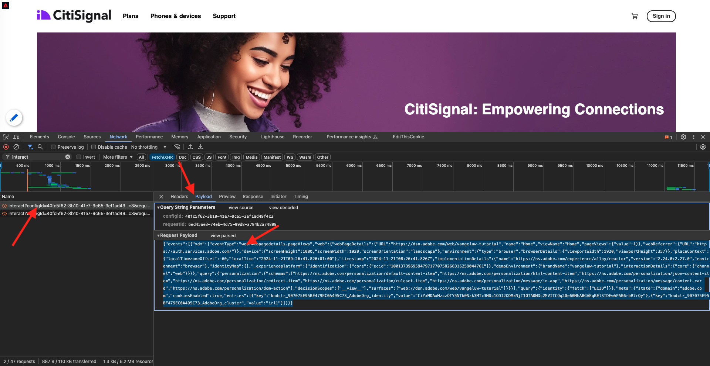

# 2.5.4 Creazione e configurazione di una funzione cloud di Google

## 2.5.4.1 Creare la funzione cloud di Google

Vai a [https://console.cloud.google.com/](https://console.cloud.google.com/). Vai a **Funzioni cloud**.


Poi vedrai questo. Fare clic su **CREA FUNZIONE**.


Poi vedrai questo.


Effettua le seguenti scelte:

- **Nome funzione**: `--aepUserLdap---event-forwarding`
- **Area geografica**: selezionare qualsiasi area geografica
- **Tipo trigger**: selezionare **HTTP**
- **Autenticazione**: selezionare **Consenti chiamate non autenticate**

Ora dovresti avere questo. Fai clic su **SALVA**.


Fai clic su **AVANTI**.


A questo punto viene visualizzato quanto segue:


Effettua le seguenti scelte:

- **Runtime**: seleziona **Node.js 16** (o più recente)
- **Punto di ingresso**: immettere **helloAEP**

Fare clic su **ABILITA API** per abilitare **Cloud Build API**. Verrà visualizzata una nuova finestra. Nella nuova finestra, fai di nuovo clic su **ABILITA**.


Poi vedrai questo. Fare clic su **Abilita**.


Una volta abilitata l&#39;API **Cloud Build**, verrà visualizzato questo messaggio.


Torna alla **funzione cloud**.
Nell’editor in linea della funzione cloud, accertati di avere il seguente codice:

```javascript
/**
 * Responds to any HTTP request.
 *
 * @param {!express:Request} req HTTP request context.
 * @param {!express:Response} res HTTP response context.
 */
exports.helloAEP = (req, res) => {
  let message = req.query.message || req.body.message || 'Hello World!';
  res.status(200).send(message);
};
```

Fare clic su **DISTRIBUISCI**.


Poi vedrai questo. È in corso la creazione della funzione cloud. L&#39;operazione potrebbe richiedere alcuni minuti.


Una volta creata ed eseguita la funzione, visualizzerai questa schermata. Fai clic sul nome della funzione per aprirla.


Poi vedrai questo. Vai a **TRIGGER**. Verrà quindi visualizzato l&#39;**URL trigger**, che è ciò che verrà utilizzato per definire l&#39;endpoint in Launch Server Side.


Copia l&#39;URL del trigger, che si presenta così: **https://europe-west1-dazzling-pillar-273812.cloudfunctions.net/vangeluw-event-forwarding**.

Nei passaggi successivi, configurerai Adobe Experience Platform Data Collection Server per inviare informazioni specifiche sulle **Visualizzazioni pagina** alla funzione Google Cloud. Invece di inoltrare il payload completo così com&#39;è, invierai solo elementi come **ECID**, **timestamp** e **Nome pagina** alla funzione Google Cloud.

Di seguito è riportato un esempio di payload che è necessario analizzare per filtrare le variabili sopra indicate:

```json
{
  "events": [
    {
      "xdm": {
        "eventType": "web.webpagedetails.pageViews",
        "web": {
          "webPageDetails": {
            "URL": "https://builder.adobedemo.com/run/vangeluw-OCUC",
            "name": "vangeluw-OCUC",
            "viewName": "vangeluw-OCUC",
            "pageViews": {
              "value": 1
            }
          },
          "webReferrer": {
            "URL": "https://builder.adobedemo.com/run/vangeluw-OCUC/equipment"
          }
        },
        "device": {
          "screenHeight": 1080,
          "screenWidth": 1920,
          "screenOrientation": "landscape"
        },
        "environment": {
          "type": "browser",
          "browserDetails": {
            "viewportWidth": 1920,
            "viewportHeight": 451
          }
        },
        "placeContext": {
          "localTime": "2022-02-23T06:51:07.140+01:00",
          "localTimezoneOffset": -60
        },
        "timestamp": "2022-02-23T05:51:07.140Z",
        "implementationDetails": {
          "name": "https://ns.adobe.com/experience/alloy/reactor",
          "version": "2.8.0+2.9.0",
          "environment": "browser"
        },
        "_experienceplatform": {
          "identification": {
            "core": {
              "ecid": "08346969856929444850590365495949561249"
            }
          },
          "demoEnvironment": {
            "brandName": "vangeluw-OCUC"
          },
          "interactionDetails": {
            "core": {
              "channel": "web"
            }
          }
        }
      },
      "query": {
        "personalization": {
          "schemas": [
            "https://ns.adobe.com/personalization/html-content-item",
            "https://ns.adobe.com/personalization/json-content-item",
            "https://ns.adobe.com/personalization/redirect-item",
            "https://ns.adobe.com/personalization/dom-action"
          ],
          "decisionScopes": [
            "eyJ4ZG06YWN0aXZpdHlJZCI6Inhjb3JlOm9mZmVyLWFjdGl2aXR5OjE0YzA1MjM4MmUxYjY1MDUiLCJ4ZG06cGxhY2VtZW50SWQiOiJ4Y29yZTpvZmZlci1wbGFjZW1lbnQ6MTRiZjA5ZGM0MTkwZWJiYSJ9",
            "__view__"
          ]
        }
      }
    }
  ],
  "query": {
    "identity": {
      "fetch": [
        "ECID"
      ]
    }
  },
  "meta": {
    "state": {
      "domain": "adobedemo.com",
      "cookiesEnabled": true,
      "entries": [
        {
          "key": "kndctr_907075E95BF479EC0A495C73_AdobeOrg_identity",
          "value": "CiYwODM0Njk2OTg1NjkyOTQ0NDg1MDU5MDM2NTQ5NTk0OTU2MTI0OVIPCPn66KfyLxgBKgRJUkwx8AH5-uin8i8="
        },
        {
          "key": "kndctr_907075E95BF479EC0A495C73_AdobeOrg_consent_check",
          "value": "1"
        },
        {
          "key": "kndctr_907075E95BF479EC0A495C73_AdobeOrg_consent",
          "value": "general=in"
        }
      ]
    }
  }
}
```

Questi sono i campi che contengono le informazioni da analizzare:

- ECID: **events.xdm._experienceplatform.identifier.core.ecid**
- timestamp: **timestamp**
- Nome pagina: **events.xdm.web.webPageDetails.name**

Passiamo ora a Adobe Experience Platform Data Collection Server per configurare gli elementi dati in modo da rendere possibile questa operazione.

## 2.5.4.2 Aggiorna la proprietà di Inoltro eventi: Elementi dati

Vai a [https://experience.adobe.com/#/data-collection/](https://experience.adobe.com/it#/data-collection/) e vai a **Inoltro eventi**. Cerca nella proprietà Inoltro eventi e fai clic su di essa per aprirla.


Nel menu a sinistra, vai a **Elementi dati**. Fare clic su **Aggiungi elemento dati**.


Viene quindi visualizzato un nuovo elemento dati da configurare.


Effettua la seguente selezione:

- Come **Nome**, immetti **customerECID**.
- Come **Estensione**, seleziona **Core**.
- Come **Tipo elemento dati**, selezionare **Percorso**.
- Come **Percorso**, immetti `arc.event.xdm.--aepTenantId--.identification.core.ecid`. Immettendo questo percorso, escluderai il campo **ecid** dal payload dell&#39;evento inviato dal sito Web o dall&#39;app mobile a Adobe Edge.

>[!NOTE]
>
>Nei percorsi sopra e sotto viene fatto riferimento a **arc**. **arc** sta per Contesto risorsa Adobe e **arc** sta sempre per l&#39;oggetto disponibile più alto disponibile nel contesto lato server. È possibile aggiungere arricchimenti e trasformazioni all&#39;oggetto **arc** utilizzando le funzioni del server di raccolta dati di Adobe Experience Platform.
>
>Nei percorsi sopra e sotto viene fatto riferimento a **event**. **event** rappresenta un evento univoco e Adobe Experience Platform Data Collection Server valuterà sempre ogni evento singolarmente. A volte è possibile che venga visualizzato un riferimento a **eventi** nel payload inviato dal lato client di Web SDK, ma nel server di raccolta dati di Adobe Experience Platform ogni evento viene valutato singolarmente.

Ora avrai questo. Fai clic su **Salva**.


Fare clic su **Aggiungi elemento dati**.


Viene quindi visualizzato un nuovo elemento dati da configurare.


Effettua la seguente selezione:

- Come **Nome**, immetti **eventTimestamp**.
- Come **Estensione**, seleziona **Core**.
- Come **Tipo elemento dati**, selezionare **Percorso**.
- Come **Percorso**, immetti **arc.event.xdm.timestamp**. Immettendo questo percorso, escluderai il campo **timestamp** dal payload dell&#39;evento inviato dal sito Web o dall&#39;app mobile a Adobe Edge.

Ora avrai questo. Fai clic su **Salva**.


Fare clic su **Aggiungi elemento dati**.


Viene quindi visualizzato un nuovo elemento dati da configurare.


Effettua la seguente selezione:

- Come **Nome**, immetti **NomePagina**.
- Come **Estensione**, seleziona **Core**.
- Come **Tipo elemento dati**, selezionare **Percorso**.
- Come **Percorso**, immetti **arc.event.xdm.web.webPageDetails.name**. Immettendo questo percorso, escluderai il campo **name** dal payload dell&#39;evento inviato dal sito Web o dall&#39;app mobile a Adobe Edge.

Ora avrai questo. Fai clic su **Salva**.


Ora hai creato questi elementi dati:


## 2.5.4.3 Aggiornare la proprietà Inoltro eventi: Aggiornare una regola

Nel menu a sinistra, vai a **Regole**. Nell&#39;esercizio precedente hai creato la regola **Tutte le pagine**. Fai clic su quella regola per aprirla.


Allora questo lo farai. Fai clic sull&#39;icona **+** in **Azioni** per aggiungere una nuova azione.


Poi vedrai questo.


Effettua la seguente selezione:

- Seleziona l&#39;**estensione**: **Connettore cloud Adobe**.
- Seleziona il **Tipo azione**: **Effettua chiamata di recupero**.

Questo dovrebbe darti **Nome**: **Connettore Adobe Cloud - Effettua una chiamata di recupero**. Ora dovresti vedere:


Quindi, configura quanto segue:

- Modifica il protocollo della richiesta da GET a **POST**
- Immetti l&#39;URL della funzione cloud di Google creata in uno dei passaggi precedenti che si presenta così: **https://europe-west1-dazzling-pillar-273812.cloudfunctions.net/vangeluw-event-forwarding**

Ora dovresti avere questo. Quindi, vai a **Corpo**.


Poi vedrai questo. Fai clic sul pulsante di opzione per **JSON**.


Configura il **corpo** come segue:

| CHIAVE | VALORE |
|--- |--- |
| customerECID | {{customerECID}} |
| pageName | {{pageName}} |
| eventTimestamp | {{eventTimestamp}} |

Poi vedrai questo. Fai clic su **Mantieni modifiche**.


Poi vedrai questo. Fai clic su **Salva**.


Hai aggiornato la regola esistente in una proprietà del server di raccolta dati di Adobe Experience Platform. Vai a **Flusso di pubblicazione** per pubblicare le modifiche. Apri la libreria di sviluppo **Principale** facendo clic su **Modifica** come indicato.


Fai clic sul pulsante **Aggiungi tutte le risorse modificate**, dopo di che la regola e l&#39;elemento dati verranno visualizzati in questa libreria. Fare clic su **Salva e genera per sviluppo**. Le modifiche sono ora in fase di implementazione.


Dopo un paio di minuti, vedrai che l’implementazione è completata e pronta per essere testata.


## 2.5.3.4 Testare la configurazione

Vai a [https://builder.adobedemo.com/projects](https://builder.adobedemo.com/projects). Dopo aver effettuato l’accesso con il tuo Adobe ID, visualizzerai questo. Fai clic sul progetto del tuo sito web per aprirlo.


Ora puoi seguire il flusso seguente per accedere al sito web. Fai clic su **Integrazioni**.


Nella pagina **Integrazioni** è necessario selezionare la proprietà Raccolta dati creata nell&#39;esercizio 0.1.


Poi vedrai il tuo sito web demo aperto. Seleziona l’URL e copialo negli Appunti.


Apri una nuova finestra del browser in incognito.


Incolla l’URL del sito web demo, che hai copiato nel passaggio precedente. Ti verrà quindi chiesto di effettuare l’accesso con il tuo Adobe ID.


Seleziona il tipo di account e completa la procedura di accesso.


Vedrai quindi il tuo sito web caricato in una finestra del browser in incognito. Per ogni dimostrazione, dovrai utilizzare una nuova finestra del browser in incognito per caricare l’URL del sito web demo.


Quando apri la visualizzazione per sviluppatori del browser, puoi esaminare le richieste di rete come indicato di seguito. Quando utilizzi il filtro **interact**, vengono visualizzate le richieste di rete inviate dal client di raccolta dati di Adobe Experience Platform ad Adobe Edge.



Passa alla funzione cloud di Google e passa a **LOGS**. Ora dovresti avere una visualizzazione simile a questa, con diverse voci di registro visualizzate. Ogni volta che viene visualizzata l&#39;**Esecuzione della funzione avviata**, significa che il traffico in ingresso è stato ricevuto nella funzione Google Cloud.


Aggiorniamo un po’ la funzione per lavorare con i dati in arrivo e visualizzare le informazioni ricevute dal server di raccolta dati di Adobe Experience Platform. Vai a **SOURCE** e fai clic su **MODIFICA**.


Nella schermata successiva, fai clic su **AVANTI**.


Aggiorna il codice in questo modo:

```javascript
/**
 * Responds to any HTTP request.
 *
 * @param {!express:Request} req HTTP request context.
 * @param {!express:Response} res HTTP response context.
 */
exports.helloAEP = (req, res) => {
  console.log('>>>>> Function has started. The following information was received from Event Forwarding:');
  console.log(req.body);

  let message = req.query.message || req.body.message || 'Hello World!';
  res.status(200).send(message);
};
```

Allora avrai questo. Fare clic su **DISTRIBUISCI**.


Dopo un paio di minuti, la funzione verrà distribuita di nuovo. Fai clic sul nome della funzione per aprirla.


Sul sito Web demo, accedi a un prodotto, ad esempio **DEIRDRE RELAXED-FIT CAPRI**.


Passa alla funzione cloud di Google e passa a **LOGS**. Ora dovresti avere una visualizzazione simile a questa, con diverse voci di registro visualizzate.

Per ogni visualizzazione di pagina sul sito web demo, ora dovresti visualizzare una nuova voce di registro nei registri della funzione Google Cloud, che mostra le informazioni ricevute.


Ora hai inviato correttamente i dati raccolti dalla raccolta dati di Adobe Experience Platform, in tempo reale, a un endpoint con funzione Google Cloud. Da lì, tali dati possono essere utilizzati da qualsiasi applicazione Google Cloud Platform, ad esempio BigQuery per l’archiviazione e il reporting o per casi di utilizzo di apprendimento automatico.

Passaggio successivo: [2.5.5 Inoltra gli eventi all&#39;ecosistema AWS](./ex5.md)

[Torna al modulo 2.5](./aep-data-collection-ssf.md)

[Torna a tutti i moduli](./../../../overview.md)
