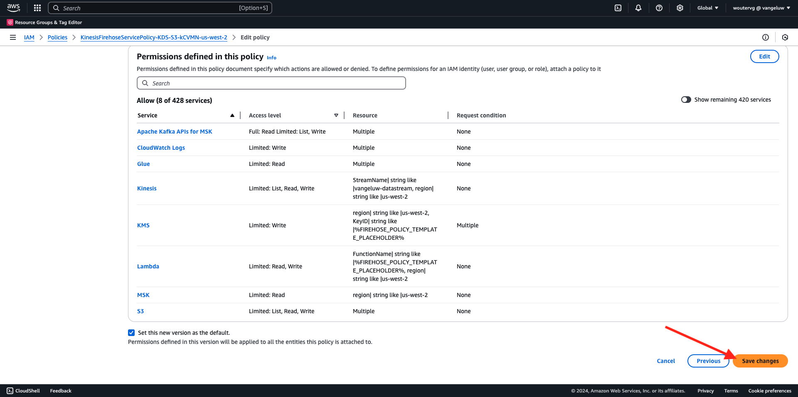
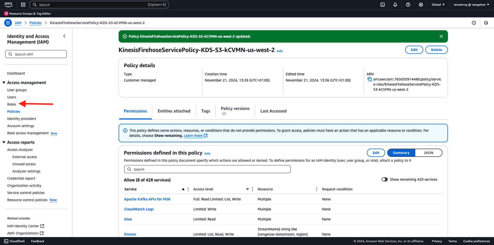

# 2.5.5 Avanzare gli eventi verso l&#39;ecosistema AWS

>[!IMPORTANT]
>
>Il completamento di questo esercizio è facoltativo e implica un costo per l’utilizzo di AWS Kinesis. AWS offre un account di livello gratuito che consente di testare e configurare molti servizi senza costi aggiuntivi, ma AWS Kinesis non fa parte di tale account di livello gratuito. Pertanto, al fine di implementare e testare questo esercizio, sarà coinvolto un costo per l’utilizzo di AWS Kinesis.

## Buono a sapersi

Adobe Experience Platform supporta vari servizi Amazon come destinazione.
Kinesis e S3 sono entrambe [destinazioni di esportazione profilo](https://experienceleague.adobe.com/docs/experience-platform/destinations/destination-types.html?lang=en) e possono essere utilizzate come parte di Adobe Experience Platform Real-Time CDP.
Puoi inserire facilmente eventi di segmento di alto valore e gli attributi di profilo associati nei sistemi preferiti.

In questa nota imparerai a configurare il tuo flusso Kinesis di Amazon per inviare in streaming i dati dell’evento provenienti dall’ecosistema Edge di Adobe Experience Platform a una destinazione di archiviazione cloud, come Amazon S3. Questa funzione è utile quando desideri raccogliere eventi di esperienza da proprietà web e mobili e inviarli nel data lake per l’analisi e il reporting operativo. I Datalake generalmente acquisiscono i dati in modalità batch con importazioni giornaliere di file di grandi dimensioni, non espongono un endpoint http pubblico che potrebbe essere utilizzato insieme all’inoltro di eventi.

Il supporto dei casi d’uso di cui sopra implica che i dati in streaming devono essere inseriti in un buffer o messi in coda prima di essere scritti in un file. Fare attenzione a non aprire il file per l&#39;accesso in scrittura in più processi. La delega di questa attività a un sistema dedicato è ideale per garantire una buona scalabilità e un livello di servizio elevato, ed è qui che Kinesis interviene in caso di emergenza.

I flussi di dati di Amazon Kinesis si concentrano sull’acquisizione e l’archiviazione dei flussi di dati. Kinesis Data Firehose si concentra sulla distribuzione di flussi di dati a destinazioni selezionate, ad esempio bucket S3.

Come parte di questo esercizio...

- Eseguire una configurazione di base di un flusso di dati Kinesis
- Creare un flusso di consegna Firehose e utilizzare il bucket S3 come destinazione
- Configurare il gateway API di Amazon come endpoint API rest per ricevere i dati dell’evento
- Inoltrare i dati grezzi dell’evento da Edge di Adobe al flusso Kinesis

## 2.5.5.1 Configurare il bucket AWS S3

Vai a [https://console.aws.amazon.com](https://console.aws.amazon.com) e accedi con l&#39;account Amazon creato in precedenza.


Dopo l&#39;accesso, verrai reindirizzato a **AWS Management Console**.


Nel menu **Trova servizi**, cerca **s3**. Fare clic sul primo risultato della ricerca: **S3 - Storage scalabile nel cloud**.


Verrà quindi visualizzata la home page di **Amazon S3**. Fai clic su **Crea bucket**.


Nella schermata **Crea bucket**, è necessario configurare due elementi:

- Nome: utilizzare il nome `eventforwarding---aepUserLdap--`. Ad esempio, in questo esercizio il nome del bucket è **aepmodulertcdpvangeluw**
- Regione: utilizzare la regione **UE (Francoforte) eu-central-1**


Lascia invariate tutte le altre impostazioni predefinite. Scorri verso il basso e fai clic su **Crea bucket**.


Vedrai quindi il tuo bucket in fase di creazione e verrà reindirizzato alla home page di Amazon S3.


## 2.5.5.2 Configurare il flusso di dati di AWS Kinesis

Nel menu **Trova servizi**, cerca **kinesis**. Fare clic sul primo risultato della ricerca: **Kinesis - Utilizzare dati in streaming in tempo reale**.


Selezionare **Flussi dati Kinesis**. Fare clic su **Crea flusso di dati**.


Per il **nome flusso dati**, utilizzare `--aepUserLdap---datastream`.


Non è necessario modificare nessuna delle altre impostazioni. Scorri verso il basso e fai clic su **Crea flusso di dati**.


Poi vedrai questo. Una volta creato correttamente il flusso di dati, puoi passare all’esercizio successivo.


## 2.5.5.3 Configurare il flusso di consegna AWS Firehose

Nel menu **Trova servizi**, cerca **kinesis**. Fare clic su **Kinesis Data Firehose**.


Fai clic su **Crea flusso di consegna**.


Per **Source**, selezionare **Flussi dati Amazon Kinesis**. Per **Destinazione**, selezionare **Amazon S3**. Fai clic su **Sfoglia** per selezionare il flusso di dati.


Seleziona il flusso di dati. Fai clic su **Scegli**.


Poi vedrai questo. Ricorda il **nome del flusso di consegna** come ti servirà in seguito.


Scorri verso il basso fino a visualizzare **Impostazioni di destinazione**. Fai clic su **Sfoglia** per selezionare il bucket S3.


Seleziona il bucket S3 e fai clic su **Scegli**.


Poi vedrai qualcosa del genere. Aggiorna le seguenti impostazioni:

- Partizionamento dinamico: impostato su **Abilitato**
- Deaggregazione di più record: impostata su **Disabilitata**
- Nuovo delimitatore di riga: impostato su **Abilitato**
- Analisi in linea per JSON: impostato su **Abilitato**


Scorri verso il basso un po&#39;, poi vedrai questo. Aggiorna le seguenti impostazioni:

- Chiavi di partizione dinamiche
   - Nome chiave: **dynamicPartitioningKey**
   - Espressione JQ: **.dynamicPartitioningKey**
- Prefisso bucket S3: aggiungi il seguente codice:

```bash
!{partitionKeyFromQuery:dynamicPartitioningKey}/!{timestamp:yyyy}/!{timestamp:MM}/!{timestamp:dd}/!{timestamp:HH}/}
```

- Prefisso di output errore bucket S3: impostato su **error**


Infine, scorri verso il basso ancora un po&#39; e fai clic su **Crea flusso di consegna**


Dopo alcuni minuti, il flusso di consegna non verrà creato e **Attivo**.


## 2.5.5.4 Configurare il ruolo AWS IAM

Nel menu **Trova servizi**, cerca **iam**. Fare clic su **Gateway API**.


Fai clic su **Ruoli**.


Cerca il tuo ruolo **KinesisFirehose**. Fai clic su di esso per aprirlo.


Fai clic sul nome del criterio di autorizzazione per aprirlo.


Nella nuova schermata visualizzata, fai clic su **Modifica criterio**.


In **Kinesis** - **Actions**, assicurati che le autorizzazioni **Write** per **PutRecord** siano abilitate. Fare clic su **Rivedi criterio**.


Fai clic su **Salva modifiche**.



Allora tornerai qui. Fai clic su **Ruoli**.



Cerca il tuo ruolo **KinesisFirehose**. Fai clic su di esso per aprirlo.


Vai a **Relazioni di trust** e fai clic su **Modifica criterio di attendibilità**.


Sovrascrivi il criterio di attendibilità corrente incollando questo codice per sostituire il codice esistente:

```json
{
	"Version": "2012-10-17",
	"Statement": [
		{
			"Effect": "Allow",
			"Principal": {
				"Service": [
                    "firehose.amazonaws.com",
                    "kinesis.amazonaws.com",
                    "apigateway.amazonaws.com"
                ]
			},
			"Action": "sts:AssumeRole"
		}
	]
}
```

Fai clic su **Aggiorna criterio**


Poi vedrai questo. Nel passaggio successivo sarà necessario specificare il **ARN** per questa mansione.


## 2.5.5.5 Configurare il gateway API di AWS

Gateway API Amazon è un servizio AWS per la creazione, la pubblicazione, la manutenzione, il monitoraggio e la protezione delle API REST, HTTP e WebSocket su qualsiasi scala. Gli sviluppatori API possono creare API che accedono ad AWS o ad altri servizi web, nonché dati memorizzati in AWS Cloud.

Ora esporrai il flusso di dati Kinesis a Internet tramite un endpoint HTTPS che può quindi essere utilizzato direttamente dai servizi Adobe, come l’inoltro degli eventi.

Nel menu **Trova servizi**, cercare **gateway API**. Fare clic su **Gateway API**.


Poi vedrai qualcosa del genere. Fare clic su **Crea API**.


Fai clic su **Build** nella scheda **REST API**.


Poi vedrai questo. Compila le impostazioni come segue:

- Scegli il protocollo: seleziona **REST**
- Crea nuova API: seleziona **Nuova API**
- Impostazioni:
   - Nome API: utilizzare `--aepUserLdap---eventforwarding`
   - Tipo di endpoint: seleziona **Area geografica**

Fare clic su **Crea API**.


Poi vedrai questo. Fare clic su **Azioni** e quindi su **Crea risorsa**.


Poi vedrai questo. Imposta **Nome risorsa** su **flusso**. Fai clic su **Crea risorsa**.


Poi vedrai questo. Fare clic su **Azioni** e quindi su **Crea metodo**.


Nel menu a discesa, seleziona **POST** e fai clic sul pulsante **v**.


Poi vedrai questo. Compila le impostazioni come segue:

- Tipo di integrazione: **Servizio AWS**
- Area geografica AWS: selezionare l&#39;area utilizzata dal flusso di dati Kinesis, in questo caso: **us-west-2**
- Servizio AWS: seleziona **Kinesis**
- Sottodominio AWS: lascia vuoto
- Metodo HTTP: selezionare **POST**
- Tipo azione: selezionare **Usa nome azione**
- Azione: immettere **PutRecord**
- Ruolo di esecuzione: incolla il **ARN** del ruolo di esecuzione utilizzato dal tuo Data Firehose Kinesis, come indicato nell&#39;esercizio precedente
- Gestione contenuto: selezionare **Passthrough**
- Usa timeout predefinito: abilita la casella di controllo

Fai clic su **Salva**.


Poi vedrai questo. Fare clic su **Richiesta di integrazione**.


Fare clic su **Intestazioni HTTP**.


Scorrere verso il basso e fare clic su **Aggiungi intestazione**.


Imposta **Nome** su **Tipo di contenuto**, imposta **Mappato da** a `'application/x-amz-json-1.1'`. Fai clic sull&#39;icona **v** per salvare le modifiche.


Poi vedrai questo. Per **Passthrough corpo richiesta**, selezionare **Se non sono stati definiti modelli (scelta consigliata)**. Fare clic su **Aggiungi modello di mapping**.


In **Content-Type** immettere **application/json**. Fai clic sull&#39;icona **v** per salvare le modifiche.


Scorri verso il basso per trovare una finestra dell’editor di codice. Incolla lì il codice seguente:

```json
{
  "StreamName": "$input.path('StreamName')",
  "Data": "$util.base64Encode($input.json('$.Data'))",
  "PartitionKey": "$input.path('$.PartitionKey')"
}
```

Fai clic su **Salva**.


Quindi scorrere verso l&#39;alto e fare clic su **&lt;- Esecuzione metodo** per tornare indietro.


Fare clic su **TEST**.


Scorri verso il basso e incolla questo codice in **Corpo richiesta**. Fare clic su **Test**.

```json
{
  "Data": {
    "message": "Hello World",
    "dynamicPartitioningKey": "v2"
  },
  "PartitionKey": "1",
  "StreamName": "--aepUserLdap---datastream"
}
```


In questo modo verrà visualizzato un risultato simile:


Poi vedrai questo. Fare clic su **Azioni** e quindi su **Distribuisci API**.


Per **Fase distribuzione**, selezionare **Nuova fase**. Come **Nome fase**, immetti **prod**. Fare clic su **Distribuisci**.


Poi vedrai questo. Fai clic su **Salva modifiche**. Nota: l’URL nell’immagine è l’URL da utilizzare per inviare dati a (in questo esempio: https://vv1i5vwg2k.execute-api.us-west-2.amazonaws.com/prod).


Puoi testare la configurazione utilizzando la seguente richiesta cURL: tutto ciò che devi fare è sostituire l&#39;URL seguente con il tuo, `https://vv1i5vwg2k.execute-api.us-west-2.amazonaws.com/prod` in questo esempio, e aggiungere `/stream` alla fine dell&#39;URL.

```json
curl --location --request POST 'https://vv1i5vwg2k.execute-api.us-west-2.amazonaws.com/prod/stream' \
--header 'Content-Type: application/json' \
--data-raw '{
    "Data": {
        "userid": "--aepUserLdap--@adobe.com",
        "firstName":"--aepUserLdap--",
        "offerName":"10% off on outdoor gears",
        "offerCode": "10OFF-SPRING",
        "dynamicPartitioningKey": "campaign"
    },
    "PartitionKey": "1",
    "StreamName": "--aepUserLdap---datastream"
}'
```

Incolla il codice aggiornato sopra riportato in una finestra di Terminal e fai clic su Invio. Vedrai quindi questa risposta, simile alla risposta che si poteva vedere durante il test qui sopra.


## 2.5.5.6 Aggiornare la proprietà Inoltro eventi

Ora puoi attivare il flusso di dati AWS Kinesis tramite AWS API Gateway, in modo da poter inviare gli eventi di esperienza non elaborati all’ecosistema AWS. Utilizzando Connessioni Real-Time CDP e Inoltro eventi, ora puoi abilitare facilmente l’inoltro degli eventi all’endpoint gateway API di AWS appena creato.

### 2.5.5.6.1 Aggiornare la proprietà Inoltro eventi: creare un elemento dati

Vai a [https://experience.adobe.com/#/data-collection/](https://experience.adobe.com/it#/data-collection/) e vai a **Inoltro eventi**. Cerca nella proprietà Inoltro eventi e fai clic su di essa per aprirla.


Nel menu a sinistra, vai a **Elementi dati**. Fare clic su **Aggiungi elemento dati**.


Viene quindi visualizzato un nuovo elemento dati da configurare.


Effettua la seguente selezione:

- Come **Name**, immetti **awsDataObject**.
- Come **Estensione**, seleziona **Core**.
- Come **Tipo elemento dati**, selezionare **Codice personalizzato**.

Ora avrai questo. Fare clic su **&lt;/> Apri editor**.


Nell’editor, incolla il seguente codice alla riga 3. Fai clic su **Salva**.

```javascript
const newObj = {...arc.event.xdm, dynamicPartitioningKey: "event_forwarding"}
return JSON.stringify(newObj);
```


>[!NOTE]
>
>Nel percorso precedente viene fatto riferimento a **arc**. **arc** sta per Contesto risorsa Adobe e **arc** sta sempre per l&#39;oggetto disponibile più alto disponibile nel contesto lato server. È possibile aggiungere arricchimenti e trasformazioni all&#39;oggetto **arc** utilizzando le funzioni del server di raccolta dati di Adobe Experience Platform.
>
>Nel percorso precedente viene fatto riferimento a **event**. **event** rappresenta un evento univoco e Adobe Experience Platform Data Collection Server valuterà sempre ogni evento singolarmente. A volte è possibile che venga visualizzato un riferimento a **eventi** nel payload inviato dal lato client di Web SDK, ma in Inoltro eventi raccolta dati di Adobe Experience Platform ogni evento viene valutato singolarmente.

Allora tornerai qui. Fai clic su **Salva** o **Salva nella libreria**.


### 2.5.5.6.2 Aggiorna la proprietà del server di raccolta dati Adobe Experience Platform: aggiorna la regola

Nel menu a sinistra, vai a **Regole**. Fare clic per aprire la regola **Tutte le pagine** creata in uno degli esercizi precedenti.


Poi vedrai questo. Fai clic sull&#39;icona **+** per aggiungere una nuova azione.


Poi vedrai questo. Effettua la seguente selezione:

- Seleziona l&#39;**estensione**: **Connettore cloud Adobe**.
- Seleziona il **Tipo azione**: **Effettua chiamata di recupero**.

Questo dovrebbe darti **Nome**: **Connettore Adobe Cloud - Effettua una chiamata di recupero**. Ora dovresti vedere:


Quindi, configura quanto segue:

- Cambia il metodo di richiesta da GET a **POST**
- Immettere l&#39;URL dell&#39;endpoint del gateway API AWS creato in uno dei passaggi precedenti, che si presenta così: `https://vv1i5vwg2k.execute-api.us-west-2.amazonaws.com/prod/stream`

Ora dovresti avere questo. Quindi, vai a **Intestazioni**.


Nelle intestazioni, aggiungi una nuova intestazione con chiave **Content-Type** e valore **application/json**. Quindi, vai a **Corpo**.


Poi vedrai questo. Incolla il seguente codice nel campo **Body (Raw)**. Fai clic su **Mantieni modifiche**.

```json
{
    "Data":{{awsDataObject}},
    "PartitionKey": "1",
    "StreamName": "--aepUserLdap---datastream"
}
```


Allora vedrai di essere qui. Fai clic su **Salva** o **Salva nella libreria**.


Hai configurato la prima regola in una proprietà di Inoltro eventi. Vai a **Flusso di pubblicazione** per pubblicare le modifiche.
Apri la libreria di sviluppo facendo clic su **Principale**.


Fai clic sul pulsante **Aggiungi tutte le risorse modificate**, dopo di che le modifiche apportate alla regola e all&#39;elemento dati verranno visualizzate in questa libreria. Fare clic su **Salva e genera per sviluppo**. Le modifiche sono ora in fase di implementazione.


Dopo un paio di minuti, vedrai che l’implementazione è completata e pronta per essere testata.


## 2.5.5.7 Testare la configurazione

Vai a [https://builder.adobedemo.com/projects](https://builder.adobedemo.com/projects). Dopo aver effettuato l’accesso con il tuo Adobe ID, visualizzerai questo. Fai clic sul progetto del tuo sito web per aprirlo.


Ora puoi seguire il flusso seguente per accedere al sito web. Fai clic su **Integrazioni**.


Nella pagina **Integrazioni** è necessario selezionare la proprietà Raccolta dati creata nell&#39;esercizio 0.1.


Poi vedrai il tuo sito web demo aperto. Seleziona l’URL e copialo negli Appunti.


Apri una nuova finestra del browser in incognito.


Incolla l’URL del sito web demo, che hai copiato nel passaggio precedente. Ti verrà quindi chiesto di effettuare l’accesso con il tuo Adobe ID.


Seleziona il tipo di account e completa la procedura di accesso.


Vedrai quindi il tuo sito web caricato in una finestra del browser in incognito. Per ogni dimostrazione, dovrai utilizzare una nuova finestra del browser in incognito per caricare l’URL del sito web demo.


Quando apri la visualizzazione per sviluppatori del browser, puoi esaminare le richieste di rete come indicato di seguito. Quando utilizzi il filtro **interact**, vengono visualizzate le richieste di rete inviate dal client di raccolta dati di Adobe Experience Platform ad Adobe Edge.


Se selezioni il payload non elaborato, passa a [https://jsonformatter.org/json-pretty-print](https://jsonformatter.org/json-pretty-print) e incolla il payload. Fare clic su **Rendi carino**. Vedrai quindi il payload JSON, l&#39;oggetto **events** e l&#39;oggetto **xdm**. In uno dei passaggi precedenti, quando hai definito l&#39;elemento dati, hai utilizzato il riferimento **arc.event.xdm**, che ti porterà ad analizzare l&#39;oggetto **xdm** di questo payload.


Passa a **AWS**. Aprendo il flusso di dati e andando nella scheda **Monitoraggio**, ora vedrai il traffico in arrivo.


Quando poi apri il flusso di consegna e vai alla scheda **Monitoraggio**, verrà visualizzato anche il traffico in entrata.


Infine, quando analizzi il bucket S3, noterai che i file vengono creati lì in seguito all’acquisizione dei dati.


Quando scarichi tale file e lo apri utilizzando un editor di testo, vedrai che contiene il payload XDM dagli eventi inoltrati.


Passaggio successivo: [Riepilogo e vantaggi](./summary.md)

[Torna al modulo 2.5](./aep-data-collection-ssf.md)

[Torna a tutti i moduli](./../../../overview.md)
