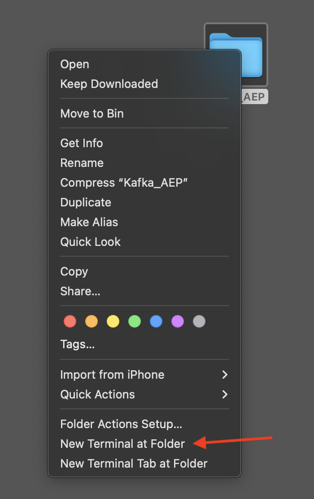
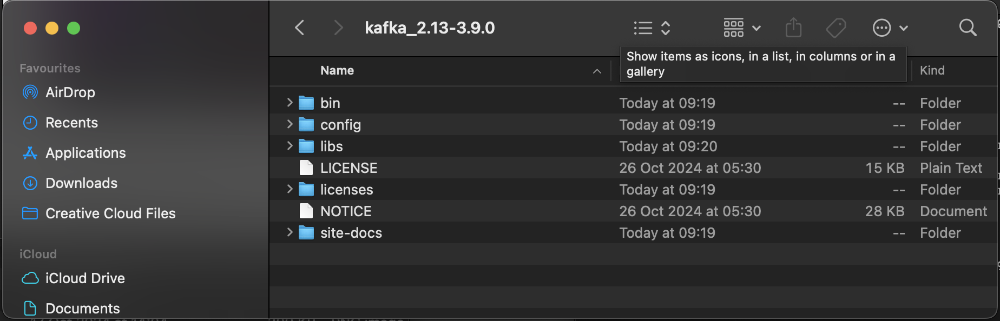
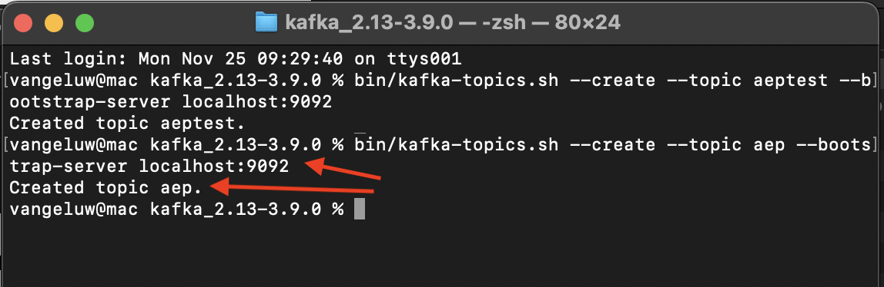
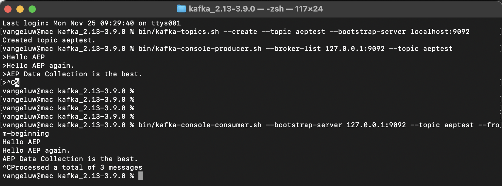

# 2.6.2 Installare e configurare il cluster Kafka

## Scarica Apache Kafka

Vai a [https://kafka.apache.org/downloads](https://kafka.apache.org/downloads) e scarica l&#39;ultima versione rilasciata. Selezionare la versione binaria più recente, in questo caso **3.9.0**. Verrà avviato il download.

Crea sul desktop una cartella denominata **Kafka_AEP** e inserisci il file scaricato in tale directory.

Apri una finestra di **Terminal** facendo clic con il pulsante destro del mouse sulla cartella e scegliendo **New Terminal at Folder**.

Esegui questo comando nella finestra di Terminal per decomprimere il file scaricato:

`tar -xvf kafka_2.13-3.9.0.tgz`

>[!NOTE]
>
>Verifica che il comando di cui sopra corrisponda alla versione del file scaricato. Se la tua versione è più recente, dovrai aggiornare il comando precedente per farla corrispondere a quella versione.

A questo punto viene visualizzato quanto segue:

Dopo aver decompresso il file, ora disponi di una directory come questa:

E in quella directory, vedrai queste sottodirectory:

Torna alla finestra Terminal. Immetti il comando seguente:

`cd kafka_2.13-3.9.0`

>[!NOTE]
>
>Verifica che il comando di cui sopra corrisponda alla versione del file scaricato. Se la tua versione è più recente, dovrai aggiornare il comando precedente per farla corrispondere a quella versione.

Immettere quindi il comando `bin/kafka-topics.sh`.

Dovresti quindi visualizzare questa risposta. Ciò significa che Kafka è installato correttamente e che Java funziona correttamente. (Promemoria: è necessario che Java 23 JDK sia installato affinché funzioni correttamente!). È possibile visualizzare la versione Java installata utilizzando il comando `java -version`.)

## Avvia Kafka

Per avviare Kafka, è necessario avviare Kafka Zookeeper e Kafka, in questo ordine.

Apri una finestra di **Terminal** facendo clic con il pulsante destro del mouse sulla cartella **kafka_2.13-3.9.0** e scegliendo **Nuovo terminale nella cartella**.

Immetti questo comando:

`bin/zookeeper-server-start.sh config/zookeeper.properties`

A questo punto viene visualizzato quanto segue:

Tieni aperta questa finestra mentre segui questi esercizi!

Aprire un&#39;altra nuova finestra di **Terminal** facendo clic con il pulsante destro del mouse sulla cartella **kafka_2.13-3.9.0** e scegliendo **Nuovo terminale nella cartella**.

Immetti questo comando:

`bin/kafka-server-start.sh config/server.properties`

A questo punto viene visualizzato quanto segue:

Tieni aperta questa finestra mentre segui questi esercizi!

## Creare un argomento Kafka

Apri una finestra di **Terminal** facendo clic con il pulsante destro del mouse sulla cartella **kafka_2.13-3.9.0** e scegliendo **Nuovo terminale nella cartella**.

Immetti questo comando per creare un nuovo argomento Kafka denominato **aeptest**. Questo argomento verrà utilizzato per il test in questo esercizio.

`bin/kafka-topics.sh --create --topic aeptest --bootstrap-server localhost:9092`

Viene quindi visualizzata una conferma:

Immettere questo comando per creare un nuovo argomento Kafka denominato **aep**. Questo argomento verrà utilizzato dal connettore sink di Adobe Experience Platform che verrà configurato negli esercizi successivi.

`bin/kafka-topics.sh --create --topic aep --bootstrap-server localhost:9092`

Viene quindi visualizzata una conferma simile:

## Produrre eventi

Torna alla finestra Terminale in cui hai creato il tuo primo argomento Kafka e immetti il seguente comando:

`bin/kafka-console-producer.sh --broker-list 127.0.0.1:9092 --topic aeptest`

Poi vedrai questo. A ogni nuova riga seguita dalla pressione del pulsante Invio, verrà inviato un nuovo messaggio nell&#39;argomento **aeptest**.

Immetti `Hello AEP` e premi Invio. Il primo evento è stato inviato all&#39;istanza Kafka locale, nell&#39;argomento **aeptest**.

Immetti `Hello AEP again.` e premi Invio.

Immetti `AEP Data Collection is the best.` e premi Invio.

Hai prodotto 3 eventi nell&#39;argomento **aeptest**. Questi eventi possono ora essere utilizzati da un’applicazione che potrebbe aver bisogno di tali dati.

Sulla tastiera, fare clic contemporaneamente su `Control` e `C` per chiudere il producer.

## Eventi di consumo

Nella stessa finestra di Terminal utilizzata per produrre gli eventi, immettere il comando seguente:

`bin/kafka-console-consumer.sh --bootstrap-server 127.0.0.1:9092 --topic aeptest --from-beginning`

Verranno quindi visualizzati nel consumatore tutti i messaggi generati nell&#39;esercizio precedente per l&#39;argomento **aeptest**. Apache Kafka funziona in questo modo: un produttore crea gli eventi in una pipeline e un consumatore li consuma.

Sulla tastiera, fare clic contemporaneamente su `Control` e `C` per chiudere il producer.

In questo esercizio, hai esaminato tutte le nozioni di base per configurare un cluster Kafka locale, creare un argomento Kafka, produrre eventi e utilizzare eventi.

L’obiettivo di questo modulo è simulare ciò che accade se un’organizzazione reale ha già implementato un cluster Apache Kafka e desidera inviare in streaming i dati dal proprio cluster Kafka a Adobe Experience Platform.

Per facilitare tale implementazione, è stato creato un connettore Adobe Experience Platform Sink che può essere implementato utilizzando Kafka Connect. La documentazione del connettore Adobe Experience Platform Sink è disponibile qui: [https://github.com/adobe/experience-platform-streaming-connect](https://github.com/adobe/experience-platform-streaming-connect).

Negli esercizi successivi, implementerai tutto il necessario per utilizzare il connettore Adobe Experience Platform Sink dal tuo cluster Kafka locale.

Chiudere la finestra del terminale.

Hai finito questo esercizio.

Passaggio successivo: [2.6.3 Configurare l&#39;endpoint API HTTP in Adobe Experience Platform](./ex3.md)

[Torna al modulo 2.6](./aep-apache-kafka.md)

[Torna a tutti i moduli](../../../overview.md)
