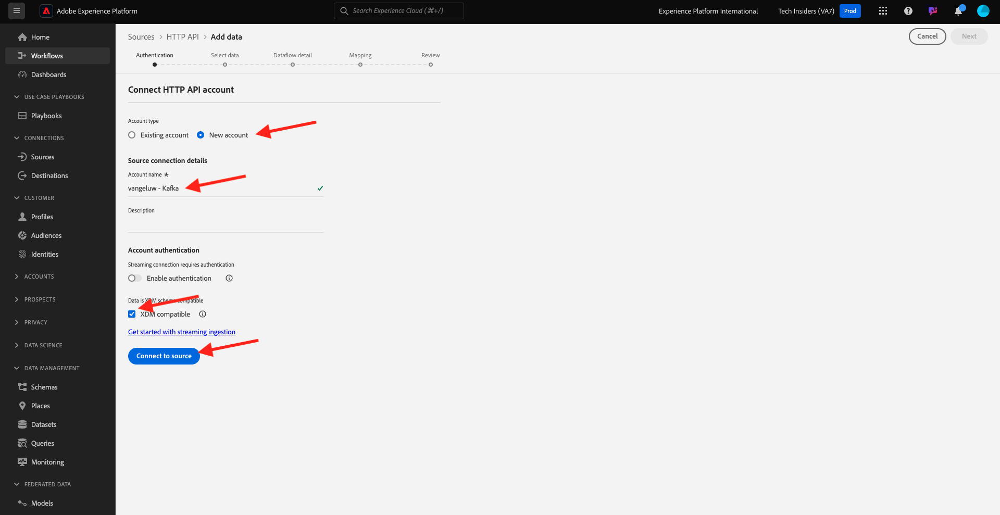
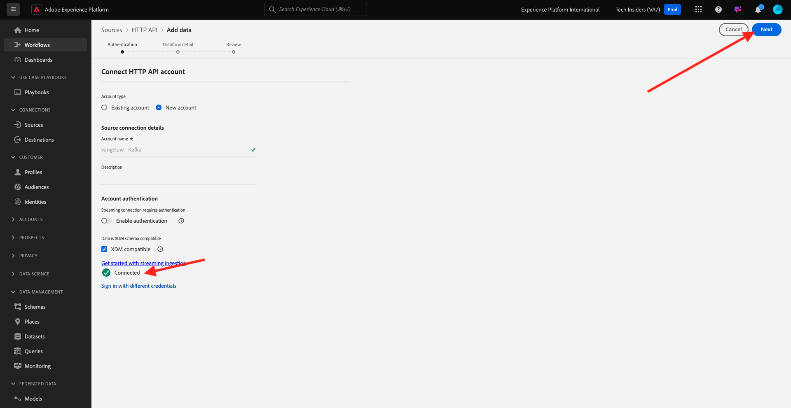

# 2.6.3 Configurare l’endpoint di streaming API HTTP in Adobe Experience Platform

Prima di poter configurare il connettore Adobe Experience Platform Sink in Kafka, è necessario creare un connettore Source API HTTP in Adobe Experience Platform. Per configurare il connettore sink di Adobe Experience Platform è necessario specificare l&#39;URL dell&#39;endpoint di streaming API HTTP.

Per creare un connettore Source API HTTP, accedi a Adobe Experience Platform da questo URL: [https://experience.adobe.com/platform](https://experience.adobe.com/platform).

Dopo aver effettuato l’accesso, accedi alla home page di Adobe Experience Platform.

Prima di continuare, devi selezionare una **sandbox**. La sandbox da selezionare è denominata ``--aepSandboxId--``. A tale scopo, fai clic sul testo **[!UICONTROL Prod produzione]** nella riga blu nella parte superiore dello schermo. Dopo aver selezionato la sandbox appropriata, la schermata cambia e ora sei nella sandbox dedicata.

Nel menu a sinistra, vai a **Origini** e scorri verso il basso nel **Catalogo origini** fino a visualizzare **API HTTP**. Fare clic su **Aggiungi dati**.

Fai clic su **Nuovo account**. Utilizza `--demoProfileLdap-- - Kafka` come nome per la connessione API HTTP, in questo caso **vangeluw - Kafka**. Abilita la casella di controllo per **Compatibile con XDM**. Fare clic su **Connetti all&#39;origine**.

Visualizzerai quindi questo elemento, fai clic su **Avanti**.

Seleziona **Set di dati esistente**, apri il menu a discesa. Cerca e seleziona il set di dati **Sistema demo - Set di dati evento per Call Center (Global v1.1)**.

Fai clic su **Avanti**.

Fai clic su **Avanti**.

Fai clic su **Fine**.

Viene quindi visualizzata una panoramica del connettore Source API HTTP appena creato.

È necessario copiare l&#39;URL dell&#39;**endpoint di streaming**, che è simile a quello riportato di seguito, come sarà necessario nell&#39;esercizio successivo.

`https://dcs.adobedc.net/collection/d282bbfc8a540321341576275a8d052e9dc4ea80625dd9a5fe5b02397cfd80dc`

Hai finito questo esercizio.

Passaggio successivo: [2.6.4 Installare e configurare Kafka Connect e il connettore Adobe Experience Platform Sink](./ex4.md)

[Torna al modulo 2.6](./aep-apache-kafka.md)

[Torna a tutti i moduli](../../../overview.md)
