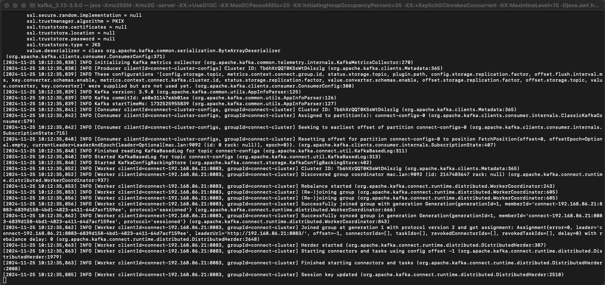
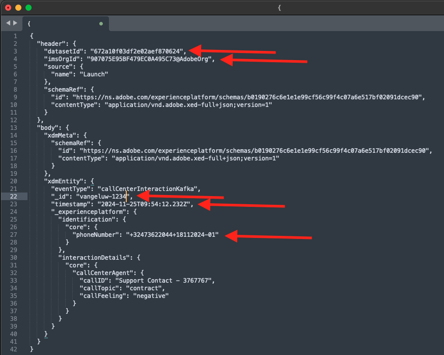

# 2.6.4 Installare e configurare Kafka Connect e il connettore Adobe Experience Platform Sink

## Scarica il connettore Adobe Experience Platform Sink

Vai a [https://github.com/adobe/experience-platform-streaming-connect/releases](https://github.com/adobe/experience-platform-streaming-connect/releases) e scarica l&#39;ultima versione ufficiale del connettore Adobe Experience Platform Sink.


Scarica il file **streaming-connect-sink-0.0.27-java-11.jar**.


Posiziona il file di download **streaming-connect-sink-0.0.27-java-11.jar** sul desktop.


## Configurare Kafka Connect

Vai alla cartella sul desktop denominata **Kafka_AEP** e passa alla cartella `kafka_2.13-3.9.0/config`.
In tale cartella, aprire il file **connect-distribution.properties** utilizzando qualsiasi editor di testo.


Nell&#39;editor di testo passare alle righe 34 e 35 e assicurarsi di impostare i campi `key.converter.schemas.enable` e `value.converter.schemas.enable` su `false`

```json
key.converter.schemas.enable=false
value.converter.schemas.enable=false
```

Salva le modifiche apportate al file.


Tornare alla cartella `kafka_2.13-3.1.0`, creare manualmente una nuova cartella e denominarla `connectors`.


Fare clic con il pulsante destro del mouse sulla nuova cartella e scegliere **Nuovo terminale nella cartella**.


Poi vedrai questo. Immettere il comando `pwd` per recuperare il percorso completo della cartella. Seleziona il percorso completo e copialo negli Appunti.


Torna all&#39;Editor di testo, al file **connect-distribution.properties** e scorri verso il basso fino all&#39;ultima riga (riga 89 nella schermata). Rimuovere il commento dalla riga (rimuovere `#`) che inizia con `# plugin.path=` e incollare il percorso completo della cartella denominata `connectors`. Il risultato dovrebbe essere simile al seguente:

`plugin.path=/Users/woutervangeluwe/Desktop/Kafka_AEP/kafka_2.13-3.9.0/connectors`

Salva le modifiche nel file **connect-distribution.properties** e chiudi l&#39;editor di testo.


Copiare quindi l&#39;ultima versione ufficiale del connettore Adobe Experience Platform Sink scaricato nella cartella denominata `connectors`. Il file scaricato in precedenza è denominato **streaming-connect-sink-0.0.27-java-11.jar**. È sufficiente spostarlo nella cartella `connectors`.


Aprire quindi una nuova finestra di Terminal a livello della cartella **kafka_2.13-3.9.0**. Fare clic con il pulsante destro del mouse sulla cartella e scegliere **Nuovo terminale nella cartella**.

Nella finestra Terminal, incolla questo comando: `bin/connect-distributed.sh config/connect-distributed.properties` e fai clic su **Invio**. Questo comando avvia Kafka Connect e carica la libreria del connettore Adobe Experience Platform Sink.


Dopo un paio di secondi, vedrai qualcosa del genere:



## Creare il connettore Adobe Experience Platform Sink con Postman

Ora puoi interagire con Kafka Connect utilizzando Postman. Per eseguire questa operazione, scaricare [questa raccolta Postman](./../../../assets/postman/postman_kafka.zip) e decomprimerla nel computer locale sul desktop. Verrà quindi creato un file denominato `Kafka_AEP.postman_collection.json`.


Devi importare questo file in Postman. Per farlo, apri Postman, fai clic su **Importa**, trascina il file `Kafka_AEP.postman_collection.json` nel popup e fai clic su **Importa**.


Troverai questa raccolta nel menu a sinistra di Postman. Fai clic sulla prima richiesta, **GET connettori Kafka Connect disponibili** per aprirla.


Poi vedrai questo. Fai clic sul pulsante blu **Invia**, dopo il quale dovresti visualizzare una risposta vuota `[]`. La risposta vuota è dovuta al fatto che non sono attualmente definiti connettori Kafka Connect.


Per creare un connettore, fare clic per aprire la seconda richiesta nella raccolta Kafka, **POST Crea connettore sink AEP** e passare a **Corpo**. Poi vedrai questo. Nella riga 11, dove è indicato **&quot;aep.endpoint&quot;: &quot;**, è necessario incollare l&#39;URL dell&#39;endpoint di streaming API HTTP ricevuto al termine di uno degli esercizi precedenti. L&#39;URL dell&#39;endpoint di streaming API HTTP è simile al seguente: `https://dcs.adobedc.net/collection/63751d0f299eeb7aa48a2f22acb284ed64de575f8640986d8e5a935741be9067`.


Dopo averlo incollato, il corpo della richiesta dovrebbe essere simile al seguente. Fai clic sul pulsante blu **Invia** per creare il connettore. Otterrai una risposta immediata della creazione del connettore.


Fai clic sulla prima richiesta, **GET connettori Kafka Connect disponibili** per aprirla nuovamente e fai di nuovo clic sul pulsante blu **Invia**. ora vedrai che esiste un connettore Kafka Connect.


Quindi, apri la terza richiesta nella raccolta Kafka, **GET lo stato del connettore Kafka Connect**. Fai clic sul pulsante blu **Invia** per ricevere una risposta simile a quella riportata di seguito, che indica che il connettore è in esecuzione.


## Produrre un evento esperienza

Apri una nuova finestra di **Terminal** facendo clic con il pulsante destro del mouse sulla cartella **kafka_2.13-3.9.0** e scegliendo **Nuovo terminale nella cartella**.


Immetti il comando seguente:

`bin/kafka-console-producer.sh --broker-list 127.0.0.1:9092 --topic aep`

Poi vedrai questo. A ogni nuova riga seguita dalla pressione del pulsante Invio, verrà inviato un nuovo messaggio nell&#39;argomento **aep**.


Ora puoi inviare un messaggio che verrà utilizzato dal connettore Adobe Experience Platform Sink e che verrà acquisito in Adobe Experience Platform in tempo reale.

Prendi il payload dell’evento di esperienza di esempio riportato di seguito e copialo in un editor di testo.

```json
{
  "header": {
    "datasetId": "61fe23fd242870194a6d779c",
    "imsOrgId": "--aepImsOrgID--",
    "source": {
      "name": "Launch"
    },
    "schemaRef": {
      "id": "https://ns.adobe.com/experienceplatform/schemas/b0190276c6e1e1e99cf56c99f4c07a6e517bf02091dcec90",
      "contentType": "application/vnd.adobe.xed-full+json;version=1"
    }
  },
  "body": {
    "xdmMeta": {
      "schemaRef": {
        "id": "https://ns.adobe.com/experienceplatform/schemas/b0190276c6e1e1e99cf56c99f4c07a6e517bf02091dcec90",
        "contentType": "application/vnd.adobe.xed-full+json;version=1"
      }
    },
    "xdmEntity": {
      "eventType": "callCenterInteractionKafka",
      "_id": "",
      "timestamp": "2024-11-25T09:54:12.232Z",
      "_experienceplatform": {
        "identification": {
          "core": {
            "phoneNumber": ""
          }
        },
        "interactionDetails": {
          "core": {
            "callCenterAgent": {
              "callID": "Support Contact - 3767767",
              "callTopic": "contract",
              "callFeeling": "negative"
            }
          }
        }
      }
    }
  }
}
```

Poi vedrai questo. È necessario aggiornare manualmente 2 campi:

- **_id**: impostalo su un ID casuale, ad esempio `--aepUserLdap--1234`
- **timestamp**: aggiorna la marca temporale alla data e all&#39;ora correnti
- **phoneNumber**: immettere phoneNumber dell&#39;account creato in precedenza nel sito Web demo. Puoi trovarlo nel pannello Visualizzatore profili in **Identità**.

Devi anche controllare e forse aggiornare questi campi:

- **datasetId**: è necessario copiare l&#39;ID del set di dati per il sistema demo del set di dati - Set di dati evento per il call center (Global v1.1)


- **imsOrgID**: ID organizzazione IMS: `--aepImsOrgId--`

>[!NOTE]
>
>Il campo **_id** deve essere univoco per ogni acquisizione di dati. Se crei più eventi, assicurati di aggiornare ogni volta il campo **_id** a un nuovo valore univoco.

Dovresti quindi avere qualcosa del genere:



Quindi, copia l’evento di esperienza completo negli Appunti. È necessario eliminare lo spazio vuoto del payload JSON e a tale scopo verrà utilizzato uno strumento online. Vai a [http://jsonviewer.stack.hu/](http://jsonviewer.stack.hu/) per farlo.

Incolla l&#39;evento esperienza nell&#39;editor e fai clic su **Rimuovi spazio vuoto**.


Quindi, selezionare tutto il testo di output e copiarlo negli Appunti.


Torna alla finestra Terminal.


Incolla il nuovo payload senza spazi nella finestra di Terminal e fai clic su **Invio**.


Quindi, torna al tuo sito web demo e aggiorna la pagina. Ora dovresti visualizzare un evento esperienza sul tuo profilo, in **Eventi esperienza**, come quello seguente:


>[!NOTE]
>
>Se desideri che le interazioni del call center vengano visualizzate nel pannello Visualizzatore profili, devi aggiungere l&#39;etichetta e il filtro seguenti nel progetto in [https://dsn.adobe.com](https://dsn.adobe.com), dalla scheda **Visualizzatore profili** e aggiungendo una nuova riga in **Eventi**, con queste variabili:
>- **Etichetta Tipo Evento**: Interazioni Del Call Center
>- **Filtro tipo evento**: callCenterInteractionKafka
>- **Titolo**: `--aepTenantId--.interactionDetails.core.callCenterAgent.callID`


Hai finito questo esercizio.

Passaggio successivo: [Riepilogo e vantaggi](./summary.md)

[Torna al modulo 2.6](./aep-apache-kafka.md)

[Torna a tutti i moduli](../../../overview.md)
