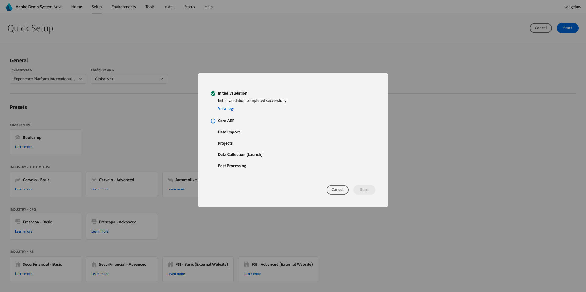

# Configurare l’istanza Adobe Experience Platform

>[!IMPORTANT]
>
>Questa pagina è destinata solo ai ruoli Amministratore di sistema. Per poter seguire i passaggi seguenti, è necessario disporre dei diritti di accesso di amministratore di sistema per la specifica istanza. Se non sei un amministratore di sistema nell’organizzazione Adobe Experience Cloud, contatta l’amministratore di sistema e chiedi la sua approvazione e assistenza prima di procedere con uno dei passaggi seguenti.

## Panoramica

Per poter utilizzare direttamente tutte queste esercitazioni, è necessario eseguire il provisioning delle seguenti applicazioni Adobe Experience Cloud nell’organizzazione IMS:

- Adobe Real-time CDP
- Raccolta dati di Adobe Experience Platform
- Adobe Journey Optimizer
- Customer Journey Analytics
- Data Distiller
- Composizione di pubblico federato

Se non è stato eseguito il provisioning di un servizio applicativo specifico per l’organizzazione IMS, non sarà possibile svolgere tale esercizio in modo pratico.

## Creare una sandbox

Per eseguire l’esercitazione nella tua istanza di Adobe Experience Platform, è consigliabile innanzitutto impostare una nuova sandbox di sviluppo. Per creare una nuova sandbox, vai a [https://experience.adobe.com/platform](https://experience.adobe.com/platform), vai a Sandbox e quindi vai a **Sfoglia**. Fai clic su **Crea sandbox**.

Crea la sandbox in questo modo:

- Tipo: **Sviluppo**
- Nome: **aep-tutorial**
- Titolo: **Esercitazione Adobe Experience Platform**

Fai clic su **Crea**.

Ora verrà creata la sandbox. Dopo un paio di minuti vedrete questo.

## Autorizzazioni di configurazione

Vai a **Autorizzazioni**, quindi vai a **Ruoli**.

Fai clic per aprire il **Ruolo** specifico che verrà utilizzato dagli Allievi che seguiranno questa esercitazione. Fai clic su **Crea ruolo**.

Assegna al tuo ruolo un nome simile a **Esercitazione Adobe Experience Platform** e fai clic su **Conferma**.

Nel menu a discesa **Sandbox**, seleziona la sandbox appena creata e assicurati di rimuoverne altre (rimuovi anche **Prod**).

Aggiungi le varie risorse e imposta le autorizzazioni. Assicurarsi di non aggiungere autorizzazioni per **Amministrazione sandbox**.

Aggiungi altre risorse come indicato e imposta le autorizzazioni.

Aggiungi altre risorse come indicato e imposta le autorizzazioni. Fai clic su **Salva**. Quindi fare clic su **Chiudi**.

## Adobe I/O configurazione

Vai a
[https://developer.adobe.com/console/integrations](https://developer.adobe.com/console/integrations). Assicurati di trovarti nell’istanza corretta. Fare clic su **Crea nuovo progetto**.

Fare clic su **Aggiungi al progetto** e quindi su **API**.

Fare clic su **Adobe Experience Platform** e quindi abilitare **Experience Platform API**. Fai clic su **Avanti**.

Per il **nome credenziali**, utilizzare **Esercitazione AEP DSN**. Fai clic su **Avanti**.

Seleziona uno dei profili di prodotto disponibili. Questo profilo di prodotto non determina le autorizzazioni per questo progetto di Adobe I/O; l’operazione verrà eseguita in un passaggio successivo. Fai clic su **Salva API configurata**.

Fare clic su **Aggiungi al progetto** e quindi di nuovo su **API**.

Fare clic su **Adobe Experience Platform** e quindi abilitare **API di Experience Platform Launch**. Fai clic su **Avanti**.

Fai clic su **Avanti**.

Seleziona un profilo di prodotto che consenta di creare e gestire le proprietà di raccolta dati. Fai clic su **Salva API configurata**.

Poi vedrai questo. Fare clic sul nome **Progetto XXX** corrente.

Fare clic su **Modifica progetto**.

Immetti un nuovo **Titolo progetto**, ad esempio **Esercitazione Adobe Experience Platform DSN**. Fai clic su **Salva**.

Il progetto di Adobe I/O è ora pronto.

## Collega progetto di Adobe I/O al ruolo

Vai a **Autorizzazioni**, a **Ruoli** e quindi fai clic sul nuovo ruolo creato in precedenza.

Vai a **Credenziali API**. Fare clic su **+ Aggiungi credenziali API**.

Vengono quindi visualizzate le credenziali di Adobe I/O create nel passaggio precedente. Selezionala e fai clic su **Salva**.

Il progetto Adobe I/O è ora configurato con le autorizzazioni necessarie per accedere alle API di Adobe Experience Platform.

>[!IMPORTANT]
>
>Devi attendere almeno 10 minuti prima di continuare con i passaggi successivi in Sistema di dimostrazione Successivo.

## Configurare l’ambiente in Demo System Avanti

Vai a [https://dsn.adobe.com/tools/org-admin](https://dsn.adobe.com/tools/org-admin). Fare clic su **+ Aggiungi organizzazione**.

Compila i campi obbligatori:

- ID organizzazione IMS
- Nome
- ID tenant (non includere **underscore**)
- Area geografica

L&#39;amministratore di sistema dovrebbe essere in grado di fornire assistenza con i valori di questi campi.

Fai clic su **Salva**.

L’ambiente ora farà parte dell’elenco. Trovarlo nell&#39;elenco e fare clic sull&#39;icona **collegamento**.

Ora devi immettere i valori creati come parte delle credenziali del progetto di Adobe I/O. Puoi trovare **ID client**, **Segreto client** e **Ambiti** qui:

**ID account tecnico**:

Copiarli e incollarli qui, quindi fare clic su **Salva**.

L&#39;ambiente DSN è ora configurato correttamente.

## Configurare l&#39;accesso all&#39;ambiente DSN

Vai a [https://dsn.adobe.com/tools/environment-admin](https://dsn.adobe.com/tools/environment-admin). Seleziona l&#39;organizzazione IMS appena creata, seleziona l&#39;utente e fai clic su **+ Assegna** in **Sandbox**.

Immetti il **Nome sandbox** definito nel primo passaggio precedente. Dovrebbe essere simile al seguente:

- Nome: **aep-tutorial**

Fai clic su **Conferma**.

La sandbox è ora disponibile per l’utente selezionato.

## Impostazione rapida DSN

Vai a [https://dsn.adobe.com/quick-setup](https://dsn.adobe.com/quick-setup). Apri il menu a discesa **Ambiente** e seleziona l&#39;organizzazione IMS o la sandbox.

Per **Configurazione**, selezionare **Global v2.0**.

Scorri verso il basso fino a **Settore - Telco** e seleziona **Segnale Citi - Avanzato**.

Scorri verso l&#39;alto e fai clic su **Avvia**.

Immetti un **Titolo** e fai clic su **Inizio**.

>[!NOTE]
>
>Se nella sandbox non è stato creato un criterio di unione predefinito, potrebbero verificarsi degli errori. In questo caso, attendere ancora un po’ che il criterio di unione venga creato automaticamente oppure passare manualmente in Adobe Experience Platform, in Profili > Criteri di unione e creare un nuovo criterio di unione predefinito.

Si vedrà quindi lo stato di avanzamento dell&#39;installazione, che richiederà alcuni minuti.

Una volta completato tutto, l’istanza di Adobe Experience Platform è configurata correttamente e pronta per l’esercitazione per gli Allievi.

>[!NOTE]
>
>Il passaggio Importazione dati non viene utilizzato dall&#39;esercitazione, quindi se questo passaggio non riesce, non preoccuparti e continua.

Vai a [https://experience.adobe.com/platform](https://experience.adobe.com/platform), a **Set di dati**. Ora dovrebbe essere visualizzato un elenco simile di set di dati, tutti creati dalla configurazione rapida DSN.

>[!NOTE]
>
>Grazie per aver dedicato il tuo tempo all&#39;apprendimento di tutto ciò che c&#39;è da sapere su Adobe Experience Platform e sulle sue applicazioni. Se hai domande, vuoi condividere feedback generali su suggerimenti in merito a contenuti futuri, contatta direttamente Tech Insiders, inviando un&#39;e-mail a **techinsiders@adobe.com**.

[Torna a tutti i moduli](./overview.md)
