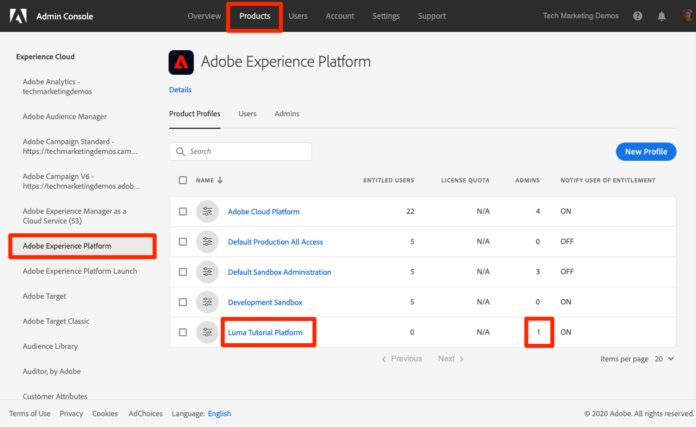
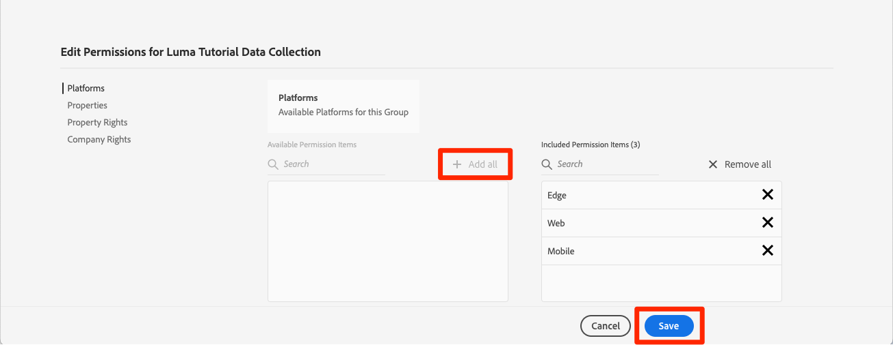

# Configurare le autorizzazioni

<!--30min-->

In questa lezione, configurerai le autorizzazioni utente di Adobe Experience Platform utilizzando [!DNL Adobe's Admin Console].

Il controllo degli accessi è una funzionalità chiave per la privacy in Experience Platform e consigliamo di limitare le autorizzazioni al minimo necessario per consentire alle persone di eseguire le loro funzioni lavorative. Consulta la sezione [Documentazione sul controllo degli accessi](https://experienceleague.adobe.com/docs/experience-platform/access-control/home.html?lang=it) per ulteriori informazioni.

Gli architetti di dati e i data engineer sono utenti esperti di Adobe Experience Platform e avrai bisogno di molte autorizzazioni per completare questa esercitazione e in seguito nel tuo lavoro quotidiano. Gli architetti di dati sono probabilmente coinvolti nell&#39;amministrazione di *altri utenti di Platform* presso la loro azienda, ad esempio addetti al marketing, analisti e data scientist. Al termine della lezione, scopri come utilizzare queste funzioni per gestire altri utenti della tua azienda.

**Architetti dei dati** spesso configura le autorizzazioni per altri utenti al di fuori di questa esercitazione.

>[!IMPORTANT]
>
>Un amministratore di sistema dei prodotti Adobe Experience Cloud deve completare alcuni dei passaggi descritti in questa lezione, descritti nelle intestazioni della sezione. Se non sei amministratore di sistema, contatta un amministratore della tua azienda e chiedi loro di completare queste attività.

## Informazioni sull’Admin Console

La [!DNL Admin Console] è l’interfaccia utilizzata per amministrare l’accesso utente a tutti i prodotti Adobe Experience Cloud. Vedi [Documentazione di Adobe Admin Console](https://helpx.adobe.com/it/enterprise/using/admin-console.html) per informazioni più dettagliate. Ecco alcune chiavi [!DNL Admin Console] concetti:

* A **profilo di prodotto** è una combinazione di autorizzazioni, ruoli e ambienti sandbox associati a un prodotto di Adobe specifico. Puoi creare più profili di prodotto per un singolo prodotto Adobe. Ad esempio, un profilo &quot;addetto al marketing&quot; potrebbe limitare le autorizzazioni a ciò che un addetto al marketing tipico avrebbe bisogno per completare le attività chiave nell’ambiente di produzione di Platform, mentre un profilo &quot;architetto di dati&quot; potrebbe essere utilizzato per concedere autorizzazioni diverse in più ambienti di Platform. In questa lezione, creerai un profilo di prodotto &quot;Luma Tutorial&quot; con tutte le autorizzazioni di cui un architetto di dati e un ingegnere di dati avrebbero bisogno per completare questa esercitazione in un ambiente sandbox.
* Un **integrazione** è una connessione a un *progetto* nella console Adobe Developer. La console Adobe Developer è il cuore dell’autenticazione e della configurazione delle API di Adobe. Puoi configurare un’integrazione in Developer Console e [!DNL Postman] lezione.

Di seguito è riportato un rapido riepilogo dei ruoli esistenti per Platform:

* **Utenti** di un profilo di prodotto può completare attività nell’interfaccia utente di Platform in base alle autorizzazioni assegnate nel profilo di prodotto.
* **Sviluppatori** di un profilo di prodotto può completare attività utilizzando l’API di Platform in base alle autorizzazioni nel profilo di prodotto.
* **Amministratori del profilo di prodotto** può modificare *del profilo specifico* autorizzazioni e aggiungi utenti, sviluppatori e amministratori di profilo aggiuntivi.
* **Amministratori di prodotto** può amministrare *tutti i profili di prodotto* per Platform e aggiungi nuovi profili di prodotto.
* **Amministratori di sistema** può aggiungere amministratori di prodotto e amministrare essenzialmente qualsiasi autorizzazione per tutti i prodotti Adobe Experience Cloud.

## Creare un profilo di prodotto di Experience Platform (richiede un amministratore di sistema o un amministratore di prodotto)

In questo esercizio, tu o un amministratore di sistema della tua azienda creerai un profilo di prodotto per Adobe Experience Platform e ti aggiungerai come amministratore per quel profilo di prodotto.

>[!NOTE]
>
>Se sei un amministratore di sistema che assiste un collega nell&#39;intraprendere questa esercitazione, considera l&#39;aggiunta del tuo collega come *Amministratore del prodotto* per Adobe Experience Platform. In qualità di amministratore di prodotto, potrebbe completare questi passaggi da solo e amministrare altri utenti di Experience Platform in futuro.

Per creare il profilo di prodotto:

1. Accedi al [Adobe Admin Console](https://adminconsole.adobe.com)
1. Seleziona **[!UICONTROL Prodotti]** nella navigazione superiore
1. Seleziona **[!UICONTROL Adobe Experience Platform]** nella navigazione a sinistra (potrebbe essere necessario espandere la **[!UICONTROL Experience Cloud]** sezione)
1. Potresti avere già diversi profili nella tua istanza di Experience Platform. Seleziona la **[!UICONTROL Nuovo profilo]** pulsante per aggiungere un altro
   
1. Assegna un nome al profilo `Luma Tutorial Platform` (aggiungi il nome del partecipante all’esercitazione alla fine, se più persone della tua azienda stanno seguendo questa esercitazione) e seleziona la **[!UICONTROL Successivo]** pulsante
   
1. A seconda dei dettagli della licenza del prodotto, è possibile visualizzare o meno questo secondo **[!UICONTROL Servizi]** schermo. Non utilizzeremo nessuno di questi servizi in questa esercitazione, quindi deseleziona **[!UICONTROL Abilita tutti i servizi]** a *remove* tutti i servizi e seleziona **[!UICONTROL Salva]**.
   

Ora, aggiungi il partecipante all’esercitazione come amministratore del nuovo profilo di prodotto creato. Se *voi* partecipante all’esercitazione, saltare avanti a [Configurare il profilo di prodotto di Experience Platform](#configure-experience-platform-product-profile):

1. Seleziona la `Luma Tutorial Platform` profilo di prodotto:

   

1. Seleziona la **[!UICONTROL Amministratori]** , quindi seleziona la **[!UICONTROL Aggiungi amministratore]** pulsante:

   

1. Completa il flusso di lavoro per aggiungere il partecipante tutorial come amministratore.

Dopo aver completato questi passaggi, dovresti notare che la `Luma Tutorial Platform` il profilo è configurato con un amministratore.

## Configurare il profilo di prodotto di Experience Platform

Ora che sei un amministratore del `Luma Tutorial Platform` profilo di prodotto puoi configurare le autorizzazioni e i ruoli necessari per completare l’esercitazione.

### Aggiungi autorizzazioni

Ora aggiungi al profilo i singoli elementi di autorizzazione:

1. Apri `Luma Tutorial Platform` profilo di prodotto
1. Fai clic sulla scheda **[!UICONTROL Autorizzazioni]**
1. Sotto **[!UICONTROL Sandbox]**, aggiungi **[!UICONTROL Prod]** sandbox al profilo. È necessario avere accesso al [!DNL Prod] sandbox per creare sandbox aggiuntive. Dopo aver aggiunto la sandbox dell’esercitazione nella lezione successiva, verrà rimossa la funzione [!DNL Prod] sandbox dal profilo di prodotto.
1. Sotto [!UICONTROL Acquisizione dei dati], aggiungi [!UICONTROL Gestisci origini] e [!UICONTROL Visualizza origini] voci di autorizzazione.
1. Aggiungi tutti gli elementi delle autorizzazioni per:
   1. [!UICONTROL Modellazione dati]
   1. [!UICONTROL Gestione dei dati]
   1. [!UICONTROL Gestione profilo]
   1. [!UICONTROL Gestione identità]
   1. [!UICONTROL Amministrazione delle sandbox]
   1. [!UICONTROL Servizio query]
   1. [!UICONTROL Raccolta dati]
   1. [!UICONTROL Governance dei dati]
   1. [!UICONTROL Dashboard]
   1. [!UICONTROL Avvisi]

1. Dopo aver aggiunto tutti gli elementi delle autorizzazioni, assicurati di selezionare il **[!UICONTROL Salva]** pulsante

### Aggiungi te stesso come utente

A questo punto, se `Luma Tutorial Platform` era *only* Ad Experience Platform, il profilo di prodotto non ti consente di accedere all’interfaccia utente di Experience Platform. Per farlo devi essere un *user* nel profilo di prodotto. Fortunatamente, dato che sei un *admin* di un profilo di prodotto, puoi aggiungerti come *user*!

1. Vai a **[!UICONTROL Utenti]** scheda
1. Seleziona la **[!UICONTROL Aggiungi utente]** pulsante
   
1. Completa il flusso di lavoro per aggiungere te stesso come utente al profilo di prodotto

### Aggiungi te stesso come sviluppatore

Per utilizzare l’API Platform, aggiungiti come sviluppatore:

1. Vai a **[!UICONTROL Sviluppatori]** scheda
1. Seleziona la **[!UICONTROL Aggiungi sviluppatore]** pulsante
   
1. Completa il flusso di lavoro per aggiungere te stesso come sviluppatore al profilo di prodotto

## Creare un profilo di prodotto Raccolta dati (richiede un amministratore di sistema o un amministratore di prodotto)

In questo esercizio, tu o un amministratore di sistema della tua azienda creerai un profilo di prodotto per la raccolta dati (precedentemente noto come Adobe Experience Platform Launch) e ti aggiungerai come amministratore del profilo di prodotto.

>[!NOTE]
>
>Se sei un amministratore di sistema che assiste un collega con questa esercitazione, puoi aggiungerlo come *Amministratore del prodotto* per la raccolta dati. In qualità di amministratore di prodotto, sarà in grado di completare questi passaggi da solo e di amministrare altri utenti della raccolta dati in futuro.

Per creare il profilo di prodotto:

1. In [!DNL Adobe Admin Console] vai al prodotto Adobe Experience Platform Data Collection
1. Aggiungi un nuovo profilo denominato `Luma Tutorial Data Collection` (aggiungi il nome del partecipante all’esercitazione alla fine, se più persone della tua azienda stanno seguendo questa esercitazione)
1. Spegnere **[!UICONTROL Proprietà]** > **[!UICONTROL Inclusione automatica]** impostazione
1. A questo punto non assegnare proprietà o autorizzazioni
1. Aggiungi il partecipante all’esercitazione come amministratore di questo profilo

Dopo aver completato questi passaggi, dovresti notare che la `Luma Tutorial Data Collection` il profilo è configurato con un amministratore.

## Configurare il profilo di prodotto Raccolta dati

Ora che sei un amministratore del `Luma Tutorial Data Collection` profilo di prodotto puoi configurare le autorizzazioni e i ruoli necessari per completare l’esercitazione.

### Aggiungi autorizzazioni

Ora aggiungi al profilo i singoli elementi di autorizzazione:

1. In [Adobe Admin Console](https://adminconsole.adobe.com), vai a **[!UICONTROL Prodotti]** > **[!UICONTROL Raccolta dati]**
1. Apri `Luma Tutorial Data Collection` profilo
1. Vai a **[!UICONTROL Autorizzazioni]** scheda
1. Apri **[!UICONTROL Piattaforme]**
1. Assicurati che siano selezionate tutte le piattaforme disponibili (potresti visualizzare opzioni diverse in base alla tua licenza)
1. **[!UICONTROL Salva]** eventuali modifiche
   
1. Apri **[!UICONTROL Proprietà]**
1. Assicurati che **[!UICONTROL Inclusione automatica]** l’opzione è disattivata per evitare l’accesso ad alcuna proprietà (ne aggiungeremo una in seguito)
1. **[!UICONTROL Salva]** eventuali modifiche
   
1. Apri **[!UICONTROL Diritti di proprietà]**
1. Seleziona **[!UICONTROL Aggiungi tutto]** per aggiungere tutte le autorizzazioni di proprietà
1. **[!UICONTROL Salva]**
   
1. Apri **[!UICONTROL Diritti aziendali]**
1. Aggiungi **[!UICONTROL Gestisci proprietà]**
1. Seleziona **[!UICONTROL Salva]**

   

### Aggiungi te stesso come utente

Aggiungi ora te stesso come utente al profilo di raccolta dati:

1. Vai a **[!UICONTROL Utenti]** scheda
1. Seleziona la **[!UICONTROL Aggiungi utente]** pulsante
   
1. Completa il flusso di lavoro per aggiungere te stesso come utente al profilo di prodotto

Non è necessario aggiungere se stessi come sviluppatore per la raccolta di dati.

Ora disponi di quasi tutte le autorizzazioni necessarie per completare l’esercitazione. Ci saranno solo due ulteriori modifiche che si farà all&#39;interno del [!DNL Adobe Admin Console], compreso uno dopo l&#39;altro [creare una sandbox](create-a-sandbox.md)!
