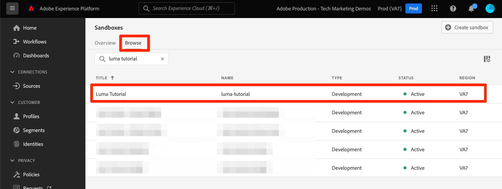

# Creare una sandbox

<!--25min-->

In questa lezione verrà creato un ambiente di sviluppo sandbox da utilizzare per il resto dell’esercitazione.

Le sandbox forniscono ambienti isolati in cui è possibile provare le funzionalità senza mescolare risorse e dati con l’ambiente di produzione. Per ulteriori dettagli, vedi [documentazione sulle sandbox](https://experienceleague.adobe.com/docs/experience-platform/sandbox/home.html?lang=it).

**Architetti di dati** e **Ingegneri dati** dovrà creare delle sandbox al di fuori di questa esercitazione.

Prima di iniziare gli esercizi, guarda questo breve video per ulteriori informazioni sulle sandbox:
>[!VIDEO](https://video.tv.adobe.com/v/29838/?quality=12&learn=on)

## Autorizzazioni richieste

In [Configurare le autorizzazioni](configure-permissions.md) Per completare questa lezione, è necessario impostare tutti i controlli di accesso necessari.

<!--
* Permission items **[!UICONTROL Sandbox Administration]** > **[!UICONTROL View Sandboxes]** and **[!UICONTROL Manage Sandboxes]**
* Permission item **[!UICONTROL Sandboxes]** > **[!UICONTROL Prod]**
* User-role access to the `Luma Tutorial Platform` product profile
* Admin-level access to the `Luma Tutorial Platform` product profile
-->

## Creare una sandbox

Creiamo una sandbox:

1. Accedi a [Adobe Experience Platform](https://experience.adobe.com/platform) Interfaccia
1. Vai a **[!UICONTROL Sandbox]** nel menu di navigazione a sinistra
1. Seleziona **[!UICONTROL Crea sandbox]** in alto a destra
   

1. Seleziona **[!UICONTROL Sviluppo]** come **[!UICONTROL Tipo]**
1. Denomina la sandbox `luma-tutorial` (provare ad aggiungere il proprio nome alla fine)
1. Assegna un titolo all’esercitazione `Luma Tutorial` (provare ad aggiungere il proprio nome alla fine)
1. Seleziona il pulante **[!UICONTROL Crea]**
   
   >[!NOTE]
   >
   >Anche se puoi utilizzare valori arbitrari per il nome e il titolo della sandbox, si consiglia di attenersi ai valori suggeriti, poiché faremo riferimento a queste etichette durante l’esercitazione. Se nell’organizzazione sono presenti più persone che completano questa esercitazione, puoi aggiungere il tuo nome alla fine del titolo e del nome della sandbox, ad esempio luma-tutorial-ignatiusjreilly.

La creazione delle sandbox richiede circa 30 secondi, durante i quali una &quot;[!UICONTROL Creazione]Viene visualizzato lo stato &quot;. Una volta creata, la sandbox viene visualizzata come &quot;[!UICONTROL Attivo]&quot;:

Attendi che la sandbox sia &quot;[!UICONTROL Attivo]&quot; prima di continuare con l&#39;esercizio successivo.

## Aggiungere la nuova sandbox al profilo di prodotto

Una volta che la sandbox è attiva, devi includerla nel tuo ruolo per poterla utilizzare. Per aggiungerlo al tuo ruolo (richiede i privilegi di amministratore di sistema o di amministratore di prodotto):

1. Vai a [!UICONTROL Autorizzazioni] screen
1. Apri `Luma Tutorial Platform` ruolo
1. _Rimuovi_ il `Prod` sandbox dal ruolo
1. Aggiungi il `Luma Tutorial` sandbox
1. Seleziona **[!UICONTROL Salva]**
1. Il giorno [!UICONTROL Sandbox] row, select **[!UICONTROL Modifica]**

   

1. Ricarica (o ricarica MAIUSC) la pagina e ora dovresti trovarti nel `Luma Tutorial` sandbox o dovrebbe apparire nel menu a discesa sandbox
1. Passa a `Luma Tutorial` sandbox, se non vi sei già iscritto

   

Bene, hai creato la sandbox e sei pronto per [Configurare Console sviluppatori e Postman](set-up-developer-console-and-postman.md)!
