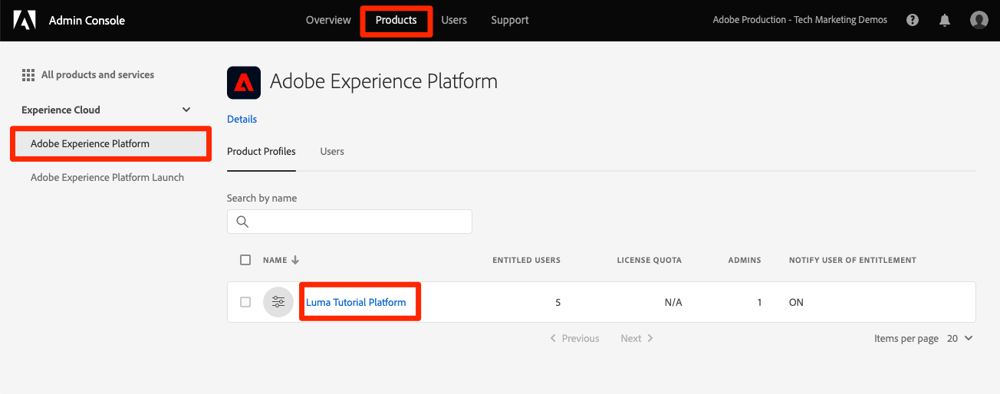

# Creare una sandbox

<!--25min-->

In questa lezione verrà creata una sandbox dell’ambiente di sviluppo da utilizzare per il resto dell’esercitazione.

Le sandbox forniscono ambienti isolati in cui è possibile provare funzionalità senza mescolare risorse e dati con l’ambiente di produzione. Per ulteriori dettagli, consulta la sezione [documentazione sandbox](https://experienceleague.adobe.com/docs/experience-platform/sandbox/home.html?lang=it).

**Architetti dei dati** e **Ingegneri dati** dovrà creare sandbox al di fuori di questa esercitazione.

Prima di iniziare gli esercizi, guarda questo breve video per ulteriori informazioni sulle sandbox:
>[!VIDEO](https://video.tv.adobe.com/v/29838/?quality=12&learn=on)

## Autorizzazioni necessarie

In [Configurare le autorizzazioni](configure-permissions.md) per completare la lezione, è necessario impostare tutti i controlli di accesso necessari.

<!--
* Permission items **[!UICONTROL Sandbox Administration]** > **[!UICONTROL View Sandboxes]** and **[!UICONTROL Manage Sandboxes]**
* Permission item **[!UICONTROL Sandboxes]** > **[!UICONTROL Prod]**
* User-role access to the `Luma Tutorial Platform` product profile
* Admin-level access to the `Luma Tutorial Platform` product profile
-->

## Creare una sandbox

Creiamo una sandbox:

1. Accedi al [Adobe Experience Platform](https://experience.adobe.com/platform) interfaccia
1. Vai a **[!UICONTROL Sandbox]** nella navigazione a sinistra
1. Seleziona **[!UICONTROL Creare una sandbox]** in alto a destra
   

1. Seleziona **[!UICONTROL Sviluppo]** come **[!UICONTROL Tipo]**
1. Denomina la sandbox `luma-tutorial` (considera l’aggiunta del nome alla fine)
1. Titolo dell’esercitazione `Luma Tutorial` (considera l’aggiunta del nome alla fine)
1. Seleziona il pulante **[!UICONTROL Crea]**
   
   >[!NOTE]
   >
   >Anche se puoi utilizzare valori arbitrari per il nome e il titolo della sandbox, è consigliabile applicare i valori suggeriti, in quanto faremo riferimento a queste etichette durante l’esercitazione. Se alla tua organizzazione sono presenti più persone che completano questa esercitazione, puoi aggiungere il tuo nome alla fine del titolo e del nome della sandbox, ad esempio luma-tutorial-ignatiusjreilly.

La creazione delle sandbox richiede circa 30 secondi, durante i quali un &quot;[!UICONTROL Creazione]&quot; viene visualizzato lo stato . Quando la sandbox è completamente creata, viene visualizzata come &quot;[!UICONTROL Attivo]&quot;:

Aspetta che la sandbox sia &quot;[!UICONTROL Attivo]&quot; prima di continuare l&#39;esercizio successivo.

## Aggiungere la nuova sandbox al profilo di prodotto

Una volta che la sandbox è attiva, è necessario includerla nel profilo di prodotto per utilizzarla. Per aggiungerlo al tuo profilo di prodotto:

1. In una scheda del browser separata, accedi al [Admin Console](https://adminconsole.adobe.com)
1. Vai a **[!UICONTROL Prodotti > Adobe Experience Platform]**
1. Apri `Luma Tutorial Platform` profilo

   

1. Vai a **[!UICONTROL Autorizzazioni]** scheda

1. Sulla [!UICONTROL Sandbox] riga, seleziona **[!UICONTROL Modifica]**

   

1. _Rimuovi_ la **[!UICONTROL Prod]** sandbox assegnato al profilo originariamente
1. Seleziona la **[!UICONTROL +]** per aggiungere il nuovo `Luma Tutorial` sandbox alla colonna di destra
1. Seleziona **[!UICONTROL Salva]** per salvare le autorizzazioni aggiornate

   

1. Torna alla scheda del browser con Experience Platform
1. Ricarica (o ricarica) la pagina e ora dovresti essere nel `Luma Tutorial` sandbox o dovrebbe apparire nel menu a discesa sandbox
1. Passa alla `Luma Tutorial` sandbox se non ci sei già

   

Ottimo, hai creato la tua sandbox e sei pronto per [Configurare Developer Console e Postman](set-up-developer-console-and-postman.md)!
