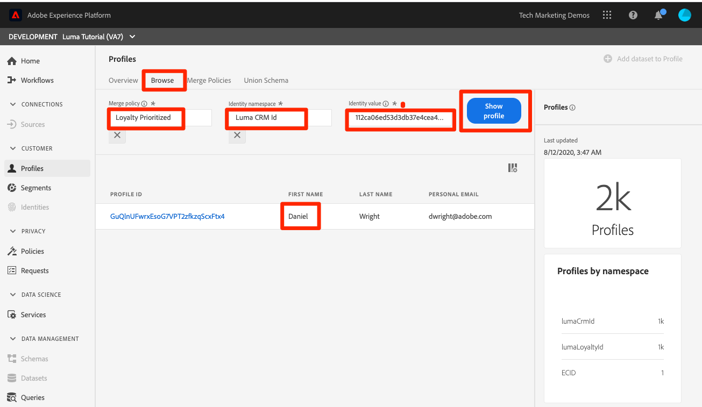

# Creare criteri di unione

<!--20 min-->

In questa lezione verranno creati criteri di unione per assegnare la priorità all’unione di più origini dati nei profili.

Adobe Experience Platform consente di unire dati provenienti da più origini e combinarli per ottenere una visualizzazione completa di ogni singolo cliente. Quando si riuniscono questi dati, i criteri di unione determinano il modo in cui viene assegnata la priorità ai dati e quali dati vengono combinati per creare tale vista unificata.

Per questa lezione verrà utilizzata l’interfaccia utente, ma sono disponibili opzioni API anche per la creazione di criteri di unione.

**Gli architetti di dati** dovranno creare criteri di unione al di fuori di questa esercitazione.

Prima di iniziare gli esercizi, guarda questo breve video per ulteriori informazioni sui criteri di unione:
>[!VIDEO](https://video.tv.adobe.com/v/330433?learn=on&enablevpops)

## Autorizzazioni richieste

Nella lezione [Configurare le autorizzazioni](configure-permissions.md) è possibile impostare tutti i controlli di accesso necessari per completare la lezione.

<!--* Permission items **[!UICONTROL Profile Management]** > **[!UICONTROL View Merge Policies]** and **[!UICONTROL Manage Merge Policies]**
* Permission item **[!UICONTROL Profile Management]** > **[!UICONTROL View Profiles]** and **[!UICONTROL Manage Profiles]**
* Permission item **[!UICONTROL Sandboxes]** > `Luma Tutorial`
* User-role access to the `Luma Tutorial Platform` product profile
-->

## Informazioni sui criteri di unione e sullo schema di unione

Forse ricordi che nella lezione sull’acquisizione in batch abbiamo caricato due record con informazioni leggermente diverse per lo stesso cliente. Nei dati [!DNL Loyalty], il nome del cliente era `Daniel` e risiedeva in `New York City`, ma nei dati CRM il nome del cliente era `Danny` e risiedeva in `Portland`. I dati dei clienti cambiano nel tempo. Forse è passato da `Portland` a `New York City`. Cambiano anche altre cose, come numeri di telefono e indirizzi e-mail. I criteri di unione consentono di decidere come gestire questi tipi di conflitti quando due origini dati forniscono informazioni diverse per lo stesso utente.

Allora, perché `Danny` ha vinto come nome? Diamo un&#39;occhiata:

1. Nell&#39;interfaccia utente di Platform, seleziona **[!UICONTROL Profili]** nell&#39;area di navigazione a sinistra
1. Passa alla scheda **[!UICONTROL Criteri di unione]**
1. Il criterio di unione predefinito è la marca temporale ordinata. Poiché hai caricato i dati CRM dopo i dati fedeltà, `Danny` ha vinto come nome nel profilo:

Quando più schemi sono abilitati per il profilo, viene automaticamente creato uno [!UICONTROL Schema unione] per tutti gli schemi di record abilitati per il profilo che condividono una classe base. Puoi visualizzare gli [!UICONTROL schemi unione] dalla scheda **[!UICONTROL Schema unione]**.

Non esiste uno schema di unione per la classe ExperienceEvent. Anche se i dati ExperienceEvent arrivano ancora nel profilo, poiché si basano su serie temporali, ogni evento include una marca temporale e un ID; le collisioni non rappresentano un problema.

E se non ti piace questo criterio di unione predefinito? E se Luma decidesse che il loro sistema di fedeltà dovrebbe essere la fonte di verità quando c’è un conflitto? A tale scopo, verrà creato un criterio di unione.

## Creare un criterio di unione nell’interfaccia utente

1. Nella schermata Criteri di unione, seleziona il pulsante **[!UICONTROL Crea criterio di unione]** in alto a destra
1. Come **[!UICONTROL Nome]**, immetti `Loyalty Prioritized`
1. Come **[!UICONTROL Schema]**, seleziona **[!UICONTROL Profilo XDM]** (tieni presente che la classe personalizzata, poiché si tratta di dati record, è disponibile anche per i criteri di unione)
1. Per **[!UICONTROL Unione ID]**, seleziona **[!UICONTROL Grafico privato]**
1. Per **[!UICONTROL Unione attributi]**, seleziona **[!UICONTROL Precedenza set di dati]**
1. Trascinare `Luma Loyalty Dataset` e `Luma CRM Dataset` nel pannello **[!UICONTROL Set di dati]**.
1. Assicurarsi che `Luma Loyalty Dataset` sia in primo piano trascinandolo e rilasciandolo sopra il `Luma CRM Dataset`
1. Seleziona il pulsante **[!UICONTROL Salva]**
   <!--do i need to explain Private Graph? Is that GA?-->
   

## Convalidare il criterio di unione

Vediamo se il criterio di unione sta facendo quello che ci aspetteremmo:

1. Passa alla scheda **[!UICONTROL Sfoglia]**
1. Modifica il **[!UICONTROL criterio di unione]** nel nuovo criterio `Loyalty Prioritized`
1. Come **[!UICONTROL spazio dei nomi Identity]**, utilizza `Luma CRM Id`
1. Poiché il **[!UICONTROL valore identità]** utilizza `112ca06ed53d3db37e4cea49cc45b71e`
1. Seleziona il pulsante **[!UICONTROL Mostra profilo]**
1. `Daniel` è tornato!

## Creare un criterio di unione con set di dati limitati

Quando si creano criteri di unione utilizzando la precedenza dei set di dati, nel profilo vengono inclusi solo i set di dati della stessa classe base inclusi a destra. Imposta un altro criterio di unione

1. Nella schermata Criteri di unione, seleziona il pulsante **[!UICONTROL Crea criterio di unione]** in alto a destra
1. Come **[!UICONTROL Nome]**, immetti `Loyalty Only`
1. Come **[!UICONTROL Schema]**, seleziona **[!UICONTROL Profilo XDM]**
1. Per **[!UICONTROL Unione ID]**, seleziona **[!UICONTROL Nessuna]**
1. Per **[!UICONTROL Unione attributi]**, seleziona **[!UICONTROL Precedenza set di dati]**
1. Trascinare solo il pannello `Luma Loyalty Dataset` nel **[!UICONTROL Set di dati selezionato]**.
1. Seleziona il pulsante **[!UICONTROL Salva]**

## Convalidare il criterio di unione

Vediamo ora quali sono le funzioni di questo criterio di unione:

1. Passa alla scheda **[!UICONTROL Sfoglia]**
1. Modifica il **[!UICONTROL criterio di unione]** nel nuovo criterio `Loyalty Only`
1. Come **[!UICONTROL spazio dei nomi Identity]**, utilizza `Luma CRM Id`
1. Poiché il **[!UICONTROL valore identità]** utilizza `112ca06ed53d3db37e4cea49cc45b71e`
1. Seleziona il pulsante **[!UICONTROL Mostra profilo]**
1. Conferma che non è stato trovato alcun profilo:
   

ID CRM è un campo di identità in `Luma Loyalty Dataset`, ma solo le identità primarie possono essere utilizzate per cercare i profili. Cerchiamo il profilo utilizzando l&#39;identità primaria `Luma Loyalty Id`&quot;

1. Cambia lo spazio dei nomi **[!UICONTROL Identity]** in `Luma Loyalty Id`
1. Poiché il **[!UICONTROL valore identità]** utilizza `5625458`
1. Seleziona il pulsante **[!UICONTROL Mostra profilo]**
1. Seleziona l’ID profilo per aprire il profilo
1. Passa alla scheda **[!UICONTROL Attributi]**
1. Altri dettagli del profilo dal set di dati CRM, come il numero di telefono cellulare e l’indirizzo e-mail, non sono disponibili perché solo
   
1. Passa alla scheda **[!UICONTROL Eventi]**
1. I dati ExperienceEvent sono disponibili nonostante non siano stati inclusi esplicitamente nei set di dati dei criteri di unione:
   

## Ulteriori informazioni sui criteri di unione

Nella ricerca del profilo, modificare il criterio di unione utilizzato in `Default Timebased` e selezionare il pulsante **[!UICONTROL Mostra profilo]**. Danny è tornato!

Cosa sta succedendo qui? Beh, l&#39;unione dei profili non è una cosa unica. I profili cliente in tempo reale vengono assemblati al volo, in base a vari fattori, tra cui il criterio di unione utilizzato. È possibile creare più criteri di unione da utilizzare in contesti diversi, a seconda della visualizzazione del cliente desiderata.

Un caso d’uso chiave per i criteri di unione è la governance dei dati. Ad esempio, supponiamo che tu acquisisca dati di terze parti in Platform che non possono essere utilizzati per casi di utilizzo di personalizzazione, ma che _possa_ essere utilizzato per casi di utilizzo pubblicitari. Puoi creare un criterio di unione che escluda questo set di dati di terze parti e utilizzarlo per creare segmenti per i casi di utilizzo pubblicitari.

## Risorse aggiuntive

* [Documentazione sui criteri di unione](https://experienceleague.adobe.com/docs/experience-platform/profile/merge-policies/overview.html)
* [Riferimento API per i criteri di unione (parte di Real-Time Customer Profile API)](https://www.adobe.io/experience-platform-apis/references/profile/#tag/Merge-policies)

Passiamo ora al [framework di governance dei dati](apply-data-governance-framework.md).
