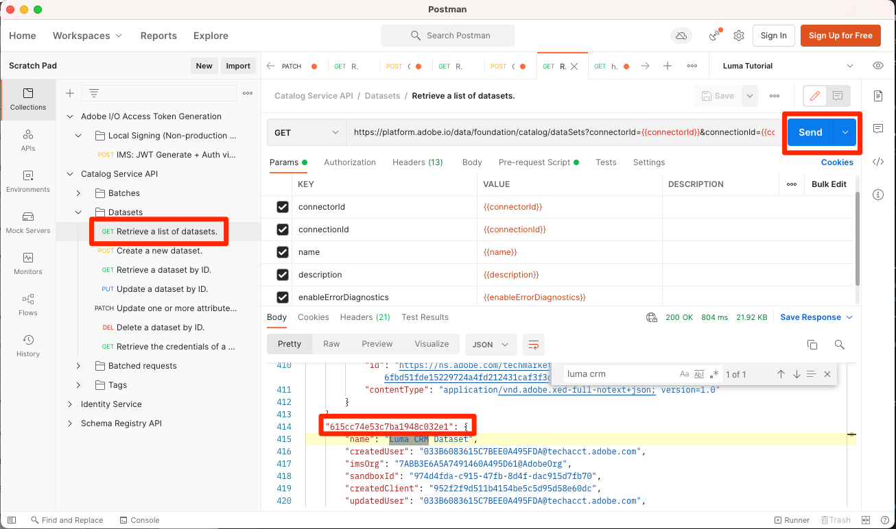

# Abilita profili cliente in tempo reale

<!-- 15min-->
In questa lezione, abiliterai gli schemi e i set di dati per il profilo cliente in tempo reale.

Ok, ho mentito quando ho detto che la lezione sui set di dati è stata la lezione più breve in questo tutorial: questo dovrebbe richiedere ancora meno tempo! Letteralmente, tutto quello che farete è ribaltare un mucchio di interruttori. Ma quello che succede quando si capovolgono questi interruttori è _davvero_ quindi volevo dedicarvi un&#39;intera pagina.

Con Profilo cliente in tempo reale puoi vedere una visualizzazione olistica di ogni singolo cliente che combina dati provenienti da più canali, inclusi dati online, offline, CRM e di terze parti. Il profilo ti consente di consolidare i dati dei tuoi clienti diversi in una visualizzazione unificata che offre un account utilizzabile e con marca temporale per ogni interazione con il cliente.

Per quanto sembri incredibile, non devi attivare *tutti i dati* per profilo. In realtà, devi solo abilitare i dati necessari per i casi d’uso di attivazione. Abilita i dati che desideri utilizzare per i casi d’uso di marketing, le integrazioni dei call center e così via, dove hai bisogno di un accesso rapido a un profilo cliente affidabile. Se carichi dati solo per l’analisi, probabilmente non dovrebbe essere abilitato per il profilo.

Ci sono importanti [protezioni per i dati del profilo cliente in tempo reale](https://experienceleague.adobe.com/docs/experience-platform/profile/guardrails.html?lang=en) che devi esaminare quando decidi quale dei tuoi dati devi abilitare per il profilo.

<!--is this accurate. Are there other considerations to point out? -->

**Architetti dei dati** dovrà abilitare Profilo cliente in tempo reale al di fuori di questa esercitazione.

Prima di iniziare gli esercizi, guarda questo breve video per saperne di più sul Profilo del cliente in tempo reale:
>[!VIDEO](https://video.tv.adobe.com/v/27251?quality=12&learn=on)

## Autorizzazioni necessarie

In [Configurare le autorizzazioni](configure-permissions.md) per completare la lezione, è necessario impostare tutti i controlli di accesso necessari.


<!--* Permission items **[!UICONTROL Data Modeling]** > **[!UICONTROL View Schemas]** and **[!UICONTROL Manage Schemas]**
* Permission items **[!UICONTROL Data Management]** > **[!UICONTROL View Datasets]** and **[!UICONTROL Manage Datasets]**
* Permission item **[!UICONTROL Sandboxes]** > `Luma Tutorial`
* User-role access to the `Luma Tutorial Platform` product profile
* Developer-role access to the `Luma Tutorial Platform` product profile (for API)
-->

## Abilitare gli schemi per il profilo cliente in tempo reale tramite l’interfaccia utente di Platform

Cominciamo con la semplice attività di abilitazione di uno schema:

1. Nell’interfaccia utente di Platform, apri la **Schema fedeltà Luma**
1. In **[!UICONTROL Proprietà schema]**, attiva/disattiva **Profilo** interruttore
1. Nella finestra modale di conferma, premi il pulsante **[!UICONTROL Abilita]** pulsante di conferma
1. Seleziona la **[!UICONTROL Salva]** per salvare le modifiche

   >[!IMPORTANT]
   >
   >Una volta abilitato lo schema per il profilo, non può essere disabilitato o eliminato. Inoltre, i campi non possono essere rimossi dallo schema dopo questo punto. Queste implicazioni sono importanti da tenere a mente in un secondo momento quando lavori con i tuoi dati nel tuo ambiente di produzione. In questa esercitazione dovresti utilizzare una sandbox di sviluppo che può essere eliminata in qualsiasi momento.
   >
   >Nell’ambiente controllato di questa esercitazione, abiliterai gli schemi e i set di dati per il profilo, _prima di acquisire qualsiasi dato_. Quando lavori con i tuoi dati, ti consigliamo di eseguire le operazioni nel seguente ordine:
   >
   > 1. Innanzitutto, acquisisci alcuni dati nei set di dati.
   > 1. Risolvere eventuali problemi che si verificano durante il processo di acquisizione dei dati (ad esempio, problemi di convalida o mappatura dei dati).
   > 1. Abilita i set di dati e gli schemi per il profilo
   > 1. Reinserire i dati


   

Facile a destra? Ripeti i passaggi precedenti per questo altro schema:

1. Schema catalogo prodotti Luma
1. Schema eventi di acquisto offline Luma
1. Schema eventi web Luma (nella finestra modale di conferma, seleziona la casella &quot;I dati per questo schema conterranno un’identità principale nel campo identityMap&quot;).

## Abilitare gli schemi per il profilo cliente in tempo reale tramite API di Platform

Ora, è il momento di abilitare `Luma CRM Schema` con l’API . Se vuoi saltare questo esercizio e abilitarlo nell&#39;interfaccia utente, vai subito avanti.

### Ottieni il meta:altId dello schema

Prima prendiamo il `meta:altId` del `Luma CRM Schema`:

1. Apri [!DNL Postman]
1. Se non hai effettuato una richiesta nelle ultime 24 ore, i token di autorizzazione probabilmente sono scaduti. Apri la richiesta **[!DNL Adobe I/O Access Token Generation > Local Signing (Non-production use-only) > IMS: JWT Generate + Auth via User Token]** e seleziona **Invia** per richiedere nuovi token JWT e di accesso, proprio come nel [!DNL Postman] lezione.
1. Apri la richiesta **[!DNL Schema Registry API > Schemas > Retrieve a list of schemas within the specified container.]**
1. Seleziona la **Invia** pulsante
1. Dovresti ricevere una risposta di 200
1. Cerca nella risposta per `Luma CRM Schema` e copia il `meta:altId` value
   

### Abilitare lo schema

Ora che abbiamo il meta:altId dello schema, possiamo abilitarlo per il profilo:

1. Apri la richiesta **[!DNL Schema Registry API > Schemas > Update one or more attributes of a custom schema specified by ID.]**
1. In **Parametri** incolla `meta:altId` come valore `SCHEMA_ID` valore param
1. In **Corpo** incolla il seguente codice

   ```json
   [{
       "op": "add",
       "path": "/meta:immutableTags",
       "value": ["union"]
   }]
   ```

1. Seleziona la **Invia** pulsante
1. Dovresti ricevere una risposta di 200

   

Dovresti essere in grado di vedere nell’interfaccia utente che tutti e cinque gli schemi sono abilitati per Profilo (potrebbe essere necessario SHIFT-Reload per vedere che `Luma CRM Schema` è abilitato):


## Abilitare i set di dati per il profilo cliente in tempo reale tramite l’interfaccia utente di Platform

I set di dati devono essere abilitati anche per Profilo e il processo è ancora più semplice:

1. Nell’interfaccia utente di Platform, apri la `Luma Loyalty Dataset`
1. Attiva/disattiva la **[!UICONTROL Profilo]** interruttore
1. Nella finestra modale di conferma, premi il pulsante **[!UICONTROL Abilita]** pulsante di conferma

   

Ripeti i passaggi precedenti per gli altri set di dati:

1. Set di dati del catalogo prodotti Luma
1. Dataset per eventi di acquisto offline Luma
1. Set di dati per eventi web Luma

>[!NOTE]
>
>A differenza degli schemi, puoi disabilitare i set di dati da Profilo, tuttavia tutti i dati precedentemente acquisiti rimarranno in Profilo.

## Abilitare i set di dati per il profilo cliente in tempo reale tramite API di Platform

Ora abiliterai un set di dati per Profilo utilizzando l’API . Anche in questo caso, se desideri attivarlo tramite l&#39;interfaccia utente utilizzando il metodo precedente, va bene anche questo.

### Ottieni l’id del set di dati

Per prima cosa dobbiamo ottenere il `id` del `Luma CRM Dataset`:

1. Apri [!DNL Postman]
1. Se non hai effettuato una richiesta nelle ultime 24 ore, i token di autorizzazione probabilmente sono scaduti. Apri la richiesta **[!DNL Adobe I/O Access Token Generation > Local Signing (Non-production use-only) > IMS: JWT Generate + Auth via User Token]** e seleziona **Invia** per richiedere nuovi token JWT e di accesso, proprio come nel [!DNL Postman] lezione.
1. Apri la richiesta **[!DNL Catalog Service API > Datasets > Retrieve a list of datasets.]**
1. Seleziona la **Invia** pulsante
1. Dovresti ricevere una risposta di 200
1. Cerca nella risposta per `Luma CRM Dataset` e copia l&#39;id:
   

### Abilitare il set di dati

Ora che abbiamo l’id del set di dati, possiamo abilitarlo per profilo:

1. Apri la richiesta **[!DNL Catalog Service API > Datasets > Update one or more attributes of a dataset specified by ID.]**
1. In **Parametri** aggiorna `DATASET_ID` valore personalizzato
1. In **Corpo** , incolla il seguente codice. I primi due valori sono tag preesistenti visibili nella risposta precedente. Devono essere inclusi nel corpo, oltre ai due nuovi tag che stiamo aggiungendo:

   ```json
   {
       "tags":{
           "adobe/pqs/table":["luma_crm_dataset"],
           "adobe/siphon/table/format":["parquet"],
           "unifiedProfile":["enabled:true"],
           "unifiedIdentity":["enabled:true"]
           }
   }
   ```

1. Seleziona la **Invia** pulsante
1. Dovresti ricevere una risposta di 200

   

Puoi anche confermare che l’interfaccia utente mostra il set di dati abilitato:


>[!IMPORTANT]
>
> Se si acquisiscono dati prima di abilitare lo schema e il set di dati per il profilo, sarà necessario riacquisire tali dati in seguito.

## Risorse aggiuntive

* [Documentazione del Profilo cliente in tempo reale](https://experienceleague.adobe.com/docs/experience-platform/profile/home.html?lang=it)
* [Riferimento API per il profilo cliente in tempo reale](https://www.adobe.io/experience-platform-apis/references/profile/)


**Ingegneri dati** devono continuare a [Iscriviti agli eventi di inserimento dati](subscribe-to-data-ingestion-events.md) lezione.
**Architetti dei dati** _può saltare_ e vai al [lezione di acquisizione batch](ingest-batch-data.md).
