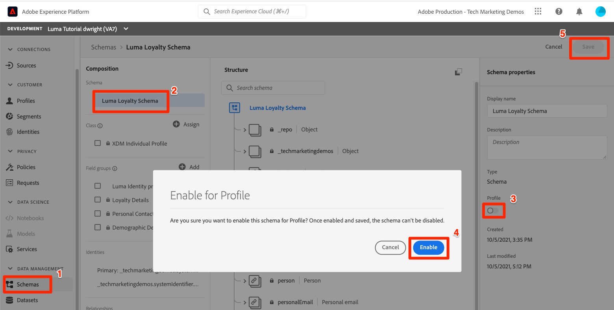
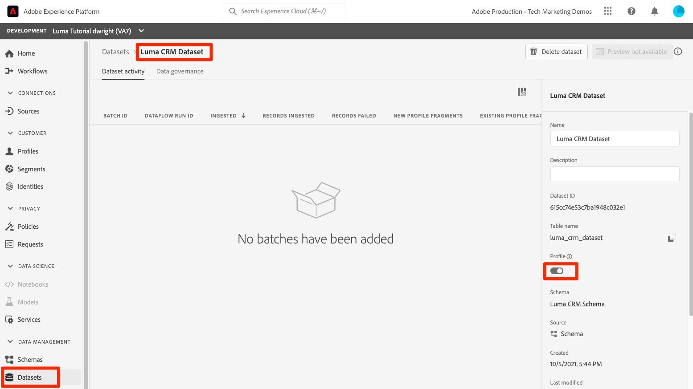

# Abilita profili cliente in tempo reale

<!-- 15min-->
In questa lezione, abiliterai gli schemi e i set di dati per Real-Time Customer Profile.

Ok, ho mentito quando ho detto che la lezione sui set di dati era la lezione più breve di questa esercitazione. Questa dovrebbe richiedere ancora meno tempo! Letteralmente tutto quello che farete è invertire una serie di interruttori. Ma ciò che accade quando si capovolgono questi interruttori è _davvero_ importante, quindi ho voluto dedicarvi un&#39;intera pagina.

Con Real-Time Customer Profile puoi visualizzare una visualizzazione olistica di ogni singolo cliente che combina dati provenienti da più canali, inclusi dati online, offline, del sistema CRM e di terze parti. Il profilo ti consente di consolidare i diversi dati dei clienti in una visualizzazione unificata che offre un account utilizzabile e con marca temporale per ogni interazione con il cliente.

Per quanto sembri incredibile, non è necessario attivare *tutti i tuoi dati* per il profilo. In realtà, devi abilitare solo i dati necessari per i casi di utilizzo dell’attivazione. Abilita i dati che desideri utilizzare per casi di utilizzo di marketing, integrazioni di call center e così via, dove devi accedere rapidamente a un solido profilo cliente. Se carichi i dati solo per l’analisi, è probabile che non sia necessario abilitarli per il profilo.

Ci sono importanti [guardrail per i dati Real-Time Customer Profile](https://experienceleague.adobe.com/docs/experience-platform/profile/guardrails.html?lang=en) che dovresti esaminare quando decidi quali dei tuoi dati abilitare per il profilo.

<!--is this accurate. Are there other considerations to point out? -->

**Architetti di dati** dovrà abilitare Real-Time Customer Profile al di fuori di questa esercitazione.

Prima di iniziare gli esercizi, guarda questo breve video per ulteriori informazioni sul profilo cliente in tempo reale:
>[!VIDEO](https://video.tv.adobe.com/v/27251?quality=12&learn=on)

## Autorizzazioni richieste

In [Configurare le autorizzazioni](configure-permissions.md) Per completare questa lezione, è necessario impostare tutti i controlli di accesso necessari.


<!--* Permission items **[!UICONTROL Data Modeling]** > **[!UICONTROL View Schemas]** and **[!UICONTROL Manage Schemas]**
* Permission items **[!UICONTROL Data Management]** > **[!UICONTROL View Datasets]** and **[!UICONTROL Manage Datasets]**
* Permission item **[!UICONTROL Sandboxes]** > `Luma Tutorial`
* User-role access to the `Luma Tutorial Platform` product profile
* Developer-role access to the `Luma Tutorial Platform` product profile (for API)
-->

## Abilitare gli schemi per Real-Time Customer Profile tramite l’interfaccia utente di Platform

Iniziamo con la semplice attività di abilitazione di uno schema:

1. Nell’interfaccia utente di Platform, apri la sezione **Schema fedeltà Luma**
1. In entrata **[!UICONTROL Proprietà schema]**, attiva/disattiva **Profilo** switch
1. Nella finestra modale di conferma, premi **[!UICONTROL Abilita]** pulsante per confermare
1. Seleziona la **[!UICONTROL Salva]** per salvare le modifiche

   >[!IMPORTANT]
   >
   >Una volta che uno schema è abilitato per il profilo, non può essere disabilitato o eliminato. Inoltre, i campi non possono essere rimossi dallo schema dopo questo punto. Queste implicazioni sono importanti da tenere presenti in un secondo momento quando si lavora con i propri dati nell’ambiente di produzione. In questa esercitazione dovresti utilizzare una sandbox di sviluppo, che può essere eliminata in qualsiasi momento.
   >
   >Nell’ambiente controllato di questa esercitazione, abiliterai gli schemi e i set di dati per il profilo, _prima di acquisire qualsiasi dato_. Quando lavori con i tuoi dati, ti consigliamo di eseguire le operazioni nel seguente ordine:
   >
   > 1. Innanzitutto, acquisisci alcuni dati nei set di dati.
   > 1. Risolvi eventuali problemi che sorgono durante il processo di acquisizione dei dati (ad esempio, problemi di convalida o mappatura dei dati).
   > 1. Abilitare i set di dati e gli schemi per il profilo
   > 1. Riacquisire i dati


   

Facile, vero? Ripeti i passaggi precedenti per questi altri schemi:

1. Schema catalogo prodotti Luma
1. Schema eventi di acquisto offline Luma
1. Schema eventi web Luma (nella finestra modale di conferma, seleziona la casella &quot;I dati per questo schema conterranno un’identità primaria nel campo identityMap&quot;).

## Abilitare gli schemi per Real-Time Customer Profile tramite API Platform

Ora è il momento di abilitare `Luma CRM Schema` con l’API. Se desideri saltare questo esercizio e abilitarlo nell’interfaccia utente, procedi subito.

### Ottenere il meta:altId dello schema

Per prima cosa, prendiamo `meta:altId` del `Luma CRM Schema`:

1. Apri [!DNL Postman]
1. Se non hai un token di accesso, apri la richiesta **[!DNL OAuth: Request Access Token]** e seleziona **Invia** per richiedere un nuovo token di accesso, proprio come hai fatto in [!DNL Postman] lezione.
1. Apri la richiesta **[!DNL Schema Registry API > Schemas > Retrieve a list of schemas within the specified container.]**
1. Seleziona la **Invia** pulsante
1. Dovresti ricevere una risposta 200
1. Cerca nella risposta per `Luma CRM Schema` elemento e copia `meta:altId` valore
   

### Abilita lo schema

Ora che disponiamo del meta:altId dello schema, è possibile abilitarlo per il profilo:

1. Apri la richiesta **[!DNL Schema Registry API > Schemas > Update one or more attributes of a custom schema specified by ID.]**
1. In **Parametri** incolla il `meta:altId` valore come `SCHEMA_ID` valore param
1. In **Corpo** , incolla il seguente codice

   ```json
   [{
       "op": "add",
       "path": "/meta:immutableTags",
       "value": ["union"]
   }]
   ```

1. Seleziona la **Invia** pulsante
1. Dovresti ricevere una risposta 200

   

Dovresti essere in grado di vedere nell’interfaccia utente che tutti e cinque gli schemi sono abilitati per Profilo (potrebbe essere necessario premere MAIUSC e Ricarica per vedere che `Luma CRM Schema` è attivato):


## Abilitare i set di dati per Real-Time Customer Profile tramite l’interfaccia utente di Platform

I set di dati devono essere abilitati anche per Profilo e il processo è ancora più semplice:

1. Nell’interfaccia utente di Platform, apri la sezione `Luma Loyalty Dataset`
1. Attiva/disattiva **[!UICONTROL Profilo]** switch
1. Nella finestra modale di conferma, premi **[!UICONTROL Abilita]** pulsante per confermare

   

Ripeti i passaggi precedenti per questi altri set di dati:

1. Set di dati catalogo prodotti Luma
1. Set di dati eventi di acquisto offline Luma
1. Set di dati di eventi web Luma

>[!NOTE]
>
>A differenza degli schemi, puoi disabilitare i set di dati da Profilo, tuttavia tutti i dati precedentemente acquisiti rimarranno in Profilo.

## Abilitare i set di dati per Real-Time Customer Profile utilizzando l’API di Platform

Ora abiliterai un set di dati per il profilo utilizzando l’API. Anche in questo caso, se desideri abilitarla tramite l’interfaccia utente utilizzando il metodo precedente, va bene.

### Ottieni l’ID del set di dati

Prima di tutto dobbiamo ottenere `id` del `Luma CRM Dataset`:

1. Apri [!DNL Postman]
1. Se non hai un token di accesso, apri la richiesta **[!DNL OAuth: Request Access Token]** e seleziona **Invia** per richiedere un nuovo token di accesso, proprio come hai fatto in [!DNL Postman] lezione.
1. Apri la richiesta **[!DNL Catalog Service API > Datasets > Retrieve a list of datasets.]**
1. Seleziona la **Invia** pulsante
1. Dovresti ricevere una risposta 200
1. Cerca nella risposta per `Luma CRM Dataset` elemento e copia l&#39;id:
   

### Abilitare il set di dati

Ora che abbiamo l’ID del set di dati, possiamo abilitarlo per il profilo:

1. Apri la richiesta **[!DNL Catalog Service API > Datasets > Update one or more attributes of a dataset specified by ID.]**
1. In **Parametri** aggiorna il `DATASET_ID` valore personalizzato
1. In **Corpo** , incolla il seguente codice. I primi due valori sono tag preesistenti visibili nella risposta precedente. Devono essere inclusi nel corpo, oltre ai due nuovi tag che stiamo aggiungendo:

   ```json
   {
       "tags":{
           "adobe/pqs/table":["luma_crm_dataset"],
           "adobe/siphon/table/format":["parquet"],
           "unifiedProfile":["enabled:true"],
           "unifiedIdentity":["enabled:true"]
           }
   }
   ```

1. Seleziona la **Invia** pulsante
1. Dovresti ricevere una risposta 200

   

Puoi anche verificare che l’interfaccia utente mostri che il set di dati è abilitato:


>[!IMPORTANT]
>
> Se acquisisci i dati prima di abilitare lo schema e il set di dati per il profilo, dovrai riacquisirli in seguito.

## Risorse aggiuntive

* [Documentazione del profilo cliente in tempo reale](https://experienceleague.adobe.com/docs/experience-platform/profile/home.html?lang=it)
* [Riferimento API del profilo cliente in tempo reale](https://www.adobe.io/experience-platform-apis/references/profile/)


**Ingegneri dati** deve continuare a [Iscriviti agli eventi di acquisizione dati](subscribe-to-data-ingestion-events.md) lezione.
**Architetti di dati** _può andare avanti_ e vai al [lezione di acquisizione batch](ingest-batch-data.md).
