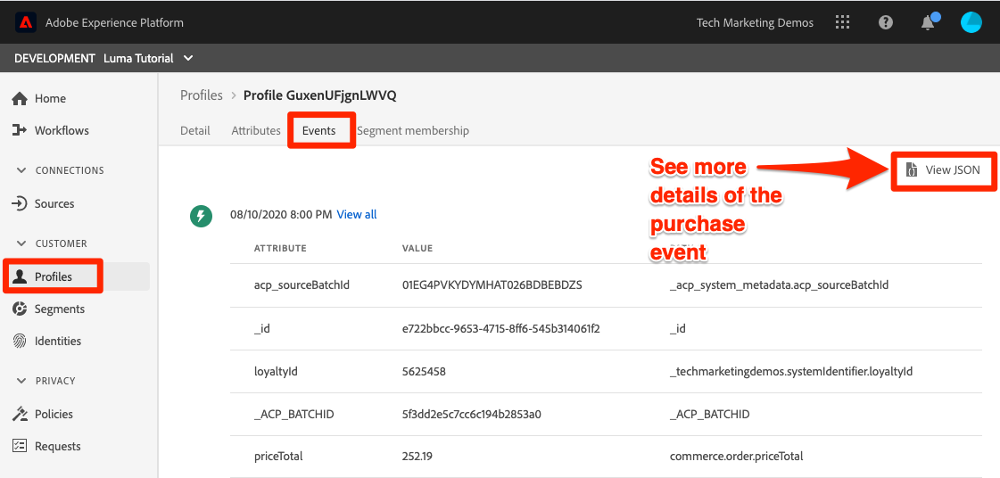

# Inserire dati batch

<!-- 1hr-->
In questa lezione, i dati batch verranno inseriti in Experience Platform utilizzando vari metodi.

L’inserimento di dati in batch consente di acquisire una grande quantità di dati in Adobe Experience Platform contemporaneamente. Puoi acquisire dati batch in un caricamento una sola volta nell’interfaccia di Platform o utilizzando l’API. Puoi anche configurare caricamenti batch pianificati regolarmente da servizi di terze parti, come i servizi di archiviazione cloud, utilizzando i connettori sorgente.

**Ingegneri dati** dovrà acquisire dati batch al di fuori di questa esercitazione.

Prima di iniziare gli esercizi, guarda questo breve video per ulteriori informazioni sull’inserimento dei dati:
>[!VIDEO](https://video.tv.adobe.com/v/27106?quality=12&learn=on)


## Autorizzazioni necessarie

In [Configurare le autorizzazioni](configure-permissions.md) per completare la lezione, è necessario impostare tutti i controlli di accesso necessari.

<!--
* Permission item **[!UICONTROL Data Management]** > **[!UICONTROL View Datasets]**, **[!UICONTROL Manage Datasets]** and **[!UICONTROL Data Monitoring]**
* Permission items **[!UICONTROL Data Ingestion]** > **[!UICONTROL View Sources]** and **[!UICONTROL Manage Sources]**
* Permission item **[!UICONTROL Profile Management]** > **[!UICONTROL View Profiles]**
* Permission item **[!UICONTROL Sandboxes]** > `Luma Tutorial`
* User-role access to the `Luma Tutorial Platform` product profile
* Developer-role access to the `Luma Tutorial Platform` product profile (for API)
-->

Per l&#39;esercizio Origini dovrai accedere a un server (S)FTP o a una soluzione di archiviazione cloud. Esiste una soluzione alternativa se non ne hai una.

## Inserire dati in batch con l’interfaccia utente di Platform

I dati possono essere caricati direttamente in un set di dati nella schermata dei set di dati in formati JSON e parquet. Questo è un ottimo modo per testare l’acquisizione di alcuni dei tuoi dati dopo la creazione di un

### Scaricare e preparare i dati

Innanzitutto, ottieni i dati di esempio e personalizzali per il tenant:

>[!NOTE]
>
>Dati contenuti nel [luma-data.zip](assets/luma-data.zip) Il file è fittizio e deve essere utilizzato solo a scopo dimostrativo.

1. Scarica [luma-data.zip](assets/luma-data.zip) al tuo **Risorse tutorial Luma** cartella.
1. Decomprimere il file, creando una cartella denominata `luma-data` che contiene i quattro file di dati che utilizzeremo in questa lezione
1. Apri `luma-loyalty.json` in un editor di testo e sostituisci tutte le istanze di `_techmarketingdemos` con il tuo id underscore-tenant, come visto nei tuoi schemi:
   

1. Salva il file aggiornato

### Inserire i dati

1. Nell’interfaccia utente di Platform, seleziona **[!UICONTROL Set di dati]** nella navigazione a sinistra
1. Apri il tuo `Luma Loyalty Dataset`
1. Scorri verso il basso fino a visualizzare la **[!UICONTROL Aggiungi dati]** nella colonna di destra
1. Carica il `luma-loyalty.json` file.
1. Una volta caricato il file, verrà visualizzata una riga per il batch
1. Se ricarichi la pagina dopo alcuni minuti, dovresti vedere che il batch è stato caricato con successo con 1000 record e 1000 frammenti di profilo.

   
<!--do i need to explain error diagnostics and partial ingestion-->

>[!NOTE]
>
>Ci sono alcune opzioni, **[!UICONTROL Diagnostica degli errori]** e **[!UICONTROL Acquisizione parziale]**, che verrà visualizzato su varie schermate in questa lezione. Queste opzioni non sono incluse nell’esercitazione. Informazioni rapide:
>
>* L’abilitazione della diagnostica degli errori genera dati sull’acquisizione dei dati, che puoi quindi esaminare utilizzando l’API di accesso ai dati. Ulteriori informazioni su [la documentazione](https://experienceleague.adobe.com/docs/experience-platform/data-access/home.html).
>* L’acquisizione parziale consente di acquisire dati contenenti errori, fino a una determinata soglia da specificare. Ulteriori informazioni su [la documentazione](https://experienceleague.adobe.com/docs/experience-platform/ingestion/batch/partial.html)


### Convalidare i dati

Esistono alcuni modi per confermare che i dati sono stati acquisiti correttamente.

#### Convalida nell’interfaccia utente di Platform

Per confermare che i dati sono stati acquisiti nel set di dati:

1. Nella stessa pagina in cui hai acquisito i dati, seleziona la **[!UICONTROL Anteprima set di dati]** pulsante in alto a destra
1. Seleziona la **Anteprima** e dovresti essere in grado di visualizzare alcuni dei dati acquisiti.

   


Per confermare che i dati sono atterrati in Profilo (potrebbero essere necessari alcuni minuti per l’atterraggio dei dati):

1. Vai a **[!UICONTROL Profili]** nella navigazione a sinistra
1. Seleziona l’icona accanto alla **[!UICONTROL Seleziona spazio dei nomi identità]** campo per aprire il modale
1. Seleziona la tua `Luma Loyalty Id` namespace
1. Quindi inserisci uno dei `loyaltyId` i valori del set di dati,  `5625458`
1. Seleziona **[!UICONTROL Visualizza]**

   

#### Convalida con eventi di acquisizione dati

Se hai effettuato l’abbonamento agli eventi di acquisizione dati della lezione precedente, controlla l’URL univoco del sito webhook.site. Dovresti visualizzare tre richieste nell’ordine seguente, con un po’ di tempo tra loro, con le seguenti `eventCode` valori:

1. `ing_load_success`—il batch così acquisito
1. `ig_load_success`—il batch è stato acquisito nel grafico dell&#39;identità
1. `ps_load_success`—il batch è stato acquisito nel servizio profilo


Consulta la sezione [documentazione](https://experienceleague.adobe.com/docs/experience-platform/ingestion/quality/subscribe-events.html#available-status-notification-events) per maggiori dettagli sulle notifiche.

## Inserire dati in batch con API Platform

Ora carichiamo i dati utilizzando l’API.

>[!NOTE]
>
>Architetti dei dati, sentiti libero di caricare i dati CRM tramite il metodo dell&#39;interfaccia utente.

### Scaricare e preparare i dati

1. Dovresti aver già scaricato e decompresso [luma-data.zip](assets/luma-data.zip) nella `Luma Tutorial Assets` cartella.
2. Apri `luma-crm.json` in un editor di testo e sostituisci tutte le istanze di `_techmarketingdemos` con il tuo id underscore-tenant, come visto nei tuoi schemi
3. Salva il file aggiornato

### Ottieni l&#39;ID del set di dati

Prima prendiamo l’id dell’id del set di dati in cui vogliamo acquisire i dati:

1. Apri [!DNL Postman]
1. Se non hai effettuato una richiesta nelle ultime 24 ore, i token di autorizzazione probabilmente sono scaduti. Apri la richiesta **[!DNL Adobe I/O Access Token Generation > Local Signing (Non-production use-only) > IMS: JWT Generate + Auth via User Token]** e seleziona **Invia** per richiedere nuovi token JWT e di accesso, proprio come nel [!DNL Postman] lezione.
1. Apri le variabili di ambiente e assicurati che il valore di **CONTAINER_ID** è ancora `tenant`
1. Apri la richiesta **[!DNL Catalog Service API > Datasets > Retrieve a list of datasets.]** e seleziona **Invia**
1. Dovresti prendere un `200 OK` response
1. Copia l&#39;id del `Luma CRM Dataset` dal corpo della risposta
   

### Crea il batch

Ora possiamo creare un batch nel set di dati:

1. Scarica [API.postman_collection.json per l’acquisizione dei dati](https://raw.githubusercontent.com/adobe/experience-platform-postman-samples/master/apis/experience-platform/Data%20Ingestion%20API.postman_collection.json) al tuo `Luma Tutorial Assets` cartella
1. Importa la raccolta in [!DNL Postman]
1. Seleziona la richiesta **[!DNL Data Ingestion API > Batch Ingestion > Create a new batch in Catalog Service.]**
1. Incolla quanto segue come **Corpo** della richiesta, ***sostituzione del valore datasetId con il proprio***:

   ```json
   {
       "datasetId":"REPLACE_WITH_YOUR_OWN_DATASETID",
       "inputFormat": {
           "format": "json"
       }
   }
   ```

1. Seleziona la **Invia** pulsante
1. Dovresti ottenere una risposta Creato 201 contenente l&#39;id del nuovo batch!
1. Copia il `id` del nuovo lotto
   

### Inserire i dati

Ora è possibile caricare i dati nel batch:

1. Seleziona la richiesta **[!DNL Data Ingestion API > Batch Ingestion > Upload a file to a dataset in a batch.]**
1. In **Parametri** , inserisci l’id set di dati e l’id batch nei rispettivi campi
1. In **Parametri** scheda , immetti `luma-crm.json` come **filePath**
1. In **Corpo** seleziona la scheda **binario** opzione
1. Seleziona il download `luma-crm.json` dal tuo locale `Luma Tutorial Assets` cartella
1. Seleziona **Invia** e si dovrebbe ottenere una risposta 200 OK con &#39;1&#39; nel corpo di risposta

   

A questo punto, se guardi il batch nell’interfaccia utente di Platform, vedrai che si trova in un &quot;[!UICONTROL Caricamento]&quot; stato:


Poiché l’API Batch viene spesso utilizzata per caricare più file, devi informare Platform al termine di un batch, operazione che eseguiremo nel passaggio successivo.

### Completa il batch

Per completare il batch:

1. Seleziona la richiesta **[!DNL Data Ingestion API > Batch Ingestion > Finish uploading a file to a dataset in a batch.]**
1. In **Parametri** scheda , immetti `COMPLETE` come **action**
1. In **Parametri** , immetti il tuo id batch. Non preoccuparti dell&#39;id del set di dati o del filePath, se presenti.
1. Assicurati che l’URL del POST sia `https://platform.adobe.io/data/foundation/import/batches/:batchId?action=COMPLETE` e che non vi siano riferimenti inutili al `datasetId` o `filePath`
1. Seleziona **Invia** e si dovrebbe ottenere una risposta 200 OK con &#39;1&#39; nel corpo di risposta

   

### Convalidare i dati

#### Convalida nell’interfaccia utente di Platform

Convalida che i dati siano atterrati nell’interfaccia utente di Platform come per il set di dati fedeltà.

Innanzitutto, conferma il batch mostrando che sono stati acquisiti 1000 record:


Successivamente, confermare il batch utilizzando il set di dati di anteprima:


Infine, conferma che uno dei profili è stato creato ricercando uno dei profili dal `Luma CRM Id` spazio dei nomi, ad esempio `112ca06ed53d3db37e4cea49cc45b71e`


C&#39;è una cosa interessante che è appena successa e che voglio sottolineare. Apri `Danny Wright` profilo. Il profilo ha sia un `Lumacrmid` e `Lumaloyaltyid`. Ricorda `Luma Loyalty Schema` conteneva due campi di identità, ID fedeltà Luma e ID CRM. Dopo aver caricato entrambi i set di dati, si sono uniti in un singolo profilo. I dati sulla fedeltà avevano `Daniel` come nome e &quot;New York City&quot; come indirizzo di casa, mentre i dati CRM avevano `Danny` come nome e `Portland` come indirizzo di origine del cliente con lo stesso ID fedeltà. Torneremo al motivo per cui viene visualizzato il nome `Danny` nella lezione sui criteri di unione.

Congratulazioni, hai appena unito i profili!


#### Convalida con eventi di acquisizione dati

Se hai effettuato l’abbonamento agli eventi di acquisizione dati della lezione precedente, controlla l’URL univoco del sito webhook.site. Dovresti vedere arrivare tre richieste, proprio come con i dati fedeltà:


Consulta la sezione [documentazione](https://experienceleague.adobe.com/docs/experience-platform/ingestion/quality/subscribe-events.html#available-status-notification-events) per maggiori dettagli sulle notifiche.

## Inserire dati con flussi di lavoro

Vediamo un altro modo per caricare i dati. La funzione flussi di lavoro ti consente di acquisire dati CSV che non sono già modellati in XDM.

### Scaricare e preparare i dati

1. Dovresti aver già scaricato e decompresso [luma-data.zip](assets/luma-data.zip) nella `Luma Tutorial Assets` cartella.
1. Conferma di avere`luma-products.csv`

### Creare un flusso di lavoro

Ora configura il flusso di lavoro:

1. Vai a **[!UICONTROL Flussi di lavoro]** nella navigazione a sinistra
1. Seleziona **[!UICONTROL Mappatura di CSV su schema XDM]** e seleziona la **[!UICONTROL Launch]** pulsante
   
1. Seleziona la tua `Luma Product Catalog Dataset` e seleziona la **[!UICONTROL Successivo]** pulsante
   
1. Aggiungi il `luma-products.csv` file scaricato e seleziona il **[!UICONTROL Successivo]** pulsante
   
1. Ora ti trovi nell’interfaccia di mappatura, in cui puoi mappare un campo dai dati di origine (uno dei nomi di colonna nel `luma-products.csv` file) in campi XDM nello schema di destinazione. Nel nostro esempio, i nomi delle colonne sono sufficientemente vicini ai nomi dei campi dello schema che il mappatore è in grado di rilevare automaticamente la mappatura corretta. Se il mappatore non è stato in grado di rilevare automaticamente il campo di destra, seleziona l’icona a destra del campo di destinazione per selezionare il campo XDM corretto. Inoltre, se non desideri acquisire una delle colonne dal CSV, puoi eliminare la riga dal mappatore. Sentiti libero di giocare e cambiare le intestazioni di colonna nel `luma-products.csv` per acquisire familiarità con il funzionamento della mappatura.
1. Seleziona la **[!UICONTROL Fine]** pulsante
   

### Convalidare i dati

Una volta caricato il batch, verifica il caricamento visualizzando in anteprima il set di dati.

Dal momento che `Luma Product SKU` è uno spazio dei nomi non personale, non verranno visualizzati profili per lo SKU del prodotto.

Dovresti vedere i tre risultati al tuo webhook.

## Inserire dati con Origini

Ok, hai fatto le cose nel modo più difficile. Ora spostiamoci nella terra promessa di _automatizzato_ ingestione batch! Quando dico, &quot;IMPOSTALO!&quot; tu dici: &quot;DIMENTICALO!&quot; &quot;IMPOSTALO!&quot; &quot;DIMENTICALO!&quot; &quot;IMPOSTALO!&quot; &quot;DIMENTICALO!&quot; Scherzavo, non faresti mai una cosa del genere! Ok, torna al lavoro. Hai quasi finito.

Vai a **[!UICONTROL Origini]** nel menu di navigazione a sinistra per aprire il catalogo Sorgenti. Qui puoi trovare diverse integrazioni pronte all’uso con i provider di dati e storage leader del settore.


Ok, assimiliamo i dati utilizzando un connettore sorgente.

Questo esercizio sarà scegliere lo stile della tua avventura. Sto per mostrare il flusso di lavoro utilizzando il connettore di origine FTP. Puoi utilizzare un connettore sorgente Cloud Storage diverso utilizzato nella tua azienda oppure caricare il file json utilizzando l’interfaccia utente del set di dati, come abbiamo fatto con i dati fedeltà.

Molte delle origini dispongono di un flusso di lavoro di configurazione simile, in cui:

1. Immetti i dettagli di autenticazione
1. Seleziona i dati da acquisire
1. Seleziona il set di dati della piattaforma in cui desideri inserirlo
1. Mappare i campi nello schema XDM
1. Scegli la frequenza con cui desideri inserire i dati da quella posizione

>[!NOTE]
>
>I dati di acquisto offline che utilizzeremo in questo esercizio contengono dati datetime. I dati di datetime devono essere in [Stringhe formattate ISO 8061](https://www.iso.org/iso-8601-date-and-time-format.html) (&quot;2018-07-10T15:05:59.000-08:00&quot;) o Tempo Unix formattato in millisecondi (1531263959000) e convertito al momento dell’acquisizione nel tipo XDM di destinazione. Per ulteriori informazioni sulla conversione dei dati e altri vincoli, consulta [documentazione API per l’acquisizione in batch](https://experienceleague.adobe.com/docs/experience-platform/ingestion/batch/api-overview.html#types).

### Scarica, prepara e carica i dati sul fornitore di archiviazione cloud preferito

1. Dovresti aver già scaricato e decompresso [luma-data.zip](assets/luma-data.zip) nella `Luma Tutorial Assets` cartella.
1. Apri `luma-offline-purchases.json` in un editor di testo e sostituisci tutte le istanze di `_techmarketingdemos` con il tuo id underscore-tenant, come visto nei tuoi schemi
1. Aggiorna tutte le marche temporali in modo che gli eventi si verifichino nell’ultimo mese (ad esempio, cerca `"timestamp":"2022-06` e sostituiscono l&#39;anno e il mese)
1. Scegliere il provider di archiviazione cloud preferito, verificando che sia disponibile nella [!UICONTROL Origini] catalogo
1. Carica `luma-offline-purchases.json` a una posizione nel provider di archiviazione cloud preferito

### Inserire i dati nella posizione di archiviazione cloud preferita

1. Nell’interfaccia utente di Platform , filtra le [!UICONTROL Origini] catalogare in **[!UICONTROL archiviazione cloud]**
1. Tieni presente che sono disponibili collegamenti utili alla documentazione nella sezione `...`
1. Nella casella del fornitore di archiviazione Cloud preferito, seleziona la **[!UICONTROL Configura]** pulsante
   
1. **[!UICONTROL Autenticazione]** è il primo passo. Immetti il nome dell’account, ad esempio `Luma's FTP Account` e i dettagli di autenticazione. Questo passaggio deve essere abbastanza simile per tutte le origini di archiviazione cloud, anche se i campi possono variare leggermente. Una volta inseriti i dettagli di autenticazione per un account, puoi riutilizzarli per altre connessioni di origine che potrebbero inviare dati diversi su pianificazioni diverse da altri file nello stesso account
1. Seleziona la **[!UICONTROL Pulsante Connetti alla sorgente]**
1. Quando Platform si è connessa correttamente all’origine, seleziona la **[!UICONTROL Successivo]** pulsante
   

1. Sulla **[!UICONTROL Seleziona dati]** l&#39;interfaccia utente utilizza le credenziali per aprire la cartella nella soluzione di archiviazione cloud
1. Seleziona i file da acquisire, ad esempio `luma-offline-purchases.json`
1. Come **[!UICONTROL Formato dati]**, seleziona `XDM JSON`
1. Puoi quindi visualizzare in anteprima la struttura json e i dati di esempio nel file .
1. Seleziona la **[!UICONTROL Successivo]** pulsante
   

1. Sulla **[!UICONTROL Mappatura]** seleziona il `Luma Offline Purchase Events Dataset` e seleziona la **[!UICONTROL Successivo]** pulsante . Nel messaggio viene visualizzato un messaggio che indica che, poiché i dati da acquisire sono un file JSON, non esiste un passaggio di mappatura in cui il campo di origine viene mappato al campo di destinazione. I dati JSON devono essere già in XDM. Se acquisisci un CSV, in questo passaggio viene visualizzata l’interfaccia utente di mappatura completa:
   
1. Sulla **[!UICONTROL Pianificazione]** scegli la frequenza con cui desideri inserire i dati dall&#39;origine. Date un&#39;occhiata alle opzioni. Faremo solo un&#39;ingestione una tantum, quindi lasciamo la **[!UICONTROL Frequenza]** su **[!UICONTROL Una volta]** e seleziona la **[!UICONTROL Successivo]** pulsante:
   
1. Sulla **[!UICONTROL Dettaglio flusso di dati]** al passaggio , puoi scegliere un nome per il flusso di dati, immettere una descrizione facoltativa, attivare la diagnostica degli errori e l’acquisizione parziale. Lascia le impostazioni così come sono e seleziona la **[!UICONTROL Successivo]** pulsante:
   
1. Sulla **[!UICONTROL Revisione]** puoi rivedere tutte le impostazioni insieme e modificarle o selezionare la **[!UICONTROL Fine]** pulsante
1. Dopo il salvataggio si aprirà su uno schermo come questo:
   

### Convalidare i dati

Una volta caricato il batch, verifica il caricamento visualizzando in anteprima il set di dati.

Dovresti vedere i tre risultati al tuo webhook.

Cerca il profilo con il valore `5625458` in `loyaltyId` Nuovo spazio dei nomi per verificare se nel profilo sono presenti eventi di acquisto. Dovresti visualizzare un acquisto. Puoi approfondire i dettagli dell’acquisto selezionando **[!UICONTROL Visualizzare JSON]**:



## Strumenti ETL

Partner di Adobe con più fornitori ETL per supportare l’inserimento dei dati in Experience Platform. A causa della varietà di fornitori di terze parti, ETL non è incluso in questa esercitazione, anche se puoi rivedere alcune di queste risorse:

* [Sviluppo di integrazioni ETL per Adobe Experience Platform](https://experienceleague.adobe.com/docs/experience-platform/etl/home.html)
* [Pagina Connettore Adobe Experience Platform Informatica su Adobe Exchange](https://exchange.adobe.com/experiencecloud.details.101570.informatica-adobe-experience-cloud-connector.html)
* [Documentazione Informatica del connettore Adobe Experience Platform ](https://docs.informatica.com/integration-cloud/cloud-data-integration-connectors/current-version/adobe-experience-platform-connector/preface.html)
* [Esperienze di pubblico univoche derivate dai dati: Unifi e Adobe Experience Platform](https://unifisoftware.com/solutions/adobe-experience-platform/)
* [[!DNL Snaplogic] Adobe Experience Platform Snap Pack](https://www.snaplogic.com/resources/videos/august-2020-aep)

## Risorse aggiuntive

* [Documentazione sull’acquisizione in batch](https://experienceleague.adobe.com/docs/experience-platform/ingestion/batch/overview.html)
* [Riferimento API per l’acquisizione in batch](https://www.adobe.io/experience-platform-apis/references/data-ingestion/#tag/Batch-Ingestion)

Ora... [trasmettere dati tramite l’SDK per web](ingest-streaming-data.md)
