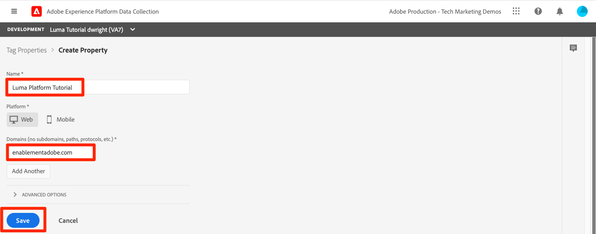

# Acquisire dati in streaming

<!--1hr-->

In questa lezione verrà illustrato lo streaming dei dati tramite Adobe Experience Platform Web SDK.

Nell’interfaccia di Data Collection è necessario completare due attività principali:

* Dobbiamo implementare Web SDK sul sito web Luma per inviare i dati sull’attività del visitatore dal sito web alla rete Edge di Adobe. Verrà eseguita una semplice implementazione utilizzando i tag (precedentemente Launch)

* Dobbiamo configurare un flusso di dati che indichi alla rete Edge dove inoltrare i dati. Verrà configurato per inviare i dati al set di dati `Luma Web Events` nella sandbox di Platform.

**I Data Engineer** dovranno acquisire i dati in streaming all&#39;esterno di questa esercitazione. Quando si implementano gli SDK per web o dispositivi mobili di Adobe Experience Platform, in genere uno sviluppatore web o mobile è coinvolto nella creazione del livello dati e nella configurazione delle proprietà dei tag.

Prima di iniziare gli esercizi, guarda questi due brevi video per ulteriori informazioni sull’acquisizione di dati in streaming e sul Web SDK:

>[!VIDEO](https://video.tv.adobe.com/v/28425?learn=on&enablevpops)

>[!VIDEO](https://video.tv.adobe.com/v/34141?learn=on&enablevpops)

>[!NOTE]
>
>Questo tutorial è incentrato sull&#39;acquisizione in streaming da siti Web con Web SDK, ma puoi anche eseguire lo streaming dei dati utilizzando [Adobe Mobile SDK](https://developer.adobe.com/client-sdks/documentation/), [Apache Kafka Connect](https://github.com/adobe/experience-platform-streaming-connect) e altri meccanismi.

## Autorizzazioni richieste

Nella lezione [Configurare le autorizzazioni](configure-permissions.md) è possibile impostare tutti i controlli di accesso necessari per completare la lezione.

<!--
* Permission items **[!UICONTROL Launch]** > **[!UICONTROL Property Rights]** > **[!UICONTROL Approve]**, **[!UICONTROL Develop]**, **[!UICONTROL Manage Environments]**, **[!UICONTROL Manage Extensions]**, and **[!UICONTROL Publish]**
* Permission item **[!UICONTROL Launch]** > **[!UICONTROL Company Rights]** > **[!UICONTROL Manage Properties]**
* User-role access to the `Luma Tutorial Launch` product profile
* Admin-role access to the `Luma Tutorial Launch` product profile
* Permission items **[!UICONTROL Platform]** > **[!UICONTROL Data Ingestion]** > **[!UICONTROL View Sources]** and **[!UICONTROL Manage Sources]**
* Permission items **[!UICONTROL Platform]** > **[!UICONTROL Data Management]** > **[!UICONTROL View Datasets]** and **[!UICONTROL Manage Datasets]**
* Permission items **[!UICONTROL Platform]** > **[!UICONTROL Profiles]** > **[!UICONTROL View Profiles]**, **[!UICONTROL Manage Profiles]** and **[!UICONTROL Export Audience Segment]**
* Permission item **[!UICONTROL Platform]** > **[!UICONTROL Sandbox Administration]** > **[!UICONTROL View Sandboxes]**
* Permission item **[!UICONTROL Platform]** > **[!UICONTROL Sandboxes]** > `Luma Tutorial`
* User-role access to the `Luma Tutorial Platform` product profile
-->

<!--## Create a streaming source

1. Log into the [Experience Platform  user interface](https://experience.adobe.com/platform/)
1. Go to **[!UICONTROL Sources]** in the left navigation
1. Filter the list by selecting **[!UICONTROL Streaming]**
1. In the **[!UICONTROL HTTP API]** section, select the **[!UICONTROL Configure]** button
    
1. On the **[!UICONTROL Authentication]** step, enter `Luma Web Events Source` as the **[!UICONTROL Account name]** and select the **[!UICONTROL Connect to source]** button (we don't need to enable authentication since the data will be originating from website visitors)
    
1. Once connected, select the **[!UICONTROL Next]** button to proceed to the next step in the workflow
1. On the **[!UICONTROL Select data]** step, choose **[!UICONTROL Existing Dataset]**, select your `Luma Web Events Dataset`, and then select the **[!UICONTROL Next]** button
    
1. On the **[!UICONTROL Dataflow detail]** step, select the **[!UICONTROL Next]** button:
    
    <!--What is a good practice for naming the data flow vs the source-->
<!--
1. On the **[!UICONTROL Review]** step, review your source details and select the **[!UICONTROL Finish]** button:
    
-->

## Configurare lo stream di dati

Innanzitutto configureremo lo stream di dati. Un flusso di dati indica alla rete Edge di Adobe dove inviare i dati dopo averli ricevuti dalla chiamata al Web SDK. Ad esempio, desideri inviare i dati ad Experience Platform, Adobe Analytics o Adobe Target? Gli stream di dati vengono gestiti nell’interfaccia utente di Data Collection (precedentemente Launch) e sono fondamentali per la raccolta dei dati con Web SDK.

Per creare il [!UICONTROL flusso di dati]:

1. Accedi all&#39;interfaccia utente di [Experience Platform Data Collection](https://experience.adobe.com/launch/)
   <!--when will the edge config go live?-->

1. Seleziona **[!UICONTROL Datastreams]** nel menu di navigazione a sinistra
1. Seleziona il pulsante **[!UICONTROL Nuovo flusso di dati]** nell&#39;angolo superiore destro

   

1. Per **[!UICONTROL Nome descrittivo]**, immetti `Luma Platform Tutorial` (aggiungi il tuo nome alla fine, se più persone della tua azienda stanno seguendo questa esercitazione)
1. Seleziona il pulsante **[!UICONTROL Salva]**

   

Nella schermata successiva, specifica dove desideri inviare i dati. Per inviare dati ad Experience Platform:

1. Attiva **[!UICONTROL Adobe Experience Platform]** per esporre campi aggiuntivi
1. Per **[!UICONTROL Sandbox]**, seleziona `Luma Tutorial`
1. Per **[!UICONTROL Set di dati evento]**, selezionare `Luma Web Events Dataset`
1. Se utilizzi altre applicazioni Adobe, puoi esplorare le altre sezioni per vedere quali informazioni sono necessarie nella configurazione Edge di queste altre soluzioni. Il Web SDK è stato sviluppato non solo per inviare dati in streaming ad Experience Platform, ma anche per sostituire tutte le precedenti librerie JavaScript utilizzate da altre applicazioni Adobe. La configurazione di Edge viene utilizzata per specificare i dettagli dell’account di ogni applicazione a cui si desidera inviare i dati.
1. Seleziona **[!UICONTROL Salva]**
   

Una volta salvata la configurazione di Edge, nella schermata risultante vengono visualizzati tre ambienti creati per lo sviluppo, la gestione temporanea e la produzione. È possibile aggiungere altri ambienti di sviluppo:

Tutti e tre gli ambienti contengono i dettagli della piattaforma appena immessi. Tuttavia, questi dettagli possono essere configurati in modo diverso in base all’ambiente. Ad esempio, ogni ambiente potrebbe inviare dati a una sandbox di Platform diversa. In questa esercitazione, non verranno effettuate ulteriori personalizzazioni del flusso di dati.

## Installare l’estensione Web SDK

### Aggiungi una proprietà

Innanzitutto, è necessario creare una proprietà tag (in precedenza una proprietà tag ). Una proprietà è un contenitore per tutte le JavaScript, le regole e le altre funzioni necessarie per raccogliere i dettagli da una pagina web e inviarli a varie posizioni.

Per creare una proprietà:

1. Vai a **[!UICONTROL Proprietà]** nel menu di navigazione a sinistra
1. Seleziona il pulsante **[!UICONTROL Nuova proprietà]**
   
1. Come **[!UICONTROL Nome]**, immetti `Luma Platform Tutorial` (aggiungi il tuo nome alla fine, se più persone della tua azienda stanno seguendo questa esercitazione)
1. Come **[!UICONTROL Domini]**, immetti `enablementadobe.com` (spiegato più tardi)
1. Seleziona **[!UICONTROL Salva]**
   

<!--
After saving the property, you might see an error message like the one below. If so, this is because you don't actually have access to the property you just created. To fix this, we need to go to the Admin Console to give yourself access:
    

To give yourself access to the property:

1. In a separate browser tab, log into the [Admin Console](https://adminconsole.adobe.com/)
1. Go to **[!UICONTROL Products]** from the top navigation
1. Select **[!UICONTROL Adobe Experience Platform Launch]** on the left navigation
1. Go to your `Luma Tutorial Launch` product profile
1. Go to the **[!UICONTROL Permissions]** tab
1. On the **[!UICONTROL Properties]** row, select **[!UICONTROL Edit]**
    
1. Select the "+" icon to move your `Luma Platform Tutorial` property to the right-hand side and select the **[!UICONTROL Save]** button to update the permissions
   
    

Now switch back to your browser tab with the Data Collection interface still open. Reload the page and the `Luma Platform Tutorial` property should display in the list. Select to open the property:

-->

## Aggiungere l&#39;estensione Web SDK

Ora che disponi di una proprietà puoi aggiungere il Web SDK utilizzando un’estensione. Un’estensione è un pacchetto di codice che estende l’interfaccia e la funzionalità di Data Collection. Per aggiungere l&#39;estensione:

1. Apri la proprietà tag
1. Vai a **[!UICONTROL Estensioni]** nel menu di navigazione a sinistra
1. Passa alla scheda **[!UICONTROL Catalogo]**
1. Sono disponibili molte estensioni per i tag. Filtra il catalogo con il termine `Web SDK`
1. Nell&#39;estensione **[!UICONTROL Adobe Experience Platform Web SDK]**, selezionare il pulsante **[!UICONTROL Installa]**
   
1. Sono disponibili diverse configurazioni per l’estensione Web SDK, ma ne verranno configurate solo due per questa esercitazione. Aggiorna il dominio **[!UICONTROL Edge]** in `data.enablementadobe.com`. Questa impostazione ti consente di impostare cookie di prime parti con l’implementazione di Web SDK, il che è consigliato. Più avanti in questa lezione verrà mappato un sito Web del dominio `enablementadobe.com` alla proprietà tag. Il CNAME per il dominio `enablementadobe.com` è già stato configurato in modo che `data.enablementadobe.com` venga inoltrato ai server Adobe. Quando si implementa Web SDK sul proprio sito Web, sarà necessario creare un CNAME per le proprie finalità di raccolta dati, ad esempio `data.YOUR_DOMAIN.com`
1. Dal menu a discesa **[!UICONTROL Datastream]**, seleziona il tuo `Luma Platform Tutorial` datastream.
1. Puoi esaminare le altre opzioni di configurazione (ma non modificarle!), quindi seleziona **[!UICONTROL Salva]**
   <!--is edge domain required for first party? when will it break?-->
   <!--any other fields that should be highlighted-->
   

## Creare una regola per inviare dati

Ora creeremo una regola per inviare dati a Platform. Una regola è una combinazione di eventi, condizioni e azioni che indicano ai tag di eseguire un’operazione. Per creare una regola:

1. Vai a **[!UICONTROL Regole]** nel menu di navigazione a sinistra
1. Seleziona il pulsante **[!UICONTROL Crea nuova regola]**
   
1. Denomina la regola `All Pages - Library Loaded`
1. In **[!UICONTROL Eventi]**, seleziona il pulsante **[!UICONTROL Aggiungi]**
   
1. Utilizza l&#39;**[!UICONTROL Core]** **[!UICONTROL Estensione]** e seleziona **[!UICONTROL Library Loaded (Page Top)]** come **[!UICONTROL Event Type]**. Questa impostazione significa che la regola viene attivata ogni volta che la libreria Launch viene caricata su una pagina.
1. Seleziona **[!UICONTROL Mantieni modifiche]** per tornare alla schermata della regola principale
   
1. Lascia vuote **[!UICONTROL Condizioni]**, poiché vogliamo che questa regola venga attivata su tutte le pagine in base al nome che le abbiamo assegnato
1. In **[!UICONTROL Azioni]**, seleziona il pulsante **[!UICONTROL Aggiungi]**
1. Utilizza **[!UICONTROL Adobe Experience Platform Web SDK]** **[!UICONTROL Estensione]** e seleziona **[!UICONTROL Invia evento]** come **[!UICONTROL Tipo azione]**
1. A destra, seleziona **[!UICONTROL web.webpagedetails.pageViews]** dal menu a discesa **[!UICONTROL Tipo]**. Questo è uno dei campi XDM in `Luma Web Events Schema`
1. Seleziona **[!UICONTROL Mantieni modifiche]** per tornare alla schermata della regola principale
   
1. Seleziona **[!UICONTROL Salva]** per salvare la regola\
   

## Pubblicare la regola in una libreria

Ora pubblicheremo la regola nel nostro ambiente di sviluppo in modo da poter verificare che funzioni.

<!--
There are a few quick steps we must take in the **[!UICONTROL Publishing]** section of Launch.

### Create a host

Launch libraries can be hosted on Adobe's Content Delivery Network (CDN) or on your own servers. In this tutorial, we will use Adobe's CDN since it is faster to set up:

1. Go to **[!UICONTROL Hosts]** in the left navigation
1. Select the **[!UICONTROL Create New Host]** button
       
1. For the **[!UICONTROL Name]**, enter `Adobe CDN`
1. For the **[!UICONTROL Type]**, select **[!UICONTROL Managed by Adobe]**
1. Select the **[!UICONTROL Save]** button to complete the setup of the host
       

### Create an environment

Environments allow you to have different versions of a library in different publishing environments to accommodate your publishing workflow. For example, the fully tested version of your library can be published to a Production environment, while new changes are being created in a Development environment. You can also use different hosts for each environment. To create an environment:

1. Go to **[!UICONTROL Environments]** in the left navigation
1. Select the **[!UICONTROL Create New Environment]** button
     
1. Under **[!UICONTROL Development]** select **[!UICONTROL Select]**   
     
1. For the **[!UICONTROL Name]**, enter `Development`
1. For the **[!UICONTROL Select Host]** dropdown, select `Adobe CDN`
1. Select the **[!UICONTROL Save]** button to complete the setup of the environment
    
1. You will see a modal with URL and other implementation details of this library. These are critical for a real Launch implementation, but we don't need to worry about them for this tutorial. Select the **[!UICONTROL Close]** button to exit the modal.

### Create and publish the library

Now let's bundle the contents of our property&mdash;currently an extension and a rule&mdash;into a library. 
-->

Per creare una libreria:

1. Vai a **[!UICONTROL Flusso di pubblicazione]** nel menu di navigazione a sinistra
1. Seleziona **[!UICONTROL Aggiungi libreria]**
   
1. Per **[!UICONTROL Name]**, immetti `Luma Platform Tutorial`
1. Per l&#39;**[!UICONTROL ambiente]**, selezionare `Development`
1. Selezionare il pulsante **[!UICONTROL Aggiungi tutte le risorse modificate]**. Oltre all&#39;estensione [!UICONTROL Adobe Experience Platform Web SDK] e alla regola `All Pages - Library Loaded`, verrà aggiunta l&#39;estensione [!UICONTROL Core] che contiene il JavaScript di base richiesto da tutte le proprietà Web di Launch.
1. Seleziona il pulsante **[!UICONTROL Salva e genera per sviluppo]**
   

La creazione della libreria potrebbe richiedere alcuni minuti e al termine viene visualizzato un punto verde a sinistra del nome della libreria:

Come puoi vedere nella schermata [!UICONTROL Flusso di pubblicazione], il processo di pubblicazione richiede molto di più, il che va oltre l&#39;ambito di questa esercitazione. Utilizzeremo un’unica libreria nel nostro ambiente di sviluppo.

## Convalidare i dati nella richiesta

### Aggiungere Adobe Experience Platform Debugger

Experience Platform Debugger è un’estensione disponibile per i browser Chrome e Firefox che consente di visualizzare la tecnologia Adobe implementata nelle pagine web. Scarica la versione per il browser preferito:

* [Estensione Firefox](https://addons.mozilla.org/it/firefox/addon/adobe-experience-platform-dbg/)
* [Estensione Chrome](https://chrome.google.com/webstore/detail/adobe-experience-platform/bfnnokhpnncpkdmbokanobigaccjkpob)

Se non hai mai utilizzato il debugger prima, e questo è diverso dal precedente Adobe Experience Cloud Debugger, potresti voler guardare questo video di panoramica di cinque minuti:

>[!VIDEO](https://video.tv.adobe.com/v/32156?learn=on&enablevpops)

### Apri il sito web Luma.

Per questo tutorial, utilizziamo una versione del sito web demo Luma in hosting pubblico. Apriamolo e aggiungiamo un segnalibro:

1. In una nuova scheda del browser, apri il [sito Web Luma](https://luma.enablementadobe.com/content/luma/us/en.html).
1. Aggiungi ai segnalibri la pagina da utilizzare nel resto dell’esercitazione

Per questo sito in hosting abbiamo utilizzato `enablementadobe.com` nel campo [!UICONTROL Domini] della configurazione iniziale della proprietà tag e `data.enablementadobe.com` come dominio di prime parti nell&#39;estensione [!UICONTROL Adobe Experience Platform Web SDK]. Vedi, avevo un piano!

### Utilizza Experience Platform Debugger per eseguire il mapping alla proprietà tag

Experience Platform Debugger dispone di una funzione interessante che consente di sostituire una proprietà tag esistente con una diversa. Questo è utile per la convalida e ci consente di saltare molti passaggi di implementazione in questa esercitazione.

1. Assicurati di avere aperto il sito Luma e seleziona l’icona dell’estensione Experience Platform Debugger
1. Debugger si aprirà e mostrerà alcuni dettagli dell’implementazione hardcoded, che non è correlata a questa esercitazione (potrebbe essere necessario ricaricare il sito Luma dopo aver aperto Debugger)
1. Verifica che il debugger sia &quot;**[!UICONTROL connesso a Luma]**&quot; come illustrato di seguito, quindi seleziona l&#39;icona &quot;**[!UICONTROL blocca]**&quot; per bloccare il debugger sul sito Luma.
1. Seleziona il pulsante **[!UICONTROL Accedi]** in alto a destra per eseguire l&#39;autenticazione.
1. Vai ora a **[!UICONTROL Launch]** nel menu di navigazione a sinistra
1. Seleziona la scheda Configurazione.
1. A destra della visualizzazione dei **[!UICONTROL Codici di incorporamento pagina]**, apri il menu a discesa **[!UICONTROL Azioni]** e seleziona **[!UICONTROL Sostituisci]**
   
1. Poiché sei autenticato, il Debugger estrae le proprietà e gli ambienti di Launch disponibili. Seleziona la proprietà `Luma Platform Tutorial`
1. Seleziona l&#39;ambiente `Development`
1. Seleziona il pulsante **[!UICONTROL Applica]**
   
1. Il sito Web Luma ricaricherà _con la tua proprietà tag_. Aiuto, sono stato attaccato! Sto scherzando.
   
1. Vai a **[!UICONTROL Riepilogo]** nella barra di navigazione a sinistra per visualizzare i dettagli della proprietà [!UICONTROL Launch]
   
1. Vai ora a **[!UICONTROL AEP Web SDK]** nell&#39;area di navigazione a sinistra per visualizzare le **[!UICONTROL richieste di rete]**
1. Apri la riga **[!UICONTROL events]**

   
1. Nota come è possibile visualizzare il tipo di evento `web.webpagedetails.pageView` specificato nell&#39;azione [!UICONTROL Invia evento] e altre variabili predefinite conformi al formato `AEP Web SDK ExperienceEvent Mixin`
   
1. Questi tipi di dettagli della richiesta sono visibili anche nella scheda **Network** degli strumenti per sviluppatori Web del browser. Apri e ricarica la pagina. Filtra le chiamate con `interact` per individuare la chiamata, selezionala e cerca nella scheda **Intestazioni**, **Payload richiesta**.
   
1. Vai alla scheda **Risposta** e osserva come il valore ECID è incluso nella risposta. Copia questo valore così come lo utilizzerai per convalidare le informazioni sul profilo nell’esercizio successivo.
   

## Convalidare i dati in Experience Platform

È possibile verificare che i dati siano in arrivo in Platform osservando i batch di dati in arrivo in `Luma Web Events Dataset`. (Lo so, si chiama acquisizione di dati in streaming, ma ora sto dicendo che arriva in batch! Viene inviato in streaming al profilo in tempo reale, quindi può essere utilizzato per la segmentazione e l’attivazione in tempo reale, ma viene inviato in batch ogni 15 minuti al data lake.)

Per convalidare i dati:

1. Nell&#39;interfaccia utente di Platform, vai a **[!UICONTROL Set di dati]** nell&#39;area di navigazione a sinistra
1. Aprire `Luma Web Events Dataset` e verificare che sia arrivato un batch. Ricordati che vengono inviati ogni 15 minuti, quindi potrebbe essere necessario attendere la visualizzazione del batch.
1. Seleziona il pulsante **[!UICONTROL Anteprima set di dati]**
   
1. Nella finestra modale di anteprima, tieni presente come selezionare diversi campi dello schema a sinistra per visualizzare in anteprima tali punti dati specifici:
   

Puoi anche verificare che il nuovo profilo sia visualizzato:

1. Nell&#39;interfaccia utente di Platform, vai a **[!UICONTROL Profili]** nell&#39;area di navigazione a sinistra
1. Seleziona lo spazio dei nomi **[!UICONTROL ECID]** e cerca il valore ECID (copialo dalla risposta). Il profilo avrà un proprio ID, separato dall’ECID.
1. Seleziona **[!UICONTROL ID profilo]** per aprire il profilo
   
1. Seleziona la scheda **[!UICONTROL Eventi]** per visualizzare le pagine visualizzate
   \
   <!---->

## Aggiungere dati personalizzati all’evento

### Creare un elemento dati per nome pagina

1. Nell&#39;interfaccia dei tag di raccolta dati, nell&#39;angolo in alto a destra della proprietà `Luma Platform Tutorial`, apri il menu a discesa **[!UICONTROL Seleziona una libreria di lavoro]** e seleziona la libreria `Luma Platform Tutorial`. Questa impostazione semplifica la pubblicazione di aggiornamenti aggiuntivi alla libreria.
1. Vai ora a **[!UICONTROL Elementi dati]** nel menu di navigazione a sinistra
1. Seleziona il pulsante **[!UICONTROL Crea nuovo elemento dati]**

   
1. Come **[!UICONTROL Nome]**, immetti `Page Name`
1. Come **[!UICONTROL Tipo di elemento dati]**, selezionare `JavaScript Variable`
1. Come **[!UICONTROL nome variabile JavaScript]**, immetti `digitalData.page.pageInfo.pageName`
1. Per semplificare la standardizzazione del formato dei valori, selezionare le caselle per **[!UICONTROL Forza valori minuscoli]** e **[!UICONTROL Pulisci testo]**
1. Assicurarsi che `Luma Platform Tutorial` sia selezionato come libreria di lavoro
1. Seleziona **[!UICONTROL Salva nella libreria]**
   

### Mappare il nome della pagina all’elemento dati Oggetto XDM

Ora mapperemo il nome della nostra pagina al Web SDK.

>[!IMPORTANT]
>
>Per completare questa attività, è necessario assicurarsi che l’utente abbia prima accesso alla sandbox di Prod. Se non hai già accesso alla sandbox Prod da un profilo di prodotto diverso, apri rapidamente il profilo `Luma Tutorial Platform` e aggiungi l&#39;elemento di autorizzazione **[!UICONTROL Sandbox]** > **[!UICONTROL Prod]**. Dopo aver eseguito questa operazione, effettua un MAIUSC-Ricarica nella pagina Elementi dati per cancellare la cache
>

Nella pagina **[!UICONTROL Elementi dati]**:

1. Creare un nuovo elemento dati
1. Come **[!UICONTROL Nome]**, immetti `XDM Object`
1. Come **[!UICONTROL Estensione]**, seleziona `Adobe Experience Platform Web SDK`
1. Come **[!UICONTROL Tipo di elemento dati]**, selezionare `XDM object`
1. Seleziona la sandbox `Luma Tutorial` come **[!UICONTROL Sandbox]**
1. Come **[!UICONTROL Schema]**, seleziona `Luma Web Events Schema`
1. Seleziona il campo `web.webPageDetails.name`
1. Come **[!UICONTROL Valore]**, seleziona l&#39;icona per aprire la selezione modale dell&#39;elemento dati e scegli l&#39;elemento dati `Page Name`
1. Seleziona **[!UICONTROL Salva nella libreria]**
   

Lo stesso processo viene utilizzato per mappare dati personalizzati aggiuntivi sul sito web ai campi XDM.

### Aggiungere i dati XDM all’azione Invia evento

Ora che hai mappato i dati sui campi XDM, puoi includerli nell’azione Invia evento:

1. Vai alla schermata **[!UICONTROL Regole]**
1. Apri la regola `All Pages - Library Loaded`
1. Apri l&#39;azione `Adobe Experience Platform Web SDK - Send Event`
1. Come **[!UICONTROL dati XDM]**, seleziona l&#39;icona per aprire la selezione modale dell&#39;elemento dati e scegli l&#39;elemento dati `XDM Object`
1. Seleziona il pulsante **[!UICONTROL Mantieni modifiche]**
   
1. Ora, poiché hai selezionato `Luma Platform Tutorial` come libreria di lavoro per gli ultimi esercizi, le modifiche recenti sono state salvate direttamente nella libreria. Invece di pubblicare le modifiche tramite la schermata Flusso di pubblicazione, puoi aprire il menu a discesa sul pulsante blu e selezionare **[!UICONTROL Salva nella libreria e genera]**
   

Inizia a creare una nuova libreria di tag con le tre modifiche appena apportate.

### Convalidare i dati XDM

Ora dovresti essere in grado di ricaricare la pagina home di Luma, mentre sei mappato sulla proprietà tag utilizzando il Debugger come hai imparato in precedenza, e vedere che il campo del nome pagina si popola nella richiesta.

Puoi anche verificare che i dati del nome della pagina siano stati ricevuti in Platform, visualizzando in anteprima il set di dati e il profilo.

## Invia identità aggiuntive

L’implementazione del Web SDK sta ora inviando eventi con Experience Cloud ID (ECID) come identificatore primario. L’ECID viene generato automaticamente dal Web SDK ed è univoco per dispositivo e browser. Un singolo cliente può avere più ECID a seconda del dispositivo e del browser in uso. Come possiamo ottenere una visione unificata di questo cliente e collegare la sua attività online ai nostri dati di gestione delle relazioni con i clienti, fedeltà e acquisto offline? Lo facciamo raccogliendo identità aggiuntive durante la loro sessione e collegando in modo deterministico il loro profilo tramite l’unione di identità.

Se ricordi, ho detto che avremmo utilizzato l&#39;ECID e l&#39;ID del sistema di gestione delle relazioni con i clienti come identità per i nostri dati web nella lezione [Mappa identità](map-identities.md). Quindi raccogliamo l’ID del sistema di gestione delle relazioni con i clienti con il Web SDK!

### Aggiungi elemento dati per l’ID CRM

Innanzitutto, memorizziamo l’ID del sistema di gestione delle relazioni con i clienti in un elemento dati:

1. Nell&#39;interfaccia dei tag, aggiungere un elemento dati denominato `CRM Id`
1. Come **[!UICONTROL Tipo di elemento dati]**, seleziona **[!UICONTROL Variabile JavaScript]**
1. Come **[!UICONTROL nome variabile JavaScript]**, immetti `digitalData.user.0.profile.0.attributes.username`
1. Seleziona il pulsante **[!UICONTROL Salva nella libreria]** (`Luma Platform Tutorial` deve essere ancora la libreria di lavoro)
   

### Aggiungere l’ID del sistema di gestione delle relazioni con i clienti all’elemento dati della Mappa identità

Dopo aver acquisito il valore ID CRM, è necessario associarlo a un tipo di elemento dati speciale denominato elemento dati [!UICONTROL Identity Map]:

1. Aggiungi un elemento dati denominato `Identities`
1. Come **[!UICONTROL Estensione]**, seleziona **[!UICONTROL Adobe Experience Platform Web SDK]**
1. Come **[!UICONTROL Tipo elemento dati]**, selezionare **[!UICONTROL Mappa identità]**
1. Come **[!UICONTROL Spazio dei nomi]**, immetti `Luma CRM Id`, che è lo [!UICONTROL spazio dei nomi] creato in una lezione precedente

   >[!WARNING]
   >
   >La versione 2.2 dell’estensione Adobe Experience Platform Web SDK consente di selezionare Namespace da un elenco a discesa precompilato utilizzando i valori effettivi nell’account Platform. Sfortunatamente, questa funzione non è ancora in grado di riconoscere la sandbox e pertanto il valore `Luma CRM Id` potrebbe non essere visualizzato nel menu a discesa. Questo potrebbe impedirti di completare questo esercizio. Una volta confermata, verrà pubblicata una soluzione alternativa.

1. Come **[!UICONTROL ID]**, seleziona l&#39;icona per aprire la selezione modale dell&#39;elemento dati e scegli l&#39;elemento dati `CRM Id`
1. Come **[!UICONTROL Stato autenticato]**, selezionare **[!UICONTROL Stato autenticato]**
1. Lascia **[!UICONTROL Primario]** _deselezionato_. Poiché l&#39;ID del sistema di gestione delle relazioni con i clienti non è presente per la maggior parte dei visitatori del sito Web Luma, _non desideri ignorare l&#39;ECID come identificatore primario_. Sarebbe un caso d’uso raro utilizzare qualcosa di diverso dall’ECID come identificatore primario. Di solito non menziono le impostazioni predefinite in queste istruzioni, ma sto chiamando questo per aiutarti a evitare problemi più avanti nella tua implementazione.
1. Seleziona il pulsante **[!UICONTROL Salva nella libreria]** (`Luma Platform Tutorial` deve essere ancora la libreria di lavoro)
   

>[!NOTE]
>
>È possibile trasmettere più identificatori utilizzando il tipo di dati [!UICONTROL Identity map].

### Aggiungere l’elemento dati Identity Map all’oggetto XDM

È necessario aggiornare un altro elemento dati: l’elemento dati Oggetto XDM. Può sembrare strano dover aggiornare tre elementi di dati separati per passare questa identità, ma questo processo è progettato per scalare per più identità. Non preoccuparti, questa lezione è quasi finita!

1. Aprire l’elemento dati Oggetto XDM
1. Apri il campo XDM di IdentityMap
1. Come **[!UICONTROL Elemento dati]**, seleziona l&#39;icona per aprire la selezione modale dell&#39;elemento dati e scegli l&#39;elemento dati `Identities`
1. Ora, poiché hai selezionato `Luma Platform Tutorial` come libreria di lavoro per gli ultimi esercizi, le modifiche recenti sono state salvate direttamente nella libreria. Invece di pubblicare le modifiche tramite la schermata Flusso di pubblicazione, puoi aprire il menu a discesa sul pulsante blu e selezionare **[!UICONTROL Salva nella libreria e genera]**
   

### Convalidare l’identità

Per verificare che l’ID del sistema di gestione delle relazioni con i clienti sia ora inviato dal Web SDK:

1. Apri il [sito Web Luma](https://luma.enablementadobe.com/content/luma/us/en.html)
1. Mappare il file alla proprietà tag utilizzando Debugger, come indicato nelle istruzioni precedenti
1. Seleziona il collegamento **Accesso** in alto a destra nel sito Web Luma
1. Accedi utilizzando le credenziali `test@adobe.com`/`test`
1. Dopo l&#39;autenticazione, esaminare la chiamata di Experience Platform Web SDK nel debugger (**[!UICONTROL Adobe Experience Platform Web SDK]** > **[!UICONTROL Richieste di rete]** > **[!UICONTROL eventi]** della richiesta più recente) e visualizzare `lumaCrmId`:
   
1. Cerca di nuovo il profilo utente utilizzando lo spazio dei nomi e il valore ECID. Nel profilo troverai l’ID del sistema di gestione delle relazioni con i clienti, l’ID fedeltà e i dettagli del profilo, come il nome e il numero di telefono. Tutte le identità e i dati sono stati uniti in un unico profilo cliente in tempo reale.
   

## Risorse aggiuntive

* [Implementare Adobe Experience Cloud con Web SDK](/help/tutorial-web-sdk/overview.md)
* [Documentazione sull&#39;acquisizione in streaming](https://experienceleague.adobe.com/docs/experience-platform/ingestion/streaming/overview.html?lang=it)
* [Riferimento API Streaming Ingestion](https://developer.adobe.com/experience-platform-apis/references/streaming-ingestion/)

Ottimo lavoro! Queste erano molte informazioni su Web SDK e Launch. L’implementazione completa richiede molto più lavoro, ma queste sono le nozioni di base per aiutarti a iniziare e visualizzare i risultati in Platform.

>[!NOTE]
>
>Ora che hai terminato la lezione Streaming Ingestion, puoi rimuovere la sandbox [!UICONTROL Prod] dal tuo profilo di prodotto `Luma Tutorial Platform`

Ingegneri dati, se lo desideri puoi passare alla lezione [eseguire query](run-queries.md).

Architetti di dati, puoi passare a [criteri di unione](create-merge-policies.md).
