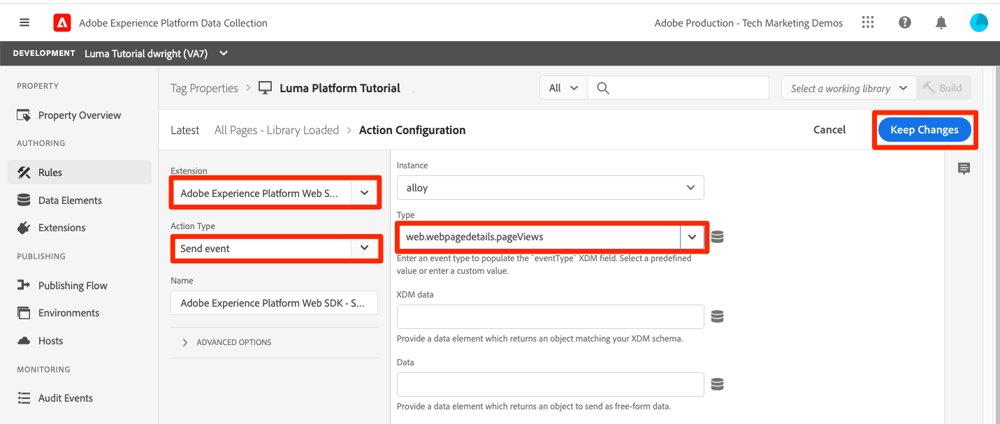

# Inserire dati in streaming

<!--1hr-->

In questa lezione i dati verranno trasmessi in streaming utilizzando l’SDK per web di Adobe Experience Platform.

Nell’interfaccia di raccolta dati è necessario completare due attività principali:

* Per inviare dati sull’attività del visitatore dal sito web alla rete Adobe Edge, è necessario implementare l’SDK web sul sito web Luma. Effettueremo una semplice implementazione utilizzando i tag (precedentemente Launch)

* È necessario configurare un datastream che indichi alla rete Edge dove inoltrare i dati. La configureremo per inviare i dati ai nostri `Luma Web Events` set di dati nella nostra sandbox Platform.

**Ingegneri dati** dovrà acquisire dati in streaming al di fuori di questa esercitazione. Quando si implementano gli SDK per web o dispositivi mobili di Adobe Experience Platform, in genere uno sviluppatore web o mobile è coinvolto nella creazione dei livelli di dati e nella configurazione delle proprietà dei tag.

Prima di iniziare gli esercizi, guarda questi due brevi video per ulteriori informazioni sull’acquisizione di dati in streaming e l’SDK per web:
>[!VIDEO](https://video.tv.adobe.com/v/28425?quality=12&learn=on)

>[!VIDEO](https://video.tv.adobe.com/v/34141?quality=12&learn=on)

>[!NOTE]
>
>Questa esercitazione si concentra sull&#39;acquisizione in streaming dai siti web con SDK per web, ma è anche possibile eseguire lo streaming dei dati utilizzando [Adobe Mobile SDK](https://aep-sdks.gitbook.io/), [Apache Kafka Connect](https://github.com/adobe/experience-platform-streaming-connect)e altri meccanismi.

## Autorizzazioni necessarie

In [Configurare le autorizzazioni](configure-permissions.md) per completare la lezione, è necessario impostare tutti i controlli di accesso necessari.

<!--
* Permission items **[!UICONTROL Launch]** > **[!UICONTROL Property Rights]** > **[!UICONTROL Approve]**, **[!UICONTROL Develop]**, **[!UICONTROL Manage Environments]**, **[!UICONTROL Manage Extensions]**, and **[!UICONTROL Publish]**
* Permission item **[!UICONTROL Launch]** > **[!UICONTROL Company Rights]** > **[!UICONTROL Manage Properties]**
* User-role access to the `Luma Tutorial Launch` product profile
* Admin-role access to the `Luma Tutorial Launch` product profile
* Permission items **[!UICONTROL Platform]** > **[!UICONTROL Data Ingestion]** > **[!UICONTROL View Sources]** and **[!UICONTROL Manage Sources]**
* Permission items **[!UICONTROL Platform]** > **[!UICONTROL Data Management]** > **[!UICONTROL View Datasets]** and **[!UICONTROL Manage Datasets]**
* Permission items **[!UICONTROL Platform]** > **[!UICONTROL Profiles]** > **[!UICONTROL View Profiles]**, **[!UICONTROL Manage Profiles]** and **[!UICONTROL Export Audience Segment]**
* Permission item **[!UICONTROL Platform]** > **[!UICONTROL Sandbox Administration]** > **[!UICONTROL View Sandboxes]**
* Permission item **[!UICONTROL Platform]** > **[!UICONTROL Sandboxes]** > `Luma Tutorial`
* User-role access to the `Luma Tutorial Platform` product profile
-->

<!--## Create a streaming source

1. Log into the [Experience Platform  user interface](https://experience.adobe.com/platform/)
1. Go to **[!UICONTROL Sources]** in the left navigation
1. Filter the list by selecting **[!UICONTROL Streaming]**
1. In the **[!UICONTROL HTTP API]** section, select the **[!UICONTROL Configure]** button
    
1. On the **[!UICONTROL Authentication]** step, enter `Luma Web Events Source` as the **[!UICONTROL Account name]** and select the **[!UICONTROL Connect to source]** button (we don't need to enable authentication since the data will be originating from website visitors)
    
1. Once connected, select the **[!UICONTROL Next]** button to proceed to the next step in the workflow
1. On the **[!UICONTROL Select data]** step, choose **[!UICONTROL Existing Dataset]**, select your `Luma Web Events Dataset`, and then select the **[!UICONTROL Next]** button
    
1. On the **[!UICONTROL Dataflow detail]** step, select the **[!UICONTROL Next]** button:
    
    <!--What is a good practice for naming the data flow vs the source-->
<!--
1. On the **[!UICONTROL Review]** step, review your source details and select the **[!UICONTROL Finish]** button:
    
-->

## Configurare il datastream

Prima configureremo il datastream. Un datastream comunica alla rete Adobe Edge dove inviare i dati dopo averli ricevuti dalla chiamata SDK per web. Ad esempio, vuoi inviare i dati ad Experience Platform, Adobe Analytics o Adobe Target? I datastreams vengono gestiti nell’interfaccia utente di raccolta dati (precedentemente Launch) e sono fondamentali per la raccolta dati con l’SDK per web.

Per creare [!UICONTROL datastream]:

1. Accedi al [Interfaccia utente per la raccolta dati di Experience Platform](https://experience.adobe.com/launch/)

   <!--when will the edge config go live?-->

1. Seleziona **[!UICONTROL Datastreams]** nella navigazione a sinistra
1. Seleziona la **[!UICONTROL Nuovo Datastream]** nell&#39;angolo in alto a destra

   

1. Per **[!UICONTROL Nome descrittivo]**, inserisci `Luma Platform Tutorial` (aggiungi il tuo nome alla fine, se più persone della tua azienda stanno seguendo questa esercitazione)
1. Seleziona il pulsante **[!UICONTROL Salva]**

   

Nella schermata successiva, specifica dove vuoi inviare i dati. Per inviare dati ad Experience Platform:

1. Attiva **[!UICONTROL Adobe Experience Platform]** esporre campi aggiuntivi
1. Per **[!UICONTROL Sandbox]**, seleziona `Luma Tutorial`
1. Per **[!UICONTROL Set di dati evento]**, seleziona `Luma Web Events Dataset`
1. Se utilizzi altre applicazioni Adobe, puoi esplorare le altre sezioni per vedere quali informazioni sono necessarie nella configurazione Edge di queste altre soluzioni. L’SDK per web è stato sviluppato non solo per lo streaming dei dati in Experience Platform, ma anche per sostituire tutte le librerie JavaScript precedenti utilizzate da altre applicazioni Adobe. La configurazione Edge viene utilizzata per specificare i dettagli account di ogni applicazione a cui si desidera inviare i dati.
1. Seleziona **[!UICONTROL Salva]**

   

Una volta salvata la configurazione Edge, nella schermata risultante verranno visualizzati tre ambienti creati per Sviluppo, Staging e Produzione. È possibile aggiungere altri ambienti di sviluppo:

Tutti e tre gli ambienti contengono i dettagli della piattaforma appena immessi. Tuttavia, questi dettagli possono essere configurati in modo diverso in base all’ambiente. Ad esempio, puoi far sì che ogni ambiente invii dati a una sandbox Platform diversa. In questa esercitazione, non eseguiremo alcuna personalizzazione aggiuntiva del nostro datastream.

## Installare l’estensione Web SDK

### Aggiungi una proprietà

Innanzitutto, devi creare una proprietà tag (precedentemente una proprietà tag ). Una proprietà è un contenitore per tutti i JavaScript, le regole e altre funzionalità necessarie per raccogliere i dettagli da una pagina web e inviarli a varie posizioni.

Per creare una proprietà:

1. Vai a **[!UICONTROL Proprietà]** nella navigazione a sinistra
1. Seleziona il pulsante **[!UICONTROL Nuova proprietà]**
   
1. Come **[!UICONTROL Nome]**, inserisci `Luma Platform Tutorial` (aggiungi il tuo nome alla fine, se più persone della tua azienda stanno seguendo questa esercitazione)
1. Come **[!UICONTROL Domini]**, inserisci `enablementadobe.com` (spiegato più avanti)
1. Seleziona **[!UICONTROL Salva]**

   

<!--
After saving the property, you might see an error message like the one below. If so, this is because you don't actually have access to the property you just created. To fix this, we need to go to the Admin Console to give yourself access:
    

To give yourself access to the property:

1. In a separate browser tab, log into the [Admin Console](https://adminconsole.adobe.com/)
1. Go to **[!UICONTROL Products]** from the top navigation
1. Select **[!UICONTROL Adobe Experience Platform Launch]** on the left navigation
1. Go to your `Luma Tutorial Launch` product profile
1. Go to the **[!UICONTROL Permissions]** tab
1. On the **[!UICONTROL Properties]** row, select **[!UICONTROL Edit]**
    
1. Select the "+" icon to move your `Luma Platform Tutorial` property to the right-hand side and select the **[!UICONTROL Save]** button to update the permissions
   
    

Now switch back to your browser tab with the Data Collection interface still open. Reload the page and the `Luma Platform Tutorial` property should display in the list. Select to open the property:

-->

## Aggiungere l’estensione SDK per web

Ora che disponi di una proprietà puoi aggiungere l’SDK web utilizzando un’estensione . Un&#39;estensione è un pacchetto di codice che estende l&#39;interfaccia e la funzionalità di raccolta dati. Aggiungere l’estensione:

1. Apri la proprietà tag
1. Vai a **[!UICONTROL Estensioni]** nella navigazione a sinistra
1. Vai a **[!UICONTROL Catalogo]** scheda
1. Sono disponibili molte estensioni per i tag. Filtrare il catalogo con il termine `Web SDK`
1. In **[!UICONTROL Adobe Experience Platform Web SDK]** estensione, seleziona **[!UICONTROL Installa]** pulsante
   
1. Sono disponibili diverse configurazioni per l’estensione SDK per web, ma ne configureremo solo due per questa esercitazione. Aggiorna **[!UICONTROL Dominio Edge]** a `data.enablementadobe.com`. Questa impostazione consente di impostare cookie di prime parti con l’implementazione dell’SDK per web, che viene incoraggiata. Più avanti in questa lezione, mapperai un sito web su `enablementadobe.com` alla proprietà tag. CNAME per `enablementadobe.com` il dominio è già stato configurato in modo che `data.enablementadobe.com` inoltrerà ai server Adobe. Quando implementi l’SDK web sul tuo sito web, dovrai creare un CNAME a scopo di raccolta dati, ad esempio, `data.YOUR_DOMAIN.com`
1. Da **[!UICONTROL Datastream]** a discesa, seleziona il tuo `Luma Platform Tutorial` datastream.
1. Puoi guardare liberamente le altre opzioni di configurazione (ma non modificarle!) quindi seleziona **[!UICONTROL Salva]**
   <!--is edge domain required for first party? when will it break?-->
   <!--any other fields that should be highlighted-->
   

## Creare una regola per inviare i dati

Ora creeremo una regola per inviare dati a Platform. Una regola è una combinazione di eventi, condizioni e azioni che avvisano i tag di fare qualcosa. Per creare una regola:

1. Vai a **[!UICONTROL Regole]** nella navigazione a sinistra
1. Seleziona la **[!UICONTROL Crea nuova regola]** pulsante
   
1. Denomina la regola `All Pages - Library Loaded`
1. Sotto **[!UICONTROL Eventi]**, seleziona **[!UICONTROL Aggiungi]** pulsante
   
1. Utilizza la **[!UICONTROL Core]** **[!UICONTROL Estensione]** e seleziona **[!UICONTROL Libreria caricata (Pagina in alto)]** come **[!UICONTROL Tipo evento]**. Questa impostazione significa che la regola viene attivata ogni volta che la libreria Launch viene caricata su una pagina.
1. Seleziona **[!UICONTROL Mantieni modifiche]** per tornare alla schermata della regola principale
   
1. Esci **[!UICONTROL Condizioni]** vuoto, poiché vogliamo che questa regola si attivi su tutte le pagine, in base al nome che gli abbiamo dato
1. Sotto **[!UICONTROL Azioni]**, seleziona **[!UICONTROL Aggiungi]** pulsante
1. Utilizza la **[!UICONTROL Adobe Experience Platform Web SDK]** **[!UICONTROL Estensione]** e seleziona **[!UICONTROL Invia evento]** come **[!UICONTROL Tipo di azione]**
1. A destra, seleziona **[!UICONTROL web.webpagedetails.pageViews]** dal **[!UICONTROL Tipo]** a discesa. Questo è uno dei campi XDM nel nostro `Luma Web Events Schema`
1. Seleziona **[!UICONTROL Mantieni modifiche]** per tornare alla schermata della regola principale
   
1. Seleziona **[!UICONTROL Salva]** per salvare la regola\
   

## Pubblicare la regola in una libreria

Ora pubblicheremo la regola nel nostro ambiente di sviluppo in modo da poter verificare che funzioni.

<!--
There are a few quick steps we must take in the **[!UICONTROL Publishing]** section of Launch.

### Create a host

Launch libraries can be hosted on Adobe's Content Delivery Network (CDN) or on your own servers. In this tutorial, we will use Adobe's CDN since it is faster to set up:

1. Go to **[!UICONTROL Hosts]** in the left navigation
1. Select the **[!UICONTROL Create New Host]** button
       
1. For the **[!UICONTROL Name]**, enter `Adobe CDN`
1. For the **[!UICONTROL Type]**, select **[!UICONTROL Managed by Adobe]**
1. Select the **[!UICONTROL Save]** button to complete the setup of the host
       

### Create an environment

Environments allow you to have different versions of a library in different publishing environments to accommodate your publishing workflow. For example, the fully tested version of your library can be published to a Production environment, while new changes are being created in a Development environment. You can also use different hosts for each environment. To create an environment:

1. Go to **[!UICONTROL Environments]** in the left navigation
1. Select the **[!UICONTROL Create New Environment]** button
     
1. Under **[!UICONTROL Development]** select **[!UICONTROL Select]**   
     
1. For the **[!UICONTROL Name]**, enter `Development`
1. For the **[!UICONTROL Select Host]** dropdown, select `Adobe CDN`
1. Select the **[!UICONTROL Save]** button to complete the setup of the environment
    
1. You will see a modal with URL and other implementation details of this library. These are critical for a real Launch implementation, but we don't need to worry about them for this tutorial. Select the **[!UICONTROL Close]** button to exit the modal.

### Create and publish the library

Now let's bundle the contents of our property&mdash;currently an extension and a rule&mdash;into a library. 
-->

Per creare una libreria:

1. Vai a **[!UICONTROL Flusso di pubblicazione]** nella navigazione a sinistra
1. Seleziona **[!UICONTROL Aggiungi libreria]**
   
1. Per **[!UICONTROL Nome]**, inserisci `Luma Platform Tutorial`
1. Per **[!UICONTROL Ambiente]**, seleziona `Development`
1. Seleziona la **[!UICONTROL Aggiungi tutte le risorse modificate]** pulsante . (Oltre al [!UICONTROL Adobe Experience Platform Web SDK] e `All Pages - Library Loaded` verrà visualizzata anche la regola [!UICONTROL Core] è stata aggiunta l’estensione , che contiene il JavaScript di base richiesto da tutte le proprietà web di Launch.)
1. Seleziona la **[!UICONTROL Salva e genera per sviluppo]** pulsante
   

La libreria potrebbe richiedere alcuni minuti per la creazione e, una volta completata, visualizza un punto verde a sinistra del nome della libreria:

Come puoi vedere sul [!UICONTROL Flusso di pubblicazione] Il processo di pubblicazione è molto più ampio rispetto all’ambito di questa esercitazione. Useremo una singola libreria nel nostro ambiente di sviluppo.

## Convalida i dati nella richiesta

### Aggiungere Adobe Experience Platform Debugger

Experience Platform Debugger è un’estensione disponibile per i browser Chrome e Firefox che consente di visualizzare la tecnologia Adobe implementata nelle pagine web. Scarica la versione per il browser preferito:

* [Estensione Firefox](https://addons.mozilla.org/it/firefox/addon/adobe-experience-platform-dbg/)
* [Estensione Chrome](https://chrome.google.com/webstore/detail/adobe-experience-platform/bfnnokhpnncpkdmbokanobigaccjkpob)

Se non hai mai utilizzato Debugger prima e questo è diverso dal precedente Adobe Experience Cloud Debugger, potresti voler guardare questo video di panoramica di cinque minuti:

>[!VIDEO](https://video.tv.adobe.com/v/32156?quality=12&learn=on)

### Apri il sito web Luma .

Per questa esercitazione, utilizziamo una versione ospitata pubblicamente del sito web dimostrativo Luma. Apriamolo e segnaliamolo:

1. In una nuova scheda del browser, apri le [Sito web Luma](https://luma.enablementadobe.com/content/luma/us/en.html).
1. Aggiungi ai segnalibri la pagina da utilizzare nel resto dell’esercitazione.

Questo sito web ospitato è il motivo per cui abbiamo utilizzato `enablementadobe.com` in [!UICONTROL Domini] campo della configurazione iniziale della proprietà tag e del motivo per cui abbiamo utilizzato `data.enablementadobe.com` come dominio di prime parti nel [!UICONTROL Adobe Experience Platform Web SDK] estensione. Vedete, avevo un piano!

### Utilizza Experience Platform Debugger per eseguire la mappatura sulla proprietà tag

Experience Platform Debugger dispone di una funzione fantastica che consente di sostituire una proprietà tag esistente con una diversa. Questa funzione è utile per la convalida e consente di saltare molti passaggi di implementazione in questa esercitazione.

1. Assicurati di aver aperto il sito Luma e seleziona l’icona dell’estensione Experience Platform Debugger .
1. Il debugger verrà aperto e mostrerà alcuni dettagli dell’implementazione hardcoded, che non sono correlati a questa esercitazione (potrebbe essere necessario ricaricare il sito Luma dopo l’apertura del debugger)
1. Conferma che il debugger sia &quot;**[!UICONTROL Connesso a Luma]**&quot; come illustrato di seguito e quindi selezionare &quot;**[!UICONTROL bloccare]**&quot; per bloccare il debugger sul sito Luma.
1. Seleziona la **[!UICONTROL Accesso]** in alto a destra per l&#39;autenticazione.
1. Ora vai a **[!UICONTROL Launch]** nella navigazione a sinistra
1. Seleziona la scheda Configurazione
1. A destra di dove ti mostra la **[!UICONTROL Codici di incorporamento della pagina]**, apri **[!UICONTROL Azioni]** a discesa e seleziona **[!UICONTROL Sostituisci]**

   
1. Poiché sei autenticato, Debugger eseguirà il pull-in delle proprietà e degli ambienti Launch disponibili. Seleziona la tua `Luma Platform Tutorial` property
1. Seleziona la tua `Development` ambiente
1. Seleziona la **[!UICONTROL Applica]** pulsante
   
1. Il sito web Luma verrà ora ricaricato _con la proprietà tag_. Aiuto, sono stata attaccata! Sto scherzando.
   
1. Vai a **[!UICONTROL Riepilogo]** nella navigazione a sinistra, per visualizzare i dettagli della [!UICONTROL Launch] property
   
1. Ora vai a **[!UICONTROL AEP Web SDK]** nella navigazione a sinistra per visualizzare il **[!UICONTROL Richieste di rete]**
1. Apri **[!UICONTROL events]** row

   
1. Si noti come è possibile visualizzare `web.webpagedetails.pageView` tipo di evento specificato nella [!UICONTROL Invia evento] e altre variabili pronte all’uso che aderiscono al `AEP Web SDK ExperienceEvent Mixin` format
   
1. Questi tipi di dettagli di richiesta sono visibili anche negli strumenti per sviluppatori web del browser **Rete** scheda . Apri e ricarica la pagina. Filtrare le chiamate con `interact` per individuare la chiamata , selezionala e quindi cerca nella **Intestazioni** scheda **Payload della richiesta** area.
   
1. Vai a **Risposta** e osserva come il valore ECID è incluso nella risposta. Copia questo valore così come lo utilizzerai per convalidare le informazioni di profilo nell’esercizio successivo.
   

## Convalida i dati in Experience Platform

Puoi verificare che i dati siano di destinazione in Platform esaminando i batch di dati in arrivo nel `Luma Web Events Dataset`. (Lo so, si chiama inserimento dati in streaming, ma ora sto dicendo che arriva in batch! Esegue lo streaming in tempo reale a Profilo, in modo che possa essere utilizzato per la segmentazione e l&#39;attivazione in tempo reale, ma viene inviato in batch ogni 15 minuti al data lake.)

Per convalidare i dati:

1. Nell’interfaccia utente di Platform, passa a **[!UICONTROL Set di dati]** nella navigazione a sinistra
1. Apri `Luma Web Events Dataset` e confermare che un lotto è arrivato. Ricordate che vengono inviati ogni 15 minuti, quindi potrebbe essere necessario attendere che il batch venga visualizzato.
1. Seleziona la **[!UICONTROL Anteprima set di dati]** pulsante
   
1. Nella finestra modale di anteprima, ricorda come selezionare diversi campi dello schema a sinistra per visualizzare in anteprima questi specifici punti di dati:
   

Puoi anche confermare che il nuovo profilo è visualizzato:

1. Nell’interfaccia utente di Platform, passa a **[!UICONTROL Profili]** nella navigazione a sinistra
1. Seleziona la **[!UICONTROL ECID]** e cerca il valore ECID (copialo dalla risposta). Il profilo avrà un proprio ID, separato dall’ECID.
1. Seleziona la **[!UICONTROL ID profilo]** per aprire il profilo
   
1. Seleziona la **[!UICONTROL Eventi]** scheda per visualizzare le pagine visualizzate
   
   <!---->

## Aggiungere dati personalizzati all’evento

### Creare un elemento dati per il nome della pagina

1. Nell’interfaccia dei tag di raccolta dati, nell’angolo in alto a destra del `Luma Platform Tutorial` aprire **[!UICONTROL Selezionare una libreria di lavoro]** seleziona il tuo menu a discesa `Luma Platform Tutorial` libreria. Questa impostazione semplifica la pubblicazione di aggiornamenti aggiuntivi alla libreria.
1. Ora vai a **[!UICONTROL Elementi dati]** nella navigazione a sinistra
1. Seleziona la **[!UICONTROL Crea nuovo elemento dati]** pulsante

   
1. Come **[!UICONTROL Nome]**, inserisci `Page Name`
1. Come **[!UICONTROL Tipo di elemento dati]**, seleziona `JavaScript Variable`
1. Come **[!UICONTROL Nome della variabile JavaScript]**, inserisci `digitalData.page.pageInfo.pageName`
1. Per standardizzare il formato dei valori, selezionare le caselle per **[!UICONTROL Forza valore minuscolo]** e **[!UICONTROL Testo pulito]**
1. Assicurati che `Luma Platform Tutorial` viene selezionato come libreria di lavoro
1. Seleziona **[!UICONTROL Salva nella libreria]**
   

### Mappare il nome della pagina all’elemento dati dell’oggetto XDM

Ora mapperemo il nome della nostra pagina all’SDK per web.

>[!IMPORTANT]
>
>Per completare questa attività, è necessario assicurarsi che l’utente abbia prima accesso alla sandbox Prod. Se non hai già accesso alla sandbox Prod da un profilo di prodotto diverso, apri rapidamente la tua `Luma Tutorial Platform` profilo e aggiungi l’elemento di autorizzazione **[!UICONTROL Sandbox]** > **[!UICONTROL Prod]**. Dopo aver fatto ciò, effettua un SHIFT-Reload sulla pagina Elementi dati per cancellare la cache
>

Sulla **[!UICONTROL Elementi dati]** pagina:

1. Creare un nuovo elemento dati
1. Come **[!UICONTROL Nome]**, inserisci `XDM Object`
1. Come **[!UICONTROL Estensione]**, seleziona `Adobe Experience Platform Web SDK`
1. Come **[!UICONTROL Tipo di elemento dati]**, seleziona `XDM object`
1. Come **[!UICONTROL Sandbox]**, seleziona la `Luma Tutorial` sandbox
1. Come **[!UICONTROL Schema]**, seleziona la `Luma Web Events Schema`
1. Seleziona la `web.webPageDetails.name` field
1. Come **[!UICONTROL Valore]**, seleziona l’icona per aprire la finestra modale di selezione degli elementi dati e scegli la tua `Page Name` elemento dati
1. Seleziona **[!UICONTROL Salva nella libreria]**

   

Questo stesso processo viene utilizzato per mappare dati personalizzati aggiuntivi sul sito web a campi XDM.

### Aggiungi i dati XDM all’azione Invia evento

Dopo aver mappato i dati sui campi XDM, puoi includerli nell’azione Invia evento:

1. Vai a **[!UICONTROL Regole]** screen
1. Apri il tuo `All Pages - Library Loaded` regola
1. Apri `Adobe Experience Platform Web SDK - Send Event` action
1. Come **[!UICONTROL Dati XDM]**, seleziona l’icona per aprire la finestra modale di selezione degli elementi dati e scegli la tua `XDM Object` elemento dati
1. Seleziona la **[!UICONTROL Mantieni modifiche]** pulsante
   
1. Ora, visto che hai avuto `Luma Platform Tutorial` selezionati come libreria di lavoro per gli ultimi esercizi, le modifiche recenti sono state salvate direttamente nella libreria. Invece di dover pubblicare le nostre modifiche tramite la schermata Flusso di pubblicazione , puoi semplicemente aprire il menu a discesa sul pulsante blu e selezionare **[!UICONTROL Salva nella libreria e genera]**
   

Viene avviata la creazione di una nuova libreria di tag con le tre modifiche appena apportate.

### Convalidare i dati XDM

Ora dovresti essere in grado di ricaricare la home page Luma, mentre sei mappato alla tua proprietà di tag utilizzando il debugger come hai appreso in precedenza, e vedrai che il campo del nome della pagina si popola nella richiesta!

Puoi anche convalidare i dati del nome della pagina ricevuti in Platform, visualizzando in anteprima il set di dati e il profilo.

## Invia altre identità

L’implementazione dell’SDK per web sta inviando eventi con l’ID Experience Cloud (ECID) come identificatore principale. L’ECID viene generato automaticamente dall’SDK per web ed è univoco per dispositivo e browser. Un singolo cliente può avere più ECID a seconda del dispositivo e del browser che utilizza. Come possiamo ottenere una visualizzazione unificata di questo cliente e collegare la loro attività online ai nostri dati CRM, fedeltà e acquisto offline? Lo facciamo raccogliendo identità aggiuntive durante la loro sessione e collegando deterministicamente il loro profilo tramite unione delle identità.

Se vi ricordate, ho accennato al fatto che avremmo usato l&#39;ECID e l&#39;ID CRM come identità per i nostri dati web nel [Identità mappa](map-identities.md) lezione. Raccogliamo quindi l’ID CRM con l’SDK web.

### Aggiungi elemento dati per l&#39;ID CRM

Per prima cosa memorizziamo l&#39;ID CRM in un elemento dati:

1. Nell’interfaccia tag , aggiungi un elemento dati denominato `CRM Id`
1. Come **[!UICONTROL Tipo di elemento dati]**, seleziona **[!UICONTROL Variabile JavaScript]**
1. Come **[!UICONTROL Nome della variabile JavaScript]**, inserisci `digitalData.user.0.profile.0.attributes.username`
1. Seleziona la **[!UICONTROL Salva nella libreria]** pulsante (`Luma Platform Tutorial` deve ancora essere la tua libreria di lavoro)
   

### Aggiungi l’ID del sistema di gestione delle relazioni con i clienti all’elemento dati Identity Map

Ora che abbiamo acquisito il valore ID CRM, dobbiamo associarlo a un tipo speciale di elemento dati denominato [!UICONTROL Mappa identità] elemento dati:

1. Aggiungi un elemento dati denominato `Identities`
1. Come **[!UICONTROL Estensione]**, seleziona **[!UICONTROL Adobe Experience Platform Web SDK]**
1. Come **[!UICONTROL Tipo di elemento dati]**, seleziona **[!UICONTROL Mappa identità]**
1. Come **[!UICONTROL Namespace]**, inserisci `Luma CRM Id`, che è [!UICONTROL namespace] abbiamo creato una lezione precedente

   >[!WARNING]
   >
   >La versione 2.2 dell’estensione Adobe Experience Platform Web SDK consente di selezionare Namespace da un elenco a discesa prepopolato utilizzando i valori effettivi nell’account Platform. Purtroppo questa funzione non è ancora &quot;consapevole sandbox&quot; e quindi il `Luma CRM Id` potrebbe non essere visualizzato nel menu a discesa . Questo potrebbe impedire il completamento di questo esercizio. Dopo la conferma, pubblicheremo una soluzione.

1. Come **[!UICONTROL ID]**, seleziona l’icona per aprire la finestra modale di selezione degli elementi dati e scegli la tua `CRM Id` elemento dati
1. Come **[!UICONTROL Stato di autenticazione]**, seleziona **[!UICONTROL Autenticato]**
1. Esci **[!UICONTROL Primaria]** _non selezionato_. Poiché l’ID del sistema di gestione delle relazioni con i clienti non è presente per la maggior parte dei visitatori del sito web Luma, sei sicuramente _non sovrascrivere l&#39;ECID come identificatore principale_. È raro che l’identificatore principale utilizzi qualsiasi elemento diverso dall’ECID. Di solito non menziono le impostazioni predefinite in queste istruzioni, ma sto chiamando questo per aiutarti a evitare problemi in un secondo momento nella tua implementazione.
1. Seleziona la **[!UICONTROL Salva nella libreria]** pulsante (`Luma Platform Tutorial` deve ancora essere la tua libreria di lavoro)
   

>[!NOTE]
>
>È possibile trasmettere più identificatori utilizzando [!UICONTROL Mappa identità] tipo di dati.

### Aggiungi l’elemento dati della mappa identità all’oggetto XDM

C&#39;è un altro elemento dati che dobbiamo aggiornare: l&#39;elemento dati oggetto XDM. Potrebbe sembrare strano dover aggiornare tre elementi di dati separati per trasmettere questa identità, ma questo processo è progettato per scalare più identità. Non ti preoccupare, abbiamo quasi finito con questa lezione!

1. Apri l’elemento dati dell’oggetto XDM
1. Apri il campo XDM di IdentityMap
1. Come **[!UICONTROL Elemento dati]**, seleziona l’icona per aprire la finestra modale di selezione degli elementi dati e scegli la tua `Identities` elemento dati
1. Ora, visto che hai avuto `Luma Platform Tutorial` selezionati come libreria di lavoro per gli ultimi esercizi, le modifiche recenti sono state salvate direttamente nella libreria. Invece di dover pubblicare le nostre modifiche tramite la schermata Flusso di pubblicazione , puoi aprire il menu a discesa sul pulsante blu e selezionare **[!UICONTROL Salva nella libreria e genera]**
   

### Convalida l&#39;identità

Per verificare che l&#39;ID CRM sia stato inviato dall&#39;SDK Web:

1. Apri [Sito web Luma](https://luma.enablementadobe.com/content/luma/us/en.html)
1. Mappa la proprietà del tag utilizzando Debugger come indicato nelle istruzioni precedenti
1. Seleziona la **Login** collegamento in alto a destra del sito web Luma
1. Accedere utilizzando le credenziali `test@adobe.com`/`test`
1. Una volta autenticata, controlla la chiamata Experience Platform Web SDK nel debugger (**[!UICONTROL Adobe Experience Platform Web SDK]** > **[!UICONTROL Richieste di rete]** > **[!UICONTROL events]** della richiesta più recente) e dovresti vedere il `lumaCrmId`:
   
1. Cerca di nuovo il profilo utente utilizzando lo spazio dei nomi e il valore ECID. Nel profilo, vedrai l&#39;ID CRM e anche l&#39;ID fedeltà e i dettagli del profilo come il nome e il numero di telefono. Tutte le identità e i dati sono stati uniti in un unico profilo cliente in tempo reale!
   

## Risorse aggiuntive

* [Implementare Adobe Experience Cloud con Web SDK](/help/tutorial-web-sdk/overview.md)
* [Documentazione sull’acquisizione in streaming](https://experienceleague.adobe.com/docs/experience-platform/ingestion/streaming/overview.html?lang=it)
* [Riferimento API per l’acquisizione in streaming](https://www.adobe.io/experience-platform-apis/references/data-ingestion/#tag/Streaming-Ingestion)

Ottimo lavoro! Queste erano molte informazioni sull&#39;SDK per web e su Launch. L’implementazione completa è molto più complessa, ma queste sono le nozioni di base per aiutarti a iniziare e vedere i risultati in Platform.

>[!NOTE]
>
>Dopo aver completato la lezione Streaming Ingestion, è possibile rimuovere la [!UICONTROL Prod] sandbox dal tuo `Luma Tutorial Platform` profilo di prodotto

data engineer, se lo desideri, può saltare [lezione sulle query](run-queries.md).

Architetti dati: puoi passare a [criteri di unione](create-merge-policies.md)!
