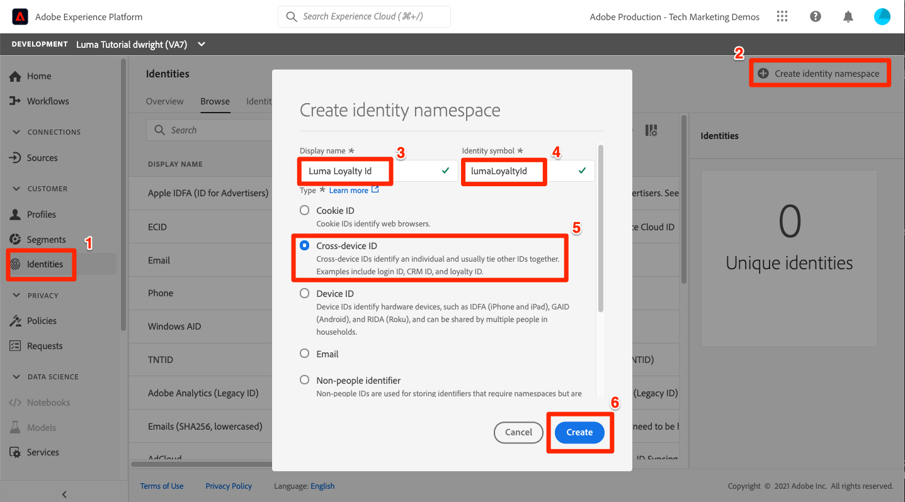

# Mappare le identità

<!-- 30 min-->

In questa lezione, creeremo spazi dei nomi di identità e aggiungeremo campi di identità ai nostri schemi. In seguito, saremo anche in grado di completare le relazioni tra schemi della lezione precedente.

Il servizio Adobe Experience Platform Identity consente di ottenere una visione migliore dei clienti e dei loro comportamenti collegando le identità tra dispositivi e sistemi, consentendo di offrire esperienze digitali personali e di impatto in tempo reale. I campi di identità e gli spazi dei nomi sono l’associazione che unisce diverse origini di dati per creare il profilo cliente in tempo reale a 360 gradi.

**Architetti di dati** dovrà mappare le identità al di fuori di questa esercitazione.

Prima di iniziare gli esercizi, guarda questo breve video per ulteriori informazioni sull’identità in Adobe Experience Platform:
>[!VIDEO](https://video.tv.adobe.com/v/27841?quality=12&learn=on)

>[!NOTE]
>
>I campi di identità sono necessari solo se si creano profili cliente in tempo reale. Non sono necessarie se si acquisiscono solo dati nel data lake.

<!--explain identity maps-->
<!--explain the strategy behind the identity selection, how these identities will join all the data together-->

## Autorizzazioni richieste

In [Configurare le autorizzazioni](configure-permissions.md) Per completare questa lezione, è necessario impostare tutti i controlli di accesso necessari.

<!--
* Permission items **[!UICONTROL Identity Management]** > **[!UICONTROL View Identity Namespaces]** and **[!UICONTROL Manage Identity Namespaces]**
* Permission item **[!UICONTROL Data Modeling]** > **[!UICONTROL View Schemas]** and **[!UICONTROL Manage Schemas]**
* Permission item **[!UICONTROL Sandboxes]** > `Luma Tutorial`
* User-role access to the `Luma Tutorial Platform` product profile
* Developer-role access to the `Luma Tutorial Platform` product profile (for API)
-->

## Crea spazio dei nomi identità

In questo esercizio creeremo spazi dei nomi di identità per i campi di identità personalizzati di Luma, `loyaltyId`, `crmId`, e `productSku`. Gli spazi dei nomi delle identità svolgono un ruolo fondamentale nella creazione di profili cliente in tempo reale, in quanto due valori corrispondenti nello stesso spazio dei nomi consentono a due origini di dati di formare un grafo identità.


### Creare spazi dei nomi nell’interfaccia utente

Iniziamo creando uno spazio dei nomi per lo schema Fedeltà Luma:

1. Nell’interfaccia utente di Platform, vai a **[!UICONTROL Identità]** nel menu di navigazione a sinistra
1. Sono disponibili diversi spazi dei nomi di identità predefiniti. Seleziona la **[!UICONTROL Creare lo spazio dei nomi delle identità]** pulsante
1. Fornisci i dettagli come segue

   | Campo | Valore |
   |---------------|-----------|
   | Nome visualizzato | ID fedeltà Luma |
   | Simbolo di identità | lumaLoyaltyId |
   | Tipo |  cross-device |

1. Seleziona **[!UICONTROL Crea]**

   

Ora imposta un altro spazio dei nomi per lo schema del catalogo prodotti Luma con i seguenti dettagli:

| Campo | Valore |
|---------------|-----------|
| Nome visualizzato | SKU prodotto Luma |
| Simbolo di identità | lumaProductSKU |
| Tipo | Identificatore non personale |


## Creare lo spazio dei nomi dell’identità tramite API

Creeremo il nostro spazio dei nomi CRM tramite API.

>[!NOTE]
>
>Se preferisci saltare gli esercizi API, puoi creare lo spazio dei nomi CRM tramite il metodo di interfaccia utente utilizzato con i seguenti dettagli:
>
> 1. Come **[!UICONTROL Nome visualizzato]**, utilizza `Luma CRM Id`
> 1. Come **[!UICONTROL Simbolo di identità]**, utilizza `lumaCrmId`
> 1. Come **[!UICONTROL Tipo]**, utilizzare Cross-Device

Creiamo lo spazio dei nomi dell’identità `Luma CRM Id`:

1. Scarica [Identity Service.postman_collection.json](https://raw.githubusercontent.com/adobe/experience-platform-postman-samples/master/apis/experience-platform/Identity%20Service.postman_collection.json) al tuo `Luma Tutorial Assets` cartella
1. Importa la raccolta in [!DNL Postman]
1. Se non hai un token di accesso, apri la richiesta **[!DNL OAuth: Request Access Token]** e seleziona **Invia** per richiedere un nuovo token di accesso.
1. Seleziona la richiesta **[!UICONTROL Servizio identità] > [!UICONTROL Spazio dei nomi identità] > [!UICONTROL Creare un nuovo spazio dei nomi delle identità].**
1. Incolla quanto segue come [!DNL Body] della richiesta:

   ```json
   {
       "name": "Luma CRM Id",
       "code": "lumaCrmId",
       "idType": "Cross_device"
   }
   ```

1. Premere il tasto **Invia** e dovresti ricevere un **200 OK** risposta:

   

Se torni all’interfaccia utente, ora dovresti visualizzare i tre nuovi spazi dei nomi personalizzati:


## Etichettare i campi di identità negli schemi

Ora che disponiamo dei nostri namespace, il passaggio successivo è aggiornare gli schemi per etichettare i campi di identità.


### Etichettare i campi XDM per l’identità primaria

Ogni schema utilizzato con Real-Time Customer Profile deve disporre di un’identità primaria specificata. E ogni record acquisito deve avere un valore per quel campo.

Aggiungiamo un’identità primaria al `Luma Loyalty Schema`:

1. Apri `Luma Loyalty Schema`
1. Seleziona `Luma Identity profile field group`
1. Seleziona la `loyaltyId` campo
1. Controlla la **[!UICONTROL Identità]** casella
1. Controlla la **[!UICONTROL Identità primaria]** box, troppo
1. Seleziona lo spazio dei nomi `Luma Loyalty Id` dal menu a discesa **[!UICONTROL Spazi dei nomi delle identità]**
1. Seleziona **[!UICONTROL Applica]**
1. Seleziona **[!UICONTROL Salva]**

   

Ripeti il processo per alcuni degli altri schemi:

1. In `Luma CRM Schema`, etichettare `crmId` come identità primaria utilizzando `Luma CRM Id` namespace
1. In `Luma Offline Purchase Events Schema`, etichettare `loyaltyId` come identità primaria utilizzando `Luma Loyalty Id` namespace
1. In `Luma Product Catalog Schema`, etichettare `productSku` come identità primaria utilizzando `Luma Product SKU` namespace

>[!NOTE]
>
>I dati raccolti con l’SDK per web costituiscono un’eccezione alla tipica pratica di etichettare i campi di identità nello schema. Web SDK utilizza Identity Map per etichettare le identità *per quanto riguarda l&#39;attuazione* e quindi determineremo le identità per il `Luma Web Events Schema` quando implementiamo l’SDK web sul sito web Luma. In questa lezione successiva, raccoglieremo l’ID visitatore Experience Cloud (ECID) come ID primario e crmId come ID secondario.

Con la nostra selezione di identità primarie, è chiaro come `Luma CRM Schema` può connettersi al `Luma Offline Purchase Events Schema` poiché entrambi utilizzano `loyaltyId` come identificatore. Ma come possiamo collegare i nostri acquisti offline al comportamento online? Come possiamo classificare i prodotti acquistati con il nostro catalogo di prodotti? Utilizzeremo campi di identità e relazioni di schema aggiuntivi.

<!--use a visual-->

### Etichettare i campi XDM per l’identità secondaria

È possibile aggiungere più campi di identità a uno schema. Le identità non primarie sono spesso indicate come identità secondarie. Per collegare gli acquisti offline al comportamento online, aggiungeremo il crmId come identificatore secondario al nostro `Luma Loyalty Schema` e più avanti nei nostri dati degli eventi web. Aggiorniamo il `Luma Loyalty Schema`:

1. Apri `Luma Loyalty Schema`
1. Seleziona `Luma Identity Profile Field group`
1. Seleziona `crmId` campo
1. Controlla la **[!UICONTROL Identità]** casella
1. Seleziona lo spazio dei nomi `Luma CRM Id` dal menu a discesa **[!UICONTROL Spazi dei nomi delle identità]**
1. Seleziona **[!UICONTROL Applica]** e quindi selezionare **[!UICONTROL Salva]** per salvare le modifiche

   

## Completa le relazioni tra schemi

Ora che abbiamo i campi di identità etichettati, possiamo completare la configurazione delle relazioni di schema tra il catalogo dei prodotti Luma e gli schemi dell’evento:

1. Apri `Luma Offline Purchase Events Schema`
1. Seleziona **[!UICONTROL Dettagli Commerce]** gruppo di campi
1. Seleziona **[!UICONTROL productListItems]** > **[!UICONTROL SKU]** campo
1. Controlla la **[!UICONTROL Relazione]** casella
1. Seleziona `Luma Product Catalog Schema` come **[!UICONTROL Schema di riferimento]**
1. `Luma Product SKU` deve essere compilato automaticamente come **[!UICONTROL Spazio dei nomi dell’identità di riferimento]**
1. Seleziona **[!UICONTROL Applica]**
1. Seleziona **[!UICONTROL Salva]**

   

Ripeti questo processo per creare una relazione tra `Luma Web Events Schema` e `Luma Product Catalog Schema`.

Dopo aver definito la relazione, questa viene indicata in entrambi i **[!UICONTROL Composizione]** e **[!UICONTROL Struttura]** nell’editor dello schema.


<!--need to verify that the relationship schema works-->

## Risorse aggiuntive

* [Documentazione del servizio Identity](https://experienceleague.adobe.com/docs/experience-platform/identity/home.html?lang=it)
* [API del servizio Identity](https://www.adobe.io/experience-platform-apis/references/identity-service/)

Ora che ci sono le nostre identità, possiamo [creare i set di dati](create-datasets.md)!
