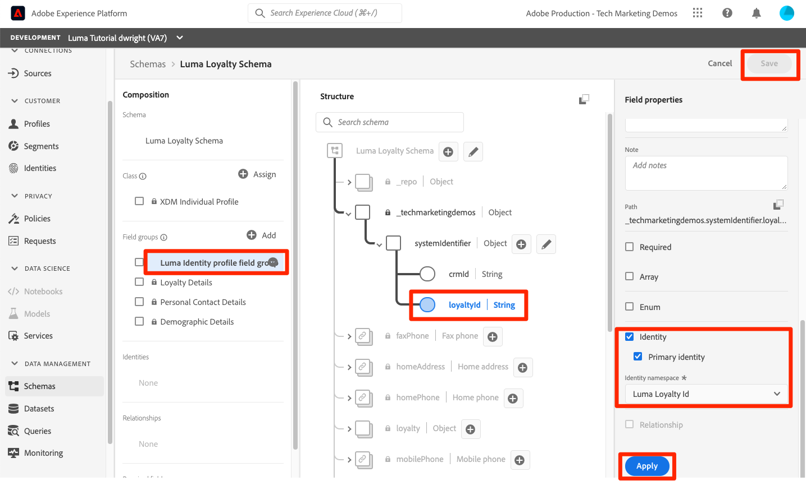

# Mappare le identità

<!-- 30 min-->

In questa lezione verranno creati spazi dei nomi delle identità e verranno aggiunti campi di identità ai nostri schemi. Dopo aver eseguito questa operazione, saremo anche in grado di completare le relazioni dello schema della lezione precedente.

Il servizio Adobe Experience Platform Identity consente di acquisire una visione migliore dei clienti e dei loro comportamenti attraverso la combinazione di identità tra dispositivi e sistemi, consentendo di fornire esperienze digitali personali e di impatto in tempo reale. I campi e i namespace di identità sono la colla che unisce diverse origini dati per creare il profilo cliente in tempo reale a 360 gradi.

**Architetti dei dati** dovrà mappare le identità al di fuori di questa esercitazione.

Prima di iniziare gli esercizi, guarda questo breve video per saperne di più sull&#39;identità in Adobe Experience Platform:
>[!VIDEO](https://video.tv.adobe.com/v/27841?quality=12&learn=on)

>[!NOTE]
>
>I campi di identità sono necessari solo se crei profili cliente in tempo reale. Non sono richieste se si acquisiscono solo dati nel data lake.

<!--explain identity maps-->
<!--explain the strategy behind the identity selection, how these identities will join all the data together-->

## Autorizzazioni necessarie

In [Configurare le autorizzazioni](configure-permissions.md) per completare la lezione, è necessario impostare tutti i controlli di accesso necessari.

<!--
* Permission items **[!UICONTROL Identity Management]** > **[!UICONTROL View Identity Namespaces]** and **[!UICONTROL Manage Identity Namespaces]**
* Permission item **[!UICONTROL Data Modeling]** > **[!UICONTROL View Schemas]** and **[!UICONTROL Manage Schemas]**
* Permission item **[!UICONTROL Sandboxes]** > `Luma Tutorial`
* User-role access to the `Luma Tutorial Platform` product profile
* Developer-role access to the `Luma Tutorial Platform` product profile (for API)
-->

## Crea spazio dei nomi identità

In questo esercizio creeremo namespace di identità per i campi di identità personalizzati di Luma, `loyaltyId`, `crmId`e `productSku`. Gli spazi dei nomi di identità svolgono un ruolo fondamentale nella creazione di profili cliente in tempo reale, in quanto due valori corrispondenti nello stesso spazio dei nomi consentono a due origini dati di formare un grafico di identità.


### Creare namespace nell’interfaccia utente

Cominciamo creando uno spazio dei nomi per lo schema fedeltà Luma:

1. Nell’interfaccia utente di Platform, passa a **[!UICONTROL Identità]** nella navigazione a sinistra
1. Noterai che sono disponibili diversi namespace di identità predefiniti. Seleziona la **[!UICONTROL Creare uno spazio dei nomi di identità]** pulsante
1. Fornisci i seguenti dettagli

   | Campo | Valore |
   |---------------|-----------|
   | Nome visualizzato | ID fedeltà Luma |
   | Simbolo di identità | lumaLoyaltyId |
   | Tipo |  cross-device |

1. Seleziona **[!UICONTROL Crea]**

   

Ora imposta un altro namespace per lo schema del catalogo di prodotti Luma con i seguenti dettagli:

| Campo | Valore |
|---------------|-----------|
| Nome visualizzato | SKU del prodotto Luma |
| Simbolo di identità | lumaProductSKU |
| Tipo | Identificatore non personale |


## Creare un namespace di identità utilizzando l’API

Creeremo il nostro namespace CRM tramite API.

>[!NOTE]
>
>Se preferisci saltare gli esercizi API, puoi creare liberamente lo spazio dei nomi CRM tramite il metodo di interfaccia utente utilizzato con i seguenti dettagli:
>
> 1. Come **[!UICONTROL Nome visualizzato]**, utilizza `Luma CRM Id`
> 1. Come **[!UICONTROL Simbolo di identità]**, utilizza `lumaCrmId`
> 1. Come **[!UICONTROL Tipo]**, utilizza tra dispositivi


Creare lo spazio dei nomi identità `Luma CRM Id`:

1. Scarica [Servizio Identity.postman_collection.json](https://raw.githubusercontent.com/adobe/experience-platform-postman-samples/master/apis/experience-platform/Identity%20Service.postman_collection.json) al tuo `Luma Tutorial Assets` cartella
1. Importa la raccolta in [!DNL Postman]
1. Se non hai effettuato una richiesta nelle ultime 24 ore, i token di autorizzazione probabilmente sono scaduti. Apri la richiesta **[!DNL Adobe I/O Access Token Generation > Local Signing (Non-production use-only) > IMS: JWT Generate + Auth via User Token]**, quindi seleziona **Invia** per richiedere nuovi token JWT e Access.
1. Seleziona la richiesta **[!UICONTROL Servizio identità] > [!UICONTROL Namespace Identity] > [!UICONTROL Creare un nuovo namespace Identity].**
1. Incolla quanto segue come [!DNL Body] della domanda:

   ```json
   {
       "name": "Luma CRM Id",
       "code": "lumaCrmId",
       "idType": "Cross_device"
   }
   ```

1. Premere **Invia** dovrebbe ottenere un **200 OK** risposta:

   

Se torni all’interfaccia utente, dovresti visualizzare i tre nuovi namespace personalizzati:


## Etichettare i campi di identità negli schemi

Ora che abbiamo i nostri namespace, il passo successivo è quello di aggiornare i nostri schemi per etichettare i nostri campi di identità.


### Etichettare i campi XDM per l’identità principale

Per specificare un&#39;identità principale è necessario specificare ogni schema utilizzato con Profilo cliente in tempo reale. E ogni record acquisito deve avere un valore per quel campo.

Aggiungiamo un&#39;identità principale al `Luma Loyalty Schema`:

1. Apri `Luma Loyalty Schema`
1. Seleziona `Luma Identity profile field group`
1. Seleziona la `loyaltyId` field
1. Controlla la **[!UICONTROL Identità]** scatola
1. Controlla la **[!UICONTROL Identità principale]** anche scatola
1. Seleziona la `Luma Loyalty Id` namespace **[!UICONTROL Namespace Identity]** menu a discesa
1. Seleziona **[!UICONTROL Applica]**
1. Seleziona **[!UICONTROL Salva]**

   

Ripeti il processo per alcuni degli altri schemi:

1. In `Luma CRM Schema`, etichettare `crmId` come identità principale utilizzando `Luma CRM Id` namespace
1. In `Luma Offline Purchase Events Schema`, etichettare `loyaltyId` come identità principale utilizzando `Luma Loyalty Id` namespace
1. In `Luma Product Catalog Schema`, etichettare `productSku` come identità principale utilizzando `Luma Product SKU` namespace

>[!NOTE]
>
>I dati raccolti con l’SDK per web costituiscono un’eccezione alla pratica tipica dell’etichettatura dei campi di identità nello schema. L’SDK per web utilizza la mappa di identità per etichettare le identità *sul lato dell&#39;attuazione* e così determineremo le identità per il `Luma Web Events Schema` quando implementiamo l’SDK web sul sito web Luma. In questa lezione successiva, raccoglieremo l’ID visitatore di Experience Cloud (ECID) come ID primario e crmId come ID secondario.

Con la nostra selezione di identità primarie, è chiaro come `Luma CRM Schema` può connettersi al `Luma Offline Purchase Events Schema` poiché entrambi utilizzano `loyaltyId` come identificatore. Ma come possiamo collegare i nostri acquisti offline al comportamento online? Come posso classificare i prodotti acquistati con il nostro catalogo prodotti? Verranno utilizzati campi di identità aggiuntivi e relazioni di schema.

<!--use a visual-->

### Etichettare i campi XDM per l’identità secondaria

È possibile aggiungere più campi di identità a uno schema. Le identità non primarie sono spesso definite identità secondarie. Per collegare gli acquisti offline al comportamento online, aggiungeremo crmId come identificatore secondario al nostro `Luma Loyalty Schema` e successivamente nei dati dei nostri eventi web. Aggiorniamo il `Luma Loyalty Schema`:

1. Apri `Luma Loyalty Schema`
1. Seleziona `Luma Identity Profile Field group`
1. Seleziona `crmId` field
1. Controlla la **[!UICONTROL Identità]** scatola
1. Seleziona la `Luma CRM Id` namespace **[!UICONTROL Namespace Identity]** menu a discesa
1. Seleziona **[!UICONTROL Applica]** quindi seleziona la **[!UICONTROL Salva]** per salvare le modifiche

   

## Completare le relazioni dello schema

Ora che i campi di identità sono etichettati, possiamo completare la configurazione delle relazioni dello schema tra il catalogo di prodotti di Luma e gli schemi di evento:

1. Apri `Luma Offline Purchase Events Schema`
1. Seleziona **[!UICONTROL Dettagli Commerce]** gruppo di campi
1. Seleziona **[!UICONTROL productListItems]** > **[!UICONTROL SKU]** field
1. Controlla la **[!UICONTROL Relazione]** scatola
1. Seleziona `Luma Product Catalog Schema` come **[!UICONTROL Schema di riferimento]**
1. `Luma Product SKU` deve essere compilato automaticamente come **[!UICONTROL Spazio dei nomi identità di riferimento]**
1. Seleziona **[!UICONTROL Applica]**
1. Seleziona **[!UICONTROL Salva]**

   

Ripeti questo processo per creare una relazione tra `Luma Web Events Schema` e `Luma Product Catalog Schema`.

Dopo aver definito la relazione, questa viene indicata in entrambi i **[!UICONTROL Composizione]** e **[!UICONTROL Struttura]** della sezione dell’editor dello schema.


<!--need to verify that the relationship schema works-->

## Risorse aggiuntive

* [Documentazione del servizio Identity](https://experienceleague.adobe.com/docs/experience-platform/identity/home.html?lang=it)
* [API del servizio Identity](https://www.adobe.io/experience-platform-apis/references/identity-service/)

Ora che abbiamo le nostre identità, possiamo [creare i nostri set di dati](create-datasets.md)!
