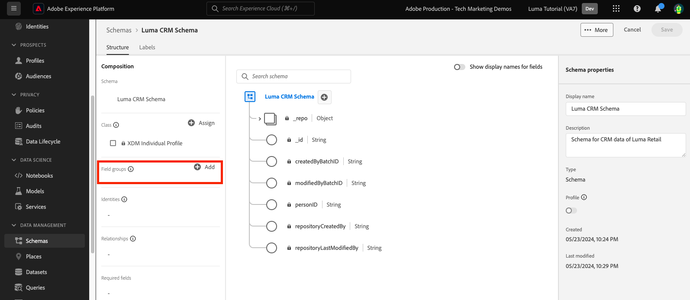
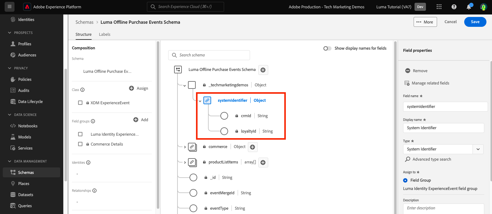

# Dati modello negli schemi

<!-- 60min -->
In questa lezione, modellerai i dati di Luma in schemi. Questa è una delle lezioni più lunghe dell&#39;esercitazione, quindi prendi un bicchiere d&#39;acqua e allacci la cintura!

La standardizzazione e l&#39;interoperabilità sono concetti chiave alla base di Adobe Experience Platform. Experience Data Model (XDM) è un tentativo di standardizzare i dati sulla customer experience e definire schemi per la gestione della customer experience.

XDM è una specifica documentata pubblicamente progettata per migliorare la potenza delle esperienze digitali. Fornisce strutture e definizioni comuni per qualsiasi applicazione da utilizzare per comunicare con i servizi di Platform. Aderendo agli standard XDM, tutti i dati sulla customer experience possono essere incorporati in una rappresentazione comune che può fornire informazioni in modo più veloce e integrato. Puoi ottenere informazioni preziose dalle azioni dei clienti, definire i tipi di pubblico dei clienti attraverso i segmenti ed esprimere gli attributi dei clienti a scopo di personalizzazione.

XDM è il framework fondamentale che consente a Adobe Experience Cloud, basato su Experienci Platform, di inviare il messaggio giusto alla persona giusta, sul canale giusto, nel momento esatto giusto. La metodologia su cui si basa l&#39;Experience Platform, **Sistema XDM**, rende operativi gli schemi Experience Data Model per l’utilizzo da parte dei servizi Platform.

<!--
This seems too lengthy. The video should suffice

Key terms:

* **Schema**: a representation of your data. A schema is comprised of a class and optional field groups and is used to create datasets. A schema includes behavioral attributes, timestamp, identity, attribute definitions, and relationships.
* **XDM Profile Class**: a common schema class used to represent record data
* **XDM ExperienceEvent Class**: a common schema class used to represent time-series data
* **Field group**: allows users to extend reusable fields that contain variables defining one or more attribute intended to be included in a schema or added to a class.
* **Standard Field group**: an open-source Field group built to conform to common industry standards, used to accelerate implementation and support repeatable services operating on the data
* **Data type**: a reusable object with properties in a hierarchical representation. These can be standard types or custom-defined defined types to describe your own data in your own way (for example, a collection of fields that you use to describe your products). Unlike Field groups, data types can be used in schemas regardless of the class.
* **Field**: a field is the lowest level element of a schema. Each field has a name for referencing and a type to identify the type of data that it contains. Field types can include, integer, number, string, Boolean and schema.
-->

**Architetti di dati** dovrà creare schemi al di fuori di questa esercitazione, ma **Ingegneri dati** opererà a stretto contatto con gli schemi creati dall’architetto di dati.

Prima di iniziare gli esercizi, guarda questo breve video per ulteriori informazioni sugli schemi e sull’Experience Data Model (XDM):
>[!VIDEO](https://video.tv.adobe.com/v/27105?learn=on)

>[!TIP]
>
> Per un approfondimento sulla modellazione dei dati in Experienci Platform, consigliamo di seguire il corso [Modellare i dati sull’esperienza del cliente con XDM](https://experienceleague.adobe.com/?recommended=ExperiencePlatform-D-1-2021.1.xdm&amp;lang=it), disponibile gratuitamente su Experience League!

## Autorizzazioni richieste

In [Configurare le autorizzazioni](configure-permissions.md) Per completare questa lezione, è necessario impostare tutti i controlli di accesso necessari.

<!--, specifically:

* Permission items **[!UICONTROL Data Modeling]** > **[!UICONTROL View Schemas]** and **[!UICONTROL Manage Schemas]**
* Permission item **[!UICONTROL Sandboxes]** > `Luma Tutorial`
* User-role access to the `Luma Tutorial Platform` product profile
* Developer-role access to the `Luma Tutorial Platform` product profile (for API)-->


<!--
## Luma's goals
-->

## Creare uno schema di fedeltà tramite l’interfaccia utente

In questo esercizio, creeremo uno schema per i dati fedeltà di Luma.

1. Vai all’interfaccia utente di Platform e accertati che la sandbox sia selezionata.
1. Vai a **[!UICONTROL Schemi]** nel menu di navigazione a sinistra
1. Seleziona il pulsante **[!UICONTROL Crea schema]** in alto a destra
1. Dal menu a discesa, seleziona **[!UICONTROL Profilo individuale XDM]**, in quanto verranno modellati gli attributi di un singolo cliente (punti, stato e così via).
   

### Aggiungi gruppi di campi standard

Verrà quindi richiesto di aggiungere gruppi di campi allo schema. Tutti i campi devono essere aggiunti agli schemi utilizzando i gruppi. Puoi scegliere tra un ampio set di gruppi di campi standard del settore forniti da Adobe o crearne di personalizzati. Quando inizi a modellare i tuoi dati in Experienci Platform, è bene acquisire familiarità con i gruppi di campi standard di settore forniti da Adobe. Quando possibile, è consigliabile utilizzarli in quanto a volte forniscono servizi a valle, come IA per l’analisi dei clienti, Attribution AI e Adobe Analytics.

Quando lavori con i tuoi dati, un grande passo sarà determinare quali dei tuoi dati devono essere acquisiti in Platform e come devono essere modellati. Questo argomento di grandi dimensioni viene discusso in modo più approfondito nel corso [Modellare i dati sull’esperienza del cliente con XDM](https://experienceleague.adobe.com/?recommended=ExperiencePlatform-D-1-2021.1.xdm&amp;lang=it). In questa esercitazione, ti guiderò attraverso l&#39;implementazione di alcuni schemi predeterminati.

Per aggiungere gruppi di campi:

1. In **[!UICONTROL Aggiungi gruppi di campi]** modale, seleziona i seguenti gruppi di campi:
   1. **[!UICONTROL Dettagli demografici]** per dati cliente di base come nome e data di nascita
   1. **[!UICONTROL Dettagli di contatto personali]** per dettagli di contatto di base come l’indirizzo e-mail e il numero di telefono
1. Puoi visualizzare in anteprima i campi che hanno contribuito nel gruppo di campi selezionando l’icona a destra della riga.
   

1. Controlla la **[!UICONTROL Settore]** > **[!UICONTROL Retail]** per esporre gruppi di campi specifici del settore.
1. Seleziona **[!UICONTROL Fedeltà]** per aggiungere i campi programma fedeltà.
1. Seleziona **[!UICONTROL Aggiungi gruppo di campi]** per aggiungere tutti e tre i gruppi di campi allo schema.
   


Ora prendi un po’ di tempo per esplorare lo stato corrente dello schema. I gruppi di campi hanno aggiunto campi standard relativi a una persona, ai relativi dettagli di contatto e allo stato del programma fedeltà. Questi due gruppi di campi possono risultare utili quando si creano schemi per i dati della propria azienda. Seleziona una riga specifica del gruppo di campi o seleziona la casella accanto al nome del gruppo di campi per visualizzare le modifiche apportate alla visualizzazione.

Per salvare lo schema:

1. Seleziona il nodo principale dello schema.
1. Invio `Luma Loyalty Schema` come **[!UICONTROL Nome visualizzato]**.
1. Seleziona **[!UICONTROL Salva]**.
   

>[!NOTE]
>
>È possibile aggiungere un campo per un punto dati che non viene raccolto da un gruppo di campi. Ad esempio, &quot;faxPhone&quot; potrebbe essere un campo per il quale Luma non raccoglie dati. Va bene. Solo perché un campo è definito nello schema non significa che i dati per esso *deve* vengono acquisiti in un secondo momento.

### Aggiungere un gruppo di campi personalizzato

Ora creiamo un gruppo di campi personalizzato.

Mentre il gruppo di campi fedeltà conteneva `loyaltyID` Luma desidera gestire tutti i propri identificatori di sistema in un unico gruppo per garantire la coerenza tra i diversi schemi.

I gruppi di campi devono essere creati nel flusso di lavoro dello schema. Per creare il gruppo di campi:

1. Seleziona **[!UICONTROL Aggiungi]** sotto **[!UICONTROL Gruppi di campi schema]** intestazione
   
1. Seleziona **[!UICONTROL Crea nuovo gruppo di campi]**
1. Utilizzare `Luma Identity profile field group` come **[!UICONTROL Nome visualizzato]**
1. Utilizzare `system identifiers for XDM Individual Profile class` come **[!UICONTROL Descrizione]**
1. Seleziona **[!UICONTROL Aggiungi gruppi di campi]**
   

Il nuovo gruppo di campi vuoto viene aggiunto allo schema. Il **[!UICONTROL +]** I pulsanti possono essere utilizzati per aggiungere nuovi campi a qualsiasi posizione nella gerarchia. Nel nostro caso, vogliamo aggiungere campi a livello principale:

1. Seleziona **[!UICONTROL +]** accanto al nome dello schema. Questo aggiunge un nuovo campo nello spazio dei nomi dell’ID tenant per gestire i conflitti tra i campi personalizzati e tutti i campi standard.
1. In **[!UICONTROL Proprietà campo]** barra laterale aggiungi i dettagli del nuovo campo:
   1. **[!UICONTROL Nome campo]**: `systemIdentifier`
   1. **[!UICONTROL Nome visualizzato]**: `System Identifier`
   1. **[!UICONTROL Tipo]**: **[!UICONTROL Oggetto]**
   1. Seleziona **[!UICONTROL Applica]**

   

Ora aggiungi due campi sotto `systemIdentifier` oggetto:

1. Primo campo
   1. **[!UICONTROL Nome campo]**: `loyaltyId`
   1. **[!UICONTROL Nome visualizzato:]** `Loyalty Id`
   1. **[!UICONTROL Tipo]**: **[!UICONTROL Stringa]**
1. Secondo campo
   1. **[!UICONTROL Nome campo]**: `crmId`
   1. **[!UICONTROL Nome visualizzato]**: `CRM Id`
   1. **[!UICONTROL Tipo]**: **[!UICONTROL Stringa]**

Il nuovo gruppo di campi sarà simile al seguente. Seleziona la **[!UICONTROL Salva]** per salvare lo schema, ma lasciare aperto lo schema per l&#39;esercizio successivo.


## Creare un tipo di dati

Gruppi di campi, ad esempio il nuovo `Luma Identity profile field group`, può essere riutilizzato in altri schemi, consentendo di applicare definizioni di dati standard in più sistemi. Ma possono essere solo riutilizzati _negli schemi che condividono una classe_, in questo caso la classe XDM Individual Profile.

Il tipo di dati è un altro costrutto a più campi che può essere riutilizzato negli schemi _tra più classi_. Convertiamo il nostro nuovo `systemIdentifier` oggetto in un tipo di dati:

Con il `Luma Loyalty Schema` ancora aperto, seleziona la `systemIdentifier` oggetto e selezione  **[!UICONTROL Converti in nuovo tipo di dati]**


Se **[!UICONTROL Annulla]** fuori dallo schema e passare alla **[!UICONTROL Tipi di dati]** , verrà visualizzato il tipo di dati appena creato. Questo tipo di dati verrà utilizzato più avanti nella lezione.


## Creare uno schema di gestione delle relazioni con i clienti tramite API

Ora creeremo uno schema utilizzando l’API.

>[!TIP]
>
> Se preferisci saltare l’esercizio API, puoi creare il seguente schema utilizzando il metodo dell’interfaccia utente:
>
> 1. Utilizza il [!UICONTROL Profilo individuale XDM] classe
> 1. Assegna un nome `Luma CRM Schema`
> 1. Utilizza i seguenti gruppi di campi: Dettagli demografici, Dettagli contatto personale e Gruppo di campi del profilo Identità Luma

Innanzitutto creiamo lo schema vuoto:

1. Apri [!DNL Postman]
1. Se non hai un token di accesso, apri la richiesta **[!DNL OAuth: Request Access Token]** e seleziona **Invia** per richiedere un nuovo token di accesso.
1. Apri le variabili di ambiente e modifica il valore di **CONTAINER_ID** da `global` a `tenant`. Ricorda, devi utilizzare `tenant` ogni volta che desideri interagire con i tuoi elementi personalizzati in Platform, ad esempio la creazione di uno schema.
1. Seleziona **Salva**
   
1. Apri la richiesta **[!DNL Schema Registry API > Schemas > Create a new custom schema.]**
1. Apri **Corpo** Tab e incolla il seguente codice e seleziona **Invia** per effettuare la chiamata API. Questa chiamata crea un nuovo schema utilizzando lo stesso `XDM Individual Profile` classe base:

   ```json
   {
     "type": "object",
     "title": "Luma CRM Schema",
     "description": "Schema for CRM data of Luma Retail ",
     "allOf": [{
       "$ref": "https://ns.adobe.com/xdm/context/profile"
     }]
   }
   ```

   >[!NOTE]
   >
   >I riferimenti allo spazio dei nomi in questo e negli esempi di codice successivi (ad esempio `https://ns.adobe.com/xdm/context/profile`), può essere ottenuto utilizzando l’elenco di chiamate API con **[!DNL CONTAINER_ID]** e accetta l’intestazione impostata sui valori corretti. Alcune sono facilmente accessibili anche nell’interfaccia utente.

1. Dovresti ricevere un `201 Created` risposta
1. Copia `meta:altId` dal corpo della risposta. La utilizzeremo successivamente in un altro esercizio.
   

1. Il nuovo schema deve essere visibile nell’interfaccia utente, ma senza gruppi di campi
   

>[!NOTE]
>
> Il `meta:altId` L’ID di schema o può essere ottenuto anche effettuando la richiesta API. **[!DNL Schema Registry API > Schemas > Retrieve a list of schemas within the specified container.]** con **[!UICONTROL CONTAINER_ID]** imposta su `tenant` e un’intestazione accept `application/vnd.adobe.xdm+json`.

>[!TIP]
>
> Problemi comuni relativi a questa chiamata e probabili correzioni:
>
> * Nessun token di autenticazione: esegui **OAuth: richiedi token di accesso** richiesta di generazione di un nuovo token
> * `401: Not Authorized to PUT/POST/PATCH/DELETE for this path : /global/schemas/`: aggiorna il **CONTAINER_ID** variabile di ambiente da `global` a `tenant`
> * `403: PALM Access Denied. POST access is denied for this resource from access control`: verifica le autorizzazioni utente nell’Admin Console

### Aggiungi gruppi di campi standard

Ora è il momento di aggiungere i gruppi di campi allo schema:

1. In entrata [!DNL Postman], Apri la richiesta **[!DNL Schema Registry API > Schemas > Update one or more attributes of a custom schema specified by ID.]**
1. In **Parametri** , incolla il `meta:altId` valore della risposta precedente come `SCHEMA_ID`
1. Apri la scheda Corpo e incolla il seguente codice e seleziona **Invia** per effettuare la chiamata API. Questa chiamata aggiunge i gruppi di campi standard al tuo `Luma CRM Schema`:

   ```json
   [{
       "op": "add",
       "path": "/allOf/-",
       "value": {
         "$ref": "https://ns.adobe.com/xdm/context/profile-personal-details"
       }
     },
     {
       "op": "add",
       "path": "/allOf/-",
       "value": {
         "$ref": "https://ns.adobe.com/xdm/context/profile-person-details"
       }
     }
   ]
   ```

1. Dovresti ottenere uno stato OK 200 per la risposta e i gruppi di campi dovrebbero essere visibili come parte dello schema nell’interfaccia utente

   


### Aggiungi gruppo di campi personalizzato

Ora aggiungiamo il nostro `Luma Identity profile field group` allo schema. Innanzitutto, dobbiamo trovare l’ID del nuovo gruppo di campi, utilizzando un’API di elenco:

1. Apri la richiesta **[!DNL Schema Registry API > Field groups > Retrieve a list of field groups within the specified container.]**
1. Seleziona la **Invia** per recuperare un elenco di tutti i gruppi di campi personalizzati nel tuo account
1. Acquisisci `$id` valore del `Luma Identity profile field group` (il tuo sarà diverso dal valore di questa schermata)
   
1. Apri la richiesta **[!DNL Schema Registry API > Schemas > Update one or more attributes of a custom schema specified by ID.]** di nuovo
1. Il **Parametri** La scheda deve ancora contenere `$id` dello schema
1. Apri **Corpo** e incolla il seguente codice, sostituendo il `$ref` valore con `$id` di tua proprietà `Luma Identity profile field group`:

   ```json
   [{
     "op": "add",
     "path": "/allOf/-",
     "value": {
       "$ref": "REPLACE_WITH_YOUR_OWN_FIELD_GROUP_ID"
     }
   }]
   ```

1. Seleziona **Invia**
   

Verifica che il gruppo di campi sia stato aggiunto allo schema controllando sia la risposta API che l’interfaccia.

## Crea schema eventi di acquisto offline

Ora creiamo uno schema basato su **[!UICONTROL XDM ExperienceEvent]** classe per i dati di acquisto offline di Luma. Poiché ora conosci l’interfaccia utente dell’editor schema, ridurrò il numero di schermate nelle istruzioni:

1. Creare uno schema con **[!UICONTROL XDM ExperienceEvent]** classe
1. Aggiungi il gruppo di campi standard **[!UICONTROL Dettagli Commerce]** per acquisire i dettagli comuni dell’ordine. Trascorri qualche minuto ad esplorare gli oggetti al loro interno.
1. Cerca `Luma Identity profile field group`. Non è disponibile. Ricorda che i gruppi di campi sono legati a una classe e che non è possibile utilizzarlo poiché per questo schema viene utilizzata una classe diversa. È necessario aggiungere un nuovo gruppo di campi per la classe ExperienceEvent XDM contenente i campi di identità. Il nostro tipo di dati lo renderà molto semplice!
1. Seleziona la **[!UICONTROL Crea nuovo gruppo di campi]** pulsante di opzione
1. Inserisci il **[!UICONTROL Nome visualizzato]** as `Luma Identity ExperienceEvent field group` e seleziona la **[!UICONTROL Aggiungi gruppi di campi]** pulsante
1. Assicurati che le **[!UICONTROL +]** pulsanti visualizzati in **[!UICONTROL Struttura]** per aggiungere nuovi campi
1. In entrata **[!UICONTROL Struttura]** sezione, seleziona **[!UICONTROL +]** al livello principale dello schema
1. Come **[!UICONTROL Nome campo]**, immetti `systemIdentifier`
1. Come **[!UICONTROL Nome visualizzato]**, immetti `System Identifier`
1. Come **[!UICONTROL Tipo]**, seleziona **Identificatore di sistema** che è il tipo di dati personalizzato creato in precedenza
1. Seleziona la **[!UICONTROL Applica]** pulsante
1. Assegnare un nome allo schema `Luma Offline Purchase Events Schema`
1. Seleziona il pulsante **[!UICONTROL Salva]**

Il tipo di dati ha aggiunto tutti i campi.



Inoltre, seleziona **[!UICONTROL XDM ExperienceEvent]** sotto **[!UICONTROL Classe]** intestazione ed ispezione di alcuni campi forniti da questa classe. Tieni presente che i campi _id e timestamp sono obbligatori quando utilizzi la classe ExperienceEvent XDM: questi campi devono essere compilati per ogni record acquisito quando utilizzi questo schema:


## Crea schema eventi web

Ora creeremo un altro schema per i dati del sito web di Luma. A questo punto dovresti essere un esperto nella creazione di schemi. Genera lo schema seguente con queste proprietà

| Proprietà | Valore |
|---------------|-----------------|
| Classe | XDM ExperienceEvent |
| Gruppo di campi | Mixin ExperienceEvent AEP Web SDK |
| Gruppo di campi | Evento esperienza consumatore |
| Nome schema | Schema eventi web Luma |

Seleziona la **[!UICONTROL Evento esperienza del consumatore]** gruppo di campi. Questo gruppo di campi contiene gli oggetti commerce e productListItems presenti [!UICONTROL Dettagli Commerce]. Infatti [!UICONTROL Evento esperienza del consumatore] è una combinazione di diversi altri gruppi di campi standard disponibili separatamente. [!UICONTROL Mixin ExperienceEvent AEP Web SDK] gruppo di campi contiene anche altri gruppi di campi, inclusi alcuni degli stessi in [!UICONTROL Evento esperienza del consumatore]. Fortunatamente, si fondono perfettamente.

Non è stato aggiunto il `Luma Identity ExperienceEvent field group` a questo schema. Questo perché l’SDK per web ha un modo diverso di raccogliere le identità. Se si seleziona la **[!UICONTROL XDM ExperienceEvent]** classe in **[!UICONTROL Composizione]** nell’editor schema, noterai che uno dei campi aggiunti per impostazione predefinita è denominato **[!UICONTROL IdentityMap]**. [!DNL IdentityMap] viene utilizzato da varie applicazioni di Adobe per il collegamento a Platform. Nella lezione di acquisizione in streaming, vedrai come le identità vengono inviate a Platform tramite identityMap.


## Crea schema catalogo prodotti

Utilizzando il  [!UICONTROL Dettagli Commerce] e [!UICONTROL Evento esperienza del consumatore] gruppi di campi, Luma segnala alcuni dettagli di eventi relativi al prodotto tramite il tipo di dati productListItems standard. ma dispongono anche di campi aggiuntivi per i dettagli del prodotto che desiderano inviare a Platform. Invece di acquisire tutti questi campi nei loro sistemi di punto vendita e e-commerce, Luma preferirebbe acquisire questi campi direttamente dal proprio sistema di catalogo dei prodotti. Una &quot;relazione di schema&quot; consente di definire una relazione tra due schemi a scopo di classificazione o ricerca. Luma utilizzerà una relazione per classificare i propri dettagli di prodotto. Inizieremo il processo ora e lo completeremo alla fine della prossima lezione.

>[!NOTE]
>
>Se sei un cliente Analytics o Target esistente, la classificazione delle entità con relazioni di schema è analoga alla classificazione SAINT o al caricamento del catalogo prodotti per Recommendations

Innanzitutto, devi creare uno schema per il catalogo prodotti di Luma utilizzando una classe personalizzata:

1. Seleziona la **[!UICONTROL Crea schema]** e selezionare il pulsante **[!UICONTROL Sfoglia]** opzione dal menu a discesa
   
1. Seleziona la **[!UICONTROL Crea nuova classe]** pulsante di opzione
1. Assegna un nome `Luma Product Catalog Class`
1. Lascia **[!UICONTROL Comportamento]** as **[!UICONTROL Registra]**
1. Seleziona la **[!UICONTROL Assegna classe]** pulsante
   
1. Crea un nuovo [!UICONTROL gruppo di campi] ha chiamato `Luma Product Catalog field group` con i seguenti campi:
   1. productName: Product Name: String
   1. productCategory: ProductCategory: String
   1. productColor: Product Color: String
   1. productSku: Product SKU: String | Obbligatorio
   1. productSize: Product Size: String
   1. productPrice: Product Price: Double
1. Denomina lo schema `Luma Product Catalog Schema` (assicurati di aggiornare il campo corretto e non aggiornare il nome della classe)
1. **[!UICONTROL Salva]** lo schema

Il nuovo schema deve essere simile al seguente. Nota come `productSku` è elencato nel [!UICONTROL Campi obbligatori] sezione:


Il passaggio successivo consiste nel definire la relazione tra i due schemi ExperienceEvent e `Luma Product Catalog Schema`Tuttavia, prima di poter procedere in tal senso, dobbiamo compiere alcuni ulteriori passi.


## Risorse aggiuntive

* [Documentazione del sistema Experience Data Model (XDM)](https://experienceleague.adobe.com/docs/experience-platform/xdm/home.html?lang=it)
* [API del registro dello schema](https://www.adobe.io/experience-platform-apis/references/schema-registry/)


Ora che disponi dei tuoi schemi puoi [mappa identità](map-identities.md)!
