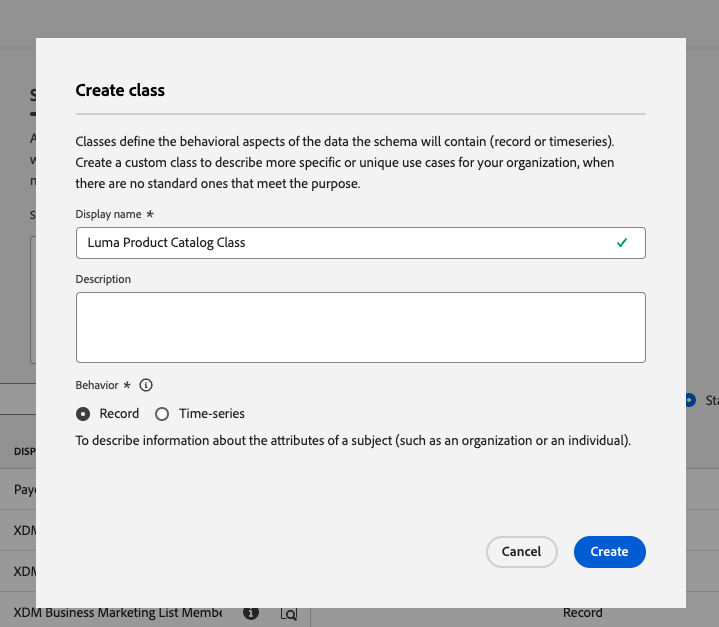

# Dati del modello negli schemi

<!-- 60min -->
In questa lezione, modellerai i dati di Luma in schemi. Questa è una delle lezioni più lunghe del tutorial, quindi prendi un bicchiere d&#39;acqua e fibbia!

La standardizzazione e l&#39;interoperabilità sono concetti chiave alla base di Adobe Experience Platform. Experience Data Model (XDM) è uno sforzo per standardizzare i dati sulla customer experience e definire schemi per la gestione della customer experience.

XDM è una specifica documentata pubblicamente progettata per migliorare il potere delle esperienze digitali. Fornisce strutture e definizioni comuni per qualsiasi applicazione da utilizzare per comunicare con i servizi Platform. Aderendo agli standard XDM, tutti i dati sulla customer experience possono essere incorporati in una rappresentazione comune che può fornire informazioni in modo più rapido e integrato. Puoi ottenere informazioni utili dalle azioni dei clienti, definire il pubblico dei clienti attraverso i segmenti ed esprimere gli attributi dei clienti a scopo di personalizzazione.

XDM è il framework fondamentale che consente a Adobe Experience Cloud, basato sull&#39;Experience Platform, di inviare il messaggio giusto alla persona giusta, sul canale giusto, al momento giusto. La metodologia su cui si basa l&#39;Experience Platform, **Sistema XDM**, rende operativi gli schemi Experience Data Model per l’utilizzo da parte dei servizi Platform.

<!--
This seems too lengthy. The video should suffice

Key terms:

* **Schema**: a representation of your data. A schema is comprised of a class and optional field groups and is used to create datasets. A schema includes behavioral attributes, timestamp, identity, attribute definitions, and relationships.
* **XDM Profile Class**: a common schema class used to represent record data
* **XDM ExperienceEvent Class**: a common schema class used to represent time-series data
* **Field group**: allows users to extend reusable fields that contain variables defining one or more attribute intended to be included in a schema or added to a class.
* **Standard Field group**: an open-source Field group built to conform to common industry standards, used to accelerate implementation and support repeatable services operating on the data
* **Data type**: a reusable object with properties in a hierarchical representation. These can be standard types or custom-defined defined types to describe your own data in your own way (for example, a collection of fields that you use to describe your products). Unlike Field groups, data types can be used in schemas regardless of the class.
* **Field**: a field is the lowest level element of a schema. Each field has a name for referencing and a type to identify the type of data that it contains. Field types can include, integer, number, string, Boolean and schema.
-->

**Architetti dei dati** dovrà creare schemi al di fuori di questa esercitazione, ma **Ingegneri dati** collaborerà strettamente con gli schemi creati dall’architetto dati.

Prima di iniziare gli esercizi, guarda questo breve video per ulteriori informazioni sugli schemi e su Experience Data Model (XDM):
>[!VIDEO](https://video.tv.adobe.com/v/27105?quality=12&learn=on)

>[!TIP]
>
> Ad Experience Platform, per approfondire la modellazione dei dati, ti consigliamo di seguire il corso [Modellare i dati sulla customer experience con XDM](https://experienceleague.adobe.com/?recommended=ExperiencePlatform-D-1-2021.1.xdm)disponibile gratuitamente all&#39;Experience League!

## Autorizzazioni necessarie

In [Configurare le autorizzazioni](configure-permissions.md) per completare la lezione, è necessario impostare tutti i controlli di accesso necessari.

<!--, specifically:

* Permission items **[!UICONTROL Data Modeling]** > **[!UICONTROL View Schemas]** and **[!UICONTROL Manage Schemas]**
* Permission item **[!UICONTROL Sandboxes]** > `Luma Tutorial`
* User-role access to the `Luma Tutorial Platform` product profile
* Developer-role access to the `Luma Tutorial Platform` product profile (for API)-->


<!--
## Luma's goals
-->

## Creare uno schema fedeltà tramite l’interfaccia utente

In questo esercizio, creeremo uno schema per i dati fedeltà di Luma.

1. Vai all’interfaccia utente di Platform e accertati che la sandbox sia selezionata.
1. Vai a **[!UICONTROL Schemi]** nella navigazione a sinistra
1. Seleziona la **[!UICONTROL Crea schema]** in alto a destra
1. Dal menu a discesa, seleziona **[!UICONTROL Profilo individuale XDM]**, poiché verranno modellati gli attributi di un singolo cliente (punti, stato e così via).
   

### Aggiungi gruppi di campi standard

Verrà quindi richiesto di aggiungere gruppi di campi allo schema. Tutti i campi devono essere aggiunti agli schemi che utilizzano i gruppi. Puoi scegliere tra un ampio set di gruppi di campi standard di settore forniti da Adobe o crearne uno personalizzati. Quando inizi a modellare i tuoi dati in Experience Platform, è bene acquisire familiarità con i gruppi di campi standard del settore forniti da Adobe. Quando possibile, è consigliabile utilizzarli in quanto a volte alimentano servizi a valle, come Customer AI, Attribution AI e Adobe Analytics.

Quando lavori con i tuoi dati, un grande passo sarà quello di determinare quali dei tuoi dati devono essere acquisiti in Platform e come dovrebbero essere modellati. Questo grande argomento è discusso più approfonditamente nel corso [Modellare i dati sulla customer experience con XDM](https://experienceleague.adobe.com/?recommended=ExperiencePlatform-D-1-2021.1.xdm). In questa esercitazione ti guiderò attraverso l’implementazione di alcuni schemi predefiniti.

Per aggiungere gruppi di campi:

1. In **[!UICONTROL Aggiungi gruppi di campi]** modale, seleziona i seguenti gruppi di campi:
   1. **[!UICONTROL Dettagli demografici]** per i dati di base dei clienti quali nome e data di nascita
   1. **[!UICONTROL Dati di contatto personali]** per informazioni di contatto di base come indirizzo e-mail e numero di telefono
1. Puoi visualizzare in anteprima i campi aggiunti al gruppo di campi selezionando l’icona sul lato destro della riga.
   

1. Controlla la **[!UICONTROL Industria]** > **[!UICONTROL Retail]** per esporre gruppi di campi specifici del settore.
1. Seleziona **[!UICONTROL Fedeltà]** per aggiungere i campi del programma fedeltà.
1. Seleziona **[!UICONTROL Aggiungi gruppo di campi]** per aggiungere tutti e tre i gruppi di campi allo schema.
   


A questo punto, soffermati a esplorare lo stato corrente dello schema. I gruppi di campi hanno aggiunto campi standard relativi a una persona, i relativi dettagli di contatto e lo stato del programma fedeltà. È possibile trovare questi due gruppi di campi utili quando si creano schemi per i dati della propria azienda. Seleziona una riga specifica del gruppo di campi o spunta la casella accanto al nome del gruppo di campi per vedere come cambia la visualizzazione.

Per salvare lo schema:

1. Selezionare il nodo principale dello schema.
1. Invio `Luma Loyalty Schema` come **[!UICONTROL Nome visualizzato]**.
1. Seleziona **[!UICONTROL Salva]**.
   

>[!NOTE]
>
>È corretto se un gruppo di campi aggiunge un campo per un punto dati che non viene raccolto. Ad esempio, &quot;faxPhone&quot; potrebbe essere un campo per il quale Luma non raccoglie dati. Va bene. Solo perché un campo è definito nello schema non significa che i dati per esso *deve* in seguito.

### Aggiungi un gruppo di campi personalizzato

Ora creiamo un gruppo di campi personalizzato.

Mentre il gruppo di campi fedeltà conteneva un `loyaltyID` Luma desidera gestire tutti i propri identificatori di sistema in un singolo gruppo per garantire la coerenza tra i propri schemi.

I gruppi di campi devono essere creati nel flusso di lavoro dello schema. Per creare il gruppo di campi:

1. Seleziona **[!UICONTROL Aggiungi]** in **[!UICONTROL Gruppi di campi dello schema]** titolo
   
1. Seleziona **[!UICONTROL Crea nuovo gruppo di campi]**
1. Utilizzo `Luma Identity profile field group` come **[!UICONTROL Nome visualizzato]**
1. Utilizzo `system identifiers for XDM Individual Profile class` come **[!UICONTROL Descrizione]**
1. Seleziona **[!UICONTROL Aggiungi gruppi di campi]**

   

Il nuovo gruppo di campi vuoto viene aggiunto allo schema. La **[!UICONTROL +]** I pulsanti possono essere utilizzati per aggiungere nuovi campi a qualsiasi posizione della gerarchia. Nel nostro caso, desideri aggiungere campi al livello principale:

1. Seleziona **[!UICONTROL +]** accanto al nome dello schema. Questo aggiunge un nuovo campo nello spazio dei nomi dell’ID tenant per gestire i conflitti tra i campi personalizzati e quelli standard.
1. In **[!UICONTROL Proprietà campo]** barra laterale aggiungi i dettagli del nuovo campo:
   1. **[!UICONTROL Nome campo]**: `systemIdentifier`
   1. **[!UICONTROL Nome visualizzato]**: `System Identifier`
   1. **[!UICONTROL Tipo]**: **[!UICONTROL Oggetto]**
   1. Seleziona **[!UICONTROL Applica]**

   

Aggiungi ora due campi nella sezione `systemIdentifier` oggetto:

1. Primo campo
   1. **[!UICONTROL Nome campo]**: `loyaltyId`
   1. **[!UICONTROL Nome visualizzato:]** `Loyalty Id`
   1. **[!UICONTROL Tipo]**: **[!UICONTROL Stringa]**
1. Secondo campo
   1. **[!UICONTROL Nome campo]**: `crmId`
   1. **[!UICONTROL Nome visualizzato]**: `CRM Id`
   1. **[!UICONTROL Tipo]**: **[!UICONTROL Stringa]**

Il nuovo gruppo di campi dovrebbe essere simile a questo. Seleziona la **[!UICONTROL Salva]** per salvare lo schema, ma lasciare lo schema aperto per l&#39;esercizio successivo.


## Creare un tipo di dati

Gruppi di campi, ad esempio il nuovo `Luma Identity profile field group`, può essere riutilizzato in altri schemi, consentendoti di applicare le definizioni dati standard su più sistemi. Ma possono essere riutilizzati solo _in schemi che condividono una classe_, in questo caso la classe Profilo individuale XDM.

Il tipo di dati è un altro costrutto a più campi che può essere riutilizzato negli schemi _in più classi_. Convertiamo il nostro nuovo `systemIdentifier` oggetto in un tipo di dati:

Con la `Luma Loyalty Schema` ancora aperto, seleziona `systemIdentifier` e seleziona  **[!UICONTROL Converti in nuovo tipo di dati]**


Se **[!UICONTROL Annulla]** uscire dallo schema e passare al **[!UICONTROL Tipi di dati]** Il tipo di dati appena creato verrà visualizzato nella scheda . Questo tipo di dati verrà utilizzato più avanti nella lezione.


## Creare uno schema CRM tramite API

Ora creeremo uno schema utilizzando l’API.

>[!TIP]
>
> Se preferisci saltare l’esercizio API, puoi creare il seguente schema utilizzando il metodo dell’interfaccia utente:
>
> 1. Utilizza la [!UICONTROL Profilo individuale XDM] Classe
> 1. Denomina `Luma CRM Schema`
> 1. Utilizza i seguenti gruppi di campi: Dettagli demografici, dettagli dei contatti personali e gruppo di campi profilo Luma Identity


Innanzitutto, creiamo lo schema vuoto:

1. Apri [!DNL Postman]
1. Se non hai effettuato una richiesta nelle ultime 24 ore, i token di autorizzazione probabilmente sono scaduti. Apri la richiesta **[!DNL Adobe I/O Access Token Generation > Local Signing (Non-production use-only) > IMS: JWT Generate + Auth via User Token]** e seleziona **Invia** per richiedere nuovi token JWT e Access.
1. Apri le variabili di ambiente e modifica il valore di **CONTAINER_ID** da `global` a `tenant`. Ricorda che devi utilizzare `tenant` ogni volta che desideri interagire con i tuoi elementi personalizzati in Platform, ad esempio creare uno schema.
1. Seleziona **Salva**
   
1. Apri la richiesta **[!DNL Schema Registry API > Schemas > Create a new custom schema.]**
1. Apri **Corpo** seleziona e incolla il seguente codice e seleziona **Invia** per effettuare la chiamata API . Questa chiamata crea un nuovo schema utilizzando lo stesso `XDM Individual Profile` classe base:

   ```json
   {
     "type": "object",
     "title": "Luma CRM Schema",
     "description": "Schema for CRM data of Luma Retail ",
     "allOf": [{
       "$ref": "https://ns.adobe.com/xdm/context/profile"
     }]
   }
   ```

   >[!NOTE]
   >
   >I riferimenti allo spazio dei nomi in questo ed esempi di codice successivi (ad esempio `https://ns.adobe.com/xdm/context/profile`), può essere ottenuto utilizzando le chiamate API elenco con **[!DNL CONTAINER_ID]** e accetta intestazione impostata sui valori corretti. Alcuni sono facilmente accessibili anche nell’interfaccia utente di .

1. Dovresti prendere un `201 Created` response
1. Copia `meta:altId` dal corpo della risposta. Lo useremo più tardi in un altro esercizio.
   

1. Il nuovo schema deve essere visibile nell&#39;interfaccia utente ma senza gruppi di campi
   

>[!NOTE]
>
> La `meta:altId` o l’id dello schema può essere ottenuto anche effettuando la richiesta API **[!DNL Schema Registry API > Schemas > Retrieve a list of schemas within the specified container.]** con **[!UICONTROL CONTAINER_ID]** impostato su `tenant` e un&#39;intestazione di accettazione `application/vnd.adobe.xdm+json`.

>[!TIP]
>
> Problemi comuni relativi a questa chiamata e possibili correzioni:
>
> * Nessun token di autenticazione: Esegui il **IMS: JWT Genera + Auth tramite token utente** chiamata per generare nuovi token
> * `401: Not Authorized to PUT/POST/PATCH/DELETE for this path : /global/schemas/`: Aggiorna **CONTAINER_ID** variabile di ambiente da `global` a `tenant`
> * `403: PALM Access Denied. POST access is denied for this resource from access control`: Verifica le autorizzazioni utente nell’Admin Console


### Aggiungi gruppi di campi standard

Ora è il momento di aggiungere i gruppi di campi allo schema:

1. In [!DNL Postman], Apri la richiesta **[!DNL Schema Registry API > Schemas > Update one or more attributes of a custom schema specified by ID.]**
1. In **Parametri** , incolla `meta:altId` dalla risposta precedente come `SCHEMA_ID`
1. Apri la scheda Corpo e incolla il seguente codice e seleziona **Invia** per effettuare la chiamata API . Questa chiamata aggiunge i gruppi di campi standard al tuo `Luma CRM Schema`:

   ```json
   [{
       "op": "add",
       "path": "/allOf/-",
       "value": {
         "$ref": "https://ns.adobe.com/xdm/context/profile-personal-details"
       }
     },
     {
       "op": "add",
       "path": "/allOf/-",
       "value": {
         "$ref": "https://ns.adobe.com/xdm/context/profile-person-details"
       }
     }
   ]
   ```

1. È necessario ottenere uno stato 200 OK per la risposta e i gruppi di campi dovrebbero essere visibili come parte dello schema nell&#39;interfaccia utente

   


### Aggiungi gruppo di campi personalizzato

Ora aggiungiamo la nostra `Luma Identity profile field group` allo schema. Innanzitutto, devi trovare l’id del nuovo gruppo di campi utilizzando un’API di elenco:

1. Apri la richiesta **[!DNL Schema Registry API > Field groups > Retrieve a list of field groups within the specified container.]**
1. Seleziona la **Invia** per recuperare un elenco di tutti i gruppi di campi personalizzati nel tuo account
1. Afferra la `$id` del valore `Luma Identity profile field group` (il tuo sarà diverso dal valore in questa schermata)
   
1. Apri la richiesta **[!DNL Schema Registry API > Schemas > Update one or more attributes of a custom schema specified by ID.]** di nuovo
1. La **Parametri** la scheda deve ancora avere `$id` dello schema
1. Apri **Corpo** scheda e incolla il seguente codice, sostituendo il `$ref` con `$id` del proprio `Luma Identity profile field group`:

   ```json
   [{
     "op": "add",
     "path": "/allOf/-",
     "value": {
       "$ref": "REPLACE_WITH_YOUR_OWN_FIELD_GROUP_ID"
     }
   }]
   ```

1. Seleziona **Invia**

   

Verifica che il gruppo di campi sia stato aggiunto allo schema controllando sia la risposta API che nell’interfaccia.

## Crea schema eventi di acquisto offline

Ora creiamo uno schema basato su **[!UICONTROL ExperienceEvent XDM]** per i dati di acquisto offline di Luma. Poiché ora hai familiarità con l’interfaccia utente dell’editor dello schema, ridurrò il numero di schermate nelle istruzioni:

1. Creare uno schema con **[!UICONTROL ExperienceEvent XDM]** Classe
1. Aggiungi il gruppo di campi standard **[!UICONTROL Dettagli Commerce]** per acquisire i dettagli comuni dell’ordine. Passate qualche minuto ad esplorare gli oggetti all&#39;interno.
1. Cerca `Luma Identity profile field group`. Non è disponibile! Tenere presente che i gruppi di campi sono legati a una classe e poiché per questo schema utilizziamo una classe diversa, non è possibile utilizzarla. È necessario aggiungere un nuovo gruppo di campi per la classe ExperienceEvent XDM contenente i campi di identità. Il nostro tipo di dati lo renderà davvero facile!
1. Seleziona la **[!UICONTROL Crea nuovo gruppo di campi]** pulsante di scelta
1. Inserisci il **[!UICONTROL Nome visualizzato]** come `Luma Identity ExperienceEvent field group` e seleziona la **[!UICONTROL Aggiungi gruppi di campi]** pulsante
1. Assicurati che **[!UICONTROL +]** i pulsanti sono attivati **[!UICONTROL Struttura]** in modo da poter aggiungere nuovi campi
1. In **[!UICONTROL Struttura]** sezione , seleziona **[!UICONTROL +]** al livello superiore dello schema
1. Come **[!UICONTROL Nome campo]**, inserisci `systemIdentifier`
1. Come **[!UICONTROL Nome visualizzato]**, inserisci `System Identifier`
1. Come **[!UICONTROL Tipo]**, seleziona **Identificatore del sistema** tipo di dati personalizzato creato in precedenza
1. Seleziona la **[!UICONTROL Applica]** pulsante
1. Denomina lo schema `Luma Offline Purchase Events Schema`
1. Seleziona il pulsante **[!UICONTROL Salva]**

Tieni presente che il tipo di dati ha aggiunto tutti i campi.


Inoltre, seleziona **[!UICONTROL ExperienceEvent XDM]** in **[!UICONTROL Classe]** intestazione ed ispezione di alcuni dei campi aggiunti da questa classe. I campi _id e timestamp sono obbligatori quando si utilizza la classe ExperienceEvent XDM; questi campi devono essere compilati per ogni record acquisito quando si utilizza questo schema:


## Crea schema eventi web

Ora creeremo un altro schema per i dati del sito web di Luma. A questo punto dovresti essere un esperto nella creazione di schemi! Crea il seguente schema con queste proprietà

| Proprietà | Valore |
|---------------|-----------------|
| Classe | ExperienceEvent XDM |
| Gruppo di campi | Mixin ExperienceEvent SDK per web AEP |
| Gruppo di campi | Evento esperienza consumatore |
| Nome dello schema | Schema eventi web Luma |

Seleziona la **[!UICONTROL Evento esperienza consumatore]** gruppo di campi. Questo gruppo di campi contiene gli oggetti commerce e productListItems che si trovavano anche in [!UICONTROL Dettagli Commerce]. Effettivamente [!UICONTROL Evento esperienza consumatore] è una combinazione di diversi altri gruppi di campi standard disponibili separatamente. [!UICONTROL Mixin ExperienceEvent SDK per web AEP] il gruppo di campi contiene anche altri gruppi di campi, inclusi alcuni degli stessi in [!UICONTROL Evento esperienza consumatore]. Fortunatamente si fondono perfettamente.

Nota che non abbiamo aggiunto il `Luma Identity ExperienceEvent field group` a questo schema. Questo perché l&#39;SDK per web ha un modo diverso di raccogliere le identità. Se selezioni la **[!UICONTROL ExperienceEvent XDM]** nella classe **[!UICONTROL Composizione]** nell’editor dello schema, noterai che uno dei campi aggiunti per impostazione predefinita è denominato **[!UICONTROL IdentityMap]**. [!DNL IdentityMap] viene utilizzato da varie applicazioni di Adobe per effettuare il collegamento a Platform. Nella lezione di streaming ingestion , vedrai come le identità vengono inviate a Platform tramite identityMap.


## Crea schema catalogo prodotti

Utilizzando  [!UICONTROL Dettagli Commerce] e [!UICONTROL Evento esperienza consumatore] gruppi di campi, Luma segnala alcuni dettagli degli eventi relativi al prodotto tramite il tipo di dati standard productListItems. Ma dispongono anche di campi di dettaglio del prodotto aggiuntivi che desiderano inviare a Platform. Invece di acquisire tutti questi campi nei loro sistemi di punti vendita ed e-commerce, Luma preferirebbe acquisire questi campi direttamente dal proprio sistema di catalogo dei prodotti. Una &quot;relazione di schema&quot; consente di definire una relazione tra due schemi ai fini della classificazione o delle ricerche. Luma utilizzerà una relazione per classificare i dettagli del prodotto. Inizieremo il processo adesso e lo completeremo alla fine della prossima lezione.

>[!NOTE]
>
>Se sei un cliente Analytics o Target esistente, la classificazione delle entità con relazioni di schema è simile alle classificazioni di SAINT o al caricamento del catalogo dei prodotti per Recommendations

Innanzitutto, devi creare uno schema per il catalogo di prodotti Luma utilizzando una classe personalizzata:

1. Seleziona la **[!UICONTROL Creare uno schema]** e seleziona il pulsante **[!UICONTROL Sfoglia]** dall’elenco a discesa
   
1. Seleziona la **[!UICONTROL Crea nuova classe]** pulsante di scelta
1. Denomina `Luma Product Catalog Class`
1. Lascia la **[!UICONTROL Comportamento]** come **[!UICONTROL Record]**
1. Seleziona la **[!UICONTROL Assegna classe]** pulsante
   
1. Crea un nuovo [!UICONTROL gruppo di campi] chiamato `Luma Product Catalog field group` con i campi seguenti:
   1. productName: Nome del prodotto: Stringa
   1. productCategory: Categoria di prodotti: Stringa
   1. productColor: Colore del prodotto: Stringa
   1. productSku: SKU del prodotto: Stringa | Obbligatorio
   1. productSize: Dimensioni del prodotto: Stringa
   1. productPrice: Prezzo del prodotto: Doppio
1. Denomina lo schema `Luma Product Catalog Schema` (assicurarsi di aggiornare il campo corretto e non aggiornare il nome della classe)
1. **[!UICONTROL Salva]** schema

Il nuovo schema dovrebbe essere simile al seguente. Tieni presente che `productSku` è elencato in [!UICONTROL Campi obbligatori] sezione:


Il passaggio successivo consiste nel definire la relazione tra i due schemi ExperienceEvent e il `Luma Product Catalog Schema`Tuttavia, nella prossima lezione dobbiamo compiere alcuni passi in più prima di poter procedere in tal senso.


## Risorse aggiuntive

* [Documentazione del sistema Experience Data Model (XDM)](https://experienceleague.adobe.com/docs/experience-platform/xdm/home.html?lang=it)
* [API del Registro di sistema dello schema](https://www.adobe.io/experience-platform-apis/references/schema-registry/)


Ora che hai i tuoi schemi puoi [identità mappa](map-identities.md)!
