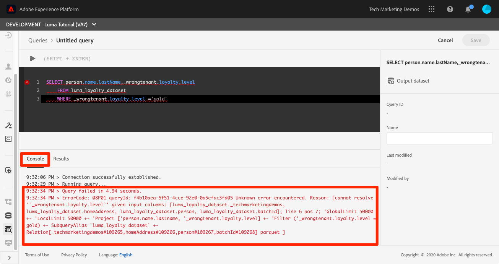

# Eseguire query

<!-- 15 min-->
In questa lezione imparerai a impostare, scrivere ed eseguire query per convalidare i dati acquisiti.

Adobe Experience Platform Query Service consente di interpretare i dati in modo più appropriato, consentendo di utilizzare SQL standard per eseguire query sui dati in Platform. Utilizzando Query Service, puoi unire qualsiasi set di dati nel Data Lake e acquisire i risultati della query sotto forma di nuovo set di dati da utilizzare nel reporting, nell’apprendimento automatico o per l’inserimento in Real-Time Customer Profile.

**Gli architetti di dati** e **i data engineer** dovranno utilizzare il servizio query all&#39;esterno di questa esercitazione.

Prima di iniziare gli esercizi, guarda questo breve video per ulteriori informazioni su Query Service:
>[!VIDEO](https://video.tv.adobe.com/v/29795?learn=on)

## Autorizzazioni richieste

Nella lezione [Configurare le autorizzazioni](configure-permissions.md) è possibile impostare tutti i controlli di accesso necessari per completare la lezione.

<!-- Settings > **[!UICONTROL Services]** > **[!UICONTROL Query Service]**
* Permission items Data Management > **[!UICONTROL View Datasets]** and  **[!UICONTROL Manage Datasets]**
* Permission item Sandboxes > `Luma Tutorial`
* User-role access to the `Luma Tutorial Platform` product profile
-->

## Query semplici

Iniziamo con alcune semplici query:

1. Nell&#39;interfaccia utente di Platform, vai a **Query** nell&#39;area di navigazione a sinistra
1. Seleziona il pulsante **Crea query** in alto a destra per aprire una casella di testo per eseguire ed eseguire le query
1. Immettete la seguente query nell&#39;editor e premete Maiusc+Invio o Maiusc+Ritorna per eseguire la query.

   ```
   SHOW TABLES
   ```

1. Mostra l’elenco delle tabelle disponibili

   


1. Prova questa query, sostituendo `_techmarketingdemos` con il tuo spazio dei nomi tenant, che, se ricordi, è visibile negli schemi.

   ```
   SELECT person.name.lastName,loyalty.tier
   FROM luma_loyalty_dataset
   WHERE loyalty.tier ='gold'
   ```

   

1. Se si verifica un errore, i messaggi dettagliati verranno visualizzati nella scheda **[!UICONTROL Console]**, come illustrato di seguito
   

1. Con la query completata, **[!UICONTROL Name]** ti ha `Luma Gold Level Customers`
1. Seleziona il pulsante **[!UICONTROL Salva]**
   


<!--SELECT COUNT(DISTINCT (_techmarketingdemos.systemIdentifier.loyaltyId)) FROM luma_loyalty_dataset 


SELECT _techmarketingdemos.systemIdentifier.loyaltyId, COUNT(_techmarketingdemos.systemIdentifier.loyaltyId)
FROM luma_loyalty_dataset 
GROUP BY _techmarketingdemos.systemIdentifier.loyaltyId
HAVING COUNT(_techmarketingdemos.systemIdentifier.loyaltyId) > 1;-->

## Esercizi aggiuntivi

Ulteriori esercizi di Query Service verranno aggiunti all’esercitazione in un secondo momento.
<!--
## Join Datasets

In this exercise, we will join two datasets `Luma Loyalty Dataset` and `Luma Offline Purchase` to get list of gold customers who have spend over $500 dollars in one purchase.

1. Create a new query
1. Copy and paste following query in query editor and execute, again replacing `_techmarketingdemos` with your own tenant namespace
    
    ```
    SELECT DISTINCT lopd.commerce.order.purchaseID as PurchaseId ,
        lld.person.name.firstName as LastName ,
        lld.person.name.lastName as LastName ,
        lopd.personalEmail.address as email,
        lopd.commerce.order.priceTotal as Total

    FROM luma_loyalty_dataset lld
    JOIN luma_offline_purchase_event_dataset lopd
    ON lopd._techmarketingdemos.systemIdentifier.loyaltyId = lld._techmarketingdemos.systemIdentifier.loyaltyId

    WHERE lld._techmarketingdemos.loyalty.level ='gold' AND lopd.commerce.order.priceTotal >500;
    ```

1. You should get list of Gold Customers who have spend over $500 in single purchase.

## Output datasets

1. Select on Output Dataset button
1. Provide name and description to the dataset
1. Save.
1. Go to **Datasets** under **Data Management** to find new dataset created.

-->
<!--Add content for Adobe Defined Functions-->

## Risorse aggiuntive

* [Documentazione di Query Service](https://experienceleague.adobe.com/docs/experience-platform/query/home.html?lang=it)
* [Riferimento API servizio query](https://www.adobe.io/experience-platform-apis/references/query-service/)

E ora per l&#39;ultima lezione pratica, [creazione di segmenti](build-segments.md)!
