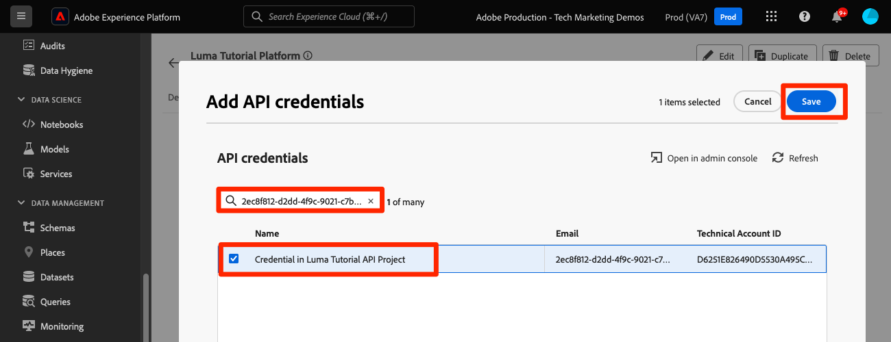

# Configura Developer Console e [!DNL Postman]

<!--30min-->

In questa lezione verrà configurato un progetto in Adobe Developer Console e verranno scaricate [!DNL Postman] raccolte per iniziare a utilizzare le API di Platform.

Per completare gli esercizi API in questa esercitazione, [scarica l&#39;app Postman per il tuo sistema operativo.](https://www.postman.com/downloads/) Sebbene non sia necessario per utilizzare le API Experience Platform, Postman semplifica i flussi di lavoro API e Adobe Experience Platform fornisce decine di raccolte Postman per aiutarti a eseguire le chiamate API e a scoprire come funzionano. Il resto di questo tutorial presuppone una certa conoscenza operativa di Postman. Per assistenza, fare riferimento alla [documentazione di Postman](https://learning.postman.com/).

La piattaforma è stata creata prima in base alle API. Sebbene esistano opzioni di interfaccia anche per tutte le attività principali, a un certo punto potresti voler utilizzare l’API di Platform. Ad esempio, per acquisire i dati, spostare gli elementi da una sandbox all’altra, automatizzare le attività di routine o utilizzare le nuove funzioni di Platform prima che l’interfaccia utente sia stata generata.

**Gli architetti di dati** e **i data engineer** potrebbero dover utilizzare l&#39;API di Platform al di fuori di questa esercitazione.

## Autorizzazioni richieste

Nella lezione [Configurare le autorizzazioni](configure-permissions.md) è possibile impostare tutti i controlli di accesso necessari per completare la lezione.

<!--
* Permission item Sandboxes > `Luma Tutorial`
* Developer-role access to the `Luma Tutorial Platform` product profile
-->

## Configurare Adobe Developer Console

Adobe Developer Console è la destinazione per sviluppatori che consente di accedere a API e SDK di Adobe, ascoltare quasi eventi in tempo reale, eseguire funzioni in fase di esecuzione o creare plug-in o applicazioni App Builder. Lo utilizzerai per accedere all’API Experience Platform. Per ulteriori dettagli, consulta la [documentazione di Adobe Developer Console](https://www.adobe.io/apis/experienceplatform/console/docs.html)

1. Creare nel computer locale una cartella denominata `Luma Tutorial Assets` per i file utilizzati nell&#39;esercitazione.

1. Apri [Adobe Developer Console](https://console.adobe.io){target="_blank"}

1. Accedi e verifica di essere nell’organizzazione corretta

1. Selezionare **[!UICONTROL Crea nuovo progetto]** nel menu [!UICONTROL Guida rapida].

   

1. Nel nuovo progetto creato, seleziona il pulsante **[!UICONTROL Modifica progetto]**
1. Cambia il **[!UICONTROL Titolo progetto]** in `Luma Tutorial API Project` (aggiungi il tuo nome alla fine, se più persone della tua azienda seguono questa esercitazione)
1. Seleziona **[!UICONTROL Salva]**

   

1. Seleziona **[!UICONTROL Aggiungi API]**

   

1. Filtra l&#39;elenco selezionando **[!UICONTROL Adobe Experience Platform]**

1. Nell&#39;elenco delle API disponibili, selezionare **[!UICONTROL Experience Platform API]** e **[!UICONTROL Next]**.

   

1. Seleziona **[!UICONTROL OAuth Server-to-Server]** come credenziale e seleziona **[!UICONTROL Next]**.
   

1. Seleziona il profilo di prodotto `AEP-Default-All-Users` e seleziona **[!UICONTROL Salva API configurata]**

   

1. Ora il progetto Developer Console è stato creato.

1. Nella sezione **[!UICONTROL Prova]** della pagina, seleziona **[!UICONTROL Scarica per Postman]**, quindi seleziona **[!UICONTROL OAuth Server-to-Server]** per scaricare il file json dell&#39;ambiente [!DNL Postman]. Salva `oauth_server_to_server.postman_environment.json` nella cartella `Luma Tutorial Assets`.

   

## Chiedi a un amministratore di sistema di aggiungere le credenziali API al ruolo

Per utilizzare le credenziali API per interagire con Experience Platform, è necessario che un amministratore di sistema assegni le credenziali API al ruolo creato nella lezione precedente.  Se non sei un amministratore di sistema, puoi inviarli:

1. Il [!UICONTROL Nome] delle credenziali API (`Credential in Luma Tutorial API Project`)
1. L&#39;[!UICONTROL e-mail account tecnico] delle tue credenziali (aiuterà l&#39;amministratore di sistema a trovare le credenziali)

   ![[!UICONTROL Nome] e [!UICONTROL E-mail account tecnico] delle credenziali](assets/postman-credentialDetails.png)

Seguono le istruzioni per l’amministratore di sistema:

1. Accedi a [Adobe Experience Platform](https://platform.adobe.com)
1. Seleziona **[!UICONTROL Autorizzazioni]** nella barra di navigazione a sinistra per passare alla schermata [!UICONTROL Ruoli]
1. Apri la mansione `Luma Tutorial Platform`
   
1. Seleziona la scheda **[!UICONTROL Credenziali API]**
1. Seleziona **[!UICONTROL Aggiungi credenziali API]**
   
1. Trova le credenziali `Credential in Luma Tutorial API Project` filtrandole con l&#39;[!UICONTROL E-mail account tecnico] fornita dal partecipante all&#39;esercitazione, se l&#39;elenco è lungo
1. Seleziona le credenziali
1. Seleziona **[!UICONTROL Salva]**

   

## Configurare Postman

>[!CAUTION]
>
>L’interfaccia di Postman viene aggiornata regolarmente. Le schermate di questo tutorial sono state scattate con Postman v10.15.1 per Mac, ma le opzioni dell’interfaccia potrebbero essere cambiate.

1. Scarica e installa [[!DNL Postman]](https://www.postman.com/downloads/)
1. Apri [!DNL Postman] e crea un&#39;area di lavoro
   

1. Importa il file di ambiente json scaricato, `oauth_server_to_server.postman_environment.json`
   
1. In [!DNL Postman], seleziona l&#39;ambiente nel menu a discesa

1. Seleziona l’icona per visualizzare le variabili di ambiente:

   

### Aggiungere il nome della sandbox e l’ID tenant

Le variabili `SANDBOX_NAME` e `TENANT_ID` e `CONTAINER_ID` non sono incluse nell&#39;esportazione Adobe Developer Console, pertanto le aggiungiamo manualmente:

1. In [!DNL Postman], apri le **Variabili di ambiente**
1. Seleziona il collegamento **Modifica** a destra del nome dell&#39;ambiente
1. In **Aggiungi nuovo campo variabile**, immetti `SANDBOX_NAME`
1. In entrambi i campi valore, immetti `luma-tutorial`, il nome assegnato alla sandbox nella lezione precedente. Se hai utilizzato un nome diverso per la sandbox, ad esempio luma-tutorial-ignatiusjreilly, assicurati di utilizzare tale valore.
1. In **Aggiungi nuovo campo variabile**, immetti `TENANT_ID`
1. Passa al browser Web e cerca l&#39;ID tenant della tua azienda andando nell&#39;interfaccia di Experience Platform ed estraendo la parte dell&#39;URL *dopo il simbolo @*. Ad esempio, il mio ID tenant è `techmarketingdemos` ma il tuo è diverso:

   

1. Copia questo valore e torna alla schermata [!DNL Postman] Gestisci ambienti
1. Incolla l’ID tenant in entrambi i campi valore
1. In **Aggiungi nuovo campo variabile**, immetti `CONTAINER_ID`
1. Immetti `global` in entrambi i campi valore

   >[!NOTE]
   >
   >`CONTAINER_ID` è un campo il cui valore viene modificato più volte durante l&#39;esercitazione. Quando si utilizza `global`, l&#39;API interagisce con gli elementi forniti da Adobe nell&#39;account Platform. Quando si utilizza `tenant`, l&#39;API interagisce con i propri elementi personalizzati.

1. Seleziona **Salva**

   

## Effettuare chiamate API

### Recuperare un token di accesso

Adobe fornisce un set completo di [!DNL Postman] raccolte per esplorare l&#39;API di Experience Platform. Queste raccolte si trovano nel repository GitHub [Adobe Experience Platform Postman Samples](https://github.com/adobe/experience-platform-postman-samples). Applica un segnalibro a questo archivio, in quanto lo utilizzerai numerose volte durante questa esercitazione e in seguito durante l’implementazione di Experience Platform per la tua azienda.

La prima raccolta funziona con le API Adobe Identity Management Service (IMS). È un modo pratico per recuperare un token di accesso da Postman.

Per generare il token di accesso:

1. Scarica la raccolta di [API del servizio Identity Management](https://github.com/adobe/experience-platform-postman-samples/blob/master/apis/ims/Identity%20Management%20Service.postman_collection.json) nella cartella `Luma Tutorial Assets`
1. Importa la raccolta in [!DNL Postman]
1. Seleziona la richiesta **oAuth: Richiedi token di accesso** e seleziona **Invia**
1. Dovresti ottenere una risposta `200 OK` con un token di accesso nella risposta

   

1. Il token di accesso deve essere archiviato automaticamente come variabile di ambiente **ACCESS_TOKEN** dell&#39;ambiente [!DNL Postman].

   

### Interagire con un’API di Platform

Effettuiamo ora una chiamata API Platform per confermare che tutto è stato configurato correttamente.

Apri gli [Experienci Platform [!DNL Postman] insiemi in GitHub](https://github.com/adobe/experience-platform-postman-samples/tree/master/apis/experience-platform). In questa pagina sono presenti molte raccolte, per diverse API di Platform. Raccomando vivamente di segnalibro.

Ora effettuiamo la nostra prima chiamata API:

1. Scarica la raccolta API del Registro di sistema dello schema [&#128279;](https://raw.githubusercontent.com/adobe/experience-platform-postman-samples/master/apis/experience-platform/Schema%20Registry%20API.postman_collection.json) nella cartella `Luma Tutorial Assets`
1. Importa in [!DNL Postman]
1. Apri **Schema Registry API > Schemi > Elenca schemi**
1. Osserva le schede **Parametri** e **Intestazioni** e osserva come includono alcune delle variabili di ambiente immesse in precedenza.
1. Il campo **Intestazioni > Accetta valore** è impostato su `application/vnd.adobe.xed-id+json`. Le API del registro dello schema richiedono uno di questi [valori di intestazione Accept specificati](https://experienceleague.adobe.com/docs/experience-platform/xdm/api/getting-started.html?lang=it#accept) che forniscono formati diversi nella risposta.
1. Seleziona **Invia** per effettuare la tua prima chiamata API Platform.

Si spera di aver ricevuto una risposta `200 OK` corretta contenente un elenco degli schemi XDM forniti dall&#39;Adobe disponibili nella sandbox, come illustrato di seguito.

Se la chiamata non ha avuto esito positivo, attendi un attimo a eseguire il debug utilizzando i dettagli della risposta di errore della chiamata API e controlla i passaggi precedenti. Se ti blocchi, chiedi aiuto nel [Forum della community](https://experienceleaguecommunities.adobe.com/t5/adobe-experience-platform/ct-p/adobe-experience-platform-community) oppure utilizza il collegamento sul lato destro della pagina per &quot;Segnalare un problema&quot;.

Con le autorizzazioni di Platform, la sandbox e [!DNL Postman] configurate, puoi [modellare i dati negli schemi](model-data-in-schemas.md).
